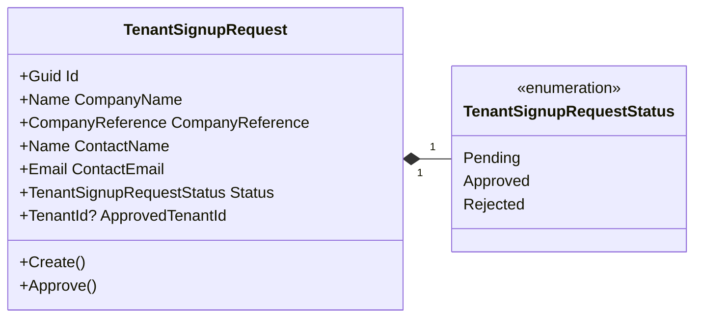
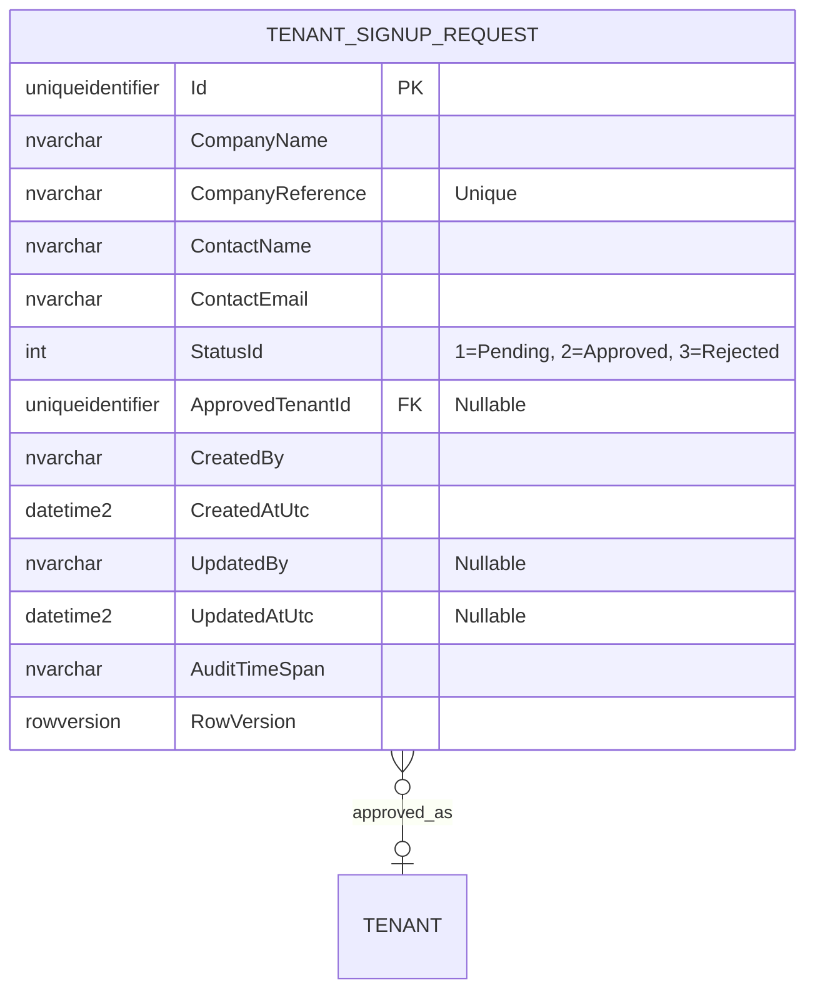

# TenantSignupRequest - Aggregate Architecture

**Bounded Context:** Identity  
**Aggregate Root:** `TenantSignupRequest`  
**Module:** `Ums.Domain.Identity.TenantSignupRequest`  
**Status:** Implemented for Phase 4 tenant onboarding

---

## 1. Aggregate Overview

### Purpose
`TenantSignupRequest` represents a public company onboarding request submitted before a tenant exists. It is reviewed by a global administrator and, when approved, links to the newly created tenant.

### Business Responsibility
- Capture company name, company reference, contact name, and contact email from the public tenant signup form.
- Keep the request in `Pending` until a global administrator approves it.
- Link the request to the created tenant through `ApprovedTenantId`.
- Provide the source record for the global onboarding inbox.

### Implemented State Model
| State | Code Value | Meaning | Implemented Transition |
|---|---:|---|---|
| `Pending` | 1 | Request submitted and waiting for global review. | Created by `TenantSignupRequest.Create`. |
| `Approved` | 2 | Tenant was created and linked to the request. | `Approve(tenantId, updatedBy)`. |
| `Rejected` | 3 | Reserved in the enum for denied company requests. | Enum exists; aggregate command is not implemented yet. |

### Related Entities / Value Objects
| Entity / VO | Type | Ownership |
|---|---|---|
| `TenantSignupRequestStatus` | Enumeration | Pending, Approved, Rejected |
| `CompanyReference` | Value Object | Company RUC/code/reference |
| `Name` | Value Object | Company and contact names |
| `Email` | Value Object | Contact email |
| `TenantId` | Value Object | Nullable reference set after approval |
| `AuditValueObject` | Value Object | Created and updated metadata |

---

## 2. Object Model

---

## 3. ER Model

### Persistence Mapping
| Code Artifact | Mapping |
|---|---|
| EF record | `TenantSignupRequestRecord` |
| Table | `identity.TenantSignupRequests` |
| Unique index | `CompanyReference` |
| Query index | `StatusId`, `ContactEmail` |
| Repository | `ITenantSignupRequestRepository` |

---

## 4. Onboarding Alignment

This aggregate implements the company onboarding request from FS-21 and EP-09. It is global in scope because the tenant does not exist yet. Tenant isolation starts after approval when `ApprovedTenantId` references the created tenant.

---

**[Back to Identity Index](./index.md)**
