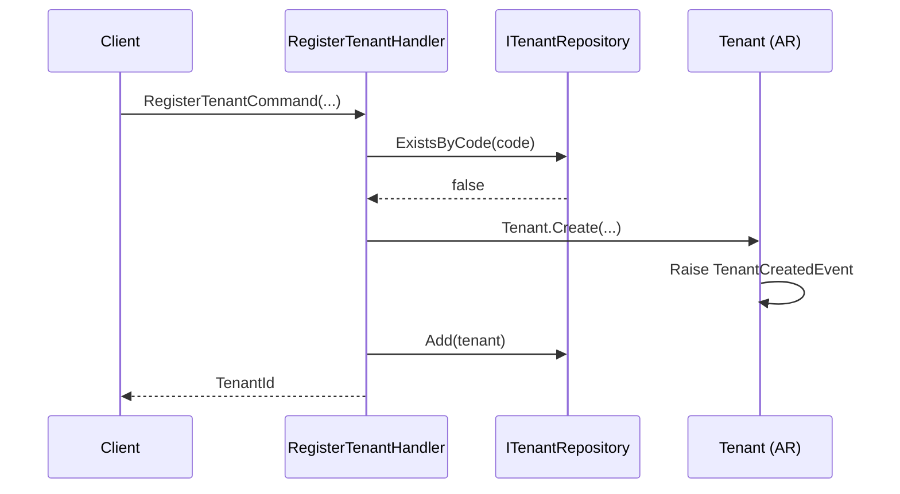
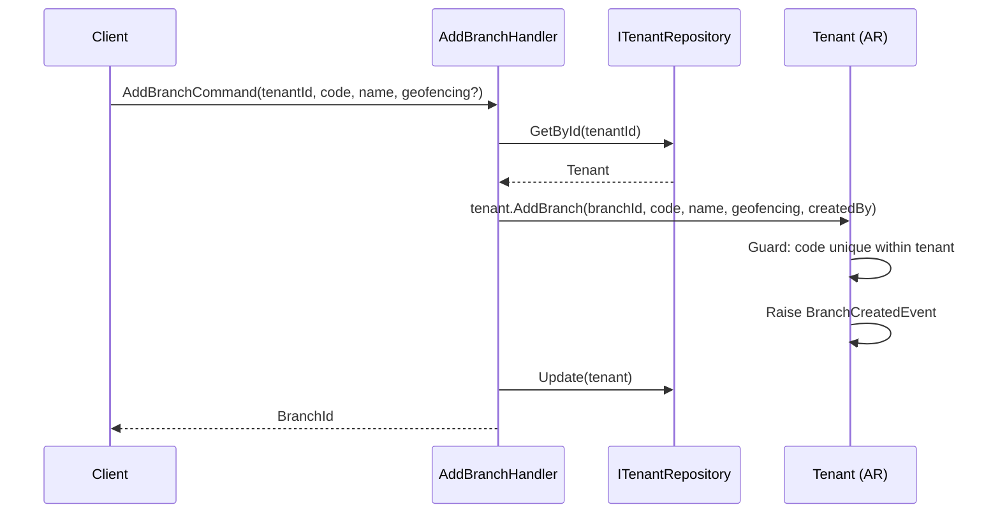
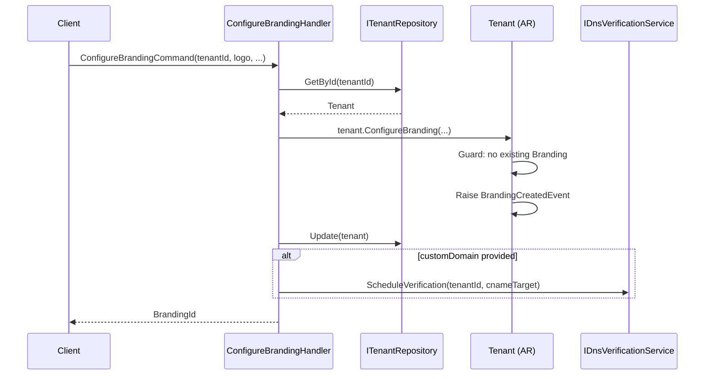
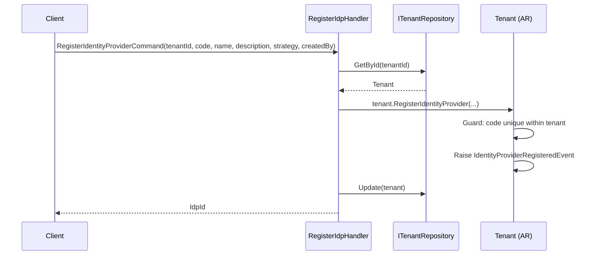
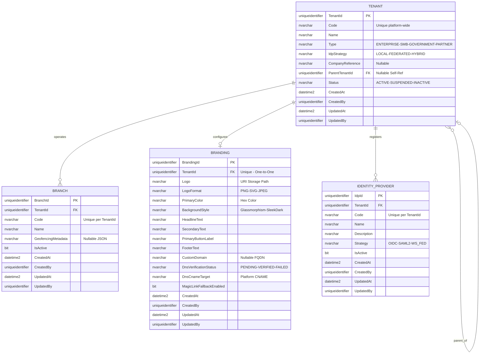
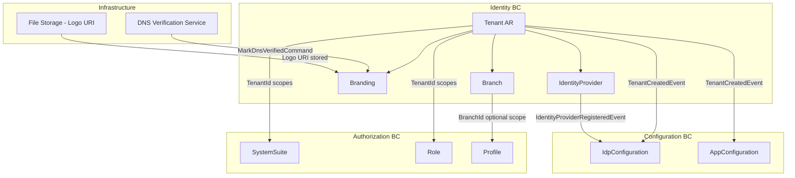

# Tenant — Aggregate Architecture

**Bounded Context:** Identity  
**Aggregate Root:** `Tenant`  
**Module:** `Ums.Domain.Identity.Tenant`  
**Status:** Production

---

## 1. Aggregate Overview

### Purpose
The `Tenant` aggregate represents the top-level organizational unit in the UMS multi-tenant model. Every resource in the system is scoped to a Tenant. It governs onboarding, lifecycle status, hierarchical structure (parent/child tenants), and the strategy used to authenticate its users (local, federated, or hybrid). It also fully owns and manages `Branch`, `Branding`, and `IdentityProvider` configurations.

### Business Responsibility
- Register and manage organizations (tenants) that operate on the UMS platform.
- Control tenant lifecycle: active, suspended, inactive.
- Define the Identity Provider strategy for the tenant.
- Manage child entities: `Branch`, `Branding`, `IdentityProvider` — all owned by and accessed through the Tenant aggregate root.

### Aggregate Root
`Tenant` is the aggregate root. All operations on `Branch`, `Branding`, and `IdentityProvider` must go through `Tenant` commands. No external aggregate should hold a direct reference to `Branch` — only a `BranchId` value object.

### Invariants and Consistency Rules
1. A Tenant `Code` must be unique across the platform.
2. A Tenant may only have one `Branding` record (1:1 relationship).
3. `IdpStrategy` must be consistent with the registered `IdentityProvider` records (e.g., `FEDERATED` requires at least one active `IdentityProvider`).
4. A suspended or inactive Tenant's users must not be able to authenticate.
5. A child Tenant (`ParentTenantId IS NOT NULL`) inherits the top-level Tenant's compliance policies.
6. `Status` transitions follow: `Active → Suspended → Active` or `Active → Inactive` (terminal).
7. Branch `Code` must be unique within the owning `Tenant`.
8. A `Branch` cannot be removed if active `UserAccount` or `Profile` records are scoped to it.
9. `GeofencingMetadata` must be valid JSON when provided.
10. Branch deactivation does not delete; records remain for historical traceability.
11. `CustomDomain` must be a valid hostname when provided.
12. `DnsVerificationStatus` starts as `PENDING` when `CustomDomain` is set and cannot be manually set to `VERIFIED` — only the DNS verification service may do so.
13. `LogoFormat` must match the actual format of the uploaded `Logo` URI.
14. IdentityProvider `Code` must be unique within the owning Tenant.
15. An `IdentityProvider` must be deactivated before it can be removed.
16. Deactivating an `IdentityProvider` that is the sole active IdP for a Federated tenant is not allowed unless the tenant's `IdpStrategy` is changed first.
17. IdentityProvider `Strategy` cannot be changed after registration — it is immutable once set.

### Related Entities / Value Objects
| Entity / VO | Type | Ownership |
|---|---|---|
| `Branch` | Entity | Owned — child of Tenant |
| `Branding` | Entity | Owned — child of Tenant (1:1) |
| `IdentityProvider` | Entity | Owned — child of Tenant |
| `Code` | Value Object | Identifier code |
| `Name` | Value Object | Display name |
| `OrganizationType` | Enum | ENTERPRISE · SMB · GOVERNMENT · PARTNER |
| `IdpStrategy` | Enum | LOCAL · FEDERATED · HYBRID |
| `TenantStatus` | Enum | Active · Suspended · Inactive |
| `Logo` | Value Object | URI storage path |
| `LogoFormat` | Enum | PNG · SVG · JPEG |
| `HexColor` | Value Object | Validated hex color |
| `BackgroundStyle` | Enum | Glassmorphism · SleekDark |
| `CustomDomain` | Value Object | Nullable hostname |
| `DnsVerificationStatus` | Enum | Pending · Verified · Failed |
| `AuditValueObject` | Value Object | CreatedAt/By, UpdatedAt/By |

### Domain Events
| Event | Trigger |
|---|---|
| `TenantCreatedEvent` | New tenant registered |
| `TenantSuspendedEvent` | Tenant moved to Suspended status |
| `TenantActivatedEvent` | Tenant re-activated from Suspended |
| `BranchCreatedEvent` | A new Branch added to the Tenant |
| `BranchDeactivatedEvent` | A Branch deactivated |
| `BranchReactivatedEvent` | A Branch reactivated |
| `BranchRemovedEvent` | A Branch hard-removed |
| `BrandingCreatedEvent` | Branding configured for the first time |
| `BrandingUpdatedEvent` | Branding attributes updated |
| `BrandingRemovedEvent` | Branding configuration removed |
| `BrandingDnsVerifiedEvent` | Custom domain DNS verified successfully |
| `BrandingDnsFailedEvent` | DNS verification failed |
| `IdentityProviderRegisteredEvent` | New IdP registered |
| `IdentityProviderActivatedEvent` | IdP activated |
| `IdentityProviderDeactivatedEvent` | IdP deactivated |
| `IdentityProviderRemovedEvent` | IdP removed |

### Commands / Use Cases
| Command | Description |
|---|---|
| `RegisterTenantCommand` | Onboard a new organization onto the platform |
| `SuspendTenantCommand` | Suspend a tenant (blocks all user auth) |
| `ActivateTenantCommand` | Reactivate a suspended tenant |
| `AddBranchCommand` | Create a new branch within the tenant |
| `UpdateBranchCommand` | Update name or geofencing metadata of a branch |
| `DeactivateBranchCommand` | Deactivate an existing branch |
| `ReactivateBranchCommand` | Reactivate a branch |
| `RemoveBranchCommand` | Remove a branch |
| `ConfigureBrandingCommand` | Set the tenant's visual identity |
| `UpdateBrandingCommand` | Update branding attributes |
| `SetCustomDomainCommand` | Add or replace the custom domain |
| `RemoveBrandingCommand` | Remove the branding configuration |
| `MarkDnsVerifiedCommand` | Internal — called by DNS verification service |
| `MarkDnsFailedCommand` | Internal — called by DNS verification service |
| `RegisterIdentityProviderCommand` | Register an external IdP |
| `ActivateIdentityProviderCommand` | Activate a registered IdP |
| `DeactivateIdentityProviderCommand` | Deactivate an IdP |
| `RemoveIdentityProviderCommand` | Hard-remove an inactive IdP |

### Repository / Service Boundaries
- `ITenantRepository` — persists the `Tenant` aggregate including owned children.
- No cross-aggregate repository calls within a single command.
- `IIdpStrategyValidationService` / `IIdpStrategyConsistencyService` — domain service that validates `IdpStrategy` consistency when IdP records are added/removed.
- `IBranchDependencyChecker` — domain service that verifies no `UserAccount` or `Profile` depends on the branch before removal.
- `IDnsVerificationService` — infrastructure service that performs CNAME lookups.

---

## 2. Object Model

### Classes / Entities / Value Objects

```
Tenant (Aggregate Root)
├── Props: TenantProps
│   ├── Id: IdValueObject
│   ├── Code: Code
│   ├── Name: Name
│   ├── Type: OrganizationType
│   ├── IdpStrategy: IdpStrategy
│   ├── CompanyReference?: CompanyReference
│   ├── ParentTenantId?: TenantId
│   ├── Status: TenantStatus
│   └── Audit: AuditValueObject
├── Children
│   ├── IReadOnlyList<Branch>
│   │   └── Props: BranchProps (Id, TenantId, Code, Name, GeofencingMetadata?, IsActive)
│   ├── Branding? (0..1)
│   │   └── Props: BrandingProps (Id, TenantId, Logo, LogoFormat, PrimaryColor, BackgroundStyle, Texts, CustomDomain?, DnsVerificationStatus, DnsCnameTarget, MagicLinkFallbackEnabled)
│   └── IReadOnlyList<IdentityProvider>
│       └── Props: IdentityProviderProps (Id, TenantId, Code, Name, Description, Strategy, IsActive)
└── DomainEvents: TenantDomainEventsManager
```

### Main Attributes
| Attribute | Entity | Type | Notes |
|---|---|---|---|
| `Id` | Tenant | `Guid` | PK, generated on creation |
| `Code` | Tenant | `string` | Unique tenant identifier code |
| `Name` | Tenant | `string` | Display name |
| `Type` | Tenant | `OrganizationType` | Organization classification |
| `IdpStrategy` | Tenant | `IdpStrategy` | Authentication strategy |
| `Status` | Tenant | `TenantStatus` | Active / Suspended / Inactive |
| `Code` | Branch | `string` | Unique per tenant |
| `Name` | Branch | `string` | Display name |
| `GeofencingMetadata` | Branch | `string?` | JSON polygon/coordinates |
| `IsActive` | Branch | `bool` | Soft activation flag |
| `Logo` | Branding | `string` | URI to uploaded logo |
| `LogoFormat` | Branding | `LogoFormat` | PNG / SVG / JPEG |
| `PrimaryColor` | Branding | `string` | Hex color |
| `CustomDomain` | Branding | `string?` | Optional FQDN |
| `DnsVerificationStatus` | Branding| `Enum` | Pending / Verified / Failed |
| `Code` | IdentityProvider | `string` | Unique within tenant |
| `Strategy` | IdentityProvider | `IdpStrategy`| OIDC / SAML2 / WS_FED — immutable |
| `IsActive` | IdentityProvider | `bool` | Routing availability |

---

## 3. Sequence Diagrams

*(Consolidated view covering core flows)*

### Create Tenant Flow


### Add Branch Flow


### Configure Branding Flow


### Register Identity Provider Flow


---

## 4. Entity / Relationship Model



---

## 5. Bounded Context Model



---

## 6. API / Application Layer Contract

*(Includes consolidated commands and queries for Tenant, Branch, Branding, and IdP).*

### Commands
| Command | Output |
|---|---|
| `RegisterTenantCommand` | `Guid tenantId` |
| `SuspendTenantCommand` | `void` |
| `ActivateTenantCommand` | `void` |
| `AddBranchCommand` | `Guid branchId` |
| `UpdateBranchCommand` | `void` |
| `DeactivateBranchCommand` | `void` |
| `ReactivateBranchCommand` | `void` |
| `RemoveBranchCommand` | `void` |
| `ConfigureBrandingCommand` | `Guid brandingId` |
| `UpdateBrandingCommand` | `void` |
| `SetCustomDomainCommand` | `void` |
| `RemoveBrandingCommand` | `void` |
| `RegisterIdentityProviderCommand` | `Guid idpId` |
| `ActivateIdentityProviderCommand` | `void` |
| `DeactivateIdentityProviderCommand` | `void` |
| `RemoveIdentityProviderCommand` | `void` |

### Queries
| Query | Returns |
|---|---|
| `GetTenantByIdQuery` | `TenantDetailDto` |
| `ListTenantsQuery` | `PagedList<TenantSummaryDto>` |
| `GetTenantBranchesQuery` | `List<BranchDto>` |
| `GetBranchByIdQuery` | `BranchDto?` |
| `GetTenantBrandingQuery` | `BrandingDto?` |
| `GetBrandingByDomainQuery` | `BrandingDto?` |
| `GetTenantIdentityProvidersQuery` | `List<IdentityProviderDto>` |

---

## 7. Persistence Notes

### Transaction Boundary
The entire `Tenant` aggregate (including `Branch`, `Branding`, `IdentityProvider`) is persisted within a single EF Core `DbContext.SaveChanges()` call. No partial saves across owned entities.

### Indexes
| Index | Columns | Type |
|---|---|---|
| `IX_Tenant_Code` | `Code` | Unique |
| `IX_Branch_TenantId_Code` | `TenantId, Code` | Unique |
| `IX_Branding_TenantId` | `TenantId` | Unique |
| `IX_Branding_CustomDomain` | `CustomDomain` | Unique (partial — not null) |
| `IX_IdentityProvider_TenantId_Code` | `TenantId, Code` | Unique |

### Multi-Tenant Considerations
- `Tenant` itself is the isolation boundary.
- All child tables (`BRANCH`, `BRANDING`, `IDENTITY_PROVIDER`) are filtered by `TenantId`.
- `CustomDomain` is a cross-tenant unique key.

---

## 8. Security and Audit

### Authorization Rules
| Operation | Required Role / Policy |
|---|---|
| Register / Suspend / Activate Tenant | `Platform:Admin` |
| Add / Update / Remove Branch | `Tenant:Admin` (own tenant only) |
| Configure / Update Branding | `Tenant:Admin` |
| Set Custom Domain | `Tenant:Admin` |
| Register / Activate / Deactivate IdP | `Tenant:Admin` |

### Audit Events
All state-changing commands produce immutable `AuditRecord` entries:
- `TENANT_REGISTERED`, `TENANT_SUSPENDED`, `TENANT_ACTIVATED`
- `BRANCH_CREATED`, `BRANCH_DEACTIVATED`, `BRANCH_REACTIVATED`, `BRANCH_REMOVED`
- `BRANDING_CONFIGURED`, `BRANDING_UPDATED`, `BRANDING_REMOVED`, `DNS_VERIFIED`, `DNS_FAILED`
- `IDP_REGISTERED`, `IDP_ACTIVATED`, `IDP_DEACTIVATED`, `IDP_REMOVED`
