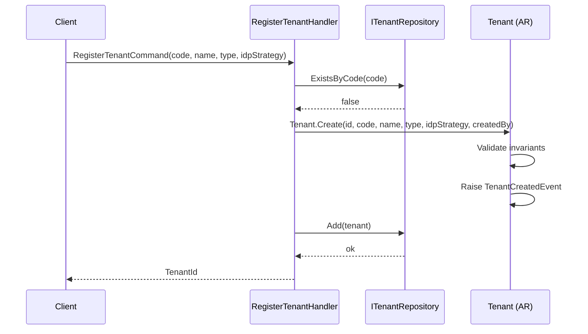
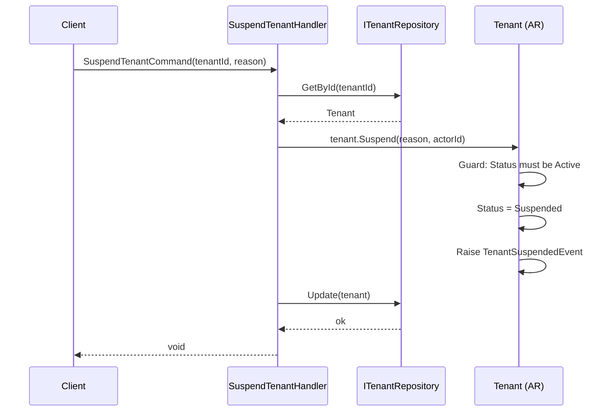
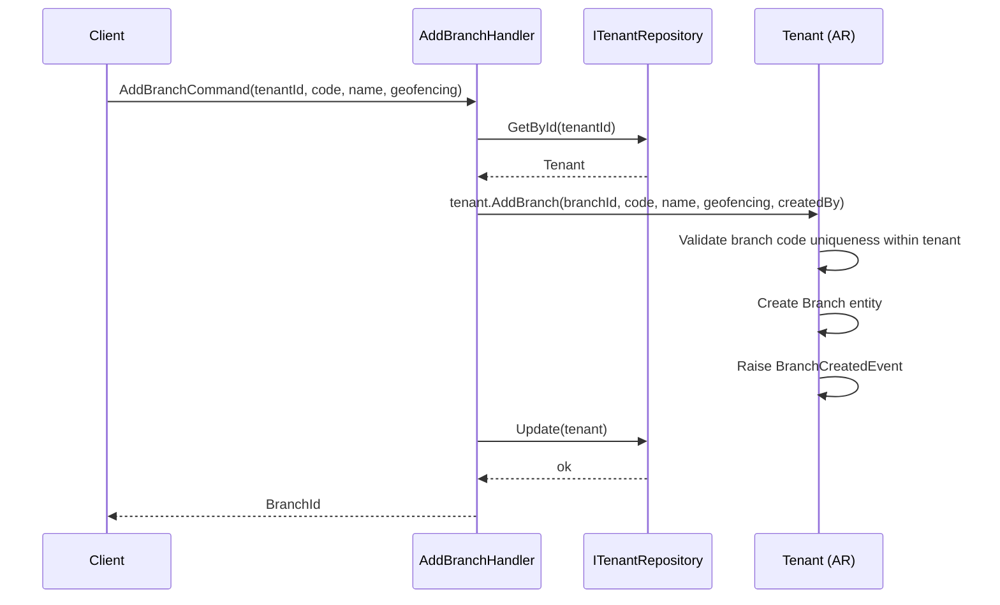
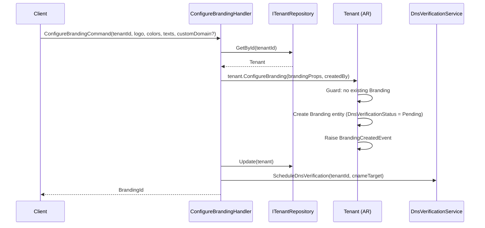
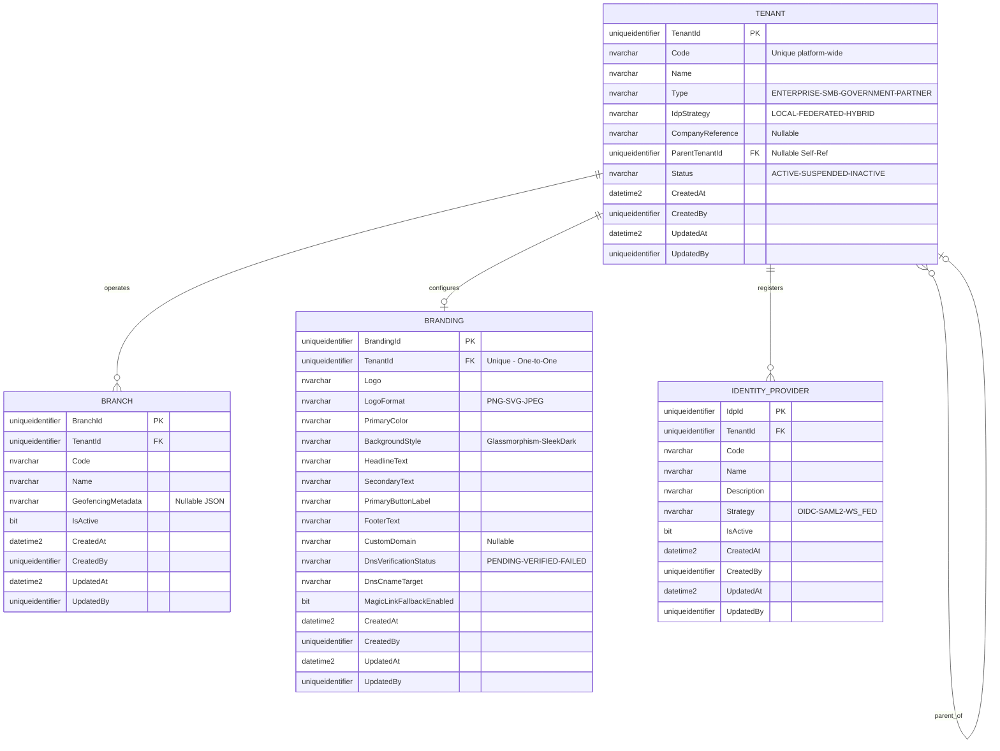
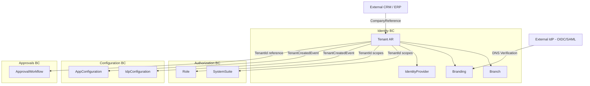

# Tenant — Aggregate Architecture

**Bounded Context:** Identity  
**Aggregate Root:** `Tenant`  
**Module:** `Ums.Domain.Identity.Tenant`  
**Status:** Production

---

## 1. Aggregate Overview

### Purpose
The `Tenant` aggregate represents the top-level organizational unit in the UMS multi-tenant model. Every resource in the system is scoped to a Tenant. It governs onboarding, lifecycle status, hierarchical structure (parent/child tenants), and the strategy used to authenticate its users (local, federated, or hybrid).

### Business Responsibility
- Register and manage organizations (tenants) that operate on the UMS platform.
- Control tenant lifecycle: active, suspended, inactive.
- Define the Identity Provider strategy for the tenant.
- Manage child entities: `Branch`, `Branding`, `IdentityProvider` — all owned by and accessed through the Tenant aggregate root.

### Aggregate Root
`Tenant` is the aggregate root. All operations on `Branch`, `Branding`, and `IdentityProvider` must go through `Tenant` commands. No external aggregate should hold a direct reference to `Branch` — only a `BranchId` value object.

### Invariants and Consistency Rules
1. A Tenant `Code` must be unique across the platform.
2. A Tenant may only have one `Branding` record (1:1 relationship).
3. `IdpStrategy` must be consistent with the registered `IdentityProvider` records (e.g., `FEDERATED` requires at least one active `IdentityProvider`).
4. A suspended or inactive Tenant's users must not be able to authenticate.
5. A child Tenant (`ParentTenantId IS NOT NULL`) inherits the top-level Tenant's compliance policies.
6. `Status` transitions follow: `Active → Suspended → Active` or `Active → Inactive` (terminal).

### Related Entities / Value Objects
| Entity / VO | Type | Ownership |
|---|---|---|
| `Branch` | Entity | Owned — child of Tenant |
| `Branding` | Entity | Owned — child of Tenant (1:1) |
| `IdentityProvider` | Entity | Owned — child of Tenant |
| `Code` | Value Object | Identifier code |
| `Name` | Value Object | Display name |
| `OrganizationType` | Enum | ENTERPRISE · SMB · GOVERNMENT · PARTNER |
| `IdpStrategy` | Enum | LOCAL · FEDERATED · HYBRID |
| `TenantStatus` | Enum | Active · Suspended · Inactive |
| `AuditValueObject` | Value Object | CreatedAt/By, UpdatedAt/By |

### Domain Events
| Event | Trigger |
|---|---|
| `TenantCreatedEvent` | New tenant registered |
| `TenantSuspendedEvent` | Tenant moved to Suspended status |
| `TenantActivatedEvent` | Tenant re-activated from Suspended |
| `BranchCreatedEvent` | A new Branch added to the Tenant |
| `BranchRemovedEvent` | A Branch hard-removed |
| `BranchDeactivatedEvent` | A Branch deactivated |
| `BranchReactivatedEvent` | A Branch reactivated |
| `IdentityProviderRegisteredEvent` | New IdP registered |
| `IdentityProviderActivatedEvent` | IdP activated |
| `IdentityProviderDeactivatedEvent` | IdP deactivated |
| `IdentityProviderRemovedEvent` | IdP removed |
| `BrandingCreatedEvent` | Branding configured for the first time |
| `BrandingUpdatedEvent` | Branding attributes updated |
| `BrandingRemovedEvent` | Branding configuration removed |
| `BrandingDnsVerifiedEvent` | Custom domain DNS verified successfully |
| `BrandingDnsFailedEvent` | DNS verification failed |

### Commands / Use Cases
| Command | Description |
|---|---|
| `RegisterTenantCommand` | Onboard a new organization onto the platform |
| `SuspendTenantCommand` | Suspend a tenant (blocks all user auth) |
| `ActivateTenantCommand` | Reactivate a suspended tenant |
| `AddBranchCommand` | Create a new branch within the tenant |
| `DeactivateBranchCommand` | Deactivate an existing branch |
| `ReactivateBranchCommand` | Reactivate a branch |
| `RemoveBranchCommand` | Remove a branch |
| `ConfigureBrandingCommand` | Set the tenant's visual identity |
| `UpdateBrandingCommand` | Update branding attributes |
| `RegisterIdentityProviderCommand` | Register an external IdP |
| `ActivateIdentityProviderCommand` | Activate a registered IdP |
| `DeactivateIdentityProviderCommand` | Deactivate an IdP |

### Repository / Service Boundaries
- `ITenantRepository` — persists the `Tenant` aggregate including owned children.
- No cross-aggregate repository calls within a single command.
- `IIdpStrategyValidationService` — domain service that validates `IdpStrategy` consistency when IdP records are added/removed.

---

## 2. Object Model

### Classes / Entities / Value Objects

```
Tenant (Aggregate Root)
├── Props: TenantProps
│   ├── Id: IdValueObject
│   ├── Code: Code
│   ├── Name: Name
│   ├── Type: OrganizationType
│   ├── IdpStrategy: IdpStrategy
│   ├── CompanyReference?: CompanyReference
│   ├── ParentTenantId?: TenantId
│   ├── Status: TenantStatus
│   └── Audit: AuditValueObject
├── Children
│   ├── IReadOnlyList<Branch>
│   ├── Branding? (0..1)
│   └── IReadOnlyList<IdentityProvider>
└── DomainEvents: TenantDomainEventsManager
```

### Main Attributes
| Attribute | Type | Notes |
|---|---|---|
| `Id` | `Guid` | PK, generated on creation |
| `Code` | `string` | Unique tenant identifier code |
| `Name` | `string` | Display name |
| `Type` | `OrganizationType` | Organization classification |
| `IdpStrategy` | `IdpStrategy` | Authentication strategy |
| `CompanyReference` | `string?` | External CRM/ERP reference |
| `ParentTenantId` | `Guid?` | Self-ref for hierarchy |
| `Status` | `TenantStatus` | Active / Suspended / Inactive |
| `CreatedAt/By` | `datetime2/Guid` | Audit |
| `UpdatedAt/By` | `datetime2/Guid` | Audit |

### Lifecycle / Status Fields
```
Active ──► Suspended ──► Active
Active ──► Inactive  (terminal — no return)
```

### Validation Rules
- `Code`: required, unique, alphanumeric + hyphens, max 50 chars.
- `Name`: required, max 200 chars.
- `Type`: must be a valid `OrganizationType` enum value.
- `IdpStrategy`: must be `LOCAL`, `FEDERATED`, or `HYBRID`.
- A tenant with `Status = Inactive` cannot be modified.

---

## 3. Sequence Diagrams

### Create Flow


### Update Flow (Suspend)


### Add Branch Flow


### Configure Branding Flow


---

## 4. Entity / Relationship Model



---

## 5. Bounded Context Model



**Context Ownership:** Identity BC owns `Tenant` fully.  
**Upstream:** None — Tenant is a platform root entity.  
**Downstream:** Authorization, Configuration, Approvals, Audit all consume `TenantId` as a foreign key.  
**Integration Points:**  
- `TenantCreatedEvent` → triggers default `AppConfiguration` seeding in Configuration BC.  
- `TenantSuspendedEvent` → consumed by Authorization BC to deactivate profiles.  
- DNS verification is a side-effect triggered asynchronously after `BrandingCreatedEvent`.

---

## 6. API / Application Layer Contract

### Commands
| Command | Input | Output |
|---|---|---|
| `RegisterTenantCommand` | `code, name, type, idpStrategy, companyReference?, parentTenantId?, createdBy` | `Guid tenantId` |
| `SuspendTenantCommand` | `tenantId, actorId` | `void` |
| `ActivateTenantCommand` | `tenantId, actorId` | `void` |
| `AddBranchCommand` | `tenantId, code, name, geofencingMetadata?, createdBy` | `Guid branchId` |
| `DeactivateBranchCommand` | `tenantId, branchId, actorId` | `void` |
| `ReactivateBranchCommand` | `tenantId, branchId, actorId` | `void` |
| `RemoveBranchCommand` | `tenantId, branchId, actorId` | `void` |
| `ConfigureBrandingCommand` | `tenantId, logo, logoFormat, primaryColor, backgroundStyle, texts..., customDomain?, createdBy` | `Guid brandingId` |
| `UpdateBrandingCommand` | `tenantId, brandingId, fields..., updatedBy` | `void` |
| `RegisterIdentityProviderCommand` | `tenantId, code, name, description, strategy, createdBy` | `Guid idpId` |
| `ActivateIdentityProviderCommand` | `tenantId, idpId, actorId` | `void` |
| `DeactivateIdentityProviderCommand` | `tenantId, idpId, actorId` | `void` |

### Queries
| Query | Filter | Returns |
|---|---|---|
| `GetTenantByIdQuery` | `tenantId` | `TenantDetailDto` |
| `GetTenantByCodeQuery` | `code` | `TenantDetailDto` |
| `ListTenantsQuery` | `status?, type?, pageSize, page` | `PagedList<TenantSummaryDto>` |
| `GetTenantBranchesQuery` | `tenantId` | `List<BranchDto>` |
| `GetTenantBrandingQuery` | `tenantId` | `BrandingDto?` |
| `GetTenantIdentityProvidersQuery` | `tenantId` | `List<IdentityProviderDto>` |

### Key DTOs
```csharp
record TenantDetailDto(
    Guid Id, string Code, string Name,
    string Type, string IdpStrategy, string Status,
    string? CompanyReference, Guid? ParentTenantId,
    DateTime CreatedAt, Guid CreatedBy
);

record BranchDto(
    Guid Id, Guid TenantId, string Code, string Name,
    string? GeofencingMetadata, bool IsActive
);
```

### Error Cases
| Code | Condition |
|---|---|
| `TENANT_CODE_ALREADY_EXISTS` | Duplicate code on registration |
| `TENANT_NOT_FOUND` | Unknown tenantId |
| `TENANT_INACTIVE` | Operation attempted on inactive tenant |
| `TENANT_ALREADY_SUSPENDED` | Suspend on already-suspended tenant |
| `BRANCH_CODE_DUPLICATE` | Branch code already exists within tenant |
| `BRANDING_ALREADY_EXISTS` | Configure branding called twice |
| `IDP_CODE_DUPLICATE` | IdP code already exists within tenant |

---

## 7. Persistence Notes

### Transaction Boundary
The entire `Tenant` aggregate (including `Branch`, `Branding`, `IdentityProvider`) is persisted within a single EF Core `DbContext.SaveChanges()` call. No partial saves across owned entities.

### Indexes
| Index | Columns | Type |
|---|---|---|
| `IX_Tenant_Code` | `Code` | Unique |
| `IX_Tenant_Status` | `Status` | Non-unique |
| `IX_Tenant_ParentTenantId` | `ParentTenantId` | Non-unique |
| `IX_Branch_TenantId_Code` | `TenantId, Code` | Unique |
| `IX_Branding_TenantId` | `TenantId` | Unique |
| `IX_IdentityProvider_TenantId_Code` | `TenantId, Code` | Unique |

### Unique Constraints
- `Tenant.Code` unique across entire table.
- `Branch.Code` unique per `TenantId`.
- `Branding.TenantId` unique (1:1 enforcement).
- `IdentityProvider.Code` unique per `TenantId`.

### Soft Delete / Audit
- Tenants use status-based lifecycle, not physical delete.
- `Branch` and `IdentityProvider` support both deactivation (soft) and removal (hard, if no dependencies).
- All mutations write `UpdatedAt` and `UpdatedBy`.

### Multi-Tenant Considerations
- `Tenant` itself is the isolation boundary — no `TenantId` RLS on this table.
- All child tables (`BRANCH`, `BRANDING`, `IDENTITY_PROVIDER`) are filtered by `TenantId`.

---

## 8. Security and Audit

### Authorization Rules
| Operation | Required Role / Policy |
|---|---|
| Register Tenant | `Platform:Admin` |
| Suspend / Activate Tenant | `Platform:Admin` |
| Add / Remove Branch | `Tenant:Admin` (own tenant only) |
| Configure Branding | `Tenant:Admin` |
| Register / Activate IdP | `Tenant:Admin` |

### Sensitive Data
- `CompanyReference` — may contain external CRM IDs; restrict to admin roles.
- `Branding.CustomDomain` — public-facing; not sensitive.
- `IdentityProvider` records do not store credentials (those live in `IDP_CONFIGURATION` in the Configuration BC).

### Audit Events
All state-changing commands produce immutable `AuditRecord` entries (written by the Audit BC listener):
- `TENANT_REGISTERED`, `TENANT_SUSPENDED`, `TENANT_ACTIVATED`
- `BRANCH_CREATED`, `BRANCH_DEACTIVATED`, `BRANCH_REMOVED`
- `BRANDING_CONFIGURED`, `BRANDING_UPDATED`, `DNS_VERIFIED`, `DNS_FAILED`
- `IDP_REGISTERED`, `IDP_ACTIVATED`, `IDP_DEACTIVATED`

### Compliance Considerations
- Tenant suspension must be traceable to an actor — `actorId` is mandatory on all lifecycle transitions.
- DNS verification state (`PENDING → VERIFIED / FAILED`) must be logged for custom domain compliance.
- Child tenant policies inherit from the parent and cannot be downgraded without parent-admin approval.
