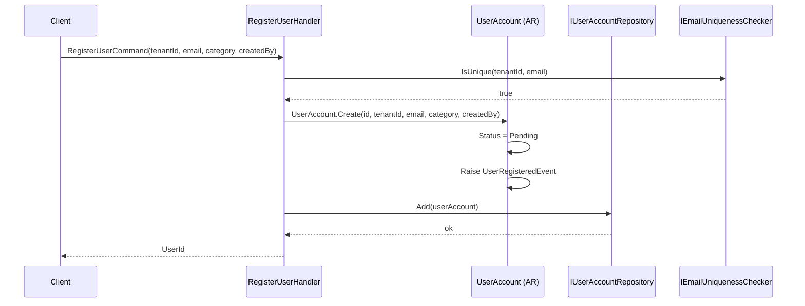
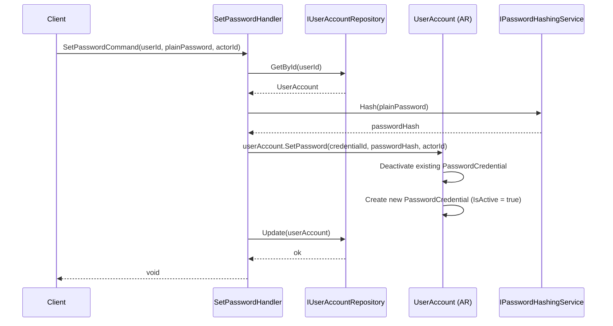
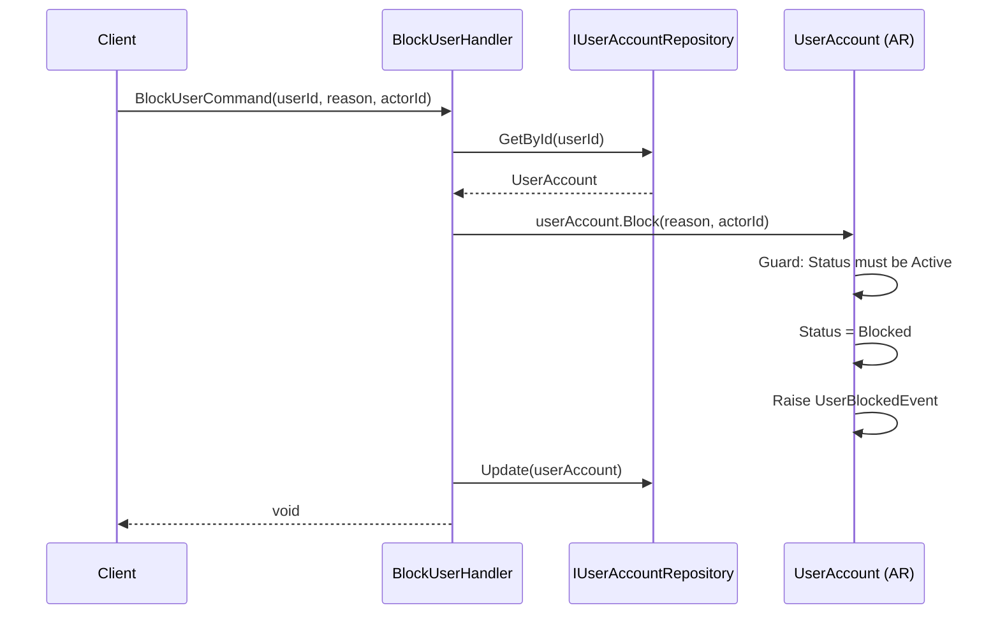
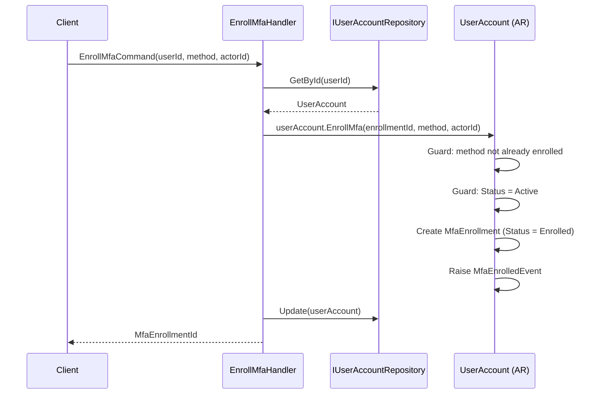
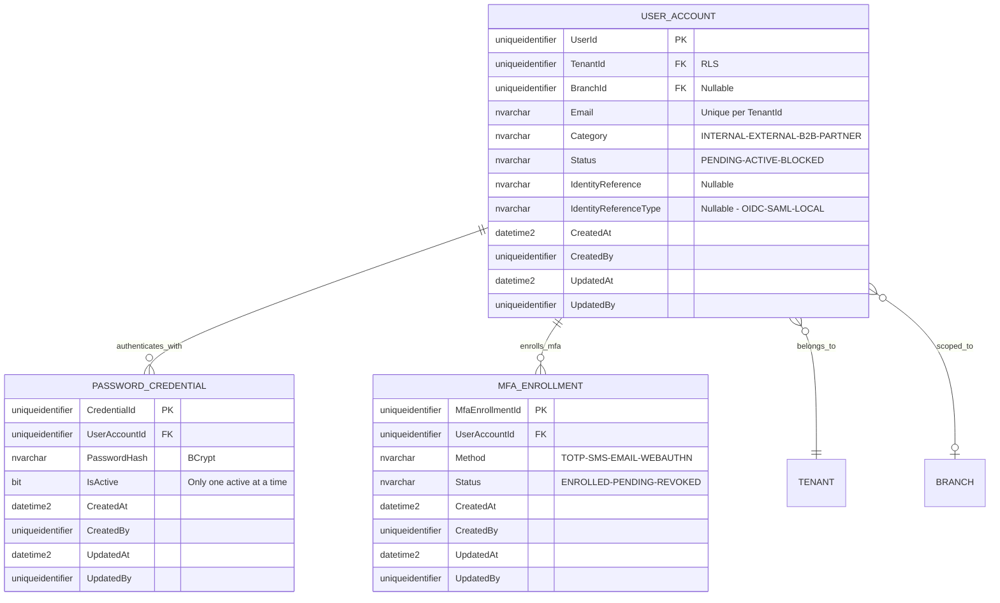
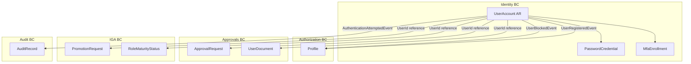

# UserAccount — Aggregate Architecture

**Bounded Context:** Identity  
**Aggregate Root:** `UserAccount`  
**Module:** `Ums.Domain.Identity.UserAccount`  
**Status:** Production

---

## 1. Aggregate Overview

### Purpose
The `UserAccount` aggregate represents a user's identity within a tenant. It governs registration, activation, blocking, external IdP linkage, password credential management, and MFA enrollment. It is the primary identity object referenced by all other bounded contexts.

### Business Responsibility
- Register users within a tenant, assigning them a category and email.
- Track lifecycle: Pending → Active → Blocked → Active.
- Link users to an external Identity Provider (OIDC/SAML subject reference).
- Own `PasswordCredential` and `MfaEnrollment` child entities.
- Emit authentication-related domain events (auth attempted, MFA enrolled/verified).

### Aggregate Root
`UserAccount` is the aggregate root. `PasswordCredential` and `MfaEnrollment` must be managed exclusively through `UserAccount` commands. External aggregates hold `UserId` references only.

### Invariants and Consistency Rules
1. `Email` must be unique per `TenantId`.
2. A `UserAccount` in status `Blocked` cannot authenticate.
3. A `UserAccount` in status `Pending` has no active `PasswordCredential`.
4. At most one `PasswordCredential` can be `IsActive = true` at any time.
5. Multiple `MfaEnrollment` records may exist (one per method), but each method may only be enrolled once per user.
6. `IdentityReference` and `IdentityReferenceType` must be set together or both null.
7. A `FEDERATED` user (has `IdentityReference`) should not have an active `PasswordCredential`.

### Related Entities / Value Objects
| Entity / VO | Type | Ownership |
|---|---|---|
| `PasswordCredential` | Entity | Owned — child of UserAccount |
| `MfaEnrollment` | Entity | Owned — child of UserAccount |
| `TenantId` | Value Object | FK reference to Tenant |
| `BranchId` | Value Object | FK reference to Branch (optional scope) |
| `Email` | Value Object | Validated email |
| `UserCategory` | Enum | INTERNAL · EXTERNAL · B2B · PARTNER |
| `UserStatus` | Enum | Pending · Active · Blocked |
| `IdentityReference` | Value Object | External IdP subject ID |
| `IdentityReferenceType` | Enum | OIDC · SAML · LOCAL |
| `AuditValueObject` | Value Object | CreatedAt/By, UpdatedAt/By |

### Domain Events
| Event | Trigger |
|---|---|
| `UserRegisteredEvent` | New user created in the system |
| `UserActivatedEvent` | User moved from Pending or Blocked to Active |
| `UserBlockedEvent` | User blocked (compliance or manual action) |
| `UserRestoredEvent` | Blocked user restored to Active |
| `MfaEnrolledEvent` | New MFA method enrolled |
| `MfaVerifiedEvent` | MFA challenge successfully verified |
| `AuthenticationAttemptedEvent` | Login attempt recorded (success or failure) |

### Commands / Use Cases
| Command | Description |
|---|---|
| `RegisterUserCommand` | Register a new user within a tenant |
| `ActivateUserCommand` | Activate a pending or blocked user |
| `BlockUserCommand` | Block a user (compliance enforcement or manual) |
| `RestoreUserCommand` | Restore a blocked user to Active |
| `SetPasswordCommand` | Set or rotate the active password credential |
| `EnrollMfaCommand` | Enroll a new MFA method |
| `LinkExternalIdentityCommand` | Associate an external IdP subject reference |

### Repository / Service Boundaries
- `IUserAccountRepository` — persists `UserAccount` aggregate including owned credentials and enrollments.
- `IPasswordHashingService` — domain service for BCrypt hashing; called before `PasswordCredential` is created.
- `IEmailUniquenessChecker` — domain service to verify email uniqueness within a tenant.

---

## 2. Object Model

### Classes / Entities / Value Objects

```
UserAccount (Aggregate Root)
├── Props: UserAccountProps
│   ├── Id: IdValueObject
│   ├── TenantId: TenantId
│   ├── BranchId?: BranchId
│   ├── Email: Email
│   ├── Category: UserCategory
│   ├── Status: UserStatus
│   ├── IdentityReference?: IdentityReference
│   ├── IdentityReferenceType?: IdentityReferenceType
│   └── Audit: AuditValueObject
├── Children
│   ├── PasswordCredential? (0..1 active)
│   └── IReadOnlyList<MfaEnrollment>
└── DomainEvents: UserAccountDomainEventsManager
```

### Main Attributes
| Attribute | Type | Notes |
|---|---|---|
| `Id` | `Guid` | PK |
| `TenantId` | `Guid` | FK — RLS scope |
| `BranchId` | `Guid?` | Optional branch scope |
| `Email` | `string` | Unique per tenant |
| `Category` | `UserCategory` | Classification |
| `Status` | `UserStatus` | Lifecycle state |
| `IdentityReference` | `string?` | External IdP subject |
| `IdentityReferenceType` | `string?` | OIDC / SAML / LOCAL |

### Lifecycle / Status Fields
```
Pending ──► Active ──► Blocked ──► Active
                └──► (no direct to Inactive — use Blocked)
```

### Validation Rules
- `Email`: required, valid format, unique per `TenantId`.
- `Category`: must be a valid `UserCategory`.
- `IdentityReference` + `IdentityReferenceType` must be set/cleared together.
- Status transitions must follow the defined lifecycle.

---

## 3. Sequence Diagrams

### Register User Flow


### Set Password Flow


### Block User Flow


### Enroll MFA Flow


---

## 4. Entity / Relationship Model



---

## 5. Bounded Context Model



**Context Ownership:** Identity BC.  
**Upstream:** `Tenant` provides `TenantId` and `BranchId` context.  
**Downstream:** Authorization, Approvals, IGA, and Audit all reference `UserId`.  
**Integration:** `UserRegisteredEvent` → Authorization BC creates a default Profile. `UserBlockedEvent` → Authorization BC deactivates active Profiles.

---

## 6. API / Application Layer Contract

### Commands
| Command | Input | Output |
|---|---|---|
| `RegisterUserCommand` | `tenantId, email, category, identityRef?, identityRefType?, branchId?, createdBy` | `Guid userId` |
| `ActivateUserCommand` | `userId, actorId` | `void` |
| `BlockUserCommand` | `userId, reason, actorId` | `void` |
| `RestoreUserCommand` | `userId, actorId` | `void` |
| `SetPasswordCommand` | `userId, plainPassword, actorId` | `void` |
| `EnrollMfaCommand` | `userId, method, actorId` | `Guid enrollmentId` |
| `LinkExternalIdentityCommand` | `userId, identityReference, identityReferenceType, actorId` | `void` |

### Queries
| Query | Filter | Returns |
|---|---|---|
| `GetUserByIdQuery` | `userId` | `UserAccountDetailDto` |
| `GetUserByEmailQuery` | `tenantId, email` | `UserAccountDetailDto?` |
| `ListUsersQuery` | `tenantId, status?, category?, page, pageSize` | `PagedList<UserSummaryDto>` |
| `GetUserCredentialStatusQuery` | `userId` | `CredentialStatusDto` |
| `GetUserMfaEnrollmentsQuery` | `userId` | `List<MfaEnrollmentDto>` |

### Error Cases
| Code | Condition |
|---|---|
| `USER_EMAIL_DUPLICATE` | Email already used in tenant |
| `USER_NOT_FOUND` | Unknown userId |
| `USER_NOT_ACTIVE` | Operation requires Active status |
| `USER_ALREADY_BLOCKED` | Block on already-blocked user |
| `MFA_METHOD_ALREADY_ENROLLED` | Duplicate MFA method for same user |
| `IDENTITY_REFERENCE_INCOMPLETE` | Only one of reference/type provided |

---

## 7. Persistence Notes

### Transaction Boundary
`UserAccount`, `PasswordCredential`, and `MfaEnrollment` are saved in a single `SaveChanges()` call.

### Indexes
| Index | Columns | Type |
|---|---|---|
| `IX_UserAccount_TenantId_Email` | `TenantId, Email` | Unique |
| `IX_UserAccount_TenantId_Status` | `TenantId, Status` | Non-unique |
| `IX_UserAccount_IdentityReference` | `IdentityReference, TenantId` | Non-unique |
| `IX_PasswordCredential_UserAccountId_IsActive` | `UserAccountId, IsActive` | Non-unique |
| `IX_MfaEnrollment_UserAccountId_Method` | `UserAccountId, Method` | Unique |

### Unique Constraints
- `(TenantId, Email)` unique.
- `(UserAccountId, MfaMethod)` unique — one enrollment per method per user.

### Soft Delete / Audit
- No physical delete for `UserAccount` — use `Blocked` status.
- `PasswordCredential` rotation keeps history (old credential `IsActive = false`); only the current active one is used.

### Multi-Tenant Considerations
- All queries must filter by `TenantId` via Row-Level Security.
- Email uniqueness enforced at the tenant scope, not global.

---

## 8. Security and Audit

### Authorization Rules
| Operation | Required Role |
|---|---|
| Register User | `Tenant:Admin` or `Tenant:UserManager` |
| Block / Restore User | `Tenant:Admin` |
| Set Password | User themselves or `Tenant:Admin` |
| Enroll MFA | User themselves |
| Link External Identity | `Tenant:Admin` |

### Sensitive Data
- `PasswordHash` — BCrypt hash, never returned in queries; write-only.
- `Email` — PII; must be masked in logs.
- `IdentityReference` — external IdP subject ID; restricted read.

### Audit Events
- `USER_REGISTERED`, `USER_ACTIVATED`, `USER_BLOCKED`, `USER_RESTORED`
- `PASSWORD_SET`, `MFA_ENROLLED`, `MFA_VERIFIED`
- `AUTHENTICATION_ATTEMPTED` (with `AuditResult: SUCCESS/FAILURE`)

### Compliance Considerations
- Failed authentication attempts must be recorded in `AUDIT_RECORD` for brute-force detection.
- PII fields (`Email`) are subject to GDPR right-to-erasure — anonymization strategy needed for inactive accounts.
- `PasswordHash` must never appear in `WhatChanged` JSON of audit records.
