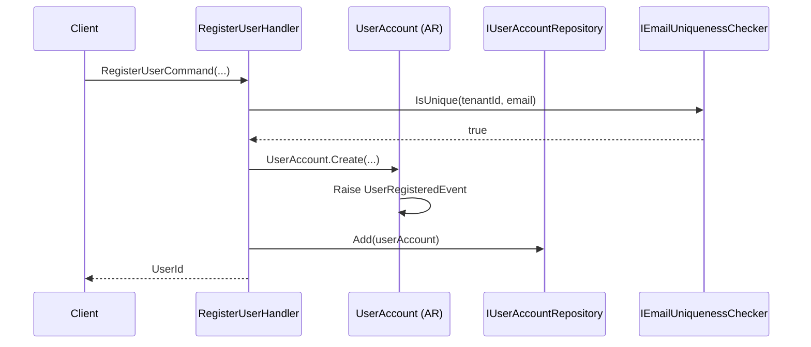
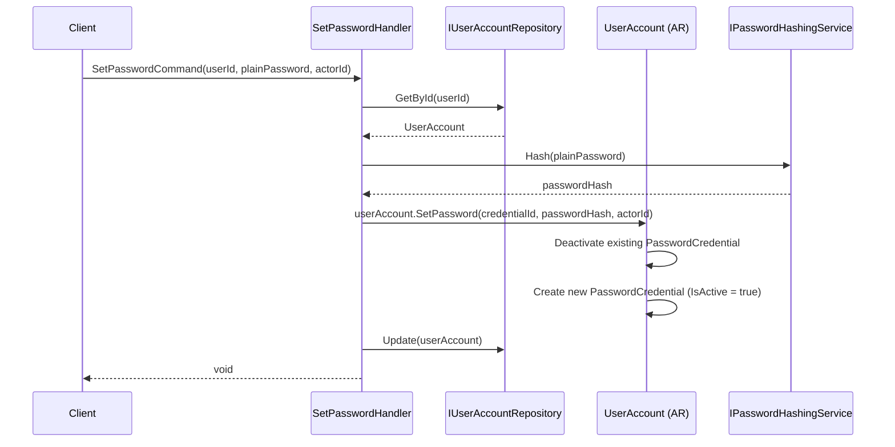
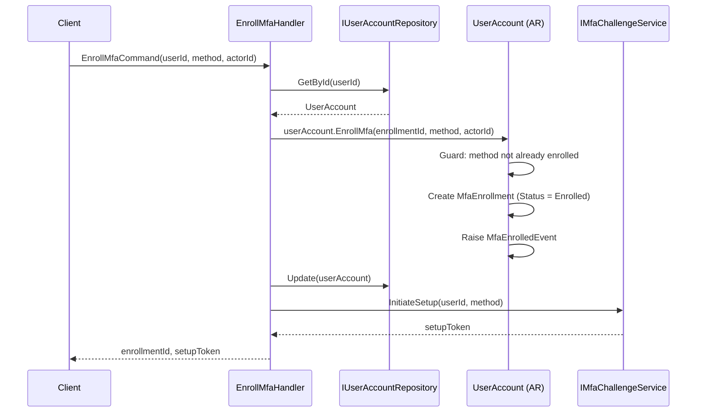
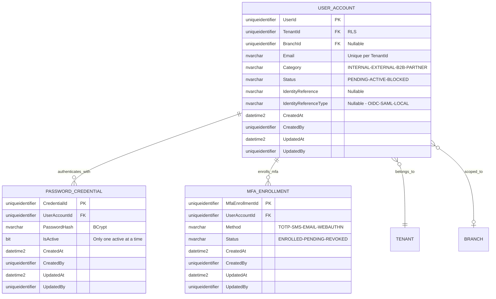
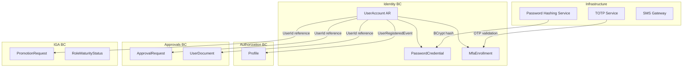

# UserAccount — Aggregate Architecture

**Bounded Context:** Identity  
**Aggregate Root:** `UserAccount`  
**Module:** `Ums.Domain.Identity.UserAccount`  
**Status:** Production

---

## 1. Aggregate Overview

### Purpose
The `UserAccount` aggregate represents a user's identity within a tenant. It governs registration, activation, blocking, external IdP linkage, password credential management, and MFA enrollment. It is the primary identity object referenced by all other bounded contexts. It fully owns the `PasswordCredential` and `MfaEnrollment` child entities.

> **Delegated Administration:** A `UserAccount` with an administrative role may receive a `UserManagementDelegation` from another administrator, granting them the authority to manage a restricted set of users within a defined scope (tenant, organization, department, system, or team). This authority is enforced at the application layer by checking for an `ACTIVE` delegation before processing restricted commands. See [`UserManagementDelegation`](./user-management-delegation.md) · [FS-14](../../governance/requirements/functional-stories/fs-14-delegated-management.md).

### Business Responsibility
- Register users within a tenant, assigning them a category and email.
- Track lifecycle: Pending → Active → Blocked → Active.
- Link users to an external Identity Provider (OIDC/SAML subject reference).
- Own `PasswordCredential` and `MfaEnrollment` child entities.
- Emit authentication-related domain events (auth attempted, MFA enrolled/verified).

### Aggregate Root
`UserAccount` is the aggregate root. `PasswordCredential` and `MfaEnrollment` must be managed exclusively through `UserAccount` commands. External aggregates hold `UserId` references only.

### Invariants and Consistency Rules
1. `Email` must be unique per `TenantId`.
14. A `UserAccount` acting as a delegated admin may only execute management commands (`RegisterUserCommand`, `BlockUserCommand`, `AssignProfileCommand`) on users within their `ACTIVE` delegation scope — validated by `IDelegationScopeValidator` at application layer.
15. A `UserAccount` cannot delegate authority it does not itself possess (`no-elevation` rule — INV-DEL1).
2. A `UserAccount` in status `Blocked` cannot authenticate.
3. A `UserAccount` in status `Pending` has no active `PasswordCredential`.
4. At most one `PasswordCredential` can be `IsActive = true` at any time.
5. Setting a new password automatically deactivates the previous active credential.
6. Historical credentials (IsActive = false) are retained for audit — never physically deleted.
7. `PasswordHash` must be a valid BCrypt hash (validated by domain service before assignment).
8. `IdentityReference` and `IdentityReferenceType` must be set together or both null.
9. A `FEDERATED` user (has `IdentityReference`) should not have an active `PasswordCredential`.
10. Multiple `MfaEnrollment` records may exist (one per method), but each method may only be enrolled once per user.
11. MFA Enrollment status transitions: `Pending → Enrolled → Revoked`.
12. `UserAccount.Status` must be `Active` to enroll a new MFA method.
13. At least one enrolled MFA method must remain if the tenant requires MFA.

### Related Entities / Value Objects
| Entity / VO | Type | Ownership |
|---|---|---|
| `PasswordCredential` | Entity | Owned — child of UserAccount |
| `MfaEnrollment` | Entity | Owned — child of UserAccount |
| `TenantId` | Value Object | FK reference to Tenant |
| `BranchId` | Value Object | FK reference to Branch (optional scope) |
| `Email` | Value Object | Validated email |
| `UserCategory` | Enum | INTERNAL · EXTERNAL · B2B · PARTNER |
| `DelegationId` | Value Object | Reference to `UserManagementDelegation` — set in application context, not stored on aggregate |
| `UserStatus` | Enum | Pending · Active · Blocked |
| `IdentityReference` | Value Object | External IdP subject ID |
| `IdentityReferenceType` | Enum | OIDC · SAML · LOCAL |
| `PasswordHash` | Value Object | Validated BCrypt hash string |
| `MfaMethod` | Enum | TOTP · SMS · EMAIL · WEBAUTHN |
| `MfaEnrollmentStatus` | Enum | Enrolled · Pending · Revoked |
| `AuditValueObject` | Value Object | CreatedAt/By, UpdatedAt/By |

### Domain Events
| Event | Trigger |
|---|---|
| `UserRegisteredEvent` | New user created in the system (by direct admin or delegated admin) |
| `UserActivatedEvent` | User moved from Pending or Blocked to Active |
| `UserBlockedEvent` | User blocked (compliance or manual action) |
| `UserRestoredEvent` | Blocked user restored to Active |
| `MfaEnrolledEvent` | New MFA method enrolled |
| `MfaVerifiedEvent` | MFA challenge successfully verified |
| `AuthenticationAttemptedEvent` | Login attempt recorded (success or failure) |

### Commands / Use Cases
| Command | Description |
|---|---|
| `RegisterUserCommand` | Register a new user within a tenant |
| `ActivateUserCommand` | Activate a pending or blocked user |
| `BlockUserCommand` | Block a user (compliance enforcement or manual) |
| `RestoreUserCommand` | Restore a blocked user to Active |
| `SetPasswordCommand` | Create or rotate the active password credential |
| `DeactivatePasswordCommand` | Deactivate credential (e.g. on account federation) |
| `LinkExternalIdentityCommand` | Associate an external IdP subject reference |
| `EnrollMfaCommand` | Enroll a new MFA method |
| `VerifyMfaCommand` | Confirm MFA challenge (transitions Pending → Enrolled) |
| `RevokeMfaEnrollmentCommand` | Revoke an enrolled MFA method |

### Repository / Service Boundaries
- `IUserAccountRepository` — persists `UserAccount` aggregate including owned credentials and enrollments.
- `IPasswordHashingService` — domain service for BCrypt hashing.
- `IEmailUniquenessChecker` — domain service to verify email uniqueness within a tenant.
- `IMfaChallengeService` — infrastructure service handling OTP generation/TOTP validation.
- `IDelegationScopeValidator` — application service; validates that the acting admin has an `ACTIVE` `UserManagementDelegation` covering the target user and requested action before processing delegation-gated commands.

---

## 2. Object Model

### Classes / Entities / Value Objects

```
UserAccount (Aggregate Root)
├── Props: UserAccountProps
│   ├── Id: IdValueObject
│   ├── TenantId: TenantId
│   ├── BranchId?: BranchId
│   ├── Email: Email
│   ├── Category: UserCategory
│   ├── Status: UserStatus
│   ├── IdentityReference?: IdentityReference
│   ├── IdentityReferenceType?: IdentityReferenceType
│   └── Audit: AuditValueObject
├── Children
│   ├── PasswordCredential? (0..N stored, 0..1 active)
│   │   └── Props: PasswordCredentialProps (Id, UserAccountId, PasswordHash, IsActive)
│   └── IReadOnlyList<MfaEnrollment>
│       └── Props: MfaEnrollmentProps (Id, UserAccountId, Method, Status)
└── DomainEvents: UserAccountDomainEventsManager
```

### Main Attributes
| Attribute | Entity | Type | Notes |
|---|---|---|---|
| `Id` | UserAccount | `Guid` | PK |
| `TenantId` | UserAccount | `Guid` | FK — RLS scope |
| `Email` | UserAccount | `string` | Unique per tenant |
| `Category` | UserAccount | `UserCategory` | Classification |
| `Status` | UserAccount | `UserStatus` | Lifecycle state |
| `IdentityReference` | UserAccount | `string?` | External IdP subject |
| `PasswordHash` | PasswordCredential | `string` | BCrypt hash — write-only |
| `IsActive` | PasswordCredential | `bool` | Only one `true` at a time |
| `Method` | MfaEnrollment | `MfaMethod` | TOTP / SMS / EMAIL / WEBAUTHN |
| `Status` | MfaEnrollment | `MfaEnrollmentStatus`| Enrolled / Pending / Revoked |

---

## 3. Sequence Diagrams

*(Consolidated view covering core flows)*

### Register User Flow


### Set Password Flow


### Enroll MFA Flow


---

## 4. Entity / Relationship Model



---

## 5. Bounded Context Model



---

## 6. API / Application Layer Contract

### Commands
| Command | Output |
|---|---|
| `RegisterUserCommand` | `Guid userId` |
| `ActivateUserCommand` | `void` |
| `BlockUserCommand` | `void` |
| `RestoreUserCommand` | `void` |
| `SetPasswordCommand` | `void` |
| `DeactivatePasswordCommand` | `void` |
| `LinkExternalIdentityCommand` | `void` |
| `EnrollMfaCommand` | `Guid enrollmentId, string setupToken` |
| `VerifyMfaCommand` | `void` |
| `RevokeMfaEnrollmentCommand` | `void` |

### Queries
| Query | Returns |
|---|---|
| `GetUserByIdQuery` | `UserAccountDetailDto` |
| `GetUserByEmailQuery` | `UserAccountDetailDto?` |
| `ListUsersQuery` | `PagedList<UserSummaryDto>` |
| `GetUserCredentialStatusQuery` | `CredentialStatusDto` |
| `GetUserMfaEnrollmentsQuery` | `List<MfaEnrollmentDto>` |

---

## 7. Persistence Notes

### Transaction Boundary
`UserAccount`, `PasswordCredential`, and `MfaEnrollment` are saved in a single `SaveChanges()` call.

### Indexes
| Index | Columns | Type |
|---|---|---|
| `IX_UserAccount_TenantId_Email` | `TenantId, Email` | Unique |
| `IX_UserAccount_TenantId_Status` | `TenantId, Status` | Non-unique |
| `IX_UserAccount_IdentityReference` | `IdentityReference, TenantId` | Non-unique |
| `IX_PasswordCredential_UserAccountId_IsActive` | `UserAccountId, IsActive` | Non-unique |
| `IX_MfaEnrollment_UserAccountId_Method` | `UserAccountId, Method` | Unique |

### Security
- `PasswordHash` column must never appear in query projections returned to clients.
- `PasswordHash` must never appear in `AuditRecord.WhatChanged` payloads.
- Column must be encrypted at rest (SQL Server Always Encrypted or TDE).

---

## 8. Security and Audit

### Authorization Rules
| Operation | Required Role | Delegation Gate |
|---|---|---|
| Register User | `Tenant:Admin` or `Tenant:UserManager` | Delegated admin with `CREATE_USER` in scope |
| Block / Restore User | `Tenant:Admin` | Delegated admin with `BLOCK_USER` in scope |
| Set Password | User themselves or `Tenant:Admin` | — |
| Enroll / Revoke / Verify MFA | User themselves | — |
| Link External Identity | `Tenant:Admin` | — |
| Assign Profile | `Tenant:Admin` | Delegated admin with `ASSIGN_PROFILE` in scope |

> **Delegation Gate:** When present, the handler also accepts requests from a `UserAccount` holding an `ACTIVE` `UserManagementDelegation` that covers the target user and the listed action. Validated by `IDelegationScopeValidator` before the command reaches the aggregate. See [`UserManagementDelegation`](./user-management-delegation.md).

### Audit Events
- `USER_REGISTERED`, `USER_ACTIVATED`, `USER_BLOCKED`, `USER_RESTORED`
- `PASSWORD_SET`, `MFA_ENROLLED`, `MFA_VERIFIED`, `MFA_REVOKED`
- `AUTHENTICATION_ATTEMPTED` (with `AuditResult: SUCCESS/FAILURE`)
