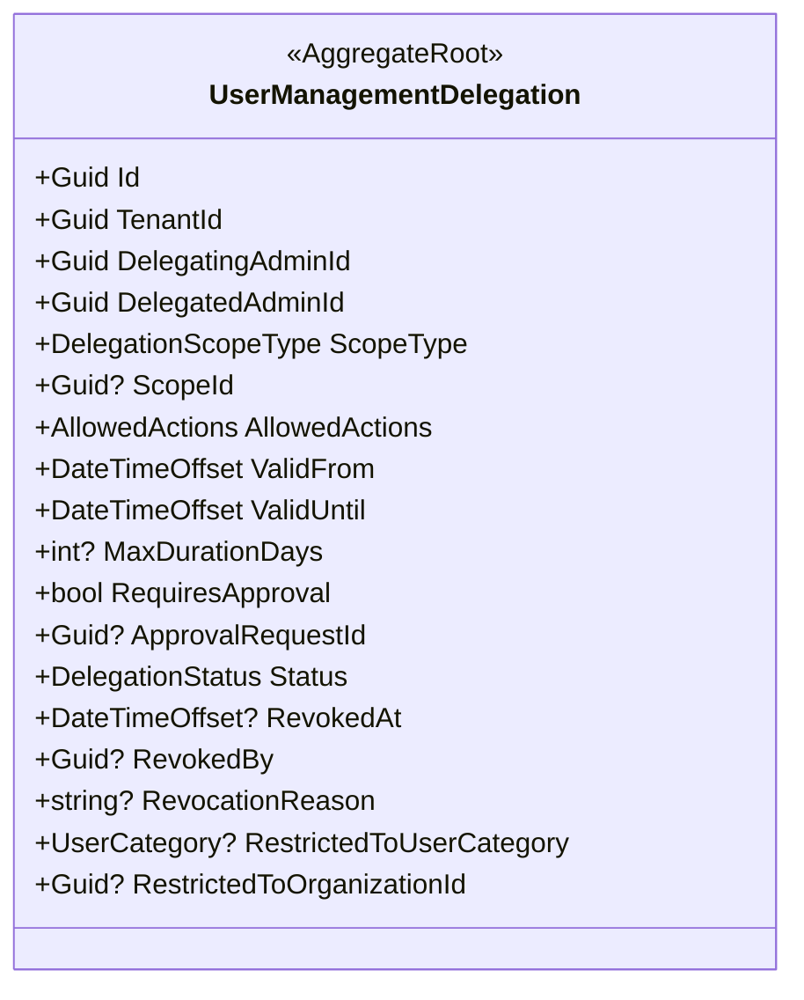
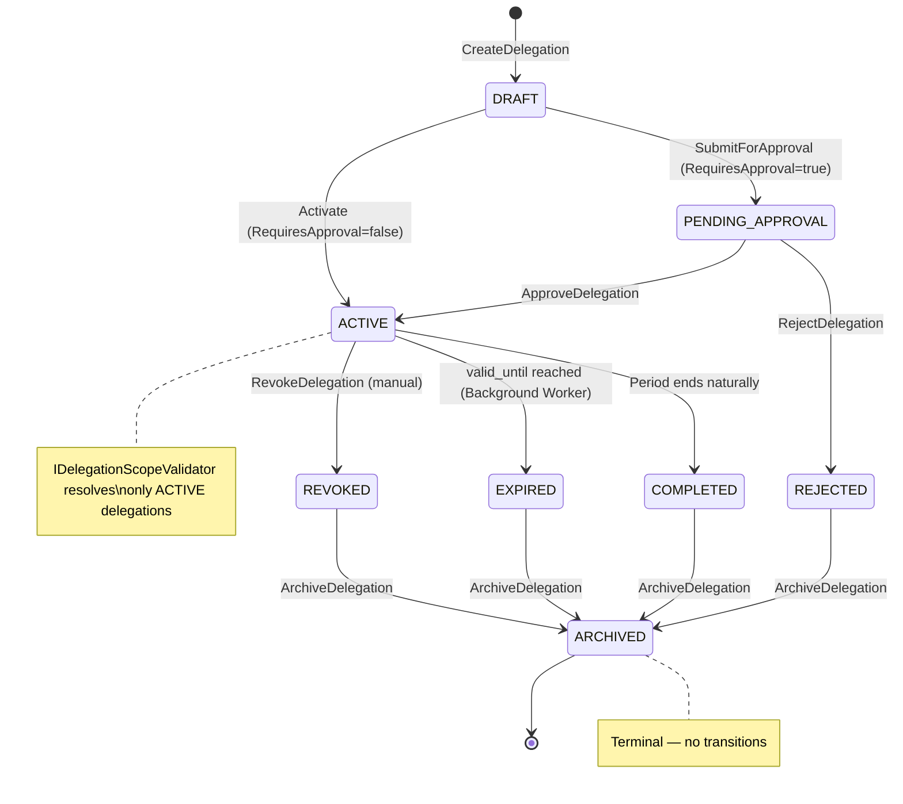
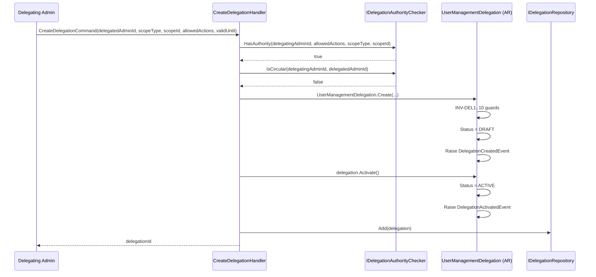
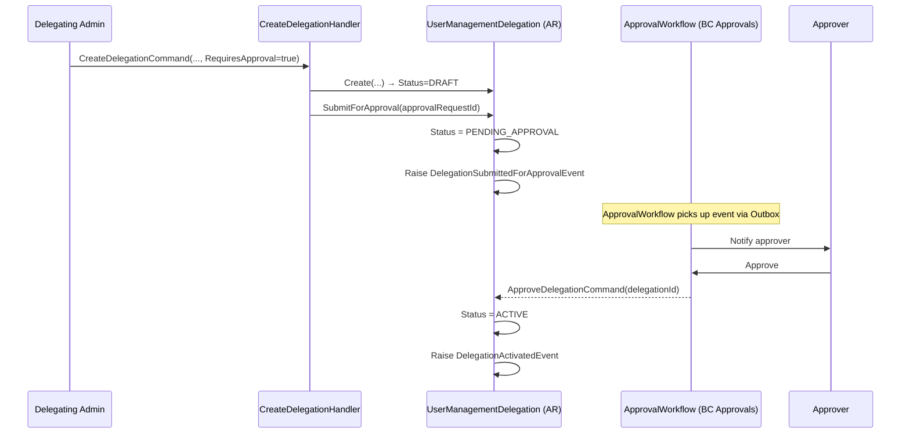
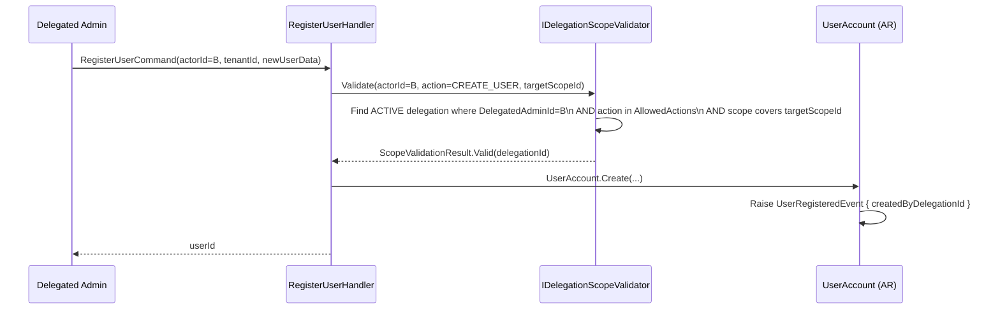
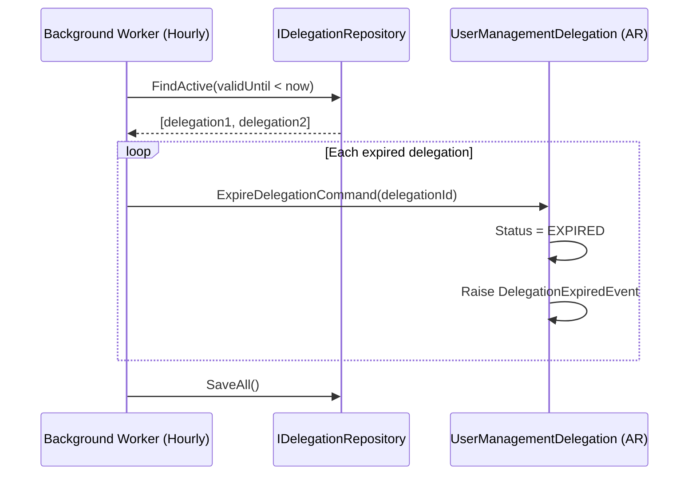
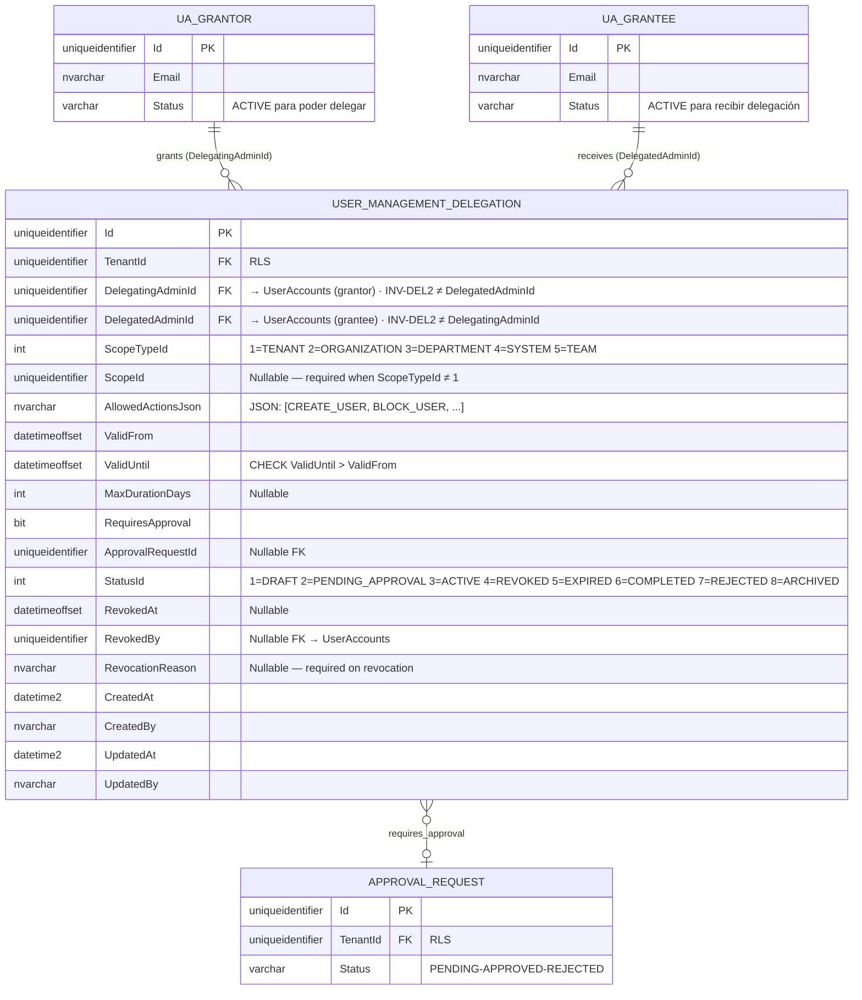
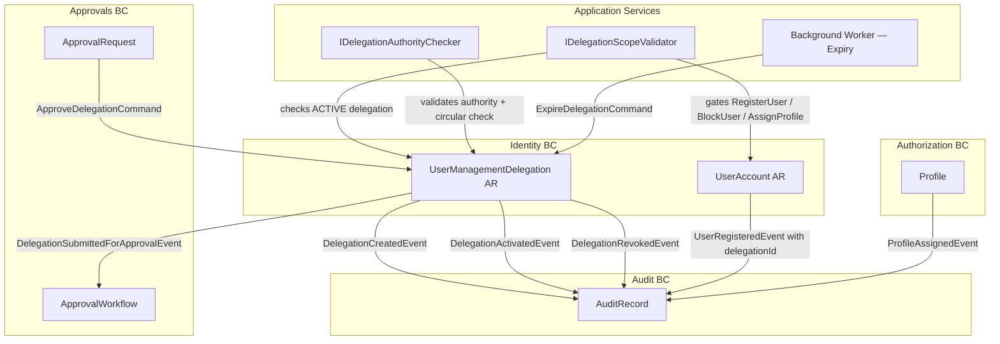

# UserManagementDelegation — Aggregate Architecture

**Bounded Context:** Identity  
**Aggregate Root:** `UserManagementDelegation`  
**Module:** `Ums.Domain.Identity.UserManagementDelegation`  
**Schema:** `[delegation]`  
**Status:** Production  
**Functional Story:** [FS-14 — Delegate User Management Between Administrators](../../governance/requirements/functional-stories/fs-14-delegated-management.md)  
**Epic:** EP-06 (Post-MVP)

---

## 1. Aggregate Overview

### Purpose

`UserManagementDelegation` allows an administrator (`DelegatingAdmin`) to transfer a controlled, time-bounded subset of their user management authority to another administrator (`DelegatedAdmin`). The delegated authority is restricted by scope type, allowed actions, and an optional approval gate. The aggregate enforces the **no-elevation** principle: a delegator can never grant more authority than they themselves hold.

### Business Responsibility

- Record which administrator delegated which authority to whom.
- Enforce scope constraints (`TENANT`, `ORGANIZATION`, `DEPARTMENT`, `SYSTEM`, `TEAM`) so the delegated admin operates only within the authorized boundary.
- Enforce allowed-actions list (`CREATE_USER`, `BLOCK_USER`, `ASSIGN_PROFILE`, `RESET_PASSWORD`, `REVOKE_MFA`).
- Manage temporal validity (`valid_from` / `valid_until`).
- Optionally route through an `ApprovalWorkflow` before activation.
- Provide an `IDelegationScopeValidator` contract consumed by application-layer handlers of `UserAccount` commands.
- Emit audit events for every lifecycle transition.

### Aggregate Root

`UserManagementDelegation` is the sole root. No child entities are owned; related objects (`DelegatingAdmin`, `DelegatedAdmin`) are referenced by ID only.

### Diagram



### State Machine



### Invariants and Consistency Rules

| ID | Rule | Source |
|---|---|---|
| INV-DEL1 | `DelegatingAdmin` cannot grant actions they do not hold — no privilege escalation | FS-14 §6.1 |
| INV-DEL2 | `DelegatingAdmin` and `DelegatedAdmin` cannot be the same user | FS-14 §6 |
| INV-DEL3 | `ValidUntil > ValidFrom` | FS-14 §3 |
| INV-DEL4 | `AllowedActions` must be a non-empty subset of `DelegatingAdmin`'s actual authority | FS-14 §6.2 |
| INV-DEL5 | Circular delegation is forbidden: B cannot delegate to A if A already delegates to B (direct) | FS-14 §5.B |
| INV-DEL6 | A `DRAFT` delegation is not visible to the delegated admin until `ACTIVE` | EP-06 §2.2 |
| INV-DEL7 | A `REVOKED` or `EXPIRED` delegation cannot be re-activated; a new one must be created | EP-06 §2.2 |
| INV-DEL8 | `MaxDurationDays`, if set, caps `ValidUntil − ValidFrom`; cannot be overridden at creation | EP-06 §2.1 |
| INV-DEL9 | If `RequiresApproval = true`, delegation cannot transition to `ACTIVE` without an `ApprovalRequestId` with `status = APPROVED` | EP-06 §2.1 |
| INV-DEL10 | `ScopeId` must be set when `ScopeType` is not `TENANT` | design decision |

### Value Objects

| Value Object | Type | Values |
|---|---|---|
| `DelegationScopeType` | Enum | `TENANT · ORGANIZATION · DEPARTMENT · SYSTEM · TEAM` |
| `AllowedActions` | Value Object (list) | `CREATE_USER · BLOCK_USER · ASSIGN_PROFILE · RESET_PASSWORD · REVOKE_MFA` |
| `DelegationStatus` | Enum | `DRAFT · PENDING_APPROVAL · ACTIVE · REVOKED · EXPIRED · COMPLETED · REJECTED · ARCHIVED` |
| `ValidFrom` | DateTimeOffset | Must be ≤ `ValidUntil` |
| `ValidUntil` | DateTimeOffset | Must be > `ValidFrom` |
| `RevocationReason` | string? | Required when `Status → REVOKED` |

### Related Entities / References

| Reference | Type | Notes |
|---|---|---|
| `DelegatingAdminId` | FK → `UserAccount` | The admin granting authority |
| `DelegatedAdminId` | FK → `UserAccount` | The admin receiving authority |
| `ApprovalRequestId` | FK → `ApprovalRequest` | Set when `RequiresApproval = true` |
| `ScopeId` | FK → tenant/org/dept/system/team entity | Nullable; required when `ScopeType ≠ TENANT` |

### Domain Events

| Event | Trigger |
|---|---|
| `DelegationCreatedEvent` | New delegation drafted `{ delegationId, delegatingAdminId, delegatedAdminId, scopeType, allowedActions }` |
| `DelegationSubmittedForApprovalEvent` | Sent to `ApprovalWorkflow` `{ delegationId, approvalRequestId }` |
| `DelegationActivatedEvent` | Delegation goes `ACTIVE` `{ delegationId, validFrom, validUntil }` |
| `DelegationRevokedEvent` | Manual revocation `{ delegationId, revokedBy, reason }` |
| `DelegationExpiredEvent` | Background worker expires `{ delegationId, expiredAt }` |
| `DelegationRejectedEvent` | Approval rejected `{ delegationId, rejectionReason }` |
| `DelegationArchivedEvent` | Terminal state `{ delegationId, previousStatus }` |

### Commands / Use Cases

| Command | Actor | Description |
|---|---|---|
| `CreateDelegationCommand` | Delegating Admin | Draft a new delegation with scope and allowed actions |
| `SubmitDelegationForApprovalCommand` | Delegating Admin | Route to approval workflow if `RequiresApproval = true` |
| `ActivateDelegationCommand` | System / Approver | Activate after approval or directly if no approval required |
| `RevokeDelegationCommand` | Delegating Admin or Superior Admin | Immediately deactivate with reason |
| `ExpireDelegationCommand` | Background Worker | Expire delegations where `valid_until < now` |
| `CompleteDelegationCommand` | Background Worker | Natural completion at period end |
| `ArchiveDelegationCommand` | Background Worker | Move terminal-state delegations to `ARCHIVED` |

### Repository / Service Boundaries

- `IUserManagementDelegationRepository` — persists and retrieves delegations.
- `IDelegationScopeValidator` — application service; used by `UserAccount` command handlers to check if the acting admin has an `ACTIVE` delegation covering `(targetUserId, requestedAction, scopeId)`.
- `IDelegationAuthorityChecker` — domain service; validates INV-DEL1 (no escalation) and INV-DEL5 (circular delegation).

---

## 2. Object Model

```
UserManagementDelegation (Aggregate Root)
├── Props: UserManagementDelegationProps
│   ├── Id: IdValueObject
│   ├── TenantId: TenantId
│   ├── DelegatingAdminId: UserId
│   ├── DelegatedAdminId: UserId
│   ├── ScopeType: DelegationScopeType
│   ├── ScopeId?: ScopeId
│   ├── AllowedActions: AllowedActions           -- non-empty list VO
│   ├── ValidFrom: DateTimeOffset
│   ├── ValidUntil: DateTimeOffset
│   ├── MaxDurationDays?: int
│   ├── RequiresApproval: bool
│   ├── ApprovalRequestId?: ApprovalRequestId
│   ├── Status: DelegationStatus
│   ├── RevokedAt?: DateTimeOffset
│   ├── RevokedBy?: UserId
│   ├── RevocationReason?: string
│   ├── RestrictedToUserCategory?: UserCategory
│   ├── RestrictedToOrganizationId?: Guid
│   └── Audit: AuditValueObject
└── DomainEvents: UserManagementDelegationEventsManager
```

### Main Attributes

| Attribute | Type | Notes |
|---|---|---|
| `Id` | `Guid` | PK |
| `TenantId` | `Guid` | FK — RLS scope |
| `DelegatingAdminId` | `Guid` | FK → `UserAccount` |
| `DelegatedAdminId` | `Guid` | FK → `UserAccount` |
| `ScopeType` | `DelegationScopeType` | Boundary of authority |
| `ScopeId` | `Guid?` | Target org/dept/system entity; null when `TENANT` scope |
| `AllowedActions` | `string` (JSON) | `["CREATE_USER","ASSIGN_PROFILE",...]` |
| `ValidFrom` | `DateTimeOffset` | Start of authority window |
| `ValidUntil` | `DateTimeOffset` | End of authority window |
| `Status` | `DelegationStatus` | Lifecycle state |
| `RevocationReason` | `string?` | Required on revocation |

---

## 3. Sequence Diagrams

### Create Delegation (No Approval Required)



### Create Delegation (Approval Required)



### Scope Validation at Command Execution



### Background Expiry



---

## 4. Entity / Relationship Model

> **Patrón dual self-join:** `USER_MANAGEMENT_DELEGATION` referencia a `USER_ACCOUNT` **dos veces** con roles distintos. El diagrama usa los alias `UA_GRANTOR` y `UA_GRANTEE` para que Mermaid pueda trazar ambas líneas; en BD ambos alias mapean a la misma tabla `[ums_identity].[UserAccounts]`. La misma cuenta puede aparecer como grantor en N filas y como grantee en M filas simultáneamente. La anti-circularidad (A→B activo + B→A activo) se bloquea en aplicación mediante `IDelegationAuthorityChecker` (INV-DEL5); la auto-delegación se bloquea en BD con `CHECK (DelegatingAdminId <> DelegatedAdminId)` (INV-DEL2).



---

## 5. Bounded Context Model



---

## 6. API / Application Layer Contract

### Commands

| Command | Input | Output | Notes |
|---|---|---|---|
| `CreateDelegationCommand` | `delegatingAdminId, delegatedAdminId, scopeType, scopeId?, allowedActions[], validFrom, validUntil, requiresApproval, restrictedToUserCategory?` | `Guid delegationId` | INV-DEL1..10 validated |
| `SubmitDelegationForApprovalCommand` | `delegationId, approvalRequestId` | `void` | Only from `DRAFT` |
| `ActivateDelegationCommand` | `delegationId` | `void` | From `DRAFT` (no approval) or `PENDING_APPROVAL` (approved) |
| `RevokeDelegationCommand` | `delegationId, revokedBy, reason` | `void` | From `ACTIVE` only |
| `ExpireDelegationCommand` | `delegationId` | `void` | Background Worker only |
| `CompleteDelegationCommand` | `delegationId` | `void` | Background Worker only |
| `ArchiveDelegationCommand` | `delegationId` | `void` | Terminal states only |

### Queries

| Query | Returns |
|---|---|
| `GetDelegationByIdQuery` | `DelegationDetailDto` |
| `ListDelegationsGrantedByQuery` | `PagedList<DelegationSummaryDto>` — delegations this admin has given |
| `ListDelegationsReceivedByQuery` | `PagedList<DelegationSummaryDto>` — delegations this admin holds |
| `GetActiveDelegationForActionQuery` | `ActiveDelegationDto?` — used by `IDelegationScopeValidator` |
| `ListActiveDelegationsByDelegatedAdminQuery` | `List<DelegationSummaryDto>` — all active authority of an admin |

### Application Service Contract

```csharp
public interface IDelegationScopeValidator
{
    /// <summary>
    /// Returns a successful result if <paramref name="actorId"/> has an ACTIVE
    /// UserManagementDelegation that covers <paramref name="action"/>
    /// within the scope containing <paramref name="targetScopeId"/>.
    /// </summary>
    Task<Result<DelegationContext>> ValidateAsync(
        Guid actorId,
        DelegatedAction action,
        Guid tenantId,
        Guid? targetScopeId,
        CancellationToken ct);
}
```

---

## 7. Persistence Notes

### Table

```sql
CREATE TABLE [delegation].[user_management_delegations] (
    [id]                          UNIQUEIDENTIFIER NOT NULL DEFAULT NEWID(),
    [root_tenant_id]              UNIQUEIDENTIFIER NOT NULL,
    [delegating_admin_id]         UNIQUEIDENTIFIER NOT NULL,
    [delegated_admin_id]          UNIQUEIDENTIFIER NOT NULL,
    [scope_type]                  VARCHAR(32)      NOT NULL,  -- TENANT | ORGANIZATION | DEPARTMENT | SYSTEM | TEAM
    [scope_id]                    UNIQUEIDENTIFIER NULL,
    [allowed_actions]             NVARCHAR(MAX)    NOT NULL,  -- JSON: ["CREATE_USER","ASSIGN_PROFILE",...]
    [valid_from]                  DATETIMEOFFSET   NOT NULL,
    [valid_until]                 DATETIMEOFFSET   NOT NULL,
    [max_duration_days]           INT              NULL,
    [requires_approval]           BIT              NOT NULL DEFAULT 0,
    [approval_request_id]         UNIQUEIDENTIFIER NULL,
    [status]                      VARCHAR(32)      NOT NULL DEFAULT 'DRAFT',
    [revoked_at]                  DATETIMEOFFSET   NULL,
    [revoked_by]                  UNIQUEIDENTIFIER NULL,
    [revocation_reason]           NVARCHAR(MAX)    NULL,
    [restricted_to_user_category] VARCHAR(32)      NULL,
    [restricted_to_org_id]        UNIQUEIDENTIFIER NULL,
    [created_by]                  UNIQUEIDENTIFIER NOT NULL,
    [created_at]                  DATETIME2        NOT NULL DEFAULT GETUTCDATE(),
    [updated_by]                  UNIQUEIDENTIFIER NULL,
    [updated_at]                  DATETIME2        NULL,

    CONSTRAINT pk_user_management_delegations
        PRIMARY KEY (id, root_tenant_id),
    CONSTRAINT fk_delegation_delegating_admin
        FOREIGN KEY (delegating_admin_id, root_tenant_id)
        REFERENCES [identity].[users](id, root_tenant_id),
    CONSTRAINT fk_delegation_delegated_admin
        FOREIGN KEY (delegated_admin_id, root_tenant_id)
        REFERENCES [identity].[users](id, root_tenant_id),
    CONSTRAINT fk_delegation_approval
        FOREIGN KEY (approval_request_id, root_tenant_id)
        REFERENCES [approval].[approval_requests](id, root_tenant_id),
    CONSTRAINT chk_valid_until_after_valid_from
        CHECK (valid_until > valid_from),
    CONSTRAINT chk_no_self_delegation
        CHECK (delegating_admin_id <> delegated_admin_id)
);
```

### Indexes

| Index | Columns | Purpose |
|---|---|---|
| `IX_Delegation_DelegatedAdmin_Active` | `delegated_admin_id, root_tenant_id` WHERE `status='ACTIVE'` | `IDelegationScopeValidator` hot path |
| `IX_Delegation_DelegatingAdmin` | `delegating_admin_id, root_tenant_id` | List delegations granted |
| `IX_Delegation_Scope` | `scope_type, scope_id, root_tenant_id` | Scope-based lookups |
| `IX_Delegation_ValidUntil_Active` | `valid_until, root_tenant_id` WHERE `status='ACTIVE'` | Background expiry worker |
| `IX_Delegation_Status_Tenant` | `status, root_tenant_id` | Operational dashboards |

### Transaction Boundary

`UserManagementDelegation` is saved in a single `SaveChanges()` call. The `DelegationSubmittedForApprovalEvent` is dispatched via Transactional Outbox to the Approvals BC — never via direct call.

### RLS

`root_tenant_id` is set in `SESSION_CONTEXT` by `DbConnectionInterceptor`. The SQL Server RLS predicate on `[delegation].[user_management_delegations]` filters by `root_tenant_id` as secondary failsafe (Two-Layer RLS — ADR-TBD).

---

## 8. Security and Audit

### Authorization Rules

| Operation | Required Role | Notes |
|---|---|---|
| Create Delegation | `Tenant:Admin` | Subject to INV-DEL1 (no escalation) |
| Submit for Approval | `Tenant:Admin` (delegating admin only) | Only the creator can submit |
| Revoke Delegation | `Tenant:Admin` (delegating admin) or `Platform:SuperAdmin` | Superior admin can also revoke |
| View delegations received | `Tenant:Admin` (delegated admin) | Own delegations only |
| View delegations granted | `Tenant:Admin` (delegating admin) | Own delegations only |
| Expire / Archive | Background Worker system identity | Never user-facing |

### Audit Events

- `DELEGATION_CREATED` — `{ delegationId, delegatingAdminId, delegatedAdminId, scopeType, allowedActions }`
- `DELEGATION_SUBMITTED_FOR_APPROVAL` — `{ delegationId, approvalRequestId }`
- `DELEGATION_ACTIVATED` — `{ delegationId, activatedAt, validUntil }`
- `DELEGATION_REVOKED` — `{ delegationId, revokedBy, reason }`
- `DELEGATION_EXPIRED` — `{ delegationId, expiredAt }`
- `DELEGATION_REJECTED` — `{ delegationId, rejectedBy, reason }`
- `DELEGATION_ARCHIVED` — `{ delegationId, previousStatus }`
- `DELEGATION_SCOPE_VALIDATED` — emitted by `IDelegationScopeValidator` for every command gated by delegation `{ delegationId, actorId, action, targetScopeId, result }`

### Security Invariants

- `PasswordHash` and MFA secrets from `UserAccount` are **never** readable via delegation — delegation only grants management commands, not credential access.
- `DELEGATION_SCOPE_VALIDATED` audit record is written even on failed validation, enabling detection of privilege abuse attempts.
- The `no-elevation` rule (INV-DEL1) is enforced by `IDelegationAuthorityChecker` which queries the delegating admin's `Profile` permissions via the Authorization BC read model before creating the delegation.

---

**[← UserAccount](./user-account.md)** | **[Identity Domain Index](./index.md)** | **[Domain Aggregate Index](../index.md)** | **[FS-14](../../governance/requirements/functional-stories/fs-14-delegated-management.md)**
