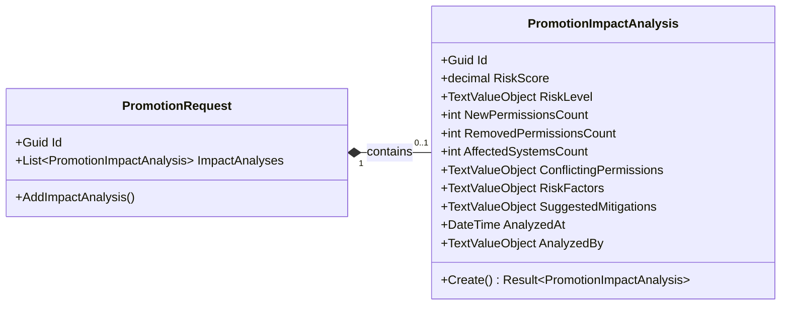
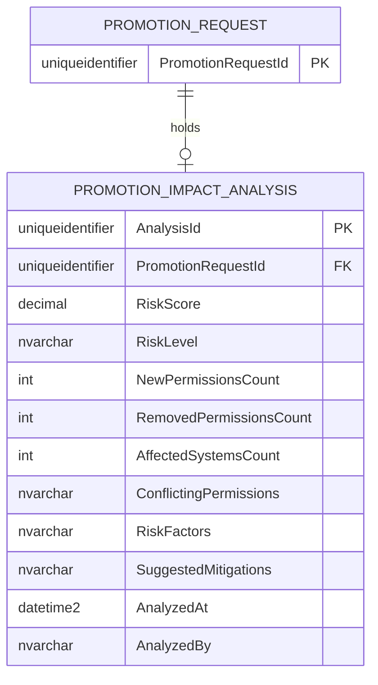

# PromotionImpactAnalysis — Entity Architecture

**Bounded Context:** IGA  
**Aggregate Root:** `PromotionRequest`  
**Module:** `Ums.Domain.IGA.PromotionRequest.PromotionImpactAnalysis`  
**Status:** Production

---

## 1. Entity Overview

### Purpose
The `PromotionImpactAnalysis` entity logs security risk assessments generated during a role promotion request. It tracks toxic combination indicators, separation of duties (SOD) violations, affected directory structures, and mitigation advice before access is authorized.

### Business Responsibility
- Quantify access promotion risks into a unified score (0 to 100).
- Identify permission conflicts and toxic combinations.
- List affected software systems and resources.
- Provide security auditors with recommended mitigation policies.

### Aggregate Root
This is an owned entity belonging to the `PromotionRequest` aggregate. It is created and stored exclusively through root promotion request methods.

### Invariants and Consistency Rules
1. **INV-PIA1 (Risk Score Limits):** The `RiskScore` must be a decimal value strictly between `0` and `100` inclusive (`DomainErrors.IGA.InvalidPerformanceScore`).
2. **INV-PIA2 (Scans Immutability):** Once calculated and saved, an impact analysis cannot be edited. If access scopes change, a brand new promotion cycle must begin.

### Related Entities / Value Objects
| Entity / VO | Type | Ownership |
|---|---|---|
| `PromotionImpactAnalysisId` | Value Object | Unique entity identifier |
| `PromotionRequestId` | Value Object | Parent aggregate identifier reference |
| `TextValueObject` | Value Object | General string properties (RiskLevel, Mitigations, ConflictingPermissions) |

---

## 2. Domain Model

### Classes / Entities / Value Objects
```
PromotionImpactAnalysis (Entity)
└── Props: PromotionImpactAnalysisProps
    ├── Id: IdValueObject
    ├── PromotionRequestId: PromotionRequestId
    ├── RiskScore: decimal
    ├── RiskLevel: TextValueObject
    ├── NewPermissionsCount: int
    ├── RemovedPermissionsCount: int
    ├── AffectedSystemsCount: int
    ├── ConflictingPermissions: TextValueObject?
    ├── RiskFactors: TextValueObject?
    ├── SuggestedMitigations: TextValueObject?
    ├── AnalyzedAt: DateTime
    └── AnalyzedBy: TextValueObject?
```

---

## 3. Object Model Diagrams



---

## 4. Sequence Diagrams
- Creation and validation sequences are coordinated exclusively through the aggregate root [PromotionRequest](./promotion-request.md#4-sequence-diagrams).

---

## 5. ER Model



### Tenant Isolation Rules
- Inherits scoping rules from its parent aggregate root `PromotionRequest`. Access between tenants is blocked implicitly.

---

## 6. Bounded Context Integration
- Mapped internally within the `IGA` context. Security engines read these findings to decide whether to block actions or prompt high-risk verification pathways.

---

## 7. Application Layer
- Managed via the command `AddImpactAnalysis` coordinated by `PromotionRequest` application handlers.

---

## 8. Infrastructure/Persistence
- Map dependent schema properties inside `USER_DOCUMENT` table or related child entity mapping.cascade delete on foreign keys guarantees database consistency.

---

## 9. Security & Compliance
- Data is strictly read-only once saved. Prevents actors from downplaying toxic combos to sneak permission additions past auditors.

---

## 10. Technical Decisions
- Decoupling permission calculation tasks from command processing routes via background queues prevents blocking user execution flows while heavy permission graph analysis runs.

---

**[Back to IGA Index](./index.md)**
