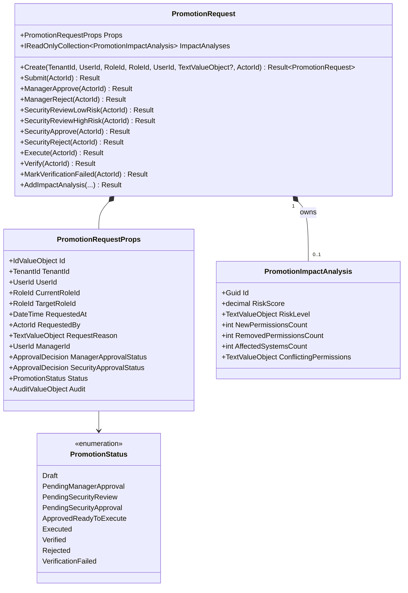
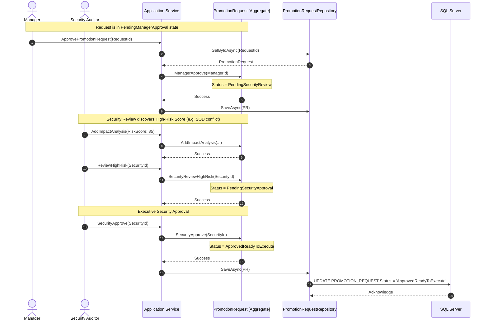
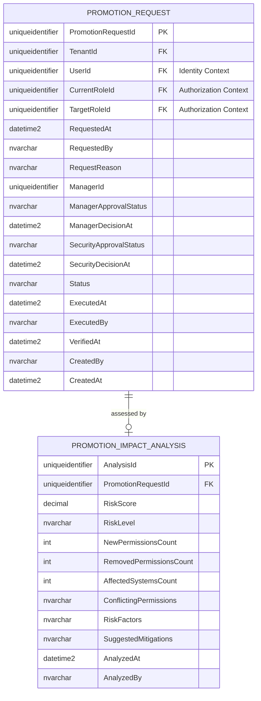

# PromotionRequest — Aggregate Architecture

**Bounded Context:** IGA  
**Aggregate Root:** Yes  
**Module:** `Ums.Domain.IGA.PromotionRequest`  
**Status:** Production

---

## 1. Aggregate Overview

### Purpose
The `PromotionRequest` aggregate coordinates access promotions, allowing users to safely request transitions from their current role to a more privileged target role. It enforces a strict, audited verification path including automatic risk scores, manager approval, security assessments, role execution, and post-execution verification.

### Business Responsibility
- Record the intent of a user to acquire a more senior or privileged target role.
- Control the multi-step approval workflow.
- Embed toxic-permission impact analysis results (`PromotionImpactAnalysis`).
- Coordinate execution and post-change confirmation states.

### Aggregate Root
`PromotionRequest` serves as the aggregate root, managing the lifecycle of the promotion process and housing the `PromotionImpactAnalysis` as an owned entity.

### Invariants and Consistency Rules
1. **INV-PR1 (Workflow State Transitions):** State transitions are strictly governed by the following FSM rules:
   - Creation puts the request into `Draft`.
   - `Draft` $\rightarrow$ `PendingManagerApproval` (via `Submit`).
   - `PendingManagerApproval` $\rightarrow$ `PendingSecurityReview` (via `ManagerApprove`) OR `Rejected` (via `ManagerReject`).
   - `PendingSecurityReview` $\rightarrow$ `ApprovedReadyToExecute` (via `SecurityReviewLowRisk` if the analyzed risk score is low) OR `PendingSecurityApproval` (via `SecurityReviewHighRisk` if risk score is high) OR `Rejected` (via `SecurityReject`).
   - `PendingSecurityApproval` $\rightarrow$ `ApprovedReadyToExecute` (via `SecurityApprove`) OR `Rejected` (via `SecurityReject`).
   - `ApprovedReadyToExecute` $\rightarrow$ `Executed` (via `Execute`).
   - `Executed` $\rightarrow$ `Verified` (via `Verify`) OR `VerificationFailed` (via `MarkVerificationFailed`).
2. **INV-PR2 (Impact Analysis Uniqueness):** Only one impact analysis can be recorded per promotion request to prevent history rewriting (`DomainErrors.IGA.ImpactAnalysisAlreadyExists`).

### Related Entities / Value Objects
| Entity / VO | Type | Description |
|---|---|---|
| `PromotionRequestId` | Value Object | Unique aggregate identifier |
| `TenantId` | Value Object | Partition identifier mapping to the tenant context |
| `UserId` | Value Object | Target user reference (Identity Context) |
| `RoleId` | Value Object | Reference to current and target roles (Authorization Context) |
| `PromotionStatus` | Enum | FSM status enum (`Draft`, `PendingManagerApproval`, etc.) |
| `ApprovalDecision` | Enum | `None` · `Approved` · `Rejected` |
| `PromotionImpactAnalysis` | Entity | Owned child entity containing risk metrics |

---

## 2. Domain Model

### Classes / Entities / Value Objects
```
PromotionRequest (Aggregate Root)
├── Props: PromotionRequestProps
│   ├── Id: PromotionRequestId
│   ├── TenantId: TenantId
│   ├── UserId: UserId (External Ref)
│   ├── CurrentRoleId: RoleId (External Ref)
│   ├── TargetRoleId: RoleId (External Ref)
│   ├── RequestedAt: DateTime
│   ├── RequestedBy: ActorId
│   ├── RequestReason: TextValueObject?
│   ├── ManagerId: UserId
│   ├── ManagerApprovalStatus: ApprovalDecision
│   ├── ManagerDecisionAt: DateTime?
│   ├── SecurityApprovalStatus: ApprovalDecision
│   ├── SecurityDecisionAt: DateTime?
│   ├── Status: PromotionStatus
│   ├── ExecutedAt: DateTime?
│   ├── ExecutedBy: ActorId?
│   ├── VerifiedAt: DateTime?
│   └── Audit: AuditValueObject
└── ImpactAnalyses: PromotionImpactAnalysis[] (Child Collection)
```

---

## 3. Object Model Diagrams



---

## 4. Sequence Diagrams

### High-Risk Promotion Process



---

## 5. ER Model



### Tenant Isolation Rules
- Partitioned by `TenantId`. Submissions are verified against tenant configuration properties to prevent cross-tenant request forgery.

---

## 6. Bounded Context Integration

```mermaid
flowchart TD
    subgraph IdentityContext [Identity Context]
        U[UserAccount]
    end

    subgraph AuthContext [Authorization Context]
        R1[Current Role]
        R2[Target Role]
    end

    subgraph IgaContext [IGA Context]
        PR[PromotionRequest]
        PIA[PromotionImpactAnalysis]
    end

    PR -.->|references UserId| U
    PR -.->|references| R1
    PR -.->|references| R2
    PR *--|owns| PIA
```

---

## 7. Application Layer

### Commands & Queries
- **CreatePromotionRequestCommand:** Creates a request in `Draft`.
- **SubmitPromotionRequestCommand:** Submits a request to manager review.
- **ManagerApprovePromotionRequestCommand:** Records a manager's verification.
- **SecurityReviewPromotionRequestCommand:** Records dynamic performance analysis and triggers risk branching.
- **ExecutePromotionRequestCommand:** Executes the role change in target systems.
- **VerifyPromotionRequestCommand:** Final compliance sign-off validating successful promotion propagation.

---

## 8. Infrastructure/Persistence

### EF Core Mapping Configuration
```csharp
public class PromotionRequestConfiguration : IEntityTypeConfiguration<PromotionRequest>
{
    public void Configure(EntityTypeBuilder<PromotionRequest> builder)
    {
        builder.ToTable("PROMOTION_REQUEST");
        builder.HasKey(e => e.Id);
        
        builder.OwnsOne(e => e.Props, props =>
        {
            props.Property(p => p.Id).HasColumnName("PromotionRequestId");
            props.Property(p => p.TenantId).HasColumnName("TenantId");
            props.Property(p => p.UserId).HasColumnName("UserId");
            props.Property(p => p.CurrentRoleId).HasColumnName("CurrentRoleId");
            props.Property(p => p.TargetRoleId).HasColumnName("TargetRoleId");
            props.Property(p => p.RequestedAt).HasColumnName("RequestedAt");
            props.Property(p => p.RequestedBy).HasConversion(a => a.GetValue(), s => ActorId.Load(s)).HasColumnName("RequestedBy");
            props.Property(p => p.RequestReason).HasConversion(p => p.GetValue(), s => TextValueObject.Create(s).Value).HasColumnName("RequestReason");
            props.Property(p => p.ManagerId).HasColumnName("ManagerId");
            props.Property(p => p.ManagerApprovalStatus).HasConversion<string>().HasColumnName("ManagerApprovalStatus");
            props.Property(p => p.ManagerDecisionAt).HasColumnName("ManagerDecisionAt");
            props.Property(p => p.SecurityApprovalStatus).HasConversion<string>().HasColumnName("SecurityApprovalStatus");
            props.Property(p => p.SecurityDecisionAt).HasColumnName("SecurityDecisionAt");
            props.Property(p => p.Status).HasConversion<string>().HasColumnName("Status");
            props.Property(p => p.ExecutedAt).HasColumnName("ExecutedAt");
            props.Property(p => p.ExecutedBy).HasConversion(a => a == null ? (Guid?)null : a.GetValue(), s => s == null ? null : ActorId.Load(s.Value)).HasColumnName("ExecutedBy");
            props.Property(p => p.VerifiedAt).HasColumnName("VerifiedAt");
            props.OwnsOne(p => p.Audit);
        });

        builder.HasMany(e => e.ImpactAnalyses)
               .WithOne()
               .HasForeignKey("PromotionRequestId")
               .OnDelete(DeleteBehavior.Cascade);
    }
}
```

---

## 9. Security & Compliance

- **Segregation of Duties (SOD):** The manager (`ManagerId`) authorized to approve a promotion request cannot be the target user (`UserId`) or the security auditor performing the security assessment.
- **Risk Branching:** Requests with high-risk impact analysis are routed to an extra step (`PendingSecurityApproval`), preventing automatic role additions without specialized sign-off.

---

## 10. Technical Decisions

- **Asynchronous Risk Calculation:** Generating toxic permission scans requires complex graph analytics. Therefore, it is decoupled into a background analytical task that returns a `PromotionImpactAnalysis` entity rather than blocking application-layer write workflows synchronously.

---

**[Back to IGA Index](./index.md)**
