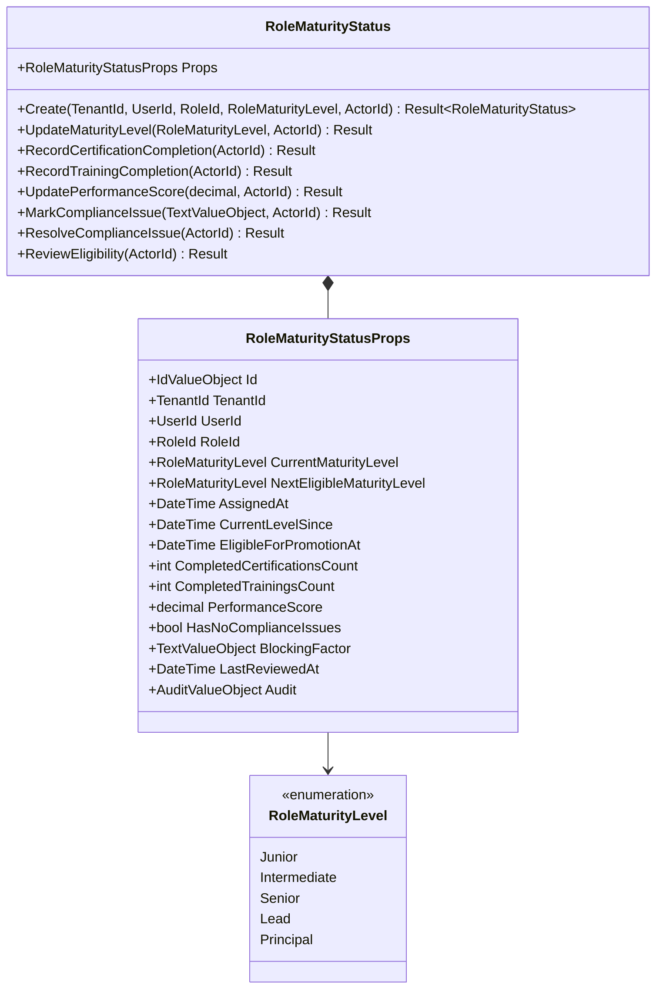
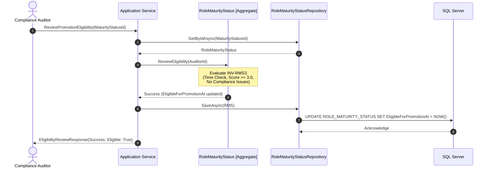
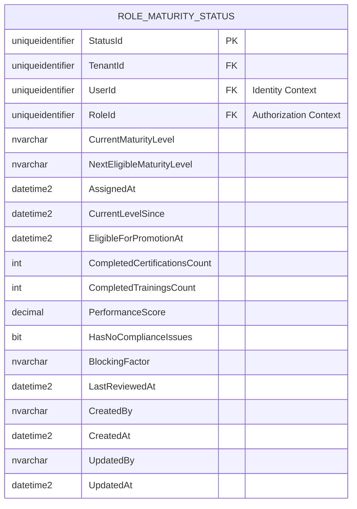
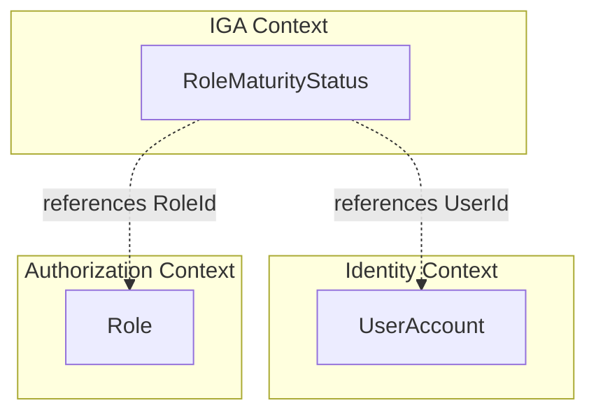

# RoleMaturityStatus — Aggregate Architecture

**Bounded Context:** IGA  
**Aggregate Root:** Yes  
**Module:** `Ums.Domain.IGA.RoleMaturityStatus`  
**Status:** Production

---

## 1. Aggregate Overview

### Purpose
The `RoleMaturityStatus` aggregate root tracks and evaluates a user's operational maturity level within an assigned security role. It governs corporate promotion eligibility by coordinating certification completions, training tracking, performance evaluations, and active security compliance checks.

### Business Responsibility
- Record a user's current and next target maturity level (e.g. Junior $\rightarrow$ Principal).
- Track professional enablement indicators (completed trainings and certifications).
- Evaluate eligibility rules based on time-at-level, performance scores, and compliance blocks.
- Provide automated blocks preventing users with active compliance issues from requesting access promotions.

### Aggregate Root
`RoleMaturityStatus` is a sovereign aggregate root that orchestrates compliance metrics and tracks user eligibility.

### Invariants and Consistency Rules
1. **INV-RMS1 (Performance Score Bounds):** The performance score must be a decimal value strictly between `0` and `5` inclusive (`DomainErrors.IGA.InvalidPerformanceScore`).
2. **INV-RMS2 (Maturity Transition Conflict):** A maturity level update must target a level different from the current level (`DomainErrors.IGA.MaturityLevelUnchanged`).
3. **INV-RMS3 (Eligibility Standards):** To be eligible for a role maturity promotion, the user must satisfy:
   - Zero active compliance issues (`HasNoComplianceIssues == true`).
   - A minimum performance score of `3.0`.
   - The required minimum duration since entering the current level:
     - **Junior $\rightarrow$ Intermediate:** 6 months.
     - **Intermediate $\rightarrow$ Senior:** 12 months.
     - **Senior $\rightarrow$ Lead:** 18 months.
     - **Lead $\rightarrow$ Principal:** 24 months.
     - **Principal:** Not eligible for further promotion.

### Related Entities / Value Objects
| Entity / VO | Type | Description |
|---|---|---|
| `RoleMaturityStatusId` | Value Object | Unique aggregate identifier |
| `TenantId` | Value Object | Owner tenant context mapping |
| `UserId` | Value Object | Owner user account (Identity Context) |
| `RoleId` | Value Object | Target security role (Authorization Context) |
| `RoleMaturityLevel` | Enum | `Junior` · `Intermediate` · `Senior` · `Lead` · `Principal` |
| `AuditValueObject` | Value Object | System audit tracking metadata |

---

## 2. Domain Model

### Classes / Entities / Value Objects
```
RoleMaturityStatus (Aggregate Root)
└── Props: RoleMaturityStatusProps
    ├── Id: RoleMaturityStatusId
    ├── TenantId: TenantId
    ├── UserId: UserId (External Ref)
    ├── RoleId: RoleId (External Ref)
    ├── CurrentMaturityLevel: RoleMaturityLevel
    ├── NextEligibleMaturityLevel: RoleMaturityLevel?
    ├── AssignedAt: DateTime
    ├── CurrentLevelSince: DateTime
    ├── EligibleForPromotionAt: DateTime?
    ├── CompletedCertificationsCount: int
    ├── CompletedTrainingsCount: int
    ├── PerformanceScore: decimal
    ├── HasNoComplianceIssues: bool
    ├── BlockingFactor: TextValueObject?
    ├── LastReviewedAt: DateTime?
    └── Audit: AuditValueObject
```

---

## 3. Object Model Diagrams



---

## 4. Sequence Diagrams

### Eligibility Assessment and Promotion Trigger



---

## 5. ER Model



### Tenant Isolation Rules
- Scoped strictly by `TenantId`. Multi-tenant safety mechanisms partition corporate performance evaluation tracks to avoid cross-org leakage.

---

## 6. Bounded Context Integration



---

## 7. Application Layer

### Commands & Queries
- **CreateRoleMaturityStatusCommand:** Registers a new user role assignment with maturity markers.
- **UpdateRoleMaturityLevelCommand:** Upgrades level after successful promotion verification.
- **UpdatePerformanceScoreCommand:** Records periodic performance evaluation reviews.
- **MarkComplianceIssueCommand:** Lock promotion capabilities due to compliance breaches.
- **ResolveComplianceIssueCommand:** Unlocks promotion eligibility.
- **ReviewEligibilityCommand:** Runs standard rule assertions to set promotion timers.

---

## 8. Infrastructure/Persistence

### EF Core Mapping Configuration
```csharp
public class RoleMaturityStatusConfiguration : IEntityTypeConfiguration<RoleMaturityStatus>
{
    public void Configure(EntityTypeBuilder<RoleMaturityStatus> builder)
    {
        builder.ToTable("ROLE_MATURITY_STATUS");
        builder.HasKey(e => e.Id);
        
        builder.OwnsOne(e => e.Props, props =>
        {
            props.Property(p => p.Id).HasColumnName("StatusId");
            props.Property(p => p.TenantId).HasColumnName("TenantId");
            props.Property(p => p.UserId).HasColumnName("UserId");
            props.Property(p => p.RoleId).HasColumnName("RoleId");
            props.Property(p => p.CurrentMaturityLevel).HasConversion<string>().HasColumnName("CurrentMaturityLevel");
            props.Property(p => p.NextEligibleMaturityLevel).HasConversion(l => l == null ? null : l.ToString(), s => string.IsNullOrEmpty(s) ? null : Enum.Parse<RoleMaturityLevel>(s)).HasColumnName("NextEligibleMaturityLevel");
            props.Property(p => p.AssignedAt).HasColumnName("AssignedAt");
            props.Property(p => p.CurrentLevelSince).HasColumnName("CurrentLevelSince");
            props.Property(p => p.EligibleForPromotionAt).HasColumnName("EligibleForPromotionAt");
            props.Property(p => p.CompletedCertificationsCount).HasColumnName("CompletedCertificationsCount");
            props.Property(p => p.CompletedTrainingsCount).HasColumnName("CompletedTrainingsCount");
            props.Property(p => p.PerformanceScore).HasColumnName("PerformanceScore");
            props.Property(p => p.HasNoComplianceIssues).HasColumnName("HasNoComplianceIssues");
            props.Property(p => p.BlockingFactor).HasConversion(b => b == null ? null : b.GetValue(), s => string.IsNullOrEmpty(s) ? null : TextValueObject.Create(s).Value).HasColumnName("BlockingFactor");
            props.Property(p => p.LastReviewedAt).HasColumnName("LastReviewedAt");
            props.OwnsOne(p => p.Audit);
        });
    }
}
```

---

## 9. Security & Compliance

- **Audit Trails:** All maturity adjustments, training increases, and compliance locks update the internal `AuditValueObject` to secure accountability.
- **Hard Eligibility Blocks:** Domain rules enforce compile-time prevention of access promotions for accounts holding unresolved compliance blocks (`HasNoComplianceIssues == false`).

---

## 10. Technical Decisions

- **Deterministic Level Progression:** Transition levels are calculated automatically using a deterministic state machine inside the domain, avoiding potential administrator input mistakes during state changes.

---

**[Back to IGA Index](./index.md)**
