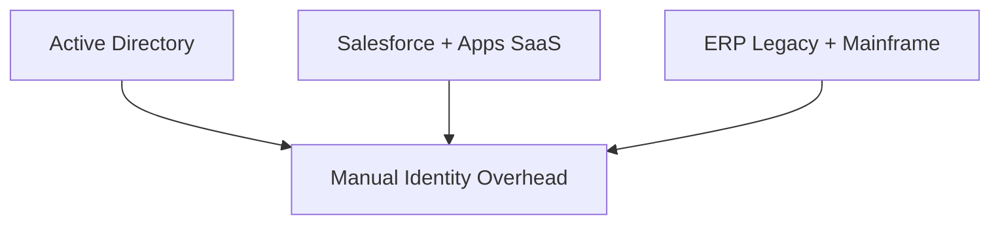
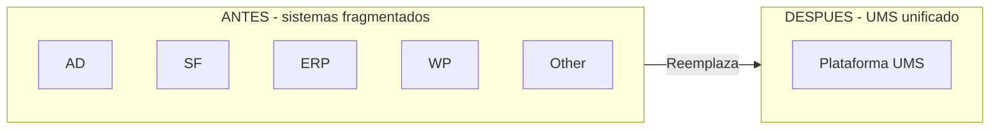
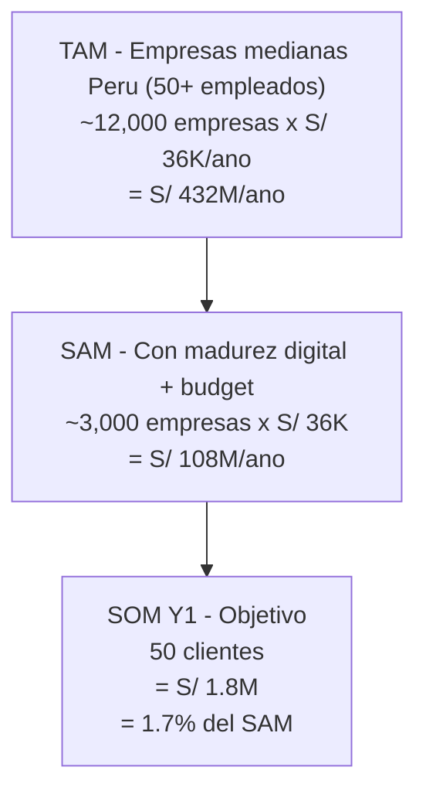
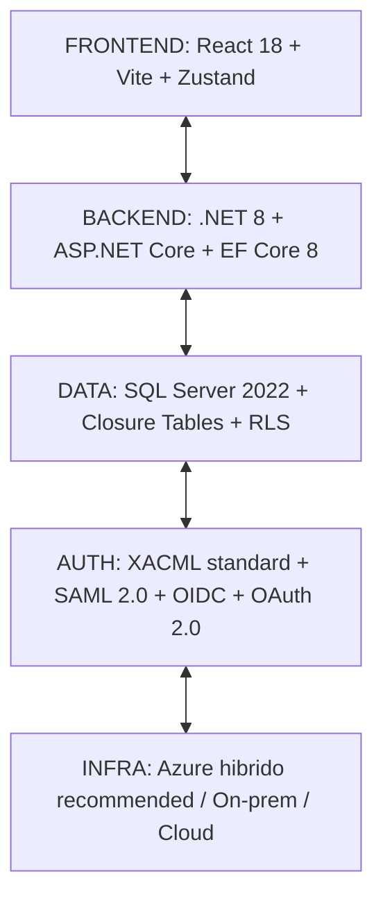
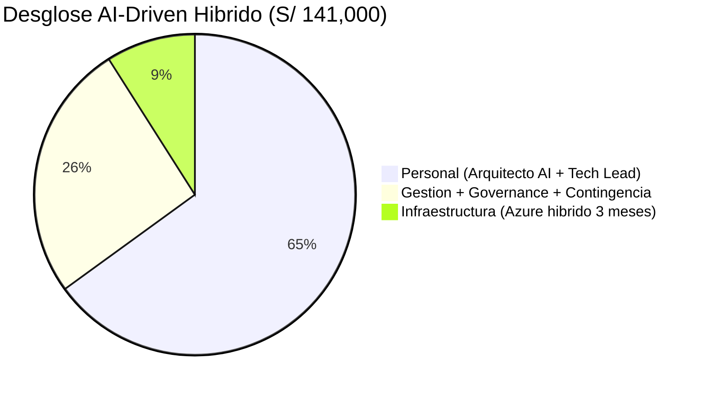
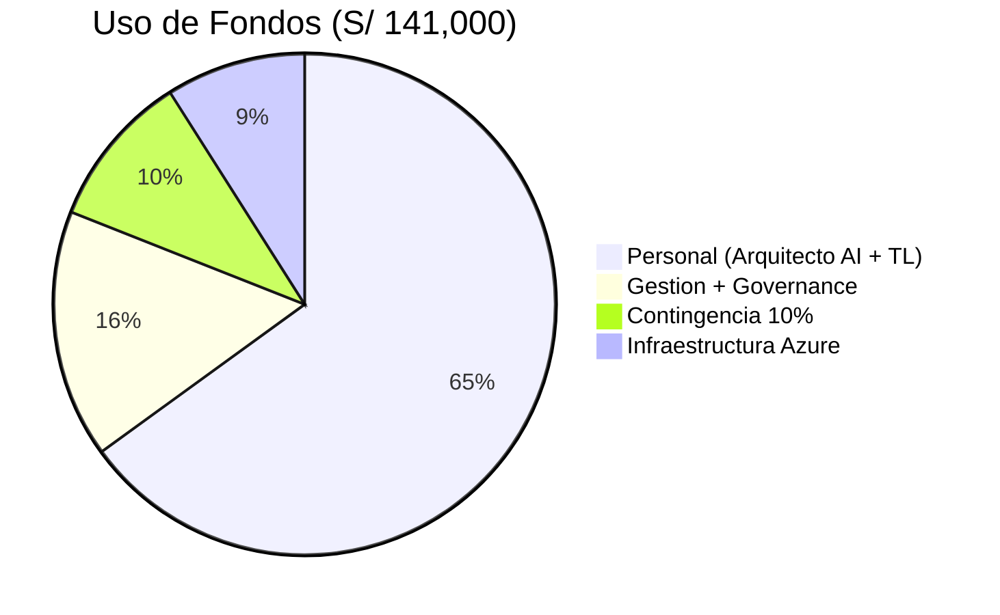

# UMS — Presentación al Directorio

> **Formato:** 12 secciones = 12 slides (markdown ↔ PPTX/PDF exportable)
> **Audiencia:** Directorio, CTO, inversores estratégicos
> **Duración pitch:** 20 minutos + 10 Q&A
> **Decisión requerida:** Aprobar inversión MVP S/ 141K-195K** Fecha:** 2026-05-15 | **Versión:** 1.0

---

## ÍNDICE

| # | Slide | Tema | Duración |
|---|-------|------|----------|
| 1 | Portada | Quiénes somos, qué pedimos | 1 min |
| 2 | El Problema | Pain del mid-market peruano | 2 min |
| 3 | La Solución | UMS en 1 minuto | 2 min |
| 4 | Mercado | TAM/SAM/SOM Perú | 2 min |
| 5 | Producto | MVP + roadmap | 2 min |
| 6 | Tecnología | Arquitectura + 49 ADRs | 1.5 min |
| 7 | Equipo | Quiénes ejecutan | 1.5 min |
| 8 | Costos | 3 escenarios infra × 2 modelos | 2 min |
| 9 | Timeline | Gantt + hitos verificables | 1 min |
| 10 | ROI + Revenue | Cómo llegamos a S/ 1.8M Y1 | 2 min |
| 11 | Riesgos | Top 5 + mitigaciones | 1 min |
| 12 | Ask | Inversión + uso de fondos + decisión | 2 min | ---

---

## SLIDE 1 — Portada

> ## UMS — Unified Management System
>
> Identidad unificada para empresas peruanas
>
> **Presentación al Directorio** — Mayo 2026
>
> - **Solicitamos:** S/ 141K para MVP en 8.5 semanas
> - **ROI Año 1:** 84-112%
> - **Payback:** 3 meses

**Talking points:**
- Saludar, agradecer tiempo del directorio
- "Hoy les pedimos aprobar la inversión más rentable de Q2 2026"
- "20 minutos: problema → solución → números → decisión"

---

## SLIDE 2 — El Problema

# El Mid-Market Peruano Sangra S/ 200K/año en Identidad Fragmentada

**Empresa típica peruana (200 empleados):**

**Pain points cuantificados:**

- **Onboarding manual:** 4-8 horas/empleado — S/ 60K/año en HR
- **Auditoría compliance manual:** consolidar logs de 5 sistemas — S/ 80K/año en auditoría
- **Accesos huérfanos no revocados:** riesgo legal/financiero — S/ 60K/año en pérdidas/multas

**Total cost of fragmentation:** S/ 200K/año por empresa **Talking points:**
- "1 de cada 3 empresas mid-market peruanas opera 5+ sistemas identidad"
- "El problema no es nuevo, pero ahora es URGENTE: SBS exige consolidación 2026"
- Conectar con experiencia personal del directorio: "¿cuántos de ustedes saben quién tiene acceso a qué en su empresa hoy?"

---

## SLIDE 3 — La Solución: UMS

# Un SaaS Que Reemplaza 5 Sistemas con 1

| | **ANTES (caos)** | **DESPUÉS (UMS)** |
|---|------------------|-------------------|
| Sistemas | AD + SF + ERP + WP + Otros | Plataforma UMS única |
| Sincronización | Manual sync | Auto-sync |
| Auditoría | No audit trail | Audit logs centralizados |
| Estándares | No standards | XACML policies |
| Tenancy | No multi-tenant | Multi-tenant jerárquico |
| Costo anual | S/ 200K/año | S/ 36K/año (S/ 3K/mes) |

### Diferenciadores únicos:
1. **Único **con multi-tenancy jerárquico nativo en Latam
2. **Único** SaaS IAM made-in-Peru (soporte local, factura PEN)
3. **50% más barato **que Okta, sin perder funcionalidad core** Talking points:**
- "Un dashboard, una factura, un equipo de soporte local"
- "Diseñado para compliance peruano (SBS, INDECOPI), no genérico US/EU"

---

## SLIDE 4 — Mercado (TAM/SAM/SOM)

# Mercado Subatendido Esperando Producto Local

**Talking points:**
- "Capturar 1.7% de un mercado subatendido es realista"
- "Aun a 0.5% (15 clientes), proyecto es rentable"
- "Sin competidor local directo: somos los primeros"

---

## SLIDE 5 — Producto (MVP + Roadmap)

# MVP en 8.5-12 Semanas, Producto Completo en Q4 2026

### MVP Reducido (Q3 2026) — 168 story points

| Funcionalidad | Estado | Sprint |
|--------------|--------|--------|
| Login corporativo multi-tenant | Diseñado | 1 |
| Auto-registro + verificación | Diseñado | 1-2 |
| Onboarding de organizaciones | Diseñado | 1-2 |
| Autorización XACML (PEP/PDP/PAP/PIP) | Diseñado | 2-3 |
| Configuración jerárquica | Diseñado | 3 |
| Login page hosted + dashboard | Diseñado | 3 | ### Post-MVP (Q4 2026) — 417 story points adicionales

| Funcionalidad | Valor para Cliente | Sprint |
|--------------|-------------------|--------|
| MFA adaptativo + passwordless | Seguridad enterprise | 4-5 |
| Acceso B2B externo + flujo aprobación | Partners y proveedores | 5-6 |
| Administración delegada | Holdings, grupos empresariales | 6 |
| Cumplimiento documental | SBS, ISO 27001 | 7 |
| IGA (role promotion, maturity) | Recursos humanos | 7-8 | **Talking points:**
- "MVP = core para vender Y1; Post-MVP = upsell + enterprise tier"
- "100% del producto diseñado y validado en 49 ADRs (no estamos improvisando)"

---

## SLIDE 6 — Tecnología

# Stack Probado, Estándares Abiertos, Cero Lock-in

### Validación de Rigor

- **49 ADRs aprobados** (decisiones arquitectónicas documentadas)
- **89 historias técnicas **con estimación validada
- **16 historias funcionales **con criterios de aceptación
- **2 capas de RLS** (EF Core primario + SQL Server failsafe)
- **Closure tables **para multi-tenant jerárquico (ADR-0048)

**Talking points:**
- "No reinventamos la rueda: usamos estándares (XACML, OIDC)"
- "Sin lock-in: código en .NET (portable a Linux, AWS, GCP)"
- "Auditable: 49 ADRs documentan cada decisión técnica"

---

## SLIDE 7 — Equipo

# Equipo Lean con Track Record

### Modelo AI-Driven Recomendado (4 personas eficientes)

| Rol | Perfil | Compromiso |
|-----|--------|-----------|
| **Arquitecto AI-Driven** | 10+ años IAM enterprise, 2+ años IA aplicada | 100% |
| **Tech Lead** | Senior fullstack .NET/React, mentor | 50% architecture + 50% mentoring |
| **AI Agents (Claude/GPT)** | Code generation supervisado | Continuo |
| **External DBA Review** | RLS multi-tenant expert | 60% Sprint 0-1 | ### Alternativa Humana (4 personas tradicionales)

| Rol | Perfil | Compromiso |
|-----|--------|-----------|
| **Team Lead** | Senior arquitecto + mentor | 100% |
| **Backend Dev 1** | DDD + EF Core specialist | 100% |
| **Backend Dev 2** | Security + Authorization | 100% |
| **QA/Backend Dev 3** | React + Schema + Tests | 100% | ### Hires Pendientes (ambos modelos)

- 1× Senior Security Engineer (semana 2)
- 1× QA Automation Engineer (semana 2)

**Talking points:**
- "Equipo pequeño = velocidad, accountability, comunicación clara"
- "No necesitamos 20 personas; necesitamos las 4 correctas"
- "Plan B para hiring: contractor backup de S/ 18K reservado"

---

## SLIDE 8 — Costos

# S/ 141K-195K Inversión Total — 6 Escenarios Calculados

### Matriz: Modelo Ejecución × Infraestructura

| | **On-Premise** | **Híbrido** | **Cloud-Native** |
|--------------------------|----------------|----------------|------------------|
| **Humano Tradicional** | S/ 193,000 | **S/ 182,350** | S/ 191,200 |
| **AI-Driven Supervisado** | S/ 151,500 | **S/ 141,000** | S/ 148,200 | ### Desglose del Recomendado (AI-Driven Híbrido = S/ 141K)

| Categoría | Monto | % |
|-----------|-------|---|
| Personal (Arquitecto AI + Tech Lead) | S/ 92,000 | 65% |
| Gestión + Governance + Contingencia | S/ 36,550 | 26% |
| Infraestructura (Azure híbrido 3 meses) | S/ 12,450 | 9% |

**Talking points:**
- "Recomendamos Híbrido: balance óptimo costo/escalabilidad/control"
- "AI-Driven ahorra S/ 41K vs Humano, pero requiere arquitecto experto"
- "Costo por punto de historia: S/ 839 (AI) vs S/ 1,086 (Humano)"

---

## SLIDE 9 — Timeline

# MVP en 8.5-12 Semanas — Hitos Verificables

```mermaid
gantt
    title Timeline MVP - 12 semanas
    dateFormat  X
    axisFormat  S%w
    section Sprints
    Sprint 0 (Setup + ADR train)         :s0, 0, 1w
    Sprint 1 (Identidad + RLS)           :s1, after s0, 2w
    Sprint 2 (Authzn + Config)           :s2, after s1, 2w
    Sprint 3 (APIs + Frontend + Tests)   :s3, after s2, 2w
    Buffer + Hardening                   :buf, after s3, 4w
    section Hitos
    Setup + ADR train       :milestone, 0, 0
    MVP AI (semana 8)       :milestone, 8, 0
    MVP Humano (semana 12)  :milestone, 12, 0
```

### Hitos Verificables por el Directorio

| Semana | Hito | Demo |
|--------|------|------|
| **3** | Login multi-tenant + aislamiento RLS validado | Sprint Review 1 |
| **5** | Motor XACML PDP + configuración jerárquica | Sprint Review 2 |
| **8** (AI) | MVP completo + UAT | Demo final |
| **12** (Humano) | MVP completo + UAT + hardening | Demo final | ### Decision Gates Intermedios

- **Sprint 1 End:** Validar arquitectura RLS funciona (Go/No-Go intermedio)
- **Sprint 2 End:** Validar XACML PDP performance (escalada de riesgo si necesario)
- **Sprint 3 End:** Validar integración completa antes de launch **Talking points:**
- "Hitos verificables cada 2 semanas, no esperar al final"
- "Si Sprint 1 muestra bloqueador, pivoteamos sin perder Sprint 2-3"
- "Buffer de 1-2 semanas reservado para imprevistos"

---

## SLIDE 10 — ROI + Revenue Model

# ROI Año 1: 84-112% — Payback en 3 Meses

### Cómo Llegamos a S/ 1.8M Revenue Y1

| Mes | 1 | 2 | 3 | 4 | 5 | 6 | 7 | 8 | 9 | 10 | 11 | 12 |
|-----|---|---|---|---|---|---|---|---|---|----|----|----|
| Clientes acumulados | 2 | 5 | 8 | 12 | 18 | 25 | 32 | 38 | 43 | 47 | 49 | 50 |
| Fase | Pilots (warm) | Pilots (warm) | Pilots (warm) | Partners (SI channel) | Partners (SI channel) | Partners (SI channel) | Outbound + Inbound | Outbound + Inbound | Outbound + Inbound | Outbound + Inbound | Outbound + Inbound | Outbound + Inbound |

### Unit Economics (validar credibilidad)

| Métrica | Valor | Benchmark SaaS |
|---------|-------|----------------|
| **ARPU mensual** | S/ 3,000 | 35-45% bajo Okta |
| **CAC** | S/ 7,248 | Industry: S/ 6K-12K |
| **LTV (3 años)** | S/ 108,000 | Industry: S/ 80K-150K |
| **LTV/CAC ratio** | **14.9x** | Target: >3x Excepcional |
| **Payback period** | **2.8 meses** | Industry: <12 meses Excepcional |
| **Churn mensual** | 2% asumido | Industry: 1-5% | ### Análisis de Sensibilidad

| Escenario | Clientes Y1 | Revenue Y1 | ROI Y1 |
|-----------|-------------|------------|--------|
| Pesimista (50%) | 25 | S/ 494K | 42% |
| Base | 50 | S/ 987K | **84%** |
| Optimista | 65 | S/ 1.28M | 109% | **Talking points:**
- "ROI 84% en escenario base; 42% aun en pesimista (proyecto sigue siendo rentable)"
- "LTV/CAC de 14.9x es excepcional — Series A target es 3-5x"
- "Payback 3 meses = caja positiva a fin de Q1 post-lanzamiento"

---

## SLIDE 11 — Riesgos

# Top 5 Riesgos — Identificados, Cuantificados, Mitigados

| # | Riesgo | Probabilidad | Impacto | Mitigación | Costo Mitig. |
|---|--------|--------------|---------|------------|--------------|
| 1 | **RLS multi-tenant complejidad** | Media | Alto | Code review DBA externo + pair programming en TS-1.2 | S/ 8K (en presupuesto) |
| 2 | **Hiring 2 ingenieros en 2 sem** | Media | Medio | Contractor backup 3 meses si no hire | S/ 18K reservados |
| 3 | **AI hallucinations** (si modelo AI) | Media-Alta | Medio | Quality gates + retrabajo presupuestado 10% | S/ 12K (en presupuesto) |
| 4 | **Cliente adoption < 50 Y1** | Media | Alto | Sensitivity 25/50/100 + pivot a 25-cliente Y1 si necesario | S/ 0 (ya modelado) |
| 5 | **Competidor local lanza similar** | Baja | Medio | First-mover advantage + IP de 49 ADRs + 8.5 sem time-to-market | S/ 0 | ### Confianza General de Estimación **70-75% MEDIUM-HIGH** — validado en 89 historias técnicas con detalle a nivel de horas-perfil.

### Análisis Pre-Mortem

> Si esto fracasa, las causas más probables serían (en orden):
> 1. Hiring no se completa → contractor backup activado
> 2. RLS no escala como esperado → mitigación Phase 2 SQL Server RLS
> 3. Cliente Y1 menor a esperado → revenue ramp ajustado (sigue rentable)

**Talking points:**
- "No escondemos riesgos; los cuantificamos y mitigamos"
- "Buffer financiero total: ~S/ 38K para imprevistos"
- "Plan B definido para cada uno de los 5 escenarios"

---

## SLIDE 12 — Ask + Decisión

# Solicitud al Directorio

### Lo que pedimos HOY:

> - **APROBAR:** S/ 141,000 (Modelo AI-Driven Híbrido)
> - **INICIO:** Sprint 0 en máximo 7 días
> - **ENTREGABLE:** MVP funcional en 8.5 semanas
> - **KPI Y1:** 50 clientes, S/ 1.8M revenue, ROI 84%

### Uso de Fondos (S/ 141K)

| Categoría | Monto | % |
|-----------|-------|---|
| Personal (Arquitecto AI + TL) | S/ 92,000 | 65% |
| Gestión + Governance | S/ 22,500 | 16% |
| Infraestructura Azure | S/ 12,450 | 9% |
| Contingencia (10%) | S/ 14,050 | 10% |

### Condiciones de Aprobación

- [ ] Arquitecto AI-Driven confirmado (esta semana)
- [ ] Infraestructura Azure aprobada (esta semana)
- [ ] 2 hires complementarios en 2 semanas
- [ ] Sign-off CTO + CFO + Head of Eng

### Próximos Pasos si GO

1. **Esta semana:** Firmar [DECISION-MATRIX.md](./DECISION-MATRIX.md)
2. **Próxima semana:** Sprint 0 kickoff
3. **Semana 3:** Demo intermedia (Login multi-tenant)
4. **Semana 8:** MVP completo + UAT
5. **Semana 9-12:** Pilots + iteración

---

## Cierre

> **"Pedimos S/ 141K hoy para construir en 8.5 semanas un producto que genera S/ 1.8M ARR en 12 meses."**
> **"Confianza 75%, payback 3 meses, LTV/CAC 14.9x."**
> **"Aprobamos esta semana, ejecutamos la próxima."**

### Preguntas y Respuestas

[10 minutos de Q&A — referirse a documentos de soporte:]

- **¿Detalles técnicos?** → [TECHNICAL-STORIES-AND-TEAM-COMPOSITION.md](./construction/TECHNICAL-STORIES-AND-TEAM-COMPOSITION.md)
- **¿Detalles financieros?** → [ANALISIS-COSTO-BENEFICIO-MVP-REDUCIDO.md](./construction/ANALISIS-COSTO-BENEFICIO-MVP-REDUCIDO.md)
- **¿Detalles competitivos?** → [COMPETITIVE-ANALYSIS.md](./construction/COMPETITIVE-ANALYSIS.md)
- **¿Detalles de revenue?** → [REVENUE-MODEL-YEAR-1.md](./construction/REVENUE-MODEL-YEAR-1.md)
- **¿Es creíble el timeline AI?** → [JUSTIFICACION-TIMELINE-AI-DRIVEN.md](./construction/JUSTIFICACION-TIMELINE-AI-DRIVEN.md)

---

**Documento preparado por:** Arquitecto Principal **Fecha:** 2026-05-15 **Estado:** Listo para presentación al Directorio **Formato exportable:** Marp / Slidev / PandocPDF / Manual a PPTX

> **Para exportar a PDF/PPTX:** Use `marp BOARD-PRESENTATION.md --pdf` o `pandoc BOARD-PRESENTATION.md -o presentation.pptx`
