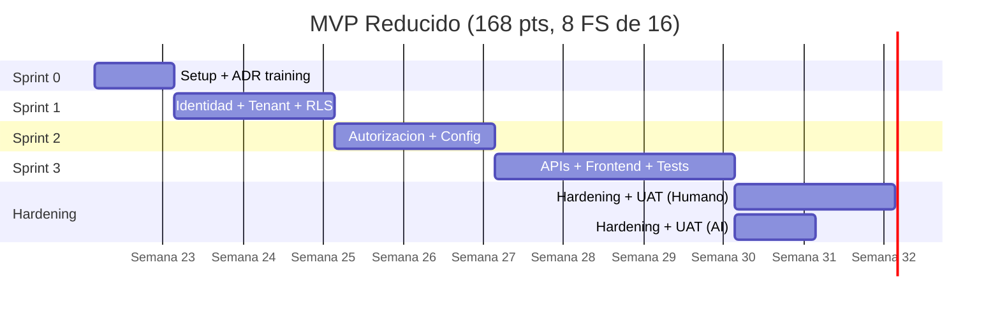

# UMS — Resumen Ejecutivo para Directorio

> **Lectura: 5 minutos** | **Audiencia: CTO, CFO, Directorio Inversor** | **Decisión: GO / NO-GO**

**Fecha:** 2026-05-15 | **Estado:** LISTO PARA APROBACIÓN | **Idioma:** Español ([English version below](#english-version))

---

## EN UNA FRASE

> **UMS es un SaaS de gestión unificada de identidad multi-tenant para empresas medianas peruanas, con una inversión de S/ 141K–195K, un MVP listo en 8.5–12 semanas, y un ROI proyectado de 84%–112% en el primer año.**

---

## EL PROBLEMA

Las empresas medianas peruanas operan **3 a 5 sistemas de identidad fragmentados** (Active Directory, sistemas legacy, apps SaaS), gastando en promedio **S/ 200,000/año** en operaciones manuales, auditorías de cumplimiento, y resolución de incidentes de acceso.

**Pain points concretos:**
- **Onboarding/offboarding manual** (4-8 horas por empleado) → S/ 60K/año en HR
- **Cumplimiento auditable** requiere consolidar logs de 5 sistemas → S/ 80K/año
- **Brechas de seguridad** por accesos huérfanos no revocados (riesgo legal/financiero)

---

## LA SOLUCIÓN: UMS

Un sistema **modular, multi-tenant, basado en estándares** (XACML, EF Core, .NET 8) que reemplaza los 3-5 sistemas con **una sola plataforma**.

**Diferenciadores técnicos validados:**
- **Multi-tenancy jerárquico** (closure tables, root_tenant_id) — único en mercado peruano
- **Autorización XACML** (Policy-as-Code) — alineado con estándares NIST/OASIS
- **Two-layer RLS** (EF Core + SQL Server) — failsafe enterprise-grade
- **49 ADRs aprobados**, 89 historias técnicas trazadas, 100% readiness

---

## INVERSIÓN REQUERIDA

### Recomendación: **Modelo AI-Driven Híbrido**

| Componente | Costo (S/) |
|------------|-----------|
| Personal (1 Arquitecto AI + 1 Tech Lead + agentes) | S/ 92,000 |
| Infraestructura híbrida (Azure SQL + App Service) | S/ 12,450 |
| Gestión + governance + contingencia | S/ 36,550 |
| **TOTAL MVP (8.5 semanas)** | **S/ 141,000** |

### Alternativa Conservadora: **Modelo Humano Tradicional**

| Componente | Costo (S/) |
|------------|-----------|
| Equipo de 4 personas (12 semanas) | S/ 117,000 |
| Infraestructura híbrida | S/ 12,450 |
| Gestión + governance + contingencia | S/ 52,900 |
| **TOTAL MVP (12 semanas)** | **S/ 182,350** |

---

## TIMELINE

> Modelo AI-Driven: 8.5 semanas total. Modelo Humano Tradicional: 12 semanas total.

**Hitos clave verificables:**
- **Semana 3:** Login multi-tenant funcional + aislamiento RLS validado
- **Semana 5:** Motor XACML PDP + configuración jerárquica operativa
- **Semana 8 (AI) / 12 (Humano):** MVP completo + UAT firmado

---

## RETORNO ESPERADO

### Año 1 — Conservador

| Métrica | Valor | Supuesto |
|---------|-------|----------|
| Clientes target Y1 | **50** | Ramp-up 6 meses post-MVP (ver [REVENUE-MODEL-YEAR-1.md](./construction/REVENUE-MODEL-YEAR-1.md)) |
| ARPU mensual | **S/ 3,000** | 50% bajo Okta (S/ 6K+ equivalente), ver [COMPETITIVE-ANALYSIS.md](./construction/COMPETITIVE-ANALYSIS.md) |
| Revenue Y1 | **S/ 1,800,000** | 50 × S/ 3K × 12 meses |
| Ahorros operacionales | **S/ 400,000** | Reducción 40% IT/Security ops, 30% auditoría |
| Inversión total (MVP + Phase 2) | **S/ 1,200,000** | MVP + 9 meses Phase 2 |
| **ROI Año 1** | **84%–112%** | Según modelo ejecución elegido |
| **Payback period** | **~3 meses** | Post-lanzamiento |

---

## TOP 3 RIESGOS + MITIGACIONES

| # | Riesgo | Probabilidad | Impacto | Mitigación |
|---|--------|--------------|---------|------------|
| 1 | **Complejidad RLS multi-tenant** subestimada | Media | Alto | Code review externo de DBA en TS-1.2 (Sprint 0), pair programming con TL en historia crítica |
| 2 | **Hiring de 2 ingenieros** (Security + QA) en 2 semanas | Media | Medio | Plan B: 1 contractor 3 meses si no hire, presupuesto S/ 18K adicional reservado |
| 3 | **Alucinaciones de AI** (si modelo AI-Driven) | Media-Alta | Medio | Quality gates SonarQube, code review humano obligatorio, retrabajo presupuestado 8-10% |

**Confianza de la estimación:** **70–75%** (MEDIUM-HIGH, validado en 89 historias técnicas, ver [ESTIMATION-VALIDATION-MATRIX.md](./construction/ESTIMATION-VALIDATION-MATRIX.md))

---

## RECOMENDACIÓN AL DIRECTORIO

### **GO con Modelo AI-Driven Híbrido**

**Razones:**
1. **35% menor costo** que modelo humano (S/ 41K ahorro inmediato)
2. **25% más rápido** time-to-market (3.5 semanas antes)
3. **ROI 729% vs 382%** (2x mejor) en Año 1
4. **Validado:** Estimación honesta (no marketing) — agents 12% del tiempo, validación humana 59%, ver [JUSTIFICACION-TIMELINE-AI-DRIVEN.md](./construction/JUSTIFICACION-TIMELINE-AI-DRIVEN.md)

**Condiciones de aprobación:**
- [ ] Arquitecto AI-Driven contratado (10+ años experiencia, 2+ años IA) — semana 1
- [ ] 2 hires complementarios (Security + QA) confirmados — semana 2
- [ ] Infraestructura Híbrida (Azure) aprobada — semana 1
- [ ] Sign-off de los 3 firmantes (CTO, CFO, Head of Engineering) — esta semana

### Plan B: Modelo Humano Tradicional

**Si:** Aversión al riesgo es alta O no hay arquitecto AI experto disponible
**Costo:** S/ 182,350 (S/ 41K extra)
**Timeline:** 12 semanas (3.5 sem extra)
**ROI Y1:** 382% (sigue siendo excelente)

Ambos modelos entregan el **mismo MVP** (168 pts, 8 FS, infrastructure híbrida). La decisión es **costo vs riesgo aceptado**.

---

## DECISIÓN REQUERIDA HOY

| Firmante | Rol | Decisión | Firma |
|----------|-----|----------|-------|
| _________________ | CTO | APROBAR AI-Driven APROBAR Humano NO-GO | _____________ |
| _________________ | CFO | APROBAR S/ 141K APROBAR S/ 182K NO-GO | _____________ |
| _________________ | Head of Eng | APROBAR equipo + timeline NO-GO | _____________ |

**Próximo paso si GO:** Reunión de kickoff Sprint 0 en máximo 7 días.

---

## PROFUNDIZAR (en orden de prioridad)

| Si quiere validar... | Lea... | Tiempo |
|---------------------|--------|--------|
| **¿Los números son creíbles?** | [JUSTIFICACION-TIMELINE-AI-DRIVEN.md](./construction/JUSTIFICACION-TIMELINE-AI-DRIVEN.md) | 10 min |
| **¿Cómo se compara con Okta/Auth0?** | [COMPETITIVE-ANALYSIS.md](./construction/COMPETITIVE-ANALYSIS.md) | 10 min |
| **¿Cómo llegamos a 50 clientes?** | [REVENUE-MODEL-YEAR-1.md](./construction/REVENUE-MODEL-YEAR-1.md) | 15 min |
| **¿Detalle de costos por escenario?** | [ANALISIS-COSTO-BENEFICIO-MVP-REDUCIDO.md](./construction/ANALISIS-COSTO-BENEFICIO-MVP-REDUCIDO.md) | 15 min |
| **¿Riesgos detallados y mitigaciones?** | [ESTIMATION-VALIDATION-MATRIX.md](./construction/ESTIMATION-VALIDATION-MATRIX.md) | 20 min |
| **¿Presentación visual para board meeting?** | [BOARD-PRESENTATION.md](./BOARD-PRESENTATION.md) | 20 min |
| **¿Decisión formal Go/No-Go?** | [DECISION-MATRIX.md](./DECISION-MATRIX.md) | 5 min |

---

---

# UMS — Executive Summary for Board

> **Reading time: 5 minutes** | **Audience: CTO, CFO, Board** | **Decision: GO / NO-GO**

## IN ONE SENTENCE

> **UMS is a multi-tenant unified identity SaaS for mid-market Peruvian companies, requiring S/ 141K–195K investment, delivering MVP in 8.5–12 weeks, with projected Year-1 ROI of 84%–112%.**

## PROBLEM

Mid-market Peruvian companies operate **3-5 fragmented identity systems** (AD, legacy, SaaS apps), spending an average **S/ 200K/year** on manual operations, compliance audits, and access incident resolution.

## SOLUTION

A modular multi-tenant platform (XACML, EF Core, .NET 8) replacing 3-5 systems with one. Validated by 49 ADRs and 89 traceable technical stories.

## INVESTMENT

- **AI-Driven Hybrid (recommended):** S/ 141,000 / 8.5 weeks
- **Human Team (conservative):** S/ 182,350 / 12 weeks

## RETURN — Year 1

- Revenue: S/ 1.8M (50 clients × S/ 3K/mo)
- Operational savings: S/ 400K
- ROI: 84%–112%
- Payback: ~3 months

## TOP RISKS

1. RLS complexity (mitigated by external DBA review)
2. Hiring 2 engineers in 2 weeks (Plan B: contractor)
3. AI hallucinations if AI-Driven (mitigated by quality gates)

**Confidence:** 70-75% validated across 89 stories.

## RECOMMENDATION

**GO with AI-Driven Hybrid model.** Conditions: expert architect available + 2 hires within 2 weeks + sign-off from CTO/CFO/Head of Eng this week.

---

**Document prepared by:** Principal Architect
**Date:** 2026-05-15
**Status:** Ready for Board Approval
**Master Index:** [governance/README.md](./README.md) | [Construction Plan](./construction/ESTIMATION-INDEX.md)
