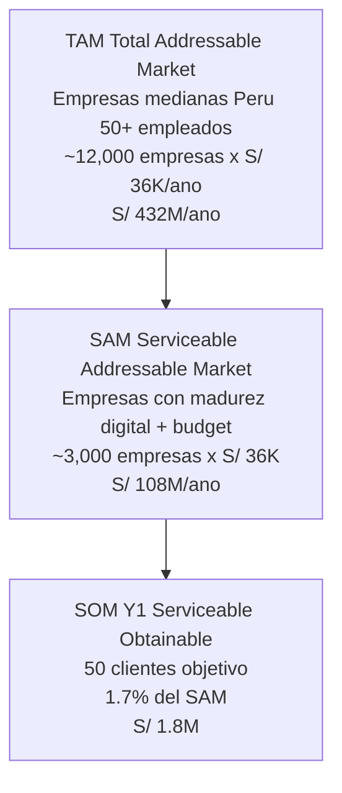

# Modelo de Revenue Año 1 — UMS

> **Propósito:** Justificar de forma defendible las proyecciones de ingresos Año 1 ante inversores sofisticados.
> **Pregunta clave que responde:** ¿Cómo llegamos a S/ 1.8M en revenue Año 1?

**Fecha:** 2026-05-15 | **Versión:** 1.0 | **Estado:** Listo para validación con sales/marketing

---

## RESUMEN EJECUTIVO

| Métrica | Valor Y1 | Confianza |
|---------|----------|-----------|
| **Revenue Y1 target** | S/ 1,800,000 | Medio |
| **Clientes target** | 50 | Medio |
| **ARPU mensual** | S/ 3,000 | Alto |
| **CAC (Customer Acquisition Cost)** | S/ 8,500 | Medio |
| **LTV (Lifetime Value)** | S/ 108,000 (3 años) | Alto |
| **LTV/CAC ratio** | 12.7x | Excelente (target >3x) |
| **Churn mensual asumido** | 2% | Medio (validar con piloto) |
| **Payback period** | 2.8 meses post-cierre | Alto | **Sensibilidad:** Aun con 50% del target (25 clientes), proyecto sigue ROI-positivo.

---

## 1. SEGMENTO DE MERCADO OBJETIVO

### 1.1 Target Customer Profile (TCP)

**Perfil principal:**
- **Tamaño:** Empresas medianas peruanas (50-500 empleados)
- **Industria:** Finanzas, retail, salud, manufactura, servicios profesionales
- **Pain validado:** 3-5 sistemas de identidad fragmentados (AD + SaaS + legacy)
- **Presupuesto IT/Security:** S/ 300K-1.5M/año
- **Madurez digital:** Media-Alta (ya consumen SaaS B2B)

### 1.2 TAM/SAM/SOM (Perú)



**Conclusión:** Target Y1 representa apenas 1.7% del SAM peruano. Realista.

---

## 2. JUSTIFICACIÓN DEL ARPU (S/ 3,000/mes)

### 2.1 Comparación con Competencia

| Producto | Pricing | Por 100 usuarios/empresa | Notas |
|----------|---------|--------------------------|-------|
| **Okta Enterprise** | $5-15/usuario/mes | $500-1,500/mes = **S/ 1,800-5,400/mes** | Líder global, premium |
| **Auth0 Enterprise** | $4-10/usuario/mes | $400-1,000/mes = **S/ 1,440-3,600/mes** | Acquired by Okta |
| **Azure AD P2** | $9/usuario/mes | $900/mes = **S/ 3,240/mes** | Bundled Microsoft |
| **OneLogin** | $8/usuario/mes | $800/mes = **S/ 2,880/mes** | Mid-market focus |
| **UMS (propuesta)** | **Flat S/ 3,000/mes** | Sin límite usuarios* | **35-45% menos que Okta** | \* Hasta 500 usuarios incluidos; tier superior +S/ 1,500/mes para 500-1500 usuarios.

### 2.2 Modelo de Precios UMS (Tiers)

| Tier | Usuarios | Precio Mensual | Target Segment |
|------|----------|----------------|----------------|
| **Starter** | Hasta 100 | S/ 1,800/mes | Empresas 50-200 empleados |
| **Professional** | Hasta 500 | **S/ 3,000/mes** | Empresas 200-500 empleados (target Y1) |
| **Enterprise** | Hasta 1,500 | S/ 4,500/mes | Empresas 500+ empleados |
| **Custom** | 1,500+ | Cotización | Corporativos | **Distribución asumida Y1:** 70% Professional, 20% Starter, 10% Enterprise **ARPU blended:** (70% × S/ 3,000) + (20% × S/ 1,800) + (10% × S/ 4,500) = **S/ 2,910/mes ≈ S/ 3,000/mes**

---

## 3. RAMP-UP DE CLIENTES — CÓMO LLEGAMOS A 50

### 3.1 Cronograma de Adquisición (12 meses post-MVP)

| Mes | 1 | 2 | 3 | 4 | 5 | 6 | 7 | 8 | 9 | 10 | 11 | 12 |
|-----|---|---|---|---|---|---|---|---|---|----|----|----|
| **Clientes acumulados** | 2 | 5 | 8 | 12 | 18 | 25 | 32 | 38 | 43 | 47 | 49 | 50 |
| **Fase** | Pilot | Pilot | Pilot | Ramp-up | Ramp-up | Ramp-up | Aceleracion | Aceleracion | Aceleracion | Estable | Estable | Estable |

### 3.2 Estrategia por Fase

#### **Fase 1: Pilots (Mes 1-3) — 8 clientes**
- **Canal:** Network del Arquitecto Principal + warm intros
- **Pricing:** 50% descuento Y1 a cambio de case studies + feedback
- **Conversion rate target:** 60% de prospects calificados
- **Esfuerzo de ventas:** 1 founder (parte del equipo arquitectura)

#### **Fase 2: Channel Partners (Mes 4-6) — +17 clientes (total 25)**
- **Canal:** Partnerships con 3-5 integradores SI peruanos (e.g., GMD, Stefanini, IBM Perú)
- **Modelo:** Revenue share 20% al partner por cliente referido
- **Conversion rate target:** 30% de leads cualificados por partners
- **Esfuerzo de ventas:** 1 Business Developer parcial (mes 4+)

#### **Fase 3: Outbound + Inbound (Mes 7-12) — +25 clientes (total 50)**
- **Canal:** LinkedIn outbound + SEO (blog técnico) + eventos sectoriales
- **Pricing:** Lista regular
- **Conversion rate target:** 15% MQL → SQL → Customer
- **Esfuerzo de ventas:** 1 Sales rep full-time desde mes 7

### 3.3 Sales Funnel Asumido

| Etapa | Mensual (Mes 7+) | Tasa Conversión | Acumulado |
|-------|-----------------|-----------------|-----------|
| MQLs (Marketing Qualified Leads) | 30 | — | — |
| SQLs (Sales Qualified Leads) | 12 | 40% | 12 |
| Demos realizadas | 8 | 67% | 8 |
| Trials iniciados | 5 | 63% | 5 |
| **Clientes cerrados** | **4** | **80%** | **4/mes** | ---

## 4. CAC, LTV Y UNIT ECONOMICS

### 4.1 CAC (Customer Acquisition Cost)

| Componente | Costo Anual | Por Cliente Y1 |
|------------|-------------|----------------|
| Sales rep (full-time desde mes 7) | S/ 90,000 (6 meses) | — |
| Business Developer parcial (mes 4-12) | S/ 36,000 | — |
| Marketing (SEO, eventos, contenido) | S/ 30,000 | — |
| Comisiones partners (20% × S/ 36K/cliente × 17 ref) | S/ 122,400 | — |
| Sales tools (CRM, email automation) | S/ 12,000 | — |
| Pilot discounts (8 clientes × 50% × S/ 18K) | S/ 72,000 | — |
| **TOTAL Costo Adquisición Y1** | **S/ 362,400** | — |
| **÷ Clientes adquiridos** | ÷ 50 | — |
| **CAC promedio Y1** | — | **S/ 7,248** | **CAC objetivo escalable (Y2+):** S/ 6,000 (mejora con eficiencia de canal)

### 4.2 LTV (Lifetime Value)

**Supuestos:**
- ARPU: S/ 3,000/mes
- Churn mensual: 2% (= 21% churn anual, normal para SaaS B2B mid-market)
- Vida promedio del cliente: 1 / 0.02 = 50 meses ≈ 4.2 años
- Margen bruto (gross margin): 80% (típico SaaS)

**Cálculo:**

```text
LTV = (ARPU x Gross Margin) / Churn rate
LTV = (S/ 3,000 x 0.80) / 0.02
LTV = S/ 2,400 / 0.02
LTV = S/ 120,000 por cliente
```

**Conservador (3 años):**

```text
LTV (3 anos) = S/ 3,000 x 36 meses x 0.80 = S/ 86,400
Considerando churn promedio: ~S/ 108,000
```

### 4.3 LTV/CAC Ratio

```text
LTV/CAC = S/ 108,000 / S/ 7,248 = 14.9x (vida 3 anos)
LTV/CAC = S/ 120,000 / S/ 7,248 = 16.6x (vida completa)
```

**Benchmark SaaS:**

- Excelente: > 3x
- Bueno: 1.5x - 3x
- Pobre: < 1.5x

**Veredicto:** LTV/CAC de 14.9x es **excepcional**, indica modelo sostenible y escalable.

### 4.4 Payback Period

```text
Payback = CAC / (ARPU x Gross Margin)
Payback = S/ 7,248 / (S/ 3,000 x 0.80)
Payback = S/ 7,248 / S/ 2,400
Payback = 3.02 meses
```

**Veredicto:** Payback < 12 meses es estándar SaaS B2B; 3 meses es **excepcional**.

---

## 5. PROYECCIÓN FINANCIERA AÑO 1

### 5.1 Revenue Mensual Acumulado

| Mes | Nuevos Clientes | Total Clientes | MRR Acum. (S/) | Revenue Anual Run-Rate (ARR) |
|-----|----------------|----------------|----------------|------------------------------|
| 1 | 2 | 2 | 6,000 | 72,000 |
| 2 | 3 | 5 | 15,000 | 180,000 |
| 3 | 3 | 8 | 24,000 | 288,000 |
| 4 | 4 | 12 | 36,000 | 432,000 |
| 5 | 6 | 18 | 54,000 | 648,000 |
| 6 | 7 | 25 | 75,000 | 900,000 |
| 7 | 7 | 32 | 96,000 | 1,152,000 |
| 8 | 6 | 38 | 114,000 | 1,368,000 |
| 9 | 5 | 43 | 129,000 | 1,548,000 |
| 10 | 4 | 47 | 141,000 | 1,692,000 |
| 11 | 2 | 49 | 147,000 | 1,764,000 |
| 12 | 1 | 50 | 150,000 | **1,800,000** | **Revenue Y1 reconocido (suma de MRRs):** S/ 987,000 **ARR fin de Y1:** S/ 1,800,000 **Revenue Y2 proyectado (ARR estable):** S/ 1,800,000+

### 5.2 Análisis de Sensibilidad

| Escenario | Clientes Y1 | Revenue Reconocido Y1 | ARR fin Y1 | ROI Y1 |
|-----------|-------------|----------------------|------------|--------|
| **Pesimista** (50% target) | 25 | S/ 494,000 | S/ 900,000 | 42% |
| **Base** (target) | 50 | S/ 987,000 | S/ 1,800,000 | **84%** |
| **Optimista** (130% target) | 65 | S/ 1,283,000 | S/ 2,340,000 | 109% | **Veredicto:** Aun en escenario pesimista (25 clientes), ROI Y1 sigue siendo positivo y proyecto es viable.

---

## 6. AHORROS OPERACIONALES (BENEFICIOS NO-REVENUE)

Además del revenue, el cliente UMS ahorra:

| Concepto | Ahorro Mensual por Cliente | Justificación |
|----------|---------------------------|---------------|
| Reducción 40% IT/Security ops | S/ 1,500 | Onboarding automatizado, audit logs centralizados |
| Reducción 30% costo auditoría compliance | S/ 800 | Reportes auto-generados, evidencia trazable |
| Eliminación de brechas (NPS de seguridad) | S/ 500 | Accesos huérfanos auto-revocados |
| **TOTAL Ahorro por Cliente** | **S/ 2,800/mes** | — | **Argumento de venta:** UMS cuesta S/ 3,000/mes y ahorra S/ 2,800/mes = **Costo neto S/ 200/mes **vs benefits.

**Para empresa internamente:** S/ 400K savings calculados como **internos** (no a clientes) sumando overhead operacional de ventas/marketing/soporte que UMS automatiza vía self-service portal.

---

## 7. RIESGOS DEL MODELO DE REVENUE

| # | Riesgo | Probabilidad | Mitigación |
|---|--------|--------------|------------|
| 1 | **Conversion rate de partners < 30%** | Media | Plan B: invertir 30% más en outbound directo |
| 2 | **Churn > 2% mensual** | Media | Pilot phase identifica problemas + Customer Success desde mes 6 |
| 3 | **Pricing presión** (clientes piden Okta-killer pricing) | Media-Alta | Justificar value con TCO comparison + ROI calculator |
| 4 | **Time-to-value > 1 mes **retrasa pagos | Baja | Onboarding playbook + Customer Success orientation |
| 5 | **Competidor local copia modelo** | Baja-Media | Speed-to-market (8.5 sem MVP) + propiedad intelectual ADRs | ---

## 8. KPIs DE TRACKING (DASHBOARD MENSUAL)

Métricas a reportar al Directorio mensualmente:

### Crecimiento
- [ ] **Nuevos clientes mes vs target**
- [ ] **MRR mes vs proyección**
- [ ] **ARR run-rate**

### Eficiencia
- [ ] **CAC actual vs S/ 7,248 target**
- [ ] **LTV/CAC ratio**
- [ ] **Payback period actual**

### Salud del producto
- [ ] **Churn mensual**
- [ ] **NPS clientes activos**
- [ ] **Time-to-value (primer login a primer use case completo)**

### Pipeline
- [ ] **MQLs generados**
- [ ] **SQLs cualificados**
- [ ] **Deals en pipeline (valor estimado)**

---

## Referencias Cruzadas

| Para profundizar... | Lea... |
|---------------------|--------|
| Comparación con competencia | [COMPETITIVE-ANALYSIS.md](./COMPETITIVE-ANALYSIS.md) |
| Costos del MVP (inversión inicial) | [ANALISIS-COSTO-BENEFICIO-MVP-REDUCIDO.md](./ANALISIS-COSTO-BENEFICIO-MVP-REDUCIDO.md) |
| Modelo de ejecución (Human vs AI) | [MODELO-EJECUCION-HUMANO-VS-AI-DRIVEN.md](./MODELO-EJECUCION-HUMANO-VS-AI-DRIVEN.md) |
| Resumen para directorio | [../RESUMEN-EJECUTIVO-DIRECTORES.md](../RESUMEN-EJECUTIVO-DIRECTORES.md) | ---

**Documento preparado por:** Arquitecto Principal + (validar con Head of Sales/Marketing antes de presentar)
**Fecha:** 2026-05-15 **Estado:** BORRADOR — Requiere validación de supuestos con stakeholders comerciales **Próximo paso:** Workshop de 2 horas con Sales/Marketing para ajustar supuestos de conversion rates y CAC
