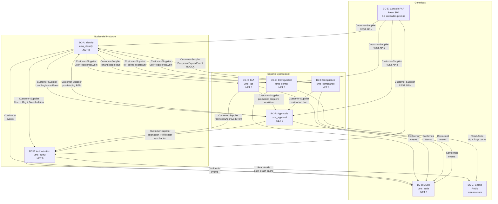

# Bounded Context Map

**Tipo:** DDD — Mapa de Contextos  
**Version:** 2.0 | **Fecha:** 2026-05-15 | **Estado:** Propuesto  
**Alcance:** Producto completo — FS-01 a FS-16  

> **Visualizacion interactiva:** [interactive-ddd-viewer.html](./interactive-ddd-viewer.html) — seccion "Bounded Context Map"

---

## Diagrama de Contextos

Ver codigo Mermaid (referencia)

---

## Catalogo de Contextos

| Codigo | Nombre | Schema SQL | Clasificacion | FS |
|--------|--------|-----------|---------------|-----|
| BC-A | Identity | `ums_identity` | Core | FS-01, FS-03, FS-08, FS-09 |
| BC-B | Authorization | `ums_authz` | Core | FS-02, FS-04, FS-05, FS-06, FS-07 |
| BC-C | Configuration | `ums_config` | Supporting | FS-08, FS-09, FS-13 |
| BC-D | Audit | `ums_audit` | Generic | Todos |
| BC-E | Console PAP | React SPA | Generic | Todos (UI) |
| BC-F | Approvals | `ums_approval` | Supporting | FS-10, FS-11, FS-12 |
| BC-G | Cache | Redis | Generic | BC-B, BC-C |
| BC-H | IGA | `ums_iga` | Supporting | FS-12, FS-14 |
| BC-I | Compliance | `ums_compliance` | Supporting | FS-11, FS-15, FS-16 |

---

## Tabla de Relaciones

| Upstream | Downstream | Patron | Contrato |
|----------|-----------|--------|----------|
| Identity | Authorization | Customer-Supplier | User/Org/Branch claims via eventos o API |
| Identity | Configuration | Customer-Supplier | Tenant scope keys para aislamiento de config |
| Identity | Approvals | Customer-Supplier | Registro de usuario externo desencadena workflow |
| Identity | IGA | Customer-Supplier | `UserRegisteredEvent` para inicializar tracking |
| Identity | Compliance | Customer-Supplier | `UserRegisteredEvent` para inicializar documentos |
| Configuration | Identity | Customer-Supplier | IdP config provista al Auth Gateway para routing |
| Authorization | Cache | Shared Kernel `ICachePort` | Read-aside; invalidacion en mutaciones |
| Configuration | Cache | Shared Kernel `IConfigCachePort` | Read-aside cfg + flags; TTL 60-900s |
| IGA | Authorization | Customer-Supplier | `PromotionApprovedEvent` actualiza Profile |
| IGA | Approvals | Customer-Supplier | Promocion requiere ApprovalRequest |
| Compliance | Identity | Customer-Supplier | `DocumentExpiredEvent` ejecuta BLOCK_ACCESS |
| Compliance | Approvals | Customer-Supplier | Validacion documental abre workflow |
| Approvals | Identity | Customer-Supplier | `ApprovalResolvedEvent` activa UserAccount (ONBOARDING) |
| Approvals | Authorization | Customer-Supplier | `ApprovalResolvedEvent` asigna Profile (PROFILE_ASSIGNMENT) |
| Todos | Audit | Conformist | Eventos inmutables appendeados al ledger |
| Console | Todos | Customer-Supplier | REST versionado; tratado como consumidor externo |

---

## Anti-Corruption Layers

| Frontera | Mecanismo | Motivo |
|---------|-----------|--------|
| Authorization — IdP externo | `IAuthenticationPort` Strategy Pattern | Evita acoplamiento con SDK de Zitadel/Okta |
| Configuration — Feature Flag Providers | `IFeatureFlagPort` Strategy Pattern | Evita LaunchDarkly/Unleash en dominio |
| Configuration — Secret Vault | `ISecretStorePort` Strategy Pattern | Evita AWS Secrets Manager / HashiCorp en dominio |
| Authorization — Redis | `ICachePort` | Evita cliente Redis en capa de dominio |
| Configuration — Redis | `IConfigCachePort` | Namespace separado de auth_graph |
| Compliance — Notificaciones | `INotificationPort` Strategy Pattern | Evita SDK SMTP/Twilio en dominio |
| Compliance — Almacenamiento | `IDocumentStoragePort` Strategy Pattern | Evita SDK MinIO/S3 en dominio |
| Authorization — Event Bus | `IEventBusPort` | Evita Kafka/RabbitMQ en use cases |

---

**[Indice DDD](./index.md)** | **[Siguiente: Lenguaje Ubicuo](./02-ubiquitous-language.md)**
