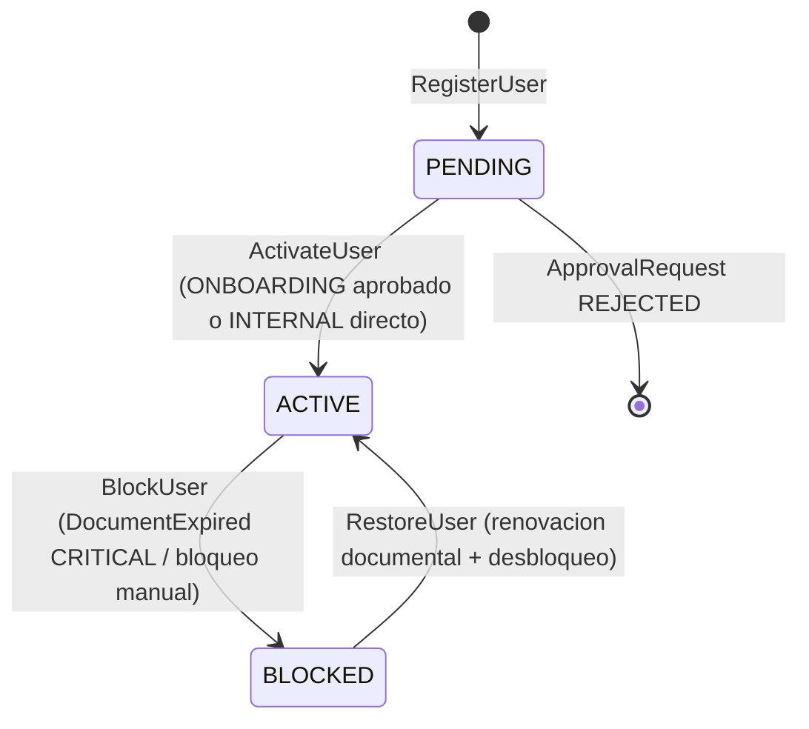

# BC-A — Identity Context

**Schema:** `[ums_identity]` | **Owner:** UMS Core API .NET 8  
**Mision:** Gestionar el ciclo de vida de principals (usuarios), estructuras organizacionales (tenants) y sub-unidades (branches). Delegar verificacion de credenciales a adaptadores de IdP.  
**FS cubiertos:** FS-01, FS-03, FS-08, FS-09  
**Version:** 2.0 | **Fecha:** 2026-05-15

---

## Agregados

| Agregado | Raiz | Descripcion |
|---------|------|-------------|
| [Tenant](#aggregate-tenant) | `Tenant` | Nodo organizacional jerárquico y sus branches/proveedores de identidad |
| [UserAccount](#aggregate-useraccount) | `UserAccount` | Principal autenticable con sus métodos de autenticación |

---

## Aggregate: Tenant

**Aggregate Root:** `Tenant`

### Entidades

| Entidad | Descripcion |
|---------|-------------|
| `Tenant` (AR) | Nodo organizacional en la jerarquía; equivale a Organization en el glosario |
| `Branch` | Sub-unidad física del tenant; ciclo de vida gobernado por el Tenant AR |
| `IdentityProvider` | Proveedor de identidad federada registrado para el tenant |
| `Branding` | Configuración visual y de DNS para el hosted login del tenant |

### Value Objects

| Value Object | Tipo base | Regla |
|-------------|-----------|-------|
| `TenantType` | enum | `ROOT / ENTERPRISE / SUBSIDIARY / DIVISION / BRANCH / DEPARTMENT` |
| `TaxonomyRank` | int | Rango jerárquico; determina quién puede ser padre/hijo |
| `TenantStatus` | enum | `ACTIVE / SUSPENDED / ARCHIVED` |
| `OrganizationType` | enum | `INTERNAL / CLIENT / SUPPLIER / PARTNER` |
| `CompanyReference` | string | Código ERP externo (SAP); inmutable post-creación |
| `IdpStrategyHint` | enum | `INTERNAL_BCRYPT / ZITADEL / AZURE_AD / OKTA / SAML2 / GENERIC_OIDC` |
| `TenantMetadata` | JSON | Payload libre validado como JSON |
| `BranchCode` | string | Único dentro del tenant; slug alfanumérico |
| `GeofencingMetadata` | JSON | Nullable; requiere `radius_km`, `center_lat`, `center_lng` si presente |

### Invariantes

| ID | Regla | Fuente |
|----|-------|--------|
| INV-T1 | `child.TaxonomyRank > parent.TaxonomyRank` — tipo hijo debe tener rango estrictamente mayor | ADR-0048 |
| INV-T2 | `BRANCH` y `DEPARTMENT` no pueden tener hijos (`can_have_children = false`) | ADR-0048 |
| INV-T3 | `ROOT` es su propio `root_tenant_id`; todos los demás deben diferir | ADR-0048 |
| INV-T4 | `CompanyReference` debe ser único dentro del tipo `CLIENT/SUPPLIER/PARTNER` del mismo parent | FS-03 |
| INV-T5 | `ARCHIVED` es terminal; no retorna a `ACTIVE` sin proceso explícito | FS-03 |
| INV-T6 | No puede crearse `Branch` ni `UserAccount` bajo un Tenant `SUSPENDED` o `ARCHIVED` | FS-03 |
| INV-B1 | `BranchCode` único dentro del `TenantId` | FS-03 |
| INV-B2 | `GeofencingMetadata` válido JSON con claves requeridas si presente | conceptual-data-model.md |
| INV-B3 | Branch inactiva o suspendida no puede recibir nuevos Profiles | FS-03 |
| INV-B4 | Branch debe pertenecer a un Tenant `ACTIVE` | FS-03 |

### Comandos

| Comando | Descripcion |
|---------|-------------|
| `RegisterTenantCommand` | Registra un nuevo tenant con tipo, referencia externa y estrategia IdP |
| `SuspendTenantCommand` | Suspende el tenant; bloquea acceso a todos sus usuarios |
| `ActivateTenantCommand` | Activa un tenant suspendido |
| `AddBranchCommand` | Agrega una sub-unidad física (Branch) al tenant |
| `RemoveBranchCommand` | Remueve una branch inactiva del tenant |
| `DeactivateBranchCommand` | Suspende/desactiva temporalmente una branch activa |
| `ReactivateBranchCommand` | Reactiva una branch suspendida |
| `RegisterIdentityProviderCommand` | Registra un nuevo proveedor de identidad federada para el tenant |
| `ActivateIdentityProviderCommand` | Activa un IdP y desactiva los demás del tenant |
| `DeactivateIdentityProviderCommand` | Desactiva un IdP activo del tenant |
| `RemoveIdentityProviderCommand` | Remueve un IdP registrado e inactivo del tenant |
| `SetBrandingCommand` | Configura branding visual por primera vez |
| `UpdateBrandingCommand` | Actualiza la configuración visual de branding existente |
| `VerifyBrandingDnsCommand` | Marca el DNS de branding como verificado con éxito |
| `FailBrandingDnsCommand` | Registra fallo en la verificación DNS del branding |
| `RemoveBrandingCommand` | Remueve la configuración de branding del tenant |

### Eventos de Dominio

```
TenantCreatedEvent                 { tenantId, code, name }
TenantActivatedEvent               { tenantId }
TenantSuspendedEvent               { tenantId }
BranchCreatedEvent                 { tenantId, branchId, code }
BranchRemovedEvent                 { tenantId, branchId }
BranchDeactivatedEvent             { tenantId, branchId }
BranchReactivatedEvent             { tenantId, branchId }
IdentityProviderRegisteredEvent    { tenantId, identityProviderId, code, strategyName }
IdentityProviderActivatedEvent     { tenantId, identityProviderId, code }
IdentityProviderDeactivatedEvent   { tenantId, identityProviderId, code }
IdentityProviderRemovedEvent       { tenantId, identityProviderId }
BrandingCreatedEvent               { tenantId, brandingId }
BrandingUpdatedEvent               { tenantId, brandingId }
BrandingDnsVerifiedEvent           { tenantId, brandingId }
BrandingDnsFailedEvent             { tenantId, brandingId }
BrandingRemovedEvent               { tenantId, brandingId }
```

### Repositorio

```csharp
ITenantRepository : IAggregateRepository<Tenant> {
    GetByCodeAsync(code, cancellationToken)
}
```

---

## Aggregate: UserAccount

**Aggregate Root:** `UserAccount`  
**FS:** FS-01, FS-03, FS-09, FS-10

### Entidades

| Entidad | Descripcion |
|---------|-------------|
| `UserAccount` (AR) | Principal autenticable en la plataforma |
| `MfaEnrollment` | Metodo MFA o passwordless enrolado por el usuario (FS-09); ver gap V2 |

### Value Objects

| Value Object | Tipo base | Regla |
|-------------|-----------|-------|
| `Email` | string | Formato RFC 5321; unico dentro del tenant |
| `UserCategory` | enum | `INTERNAL / EXTERNAL / B2B / PARTNER / SERVICE_ACCOUNT` |
| `UserStatus` | enum | `PENDING / ACTIVE / BLOCKED` |
| `IdentityReference` | string | Referencia externa al sistema origen (HR/ERP/vendor) |
| `IdentityReferenceType` | enum | `HR_ID / VENDOR_CODE / GOVERNMENT_ID / PARTNER_REF` |
| `PasswordHash` | string | Nullable; null cuando autenticacion delegada a IdP externo |
| `MfaMethod` | enum | `TOTP / WEBAUTHN / SMS_OTP / EMAIL_OTP` |
| `MfaEnrollmentStatus` | enum | `NOT_ENROLLED / ENROLLED / VERIFIED` |

### Invariantes

| ID | Regla | Fuente |
|----|-------|--------|
| INV-U1 | `Email` unico dentro del mismo `TenantId` | FS-03 |
| INV-U2 | `PasswordHash` solo NOT NULL cuando `IdpStrategy == INTERNAL_BCRYPT` | ADR-0031 |
| INV-U3 | `INTERNAL` users deben tener `IdentityReferenceType == HR_ID` | ADR-0031 |
| INV-U4 | `UserAccount BLOCKED` no puede recibir asignacion de nuevos Profiles | ADR-0044 |
| INV-U5 | `PENDING -> ACTIVE` solo tras `ApprovalRequest ONBOARDING` aprobado para `EXTERNAL/B2B/PARTNER` | ADR-0044, FS-10 |
| INV-U6 | `SERVICE_ACCOUNT` creado directamente en `ACTIVE` por admin; sin flujo de aprobacion | FS-01 |
| INV-U7 | Sesion no puede iniciarse si `UserStatus != ACTIVE` | FS-01 |
| INV-U8 | Fallo de IdP no concede acceso silencioso | FS-01 |
| INV-U9 | `MfaEnrollment` solo aplica cuando el tenant tiene MFA habilitado o elevacion de riesgo detectada | FS-09 |

### Maquina de Estado: UserAccount

> **Visualizacion:** [interactive-ddd-viewer.html](./interactive-ddd-viewer.html) — seccion "UserAccount"



### Comandos

| Comando | Descripcion |
|---------|-------------|
| `RegisterUserCommand` | Registra usuario con categoria, email, referencia externa |
| `ActivateUserCommand` | Activa el usuario post-aprobacion o directamente si es INTERNAL |
| `BlockUserCommand` | Bloquea el usuario (expiracion documental o manual) |
| `RestoreUserCommand` | Desbloquea y reactiva el usuario |
| `UpdateCredentialsCommand` | Actualiza PasswordHash (solo INTERNAL_BCRYPT) |
| `EnrollMfaCommand` | Registra metodo MFA/passwordless (FS-09) |
| `VerifyMfaChallengeCommand` | Verifica challenge MFA en el flujo de autenticacion |

### Eventos de Dominio

```
UserRegisteredEvent          { userId, tenantId, branchId?, userCategory, identityReference }
UserActivatedEvent           { userId, tenantId }
UserBlockedEvent             { userId, tenantId, reason, enforcementAction }
UserRestoredEvent            { userId, tenantId }
MfaEnrolledEvent             { userId, tenantId, method }
MfaVerifiedEvent             { userId, tenantId, method, riskScore }
AuthenticationAttemptedEvent { userId?, tenantId, outcome, reason, ipAddress }
```

### Repositorio

```csharp
IUserAccountRepository {
    FindByIdAsync(userId, rootTenantId)
    FindByEmailAsync(email, tenantId)
    FindByTenantAsync(tenantId, status?)
    FindPendingApprovalAsync(tenantId)
    FindByIdentityReferenceAsync(reference, referenceType, tenantId)
    AddAsync(user)
    UpdateAsync(user)
}
```

---

**[Anterior: Lenguaje Ubicuo](./02-ubiquitous-language.md)** | **[Indice DDD](./index.md)** | **[Siguiente: Authorization Context](./04-authorization-context.md)**
