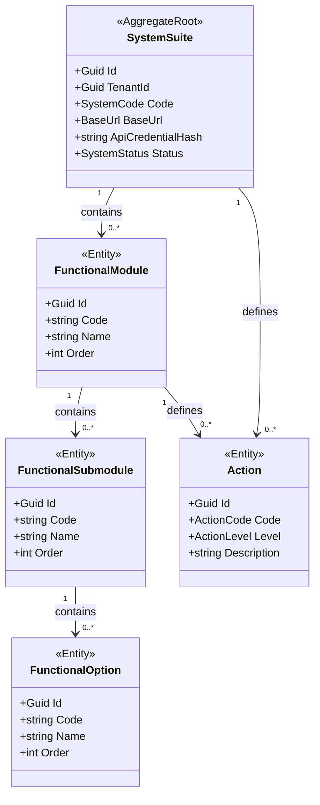
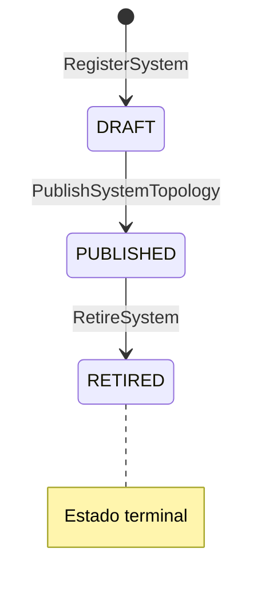
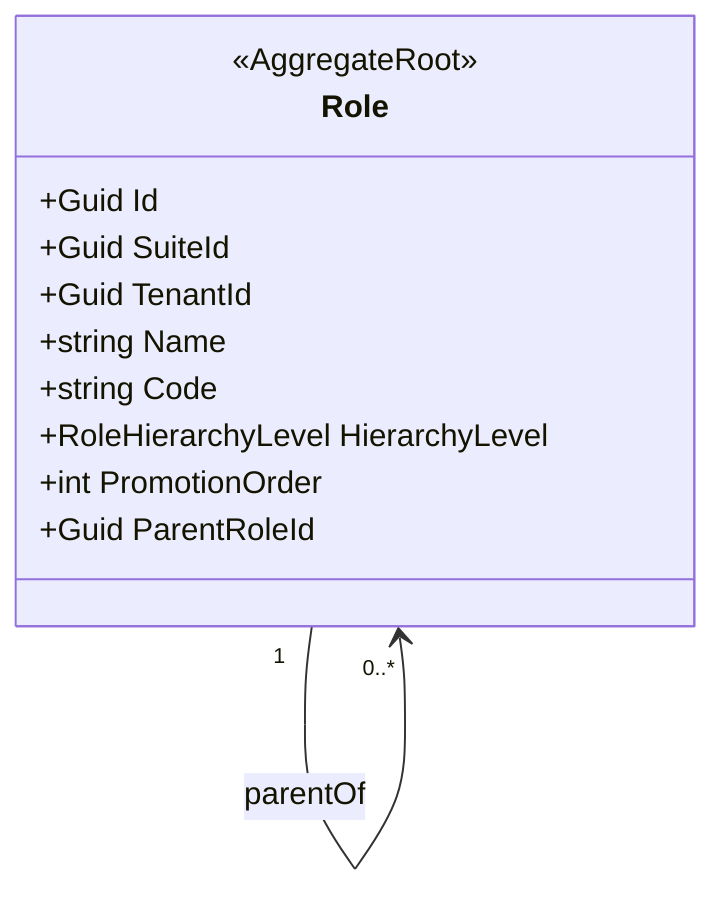
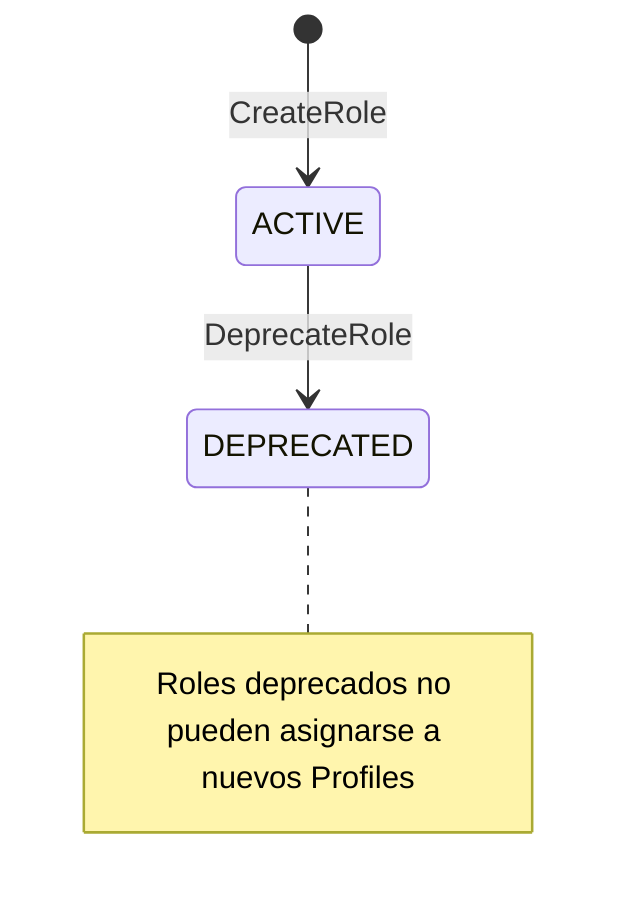
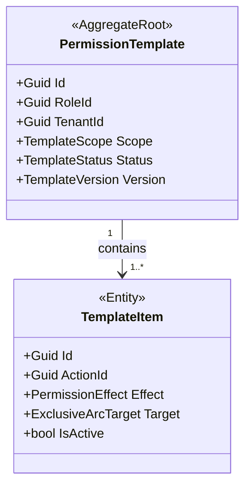
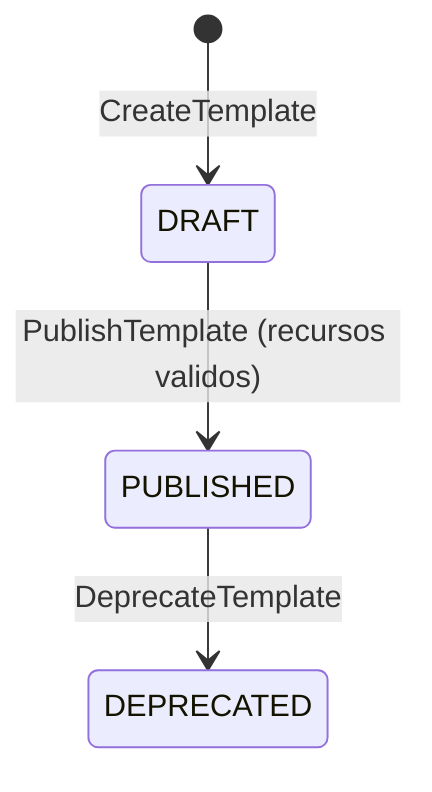
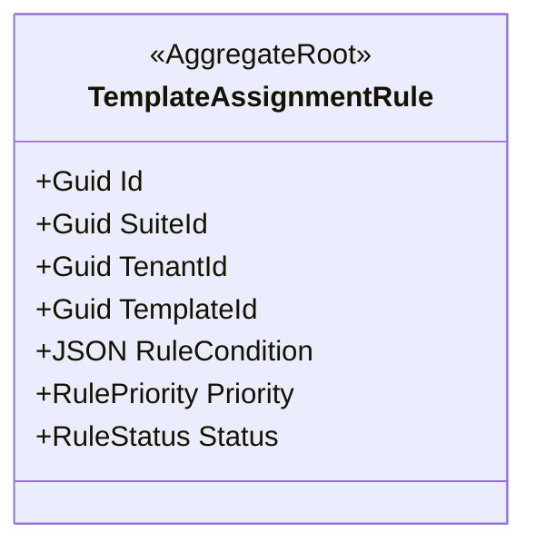
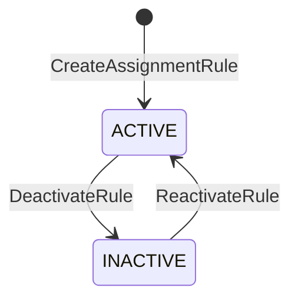
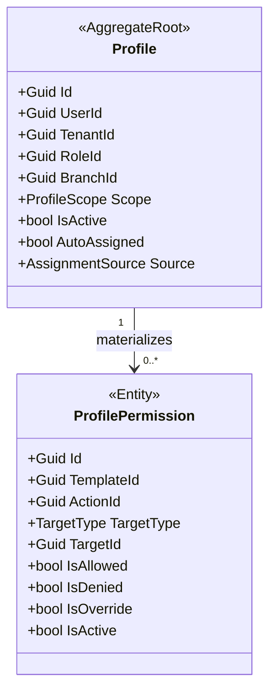

# BC-B — Authorization Context

> **Idioma:** Español | *Versión en inglés no disponible*

**Schema:** `[ums_authorization]` | **Owner:** UMS Core API .NET 10  
**Misión:** Actuar como Policy Decisión Point (PDP). Compilar y resolver el grafo de autorización jerarquico. Gobernar la topologia de recursos (sistemas, modulos, acciones) y los perfiles de permisos.  
**FS cubiertos:** FS-02, FS-04, FS-05, FS-06, FS-07  
**Versión:** 2.0 | **Fecha:** 2026-05-15

> **Arquitectura de Agregados:** Modelo completo con diagramas, secuencias, ER y API:
> [SystemSuite](../../../domain/authorization/system-suite.md) · [PermissionTemplate](../../../domain/authorization/permission-template.md) · [Profile](../../../domain/authorization/profile.md)

---

## Agregados

> [!NOTE]
> En la implementación real de C# (base de código), **`Profile`** y **`PermissionTemplate`** son los únicos agregados locales de dominio activos. **`SystemSuite`**, **`Role`** y **`TemplateAssignmentRule`** están diferidos en esta fase y son consumidos mediante referencias desacopladas a nivel de Value Object ID (`SystemSuiteId`, `RoleId`).

| Agregado | Raiz | C# Status | Descripción |
|---------|------|-----------|-------------|
| [Profile](#aggregate-profile) | `Profile` | **Activo** | Colección de autorizaciónes de un usuario |
| [PermissionTemplate](#aggregate-permissiontemplate) | `PermissionTemplate` | **Activo** | Blueprint de permisos reutilizable |
| [SystemSuite](#aggregate-systemsuite) | `SystemSuite` | *Diferido (Ref ID)* | Aplicación cliente con topología de recursos |
| [Role](#aggregate-role) | `Role` | *Diferido (Ref ID)* | Rol jerárquico dentro de un sistema |
| [TemplateAssignmentRule](#aggregate-templateassignmentrule) | `TemplateAssignmentRule` | *Diferido (Ref ID)* | Regla de auto-asignación de templates |

---

## Axiomas de Autorización (ADR-0039)

| Axioma | Enunciado |
|--------|-----------|
| A1 Deny-by-Default | Toda accion esta denegada hasta ALLOW explicito |
| A2 Permissive Union | El usuario obtiene la union de ALLOW de todos sus Profiles activos |
| A3 Explicit Deny Dominance | Un DENY en cualquier Profile invalida todos los ALLOW del usuario |
| A4 Branch Scope Precedence | Profile `BRANCH_SCOPED` tiene precedencia sobre `ORG_WIDE` para el mismo branch |

---

## Aggregate: SystemSuite

**Aggregate Root:** `SystemSuite`  
**FS:** FS-04

### Entidades

| Entidad | Descripción |
|---------|-------------|
| `SystemSuite` (AR) | Aplicacion cliente registrada en la plataforma |
| `FunctionalModule` | L1 de la topologia funcional (Modulo) |
| `FunctionalSubmodule` | L2 (Menu / Submenu) |
| `FunctionalOption` | L3 (Pagina / Vista) |
| `Action` | Unidad atomica de permiso; asignable en cualquier nivel |

### Value Objects

| Value Object | Tipo | Regla |
|-------------|------|-------|
| `SystemCode` | string | Único globalmente; slug machine-readable |
| `BaseUrl` | string | URL fisica del sistema para routing del gateway |
| `ApiCredentialHash` | string | Hash de credencial M2M generado al registro |
| `SystemStatus` | enum | `DRAFT / PUBLISHED / RETIRED` |
| `ActionLevel` | enum | `SYSTEM / MODULE / SUBMODULE / OPTION` |
| `ActionCode` | string | Único dentro del sistema (ej. `USER_CREATE`) |

### Invariantes

| ID | Regla | Fuente |
|----|-------|--------|
| INV-S1 | `SystemCode` único globalmente (no por tenant) | FS-04 |
| INV-S2 | Action XOR: `(SuiteId NOT NULL AND ModuleId NULL) OR (SuiteId NULL AND ModuleId NOT NULL)` | ADR-0043 |
| INV-S3 | Jerarquia estricta: Suite -> Module -> Submodule -> Option; no saltos | ADR-0043 |
| INV-S4 | Topologia `DRAFT` no puede usarse en PermissionTemplates | FS-04 |
| INV-S5 | `FunctionalModule.SuiteId` inmutable post-creación | FS-04 |

### Diagrama del Agregado



### Máquina de Estado: SystemSuite



### Comandos

| Comando | Descripción |
|---------|-------------|
| `RegisterSystemCommand` | Registra nuevo sistema con code y URL |
| `AddModuleToSystemCommand` | Agrega modulo a la topologia del sistema |
| `AddSubmoduleCommand` | Agrega submenu/menu al modulo |
| `AddOptionCommand` | Agrega opcion al submenu |
| `RegisterActionCommand` | Declara accion con nivel propietario |
| `PublishSystemTopologyCommand` | Cambia estado DRAFT -> PUBLISHED |
| `RetireSystemCommand` | Retira el sistema; estado terminal |

### Eventos de Dominio

```
SystemRegisteredEvent        { suiteId, systemCode, baseUrl }
SystemTopologyPublishedEvent { suiteId }
ActionRegisteredEvent        { actionId, suiteId, actionCode, level }
SystemRetiredEvent           { suiteId }
```

---

## Aggregate: Role

**Aggregate Root:** `Role`  
**FS:** FS-02, FS-05, FS-12

### Value Objects

| Value Object | Tipo | Regla |
|-------------|------|-------|
| `RoleHierarchyLevel` | int | Nivel jerarquico; inmutable post-asignacion |
| `PromotionOrder` | int | Orden lineal de promoción dentro del suite |

### Invariantes

| ID | Regla | Fuente |
|----|-------|--------|
| INV-R1 | `ParentRoleId` debe pertenecer al mismo `SuiteId` | ADR-0046 |
| INV-R2 | `HierarchyLevel` hijo estrictamente > padre | ADR-0046 |
| INV-R3 | `PromotionOrder` hijo = padre + 1; no saltos de nivel | ADR-0046 |
| INV-R4 | Un rol no puede tener mas de un padre (no herencia multiple) | ADR-0046 |

### Diagrama del Agregado



### Máquina de Estado: Role



### Comandos y Eventos

```
CreateRoleCommand          -> RoleCreatedEvent          { roleId, suiteId, parentRoleId? }
UpdateRoleHierarchyCommand -> RoleHierarchyUpdatedEvent { roleId, oldParentRoleId, newParentRoleId }
```

---

## Aggregate: PermissionTemplate

**Aggregate Root:** `PermissionTemplate`  
**FS:** FS-02, FS-05, FS-06

### Value Objects

| Value Object | Tipo | Regla |
|-------------|------|-------|
| `ExclusiveArcTarget` | record | Encapsula (SuiteId?, ModuleId?, SubmoduleId?, OptionId?); exactamente uno NOT NULL |
| `TemplateScope` | enum | `GLOBAL` (TenantId=NULL) / `TENANT` (protegido por RLS) |
| `PermissionEffect` | enum | `ALLOW / DENY` |
| `TemplateVersión` | string | Semver (ej. `1.0.0`); inmutable una vez publicada |
| `TemplateStatus` | enum | `DRAFT / PUBLISHED / DEPRECATED` |

### Invariantes

| ID | Regla | Fuente |
|----|-------|--------|
| INV-PT1 | Exactamente uno de los 4 FKs del arco exclusivo debe ser NOT NULL | ADR-0043, Regla 2 |
| INV-PT2 | Template debe referenciar `RoleId` valido del mismo suite | ADR-0043 |
| INV-PT3 | Templates `GLOBAL` tienen `TenantId = NULL` | ADR-0042 |
| INV-PT4 | No puede existir mas de un template activo para `(RoleId, ActionId, ExclusiveArcTarget)` | ADR-0042 |
| INV-PT5 | `DRAFT` no puede asignarse a Profiles | FS-02 |
| INV-PT6 | `DEPRECATED` no puede asignarse a nuevos Profiles | FS-02 |
| INV-PT7 | Recursos referenciados deben pertenecer a un `SystemSuite PUBLISHED` | FS-02 |

### Diagrama del Agregado



### Máquina de Estado: PermissionTemplate

> **Visualización:** [interactive-ddd-viewer.html](./interactive-ddd-viewer.html) — sección "PermissionTemplate"



### Comandos

| Comando | Descripción |
|---------|-------------|
| `CreateTemplateCommand` | Crea template en estado DRAFT |
| `AddPermissionToTemplateCommand` | Agrega Action+Effect al template (solo en DRAFT) |
| `RemovePermissionFromTemplateCommand` | Elimina permiso del template (solo en DRAFT) |
| `PublishTemplateCommand` | Valida recursos y publica el template |
| `DeprecateTemplateCommand` | Marca el template como obsoleto |

### Eventos de Dominio

```
PermissionTemplateCreatedEvent    { templateId, roleId, scope, version }
PermissionTemplatePublishedEvent  { templateId, roleId }
PermissionTemplateMutatedEvent    { templateId, roleId, previousEffect, newEffect }
PermissionTemplateDeprecatedEvent { templateId, roleId }
```

---

## Aggregate: TemplateAssignmentRule

**Aggregate Root:** `TemplateAssignmentRule`  
**FS:** FS-06

> **Nota:** Este agregado no aparece en el E/R actual. Pendiente de validación (gap V1 en [12-design-decisions.md](./12-design-decisions.md)).

### Value Objects

| Value Object | Tipo | Regla |
|-------------|------|-------|
| `RuleCondition` | JSON | Condicion evaluable contra atributos del Profile (org type, branch, user category) |
| `RulePriority` | int | Mayor numero = mayor prioridad; resuelve conflictos deterministicamente |
| `RuleStatus` | enum | `ACTIVE / INACTIVE` |

### Invariantes

| ID | Regla | Fuente |
|----|-------|--------|
| INV-AR1 | `RulePriority` único dentro del mismo `SuiteId` | FS-06 |
| INV-AR2 | Template referenciado debe estar `PUBLISHED` | FS-06 |
| INV-AR3 | La razon de asignacion debe registrarse en `ProfilePermission` (rule reference) | FS-06 |

### Diagrama del Agregado



### Máquina de Estado: TemplateAssignmentRule



### Comandos y Eventos

```
CreateAssignmentRuleCommand    -> AssignmentRuleCreatedEvent     { ruleId, suiteId, templateId, priority }
UpdateRulePriorityCommand      -> AssignmentRulePriorityUpdated  { ruleId, oldPriority, newPriority }
DeactivateRuleCommand          -> AssignmentRuleDeactivatedEvent { ruleId }
```

---

## Aggregate: Profile

**Aggregate Root:** `Profile`  
**FS:** FS-05, FS-06, FS-07, FS-10

### Entidades

| Entidad | Descripción |
|---------|-------------|
| `Profile` (AR) | Coleccion fisica de autorizaciónes asignada a un usuario |
| `ProfilePermission` | Materializacion del template sobre el perfil; soporta overrides `IsAllowed/IsDenied` |

### Value Objects

| Value Object | Tipo | Regla |
|-------------|------|-------|
| `ProfileScope` | enum | `ORG_WIDE` (BranchId=NULL) / `BRANCH_SCOPED` (BranchId NOT NULL) |
| `AutoAssigned` | bool | true si asignado por motor de reglas; false si manual |
| `AssignmentSource` | record | `(method: MANUAL/AUTO, ruleId?: Guid, assignedBy: Guid)` |
| `PermissionOverride` | record | `(IsAllowed: bool, IsDenied: bool, Reason: string)` |

### Invariantes

| ID | Regla | Fuente |
|----|-------|--------|
| INV-P1 | `BranchId` NOT NULL implica que el Branch pertenece al mismo `TenantId` | FS-05 |
| INV-P2 | Un usuario puede tener un solo Profile activo por `(TenantId, BranchId, RoleId)` | FS-05 |
| INV-P3 | Al asignar `ProfilePermission`, permisos del admin deben ser >= permisos concedidos (Least Privilege) | ADR-0044 |
| INV-P4 | `UserAccount BLOCKED` no puede recibir nuevos Profiles | ADR-0044 |
| INV-P5 | Profile `BRANCH_SCOPED` tiene precedencia sobre `ORG_WIDE` para el mismo branch (Axioma 4) | database-design-er.md |
| INV-P6 | `DENY` en cualquier Profile invalida `ALLOW` en todos los perfiles del usuario (Axioma 3) | database-design-er.md |
| INV-P7 | Accion bloqueada hasta `ALLOW` explicito (Deny-by-Default, Axioma 1) | database-design-er.md |
| INV-P8 | Profiles internos (`INTERNAL_ONLY`) no pueden asignarse a usuarios `EXTERNAL/B2B/PARTNER` | FS-10 |

### Diagrama del Agregado



### Comandos

| Comando | Descripción |
|---------|-------------|
| `CreateProfileCommand` | Crea perfil vinculado a org, rol y opcionalmente branch |
| `AssignTemplateToProfileCommand` | Vincula template publicado al perfil (manual) |
| `AutoAssignTemplateCommand` | Motor de reglas asigna template automaticamente (FS-06) |
| `GrantPermissionOverrideCommand` | Override explicito ALLOW/DENY sobre una Action |
| `RevokePermissionOverrideCommand` | Elimina override de una Action |
| `AssignProfileToUserCommand` | Vincula el Profile a un UserAccount |
| `RevokeProfileFromUserCommand` | Desvincula el Profile del UserAccount |

### Eventos de Dominio

```
ProfileCreatedEvent                { profileId, userId, tenantId, roleId, branchId? }
TemplateLinkedToProfileEvent       { profileId, templateId, method: MANUAL/AUTO, ruleId? }
PermissionOverrideGrantedEvent     { profileId, userId, actionId, effect, grantedBy }
PermissionOverrideRevokedEvent     { profileId, userId, actionId, revokedBy }
ProfileAssignedToUserEvent         { profileId, userId, assignedBy }
ProfileRevokedFromUserEvent        { profileId, userId, reason }
PermissionMutatedEvent             { profileId, userId, actionId, effect, mutatedBy }
AuthorizationGraphInvalidatedEvent { userId, tenantId, suiteId }
```

---

**[Anterior: Identity Context](./03-identity-context.md)** | **[Índice DDD](./index.md)** | **[Siguiente: Configuration Context](./05-configuration-context.md)**
