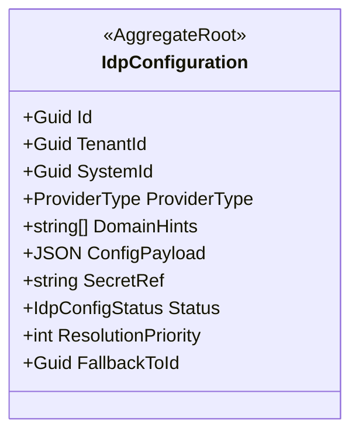
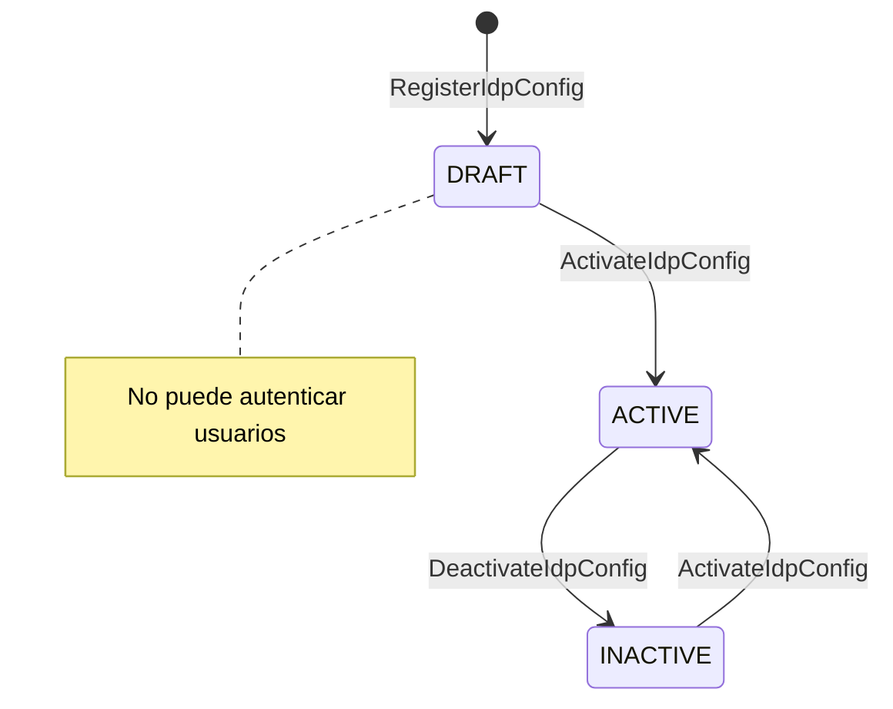
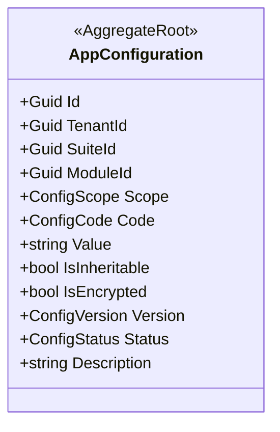
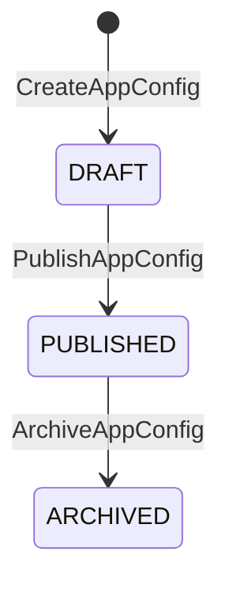
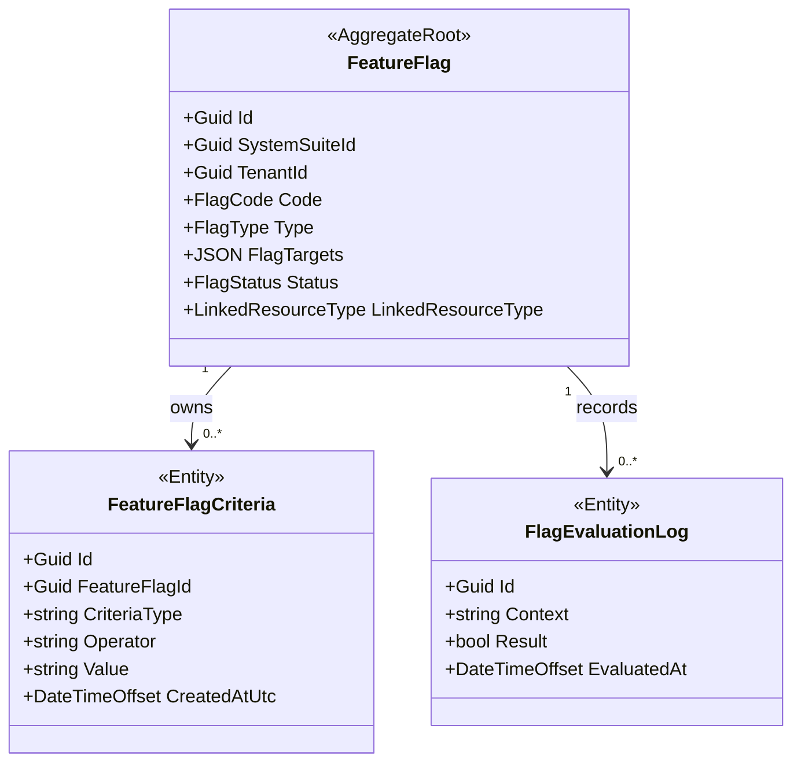
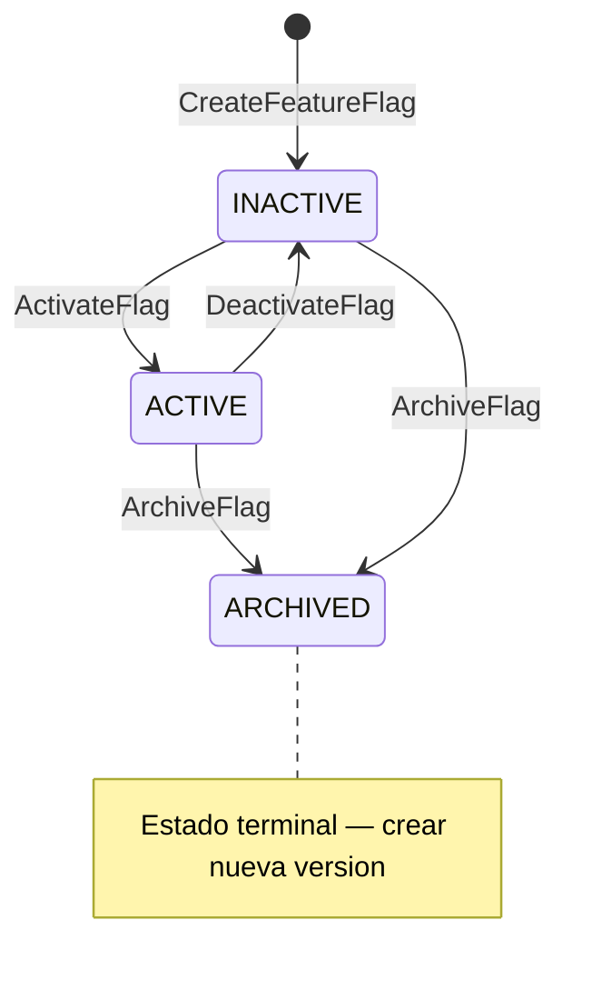

# BC-C — Configuration Context

> **Idioma:** Español | *Versión en inglés no disponible*

**Schema:** `[ums_configuration]` | **Owner:** UMS Core API .NET 10  
**Misión:** Gobernar el comportamiento dinamico de todos los sistemas integrados sin requerir redeployments. Tres pilares: Multi-IdP, Configuración de Sistemas, Feature Flags.  
**FS cubiertos:** FS-08, FS-09, FS-13  
**Versión:** 2.0 | **Fecha:** 2026-05-15

> **Arquitectura de Agregados:** Modelo completo con diagramas, secuencias, ER y API:
> [IdpConfiguration](../../../domain/configuration/idp-configuration.md) · [AppConfiguration](../../../domain/configuration/app-configuration.md) · [FeatureFlag](../../../domain/configuration/feature-flag.md)

---

## Agregados

| Agregado | Raiz | Descripción |
|---------|------|-------------|
| [IdpConfiguration](#aggregate-idpconfiguration) | `IdpConfiguration` | Config de proveedor de identidad por tenant/sistema |
| [AppConfiguration](#aggregate-appconfiguration) | `AppConfiguration` | Parametros jerarquicos de configuración |
| [FeatureFlag](#aggregate-featureflag) | `FeatureFlag` | Toggles de funcionalidad multi-dimension |
| [ParameterDefinition](#aggregate-parameterdomainmodel) | `ParameterDefinition` | Esquema canónico de parámetro configurable |
| [ParameterGlobalValue](#aggregate-parameterdomainmodel) | `ParameterGlobalValue` | Valor global por defecto del parámetro |
| [ParameterTenantValue](#aggregate-parameterdomainmodel) | `ParameterTenantValue` | Override del parámetro a nivel tenant |

## Aggregate: Parameter Domain Model

**Aggregate Roots:** `ParameterDefinition`, `ParameterGlobalValue`, `ParameterTenantValue`

### Intención del Modelo

El sistema de parametrización se modela como tres Aggregate Roots separados para mantener la trazabilidad y el ciclo de vida explícito:

| Aggregate Root | Rol funcional |
|---|---|
| `ParameterDefinition` | Define el esquema, tipo, alcance permitido y semántica de un parámetro |
| `ParameterGlobalValue` | Publica el valor global por defecto para todos los tenants |
| `ParameterTenantValue` | Sobrescribe el valor global para un tenant específico cuando la política lo permite |

### Reglas Clave

- `ParameterDefinition` gobierna `code`, `value` y `description` como contrato mínimo.
- `ParameterGlobalValue` representa el valor base del sistema.
- `ParameterTenantValue` solo puede existir cuando el tenant tiene permiso de override.
- La documentación y el modelo físico deben evolucionar juntos para estos tres ARs.

---

## Aggregate: IdpConfiguration

**Aggregate Root:** `IdpConfiguration`  
**FS:** FS-01, FS-03, FS-08

### Value Objects

| Value Object | Tipo | Regla |
|-------------|------|-------|
| `ProviderType` | enum | `INTERNAL_BCRYPT / ZITADEL / AZURE_AD / OKTA / KEYCLOAK / AUTH0 / GOOGLE / LDAP / SAML2 / GENERIC_OIDC` |
| `DomainHints` | string[] | Patrónes de dominio email para routing (ej. `@logisticscorp.com`) |
| `ConfigPayload` | JSON cifrado | authority URL, client_id, scopes, claim mappings |
| `SecretRef` | string | Ruta Vault para credenciales (ej. `vault://ums/secrets/{tenant}/client_secret`) |
| `IdpConfigStatus` | enum | `DRAFT / ACTIVE / INACTIVE` |
| `ResolutionPriority` | int | Orden de evaluación; menor = mayor prioridad |

### Invariantes

| ID | Regla | Fuente |
|----|-------|--------|
| INV-IDP1 | `ResolutionPriority` único dentro del scope `(TenantId, SystemId)` | conceptual-data-model.md |
| INV-IDP2 | `FallbackToId` no puede formar ciclo en la cadena | ADR-0020 |
| INV-IDP3 | Solo una config `ACTIVE` por `ProviderType` en el mismo scope | FS-03 |
| INV-IDP4 | `ConfigPayload` debe ser JSON valido | conceptual-data-model.md |
| INV-IDP5 | `DRAFT` no puede usarse para autenticar usuarios | FS-03 |

### Diagrama del Agregado



### Máquina de Estado: IdpConfiguration



### Comandos y Eventos

```
RegisterIdpConfigCommand    -> IdpConfigRegisteredEvent  { configId, tenantId, providerType, version }
ActivateIdpConfigCommand    -> IdpConfigActivatedEvent   { configId, tenantId }
UpdateIdpConfigCommand      -> IdpConfigUpdatedEvent     { configId, tenantId, version }
DeactivateIdpConfigCommand  -> IdpConfigDeactivatedEvent { configId, tenantId }
```

---

## Aggregate: AppConfiguration

**Aggregate Root:** `AppConfiguration`  
**FS:** FS-08, FS-13

### Value Objects

| Value Object | Tipo | Regla |
|-------------|------|-------|
| `ConfigScope` | enum/record | `GLOBAL / TENANT / SUITE / MODULE` segun FKs poblados |
| `ConfigCode` | string | Único por scope `(TenantId, SuiteId, ModuleId)` |
| `IsInheritable` | bool | `false` bloquea override en scopes inferiores |
| `IsEncrypted` | bool | Valor cifrado en reposo |
| `ConfigVersión` | string | Semver; lineage de versiónes |
| `ConfigStatus` | enum | `DRAFT / PUBLISHED / ARCHIVED` |

### Invariantes

| ID | Regla | Fuente |
|----|-------|--------|
| INV-AC1 | `ConfigCode` único para `(TenantId, SuiteId, ModuleId)` | ADR-0047, FS-13 |
| INV-AC2 | Si `IsInheritable=false` en scope superior, scopes inferiores no pueden crear ese `ConfigCode` | ADR-0047 |
| INV-AC3 | Resolución jerarquica: `MODULE > SUITE > TENANT > GLOBAL` | ADR-0047 |
| INV-AC4 | `Description` obligatorio; debe documentar proposito, impacto, comportamiento y scope | FS-13, database-design-er.md Regla 9 |
| INV-AC5 | `DRAFT` no puede servirse a clientes | FS-13 |

### Diagrama del Agregado



### Máquina de Estado: AppConfiguration



### Comandos y Eventos

```
CreateAppConfigCommand      -> AppConfigCreatedEvent    { configId, scope, code, version }
PublishAppConfigCommand     -> AppConfigPublishedEvent  { configId, code, version }
ArchiveAppConfigCommand     -> AppConfigArchivedEvent   { configId, code }
UpdateAppConfigCommand      -> AppConfigUpdatedEvent    { configId, code, newVersion }
```

---

## Aggregate: FeatureFlag

**Aggregate Root:** `FeatureFlag`  
**FS:** FS-08, FS-13  
**Referencia completa:** [FeatureFlag](../../../domain/configuration/feature-flag.md) · [FeatureFlagCriteria](../../../domain/configuration/feature-flag-criteria.md)

### Entidades

| Entidad | Descripción |
|---------|-------------|
| `FeatureFlag` (AR) | Toggle multi-dimension de funcionalidades, acotado a un SystemSuite |
| `FeatureFlagCriteria` | Criterio de evaluación dinámico; colección vacía = activo para todos |
| `FlagEvaluationLog` | Registro de evaluaciones; se proyecta también en Audit Context |

### Value Objects

| Value Object | Tipo | Regla |
|-------------|------|-------|
| `SystemSuiteId` | Guid (ref BC-B) | Obligatorio e inmutable; scope del flag |
| `TenantId` | Guid? | Scope de tenant opcional |
| `FlagCode` | string | Único dentro de `(SystemSuiteId, FlagCode)` — no globalmente |
| `FlagType` | enum | `BOOLEAN / VARIANT / PERCENTAGE` |
| `FlagTargets` | JSON | `{systems, tenants, branches, roles, users, rollout_percentage}` |
| `FlagStatus` | enum | `ACTIVE / INACTIVE / ARCHIVED` |
| `LinkedResourceType` | enum? | Nullable: `MENU / MODULE / ENDPOINT / WORKFLOW` |

### Invariantes

| ID | Regla | Fuente |
|----|-------|--------|
| INV-FF1 | `FlagCode` único dentro de `(SystemSuiteId, FlagCode)` | ADR-0068 |
| INV-FF2 | `PERCENTAGE` type: `rollout_percentage` entre 0 y 100 | FS-08 |
| INV-FF3 | `ARCHIVED` no puede evaluarse ni reactivarse; debe crearse nueva versión | FS-08 |
| INV-FF4 | `SystemSuiteId` obligatorio e inmutable una vez creado el flag | ADR-0068 |
| INV-FF5 | Criterio `DateRange`: fecha de inicio estrictamente antes de la de fin | ADR-0068 |
| INV-FF6 | No duplicar `(CriteriaType, Operator, Value)` en el mismo flag | ADR-0068 |

### Diagrama del Agregado



### Puertos (Ports)

```csharp
// Domain port — implemented in Infrastructure
public interface IFeatureFlagEvaluator
{
    bool Evaluate(FeatureFlag flag, EvaluationContext context);
}
```

### Máquina de Estado: FeatureFlag



Los criterios (`FeatureFlagCriteria`) no tienen estados propios. Se agregan y eliminan mientras el flag está en `INACTIVE` o `ACTIVE`.

### Comandos y Eventos

```
CreateFeatureFlagCommand(systemSuiteId, tenantId, flagCode, type, actor)
    -> FeatureFlagCreatedEvent { flagId, flagCode, systemSuiteId }

UpdateFeatureFlagCommand(flagId, flagTargets, rolloutPercentage, actor)
    -> (mutable properties updated)

ActivateFlagCommand(flagId, actor)
    -> FeatureFlagActivatedEvent { flagCode, targetScope }

DeactivateFlagCommand(flagId, actor)
    -> FeatureFlagDeactivatedEvent { flagCode }

ArchiveFlagCommand(flagId, actor)
    -> FeatureFlagArchivedEvent { flagCode }

AddFeatureFlagCriteriaCommand(flagId, criteriaType, operator, value, actor)
    -> FeatureFlagCriteriaAddedEvent { flagId, flagCode, criteriaType }

RemoveFeatureFlagCriteriaCommand(flagId, criteriaId, actor)
    -> FeatureFlagCriteriaRemovedEvent { flagId, flagCode, criteriaId }

EvaluateFeatureFlagCommand(flagId, evaluationContext, evaluatedBy)
    -> FlagEvaluatedEvent { flagCode, result, context }

FeatureFlagStateChangedEvent { flagCode, newStatus, targetScope, changedBy }
FeatureFlagTargetingRulesUpdatedEvent { flagId, flagCode, systemSuiteId }
```

---

**[Anterior: Authorization Context](./04-authorization-context.md)** | **[Índice DDD](./index.md)** | **[Siguiente: Audit Context](./06-audit-context.md)**
