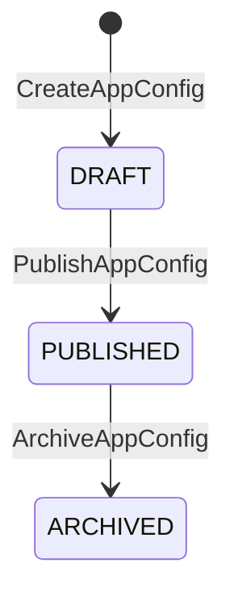

# BC-C — Configuration Context

**Schema:** `[ums_config]` | **Owner:** UMS Core API .NET 8  
**Mision:** Gobernar el comportamiento dinamico de todos los sistemas integrados sin requerir redeployments. Tres pilares: Multi-IdP, Configuracion de Sistemas, Feature Flags.  
**FS cubiertos:** FS-08, FS-09, FS-13  
**Version:** 2.0 | **Fecha:** 2026-05-15

---

## Agregados

| Agregado | Raiz | Descripcion |
|---------|------|-------------|
| [IdpConfiguration](#aggregate-idpconfiguration) | `IdpConfiguration` | Config de proveedor de identidad por tenant/sistema |
| [AppConfiguration](#aggregate-appconfiguration) | `AppConfiguration` | Parametros jerarquicos de configuracion |
| [FeatureFlag](#aggregate-featureflag) | `FeatureFlag` | Toggles de funcionalidad multi-dimension |

---

## Aggregate: IdpConfiguration

**Aggregate Root:** `IdpConfiguration`  
**FS:** FS-01, FS-03, FS-08

### Value Objects

| Value Object | Tipo | Regla |
|-------------|------|-------|
| `ProviderType` | enum | `INTERNAL_BCRYPT / ZITADEL / AZURE_AD / OKTA / KEYCLOAK / AUTH0 / GOOGLE / LDAP / SAML2 / GENERIC_OIDC` |
| `DomainHints` | string[] | Patrones de dominio email para routing (ej. `@logisticscorp.com`) |
| `ConfigPayload` | JSON cifrado | authority URL, client_id, scopes, claim mappings |
| `SecretRef` | string | Ruta Vault para credenciales (ej. `vault://ums/secrets/{tenant}/client_secret`) |
| `IdpConfigStatus` | enum | `DRAFT / ACTIVE / INACTIVE` |
| `ResolutionPriority` | int | Orden de evaluacion; menor = mayor prioridad |

### Invariantes

| ID | Regla | Fuente |
|----|-------|--------|
| INV-IDP1 | `ResolutionPriority` unico dentro del scope `(TenantId, SystemId)` | conceptual-data-model.md |
| INV-IDP2 | `FallbackToId` no puede formar ciclo en la cadena | ADR-0020 |
| INV-IDP3 | Solo una config `ACTIVE` por `ProviderType` en el mismo scope | FS-03 |
| INV-IDP4 | `ConfigPayload` debe ser JSON valido | conceptual-data-model.md |
| INV-IDP5 | `DRAFT` no puede usarse para autenticar usuarios | FS-03 |

### Comandos y Eventos

```
RegisterIdpConfigCommand    -> IdpConfigRegisteredEvent  { configId, tenantId, providerType, version }
ActivateIdpConfigCommand    -> IdpConfigActivatedEvent   { configId, tenantId }
UpdateIdpConfigCommand      -> IdpConfigUpdatedEvent     { configId, tenantId, version }
DeactivateIdpConfigCommand  -> IdpConfigDeactivatedEvent { configId, tenantId }
```

---

## Aggregate: AppConfiguration

**Aggregate Root:** `AppConfiguration`  
**FS:** FS-08, FS-13

### Value Objects

| Value Object | Tipo | Regla |
|-------------|------|-------|
| `ConfigScope` | enum/record | `GLOBAL / TENANT / SUITE / MODULE` segun FKs poblados |
| `ConfigCode` | string | Unico por scope `(TenantId, SuiteId, ModuleId)` |
| `IsInheritable` | bool | `false` bloquea override en scopes inferiores |
| `IsEncrypted` | bool | Valor cifrado en reposo |
| `ConfigVersion` | string | Semver; lineage de versiones |
| `ConfigStatus` | enum | `DRAFT / PUBLISHED / ARCHIVED` |

### Invariantes

| ID | Regla | Fuente |
|----|-------|--------|
| INV-AC1 | `ConfigCode` unico para `(TenantId, SuiteId, ModuleId)` | ADR-0047, FS-13 |
| INV-AC2 | Si `IsInheritable=false` en scope superior, scopes inferiores no pueden crear ese `ConfigCode` | ADR-0047 |
| INV-AC3 | Resolucion jerarquica: `MODULE > SUITE > TENANT > GLOBAL` | ADR-0047 |
| INV-AC4 | `Description` obligatorio; debe documentar proposito, impacto, comportamiento y scope | FS-13, database-design-er.md Regla 9 |
| INV-AC5 | `DRAFT` no puede servirse a clientes | FS-13 |

### Maquina de Estado: AppConfiguration



### Comandos y Eventos

```
CreateAppConfigCommand      -> AppConfigCreatedEvent    { configId, scope, code, version }
PublishAppConfigCommand     -> AppConfigPublishedEvent  { configId, code, version }
ArchiveAppConfigCommand     -> AppConfigArchivedEvent   { configId, code }
UpdateAppConfigCommand      -> AppConfigUpdatedEvent    { configId, code, newVersion }
```

---

## Aggregate: FeatureFlag

**Aggregate Root:** `FeatureFlag`  
**FS:** FS-08, FS-13

### Entidades

| Entidad | Descripcion |
|---------|-------------|
| `FeatureFlag` (AR) | Toggle multi-dimension de funcionalidades |
| `FlagEvaluationLog` | Registro de evaluaciones; se proyecta tambien en Audit Context |

### Value Objects

| Value Object | Tipo | Regla |
|-------------|------|-------|
| `FlagCode` | string | Unico globalmente en la plataforma |
| `FlagType` | enum | `BOOLEAN / VARIANT / PERCENTAGE` |
| `FlagTargets` | JSON | `{systems, tenants, branches, roles, users, rollout_percentage}` |
| `FlagStatus` | enum | `ACTIVE / INACTIVE / ARCHIVED` |
| `LinkedResourceType` | enum? | Nullable: `MENU / MODULE / ENDPOINT / WORKFLOW` |

### Invariantes

| ID | Regla | Fuente |
|----|-------|--------|
| INV-FF1 | `FlagCode` unico globalmente | conceptual-data-model.md |
| INV-FF2 | `PERCENTAGE` type: `rollout_percentage` entre 0 y 100 | FS-08 |
| INV-FF3 | `ARCHIVED` no puede evaluarse ni reactivarse; debe crearse nueva version | FS-08 |

### Comandos y Eventos

```
CreateFeatureFlagCommand    -> FeatureFlagCreatedEvent      { flagCode, type }
ActivateFlagCommand         -> FeatureFlagActivatedEvent    { flagCode, targetScope }
DeactivateFlagCommand       -> FeatureFlagDeactivatedEvent  { flagCode }
ArchiveFlagCommand          -> FeatureFlagArchivedEvent     { flagCode }
EvaluateFlagCommand         -> FlagEvaluatedEvent           { flagCode, result, context }
FeatureFlagStateChangedEvent { flagCode, newStatus, targetScope, changedBy }
```

---

**[Anterior: Authorization Context](./04-authorization-context.md)** | **[Indice DDD](./index.md)** | **[Siguiente: Audit Context](./06-audit-context.md)**
