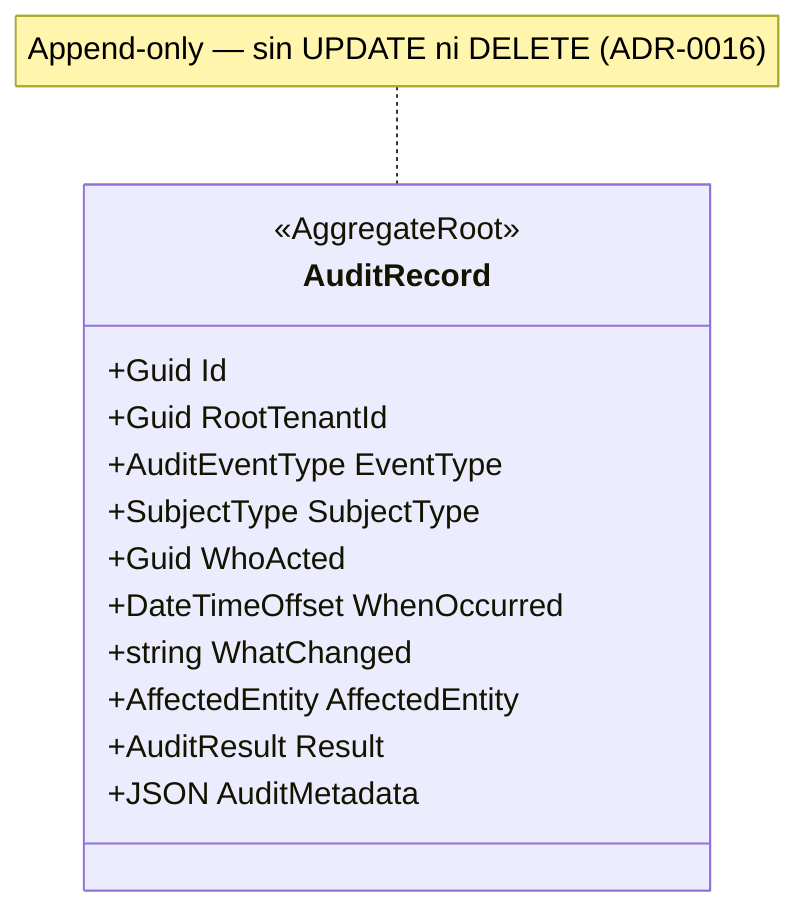

# BC-D — Audit Context

**Schema:** `[ums_audit]` | **Owner:** UMS Core API .NET 8  
**Mision:** Mantener un ledger inmutable y a prueba de manipulaciones de todos los eventos de la plataforma.  
**Patron:** Conformist puro — solo recibe, nunca emite.  
**Version:** 2.0 | **Fecha:** 2026-05-15

---

## Aggregate: AuditRecord

**Aggregate Root:** `AuditRecord` (append-only)

### Entidades

| Entidad | Descripcion |
|---------|-------------|
| `AuditRecord` (AR) | Registro inmutable: quien, cuando, que, resultado |

### Value Objects

| Value Object | Tipo | Descripcion |
|-------------|------|-------------|
| `AuditEventType` | enum/string | Tipo de evento que origino el registro |
| `SubjectType` | enum | `USER / ADMIN / SYSTEM / BACKGROUND_WORKER` |
| `AuditResult` | enum | `SUCCESS / FAILURE / PARTIAL` |
| `AffectedEntity` | record | `(entityType: string, entityId: Guid)` |
| `AuditMetadata` | JSON | Payload adicional especifico del evento |

### Invariantes

| ID | Regla | Fuente |
|----|-------|--------|
| INV-AU1 | Registros **inmutables** una vez escritos; no existe UPDATE ni DELETE | ADR-0016 |
| INV-AU2 | Todo registro debe tener: `WhoActed`, `WhenOccurred`, `WhatChanged`, `AffectedEntityId` | ADR-0016 |
| INV-AU3 | El contexto de Audit no publica eventos; es receptor terminal | bounded-context-map.md |

### Eventos Auditados por Contexto

| Origen | Eventos auditados |
|--------|------------------|
| Identity | `UserRegistered`, `UserActivated`, `UserBlocked`, `AuthenticationAttempted`, `MfaEnrolled` |
| Authorization | `PermissionMutated`, `ProfileCreated`, `TemplatePublished`, `TemplateAssigned` |
| Configuration | `IdpConfigUpdated`, `AppConfigPublished`, `FeatureFlagStateChanged` |
| Approvals | `ApprovalRequestSubmitted`, `ApprovalResolved`, `ApprovalRejected`, `ApprovalExpired` |
| Compliance | `DocumentUploaded`, `DocumentValidated`, `DocumentExpired`, `NotificationSent`, `EnforcementExecuted` |
| IGA | `PromotionCriteriaMet`, `PromotionApproved`, `PromotionRejected`, `DelegationCreated`, `DelegationRevoked` |

### Diagrama del Agregado



### Comandos y Repositorio

```
AppendAuditRecordCommand  (interno, no expuesto via API publica)

IAuditRepository {
    AppendAsync(record)
    QueryByEntityAsync(entityId, entityType, rootTenantId, from, to)
    QueryByActorAsync(actorId, from, to)
    QueryByEventTypeAsync(eventType, rootTenantId, from, to)
}
```

---

**[Anterior: Configuration Context](./05-configuration-context.md)** | **[Indice DDD](./index.md)** | **[Siguiente: Approvals Context](./07-approvals-context.md)**
