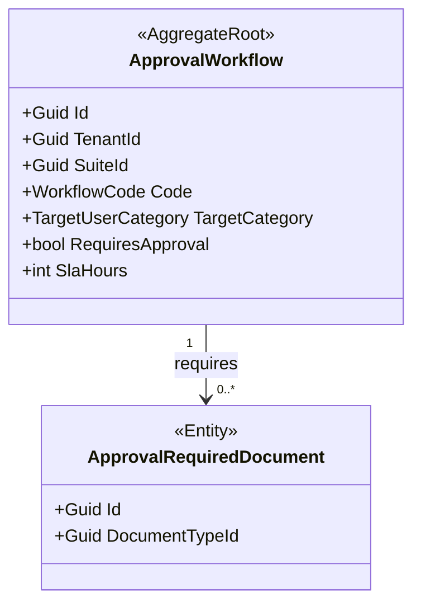
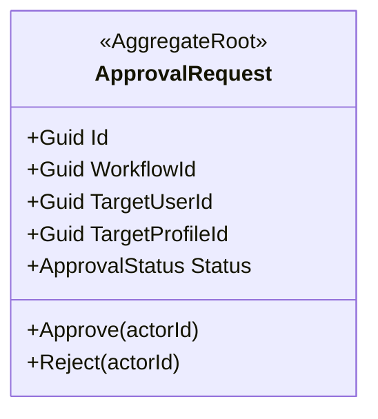
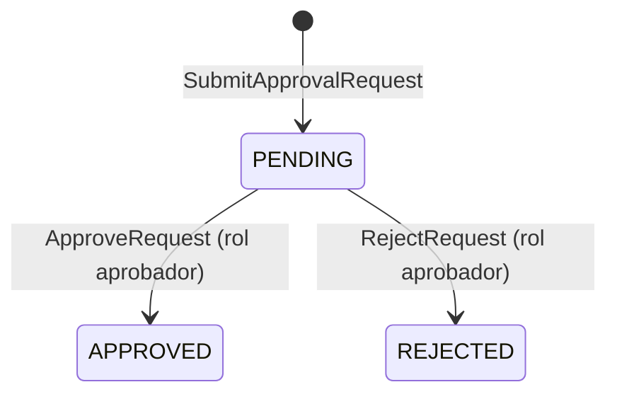

# BC-F — Approvals Context

> **Idioma:** Español | *Versión en inglés no disponible*

**Schema:** `[approvals]` | **Owner:** UMS Core API .NET 10  
> [!NOTE]
> En la implementación real de C# (base de código), los agregados de este contexto están consolidados junto con el contexto de Cumplimiento (Compliance) bajo el espacio de nombres unificado **Ums.Domain.Approvals**.

**Misión:** Orquestar flujos de aprobacion para: acceso B2B externo, validación de documentos, solicitud de acceso a perfil y promoción de roles. Punto de control central para decisiones de autorización multi-paso.  
**FS cubiertos:** FS-10, FS-11, FS-12, FS-23, FS-24  
**Versión:** 2.0 | **Fecha:** 2026-05-15

> **Arquitectura de Agregados:** Modelo completo con diagramas, secuencias, ER y API:
> [ApprovalWorkflow](../../../domain/approvals/approval-workflow.md) · [ApprovalRequest](../../../domain/approvals/approval-request.md)

---

## Agregados

| Agregado | Raiz | Descripción |
|---------|------|-------------|
| [ApprovalWorkflow](#aggregate-approvalworkflow) | `ApprovalWorkflow` | Configuración de routing y reglas del flujo |
| [ApprovalRequest](#aggregate-approvalrequest) | `ApprovalRequest` | Solicitud con estado, historial y SLA |
| [NotificationRule](#aggregate-notificationrule) | `NotificationRule` | Regla independiente de notificación reutilizable |

---

## Aggregate: ApprovalWorkflow

**Aggregate Root:** `ApprovalWorkflow`

### Entidades

| Entidad | Descripción |
|---------|-------------|
| `ApprovalWorkflow` (AR) | Define reglas de routing, pasos requeridos y roles aprobadores |
| `ApprovalRequiredDocument` | Tipos de documentos obligatorios vinculados al workflow |

### Value Objects

| Value Object | Tipo | Regla |
|-------------|------|-------|
| `WorkflowCode` | string | Único por `(TenantId, SuiteId, TargetUserCategory)` |
| `TargetUserCategory` | enum | Categoria de usuario a la que aplica |
| `RequiresApproval` | bool | `false` = flujo automatico sin intervencion humana |
| `SlaHours` | int | Tiempo limite para decisión; vence en `EXPIRED` |

### Invariantes

| ID | Regla | Fuente |
|----|-------|--------|
| INV-AW1 | `RequiresApproval=true` requiere al menos un rol aprobador configurado | ADR-0044 |
| INV-AW2 | `WorkflowCode` único por scope `(TenantId, SuiteId, TargetUserCategory)` | ADR-0044 |
| INV-AW3 | Modificacion de workflow no afecta `ApprovalRequest PENDING` activas | ADR-0044 |

### Diagrama del Agregado



### Comandos y Eventos

```
ConfigureWorkflowCommand       -> WorkflowConfiguredEvent        { workflowId, tenantId, targetCategory }
AddRequiredDocumentCommand     -> RequiredDocumentAddedEvent     { workflowId, documentTypeId }
RemoveRequiredDocumentCommand  -> RequiredDocumentRemovedEvent   { workflowId, documentTypeId }
```

---

## Aggregate: NotificationRule

**Aggregate Root:** `NotificationRule`

`NotificationRule` es un Aggregate Root independiente que define el canal, la ventana temporal y la audiencia de una notificación. No es una entidad hija de `DocumentType`; puede reutilizarse y evolucionar sin acoplar su ciclo de vida al catálogo documental.

- `DocumentType` puede referenciar `NotificationRule` por identificador.
- `DocumentType` no administra el ciclo de vida de `NotificationRule`.

---

## Aggregate: ApprovalRequest

**Aggregate Root:** `ApprovalRequest`  
**FS:** FS-10, FS-12, FS-23, FS-24

### Entidades

| Entidad | Descripción |
|---------|-------------|
| `ApprovalRequest` (AR) | Solicitud con estado para aprobaciones operativas |

### Value Objects

| Value Object | Tipo | Regla |
|-------------|------|-------|
| `ApprovalStatus` | enum | Implementado: `Pending / Approved / Rejected` |
| `WorkflowId` | Guid | Enlaza con `ApprovalWorkflow` |
| `TargetUserId` | Guid | Usuario objetivo de la solicitud |
| `TargetProfileId` | Guid? | Perfil objetivo opcional |
| `AuditValueObject` | value object | Metadata de creacion y actualizacion |

### Invariantes

| ID | Regla | Fuente |
|----|-------|--------|
| INV-AR1 | Solo solicitudes `Pending` pueden recibir acciones de decision | glossary.md |
| INV-AR2 | `Approved` y `Rejected` son estados terminales implementados | glossary.md |
| INV-AR3 | Accion de aprobacion solo ejecutable por usuario con rol aprobador configurado en el workflow | ADR-0044 |
| INV-AR4 | Para FS-23/FS-24, `Rejected` se expone como resultado de negocio `Denied` | ADR-0075 |
| INV-AR5 | Profile marcado `INTERNAL_ONLY` no puede ser el objetivo de una solicitud `ONBOARDING` external | FS-10 |

### Diagrama del Agregado



### Máquina de Estado: ApprovalRequest

> **Visualización:** [interactive-ddd-viewer.html](./interactive-ddd-viewer.html) — sección "ApprovalRequest"



> En EP-09, `REJECTED` se traduce como `Denied` para usuarios y auditores de onboarding. El almacenamiento actual conserva el valor implementado `Rejected`.

### Comandos

| Comando | Descripción |
|---------|-------------|
| `SubmitApprovalRequestCommand` | Crea solicitud de aprobacion con tipo, objetivo y justificacion |
| `ApproveRequestCommand` | Aprueba la solicitud con razon; desencadena provisioning |
| `RejectRequestCommand` | Rechaza la solicitud; en onboarding se presenta como denegacion |

### Eventos de Dominio

```
ApprovalRequestSubmittedEvent { requestId, workflowId, targetUserId, targetProfileId?, requestType }
ApprovalRequestApprovedEvent  { requestId, decision, approvedBy, reason }
ApprovalRequestRejectedEvent  { requestId, rejectionReason, rejectedBy }
```

### Estado EP-09

El modelo implementado ya persiste `RequestedSystemId`, `RequestedBranchId`, `RequestedRoleId`, `Justification`, `GrantedRoleId` y `DecisionReason` para solicitudes de perfil. FS-23 y FS-24 quedan cubiertas por el contrato del agregado; solo quedaria una extension adicional si el diseno futuro exige persistir un resultado final de notificacion como dato propio.

---

**[Anterior: Audit Context](./06-audit-context.md)** | **[Índice DDD](./index.md)** | **[Siguiente: IGA Context](./08-iga-context.md)**
