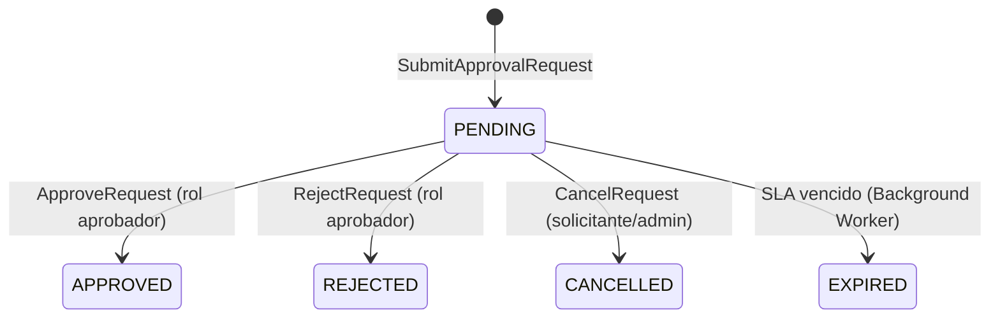

# BC-F — Approvals Context

**Schema:** `[ums_approval]` | **Owner:** UMS Core API .NET 8  
> [!NOTE]
> En la implementación real de C# (base de código), los agregados de este contexto están consolidados junto con el contexto de Cumplimiento (Compliance) bajo el espacio de nombres unificado **[Ums.Domain.Approvals](file:///d:/Users/aarroyo/personal/sources/ums/src/apps/app-api-dotnet/Ums.Domain/Approvals/)**.

**Mision:** Orquestar flujos de aprobacion para: acceso B2B externo, validacion de documentos y promocion de roles. Punto de control central para decisiones de autorizacion multi-paso.  
**FS cubiertos:** FS-10, FS-12, FS-11 (validacion documental)  
**Version:** 2.0 | **Fecha:** 2026-05-15

---

## Agregados

| Agregado | Raiz | Descripcion |
|---------|------|-------------|
| [ApprovalWorkflow](#aggregate-approvalworkflow) | `ApprovalWorkflow` | Configuracion de routing y reglas del flujo |
| [ApprovalRequest](#aggregate-approvalrequest) | `ApprovalRequest` | Solicitud con estado, historial y SLA |

---

## Aggregate: ApprovalWorkflow

**Aggregate Root:** `ApprovalWorkflow`

### Entidades

| Entidad | Descripcion |
|---------|-------------|
| `ApprovalWorkflow` (AR) | Define reglas de routing, pasos requeridos y roles aprobadores |
| `ApprovalRequiredDocument` | Tipos de documentos obligatorios vinculados al workflow |

### Value Objects

| Value Object | Tipo | Regla |
|-------------|------|-------|
| `WorkflowCode` | string | Unico por `(TenantId, SuiteId, TargetUserCategory)` |
| `TargetUserCategory` | enum | Categoria de usuario a la que aplica |
| `RequiresApproval` | bool | `false` = flujo automatico sin intervencion humana |
| `SlaHours` | int | Tiempo limite para decision; vence en `EXPIRED` |

### Invariantes

| ID | Regla | Fuente |
|----|-------|--------|
| INV-AW1 | `RequiresApproval=true` requiere al menos un rol aprobador configurado | ADR-0044 |
| INV-AW2 | `WorkflowCode` unico por scope `(TenantId, SuiteId, TargetUserCategory)` | ADR-0044 |
| INV-AW3 | Modificacion de workflow no afecta `ApprovalRequest PENDING` activas | ADR-0044 |

### Comandos y Eventos

```
ConfigureWorkflowCommand       -> WorkflowConfiguredEvent        { workflowId, tenantId, targetCategory }
AddRequiredDocumentCommand     -> RequiredDocumentAddedEvent     { workflowId, documentTypeId }
RemoveRequiredDocumentCommand  -> RequiredDocumentRemovedEvent   { workflowId, documentTypeId }
```

---

## Aggregate: ApprovalRequest

**Aggregate Root:** `ApprovalRequest`  
**FS:** FS-10, FS-12

### Entidades

| Entidad | Descripcion |
|---------|-------------|
| `ApprovalRequest` (AR) | Solicitud con estado y evidencia adjunta |
| `ApprovalLog` | Registro inmutable de cada decision tomada |

### Value Objects

| Value Object | Tipo | Regla |
|-------------|------|-------|
| `RequestStatus` | enum | `PENDING / APPROVED / REJECTED / CANCELLED / EXPIRED` |
| `RequestType` | enum | `ONBOARDING / PROFILE_ASSIGNMENT / ROLE_PROMOTION / DOCUMENT_VALIDATION` |
| `ApprovalActionTaken` | enum | `APPROVED / REJECTED / ESCALATED / DELEGATED / COMMENTED` |
| `SlaDeadline` | DateTimeOffset | Calculado en creacion; vence `PENDING -> EXPIRED` |
| `Justification` | string | Razon de negocio; obligatorio para `ONBOARDING` y `PROFILE_ASSIGNMENT` |

### Invariantes

| ID | Regla | Fuente |
|----|-------|--------|
| INV-AR1 | Solo solicitudes `PENDING` pueden recibir acciones de decision | glossary.md |
| INV-AR2 | `APPROVED` y `REJECTED` son estados terminales | glossary.md |
| INV-AR3 | Accion de aprobacion solo ejecutable por usuario con rol aprobador configurado en el workflow | ADR-0044 |
| INV-AR4 | Entradas del `ApprovalLog` son inmutables una vez escritas | ADR-0044 |
| INV-AR5 | `EXPIRED` lo ejecuta Background Worker, no una accion humana | glossary.md |
| INV-AR6 | `CANCELLED` solo por solicitante original o admin del tenant | FS-10 |
| INV-AR7 | Profile marcado `INTERNAL_ONLY` no puede ser el objetivo de una solicitud `ONBOARDING` external | FS-10 |

### Maquina de Estado: ApprovalRequest

> **Visualizacion:** [interactive-ddd-viewer.html](./interactive-ddd-viewer.html) — seccion "ApprovalRequest"



### Comandos

| Comando | Descripcion |
|---------|-------------|
| `SubmitApprovalRequestCommand` | Crea solicitud de aprobacion con tipo, objetivo y justificacion |
| `ApproveRequestCommand` | Aprueba la solicitud con razon; desencadena provisioning |
| `RejectRequestCommand` | Rechaza la solicitud con razon |
| `CancelRequestCommand` | Cancela la solicitud |
| `ExpireRequestCommand` | Vence la solicitud por timeout SLA (comando interno de background) |

### Eventos de Dominio

```
ApprovalRequestSubmittedEvent { requestId, workflowId, targetUserId, targetProfileId?, requestType }
ApprovalRequestApprovedEvent  { requestId, decision, approvedBy, reason }
ApprovalRequestRejectedEvent  { requestId, rejectionReason, rejectedBy }
ApprovalRequestCancelledEvent { requestId, cancelledBy }
ApprovalRequestExpiredEvent   { requestId, workflowId, targetUserId }
```

---

**[Anterior: Audit Context](./06-audit-context.md)** | **[Indice DDD](./index.md)** | **[Siguiente: IGA Context](./08-iga-context.md)**
