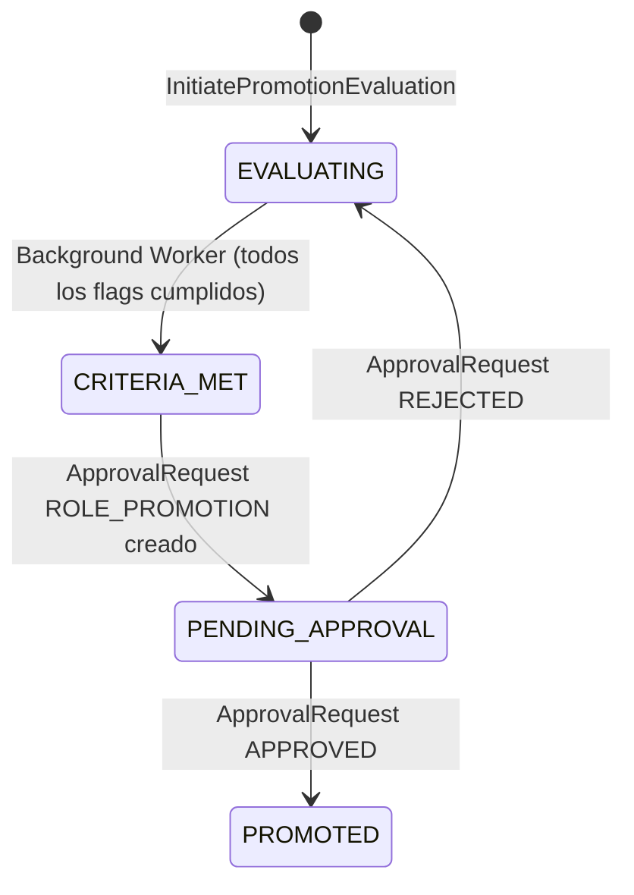

# BC-H — IGA Context

**Schema:** `[ums_iga]` | **Owner:** UMS Core API .NET 8  
**Mision:** Gobernar el ciclo de vida de evolucion de roles, procesos de promocion y administracion delegada de usuarios.  
**FS cubiertos:** FS-12, FS-14  
**Version:** 2.0 | **Fecha:** 2026-05-15

---

## Agregados

| Agregado | Raiz | Descripcion |
|---------|------|-------------|
| [RolePromotionCriteria](#aggregate-rolepromotionscriteria) | `RolePromotionCriteria` | Criterios y flags de promocion entre roles |
| [UserPromotionProcess](#aggregate-userpromotionprocess) | `UserPromotionProcess` | Proceso activo de evaluacion para un usuario |
| [UserManagementDelegation](#aggregate-usermanagementdelegation) | `UserManagementDelegation` | Delegacion de capacidades de administracion |

---

## Aggregate: RolePromotionCriteria

**Aggregate Root:** `RolePromotionCriteria`  
**FS:** FS-12

### Value Objects

| Value Object | Tipo | Regla |
|-------------|------|-------|
| `CriteriaFlags` | record | `(FlagSeniority, FlagCompliance, FlagBusinessScore, FlagManualApproval)`; al menos uno activo |
| `MinimumDaysInRole` | int | Umbral de antiguedad si `FlagSeniority=true` |
| `MandatoryDocuments` | Guid[] | IDs de DocumentType requeridos validos si `FlagCompliance=true` |

### Invariantes

| ID | Regla | Fuente |
|----|-------|--------|
| INV-RPC1 | `SourceRoleId` y `TargetRoleId` deben pertenecer al mismo `SuiteId` | ADR-0046 |
| INV-RPC2 | `TargetRole.HierarchyLevel > SourceRole.HierarchyLevel` | ADR-0046 |
| INV-RPC3 | `TargetRole.PromotionOrder = SourceRole.PromotionOrder + 1`; no saltos | ADR-0046 |
| INV-RPC4 | Al menos una flag activa | ADR-0046 |

### Comandos y Eventos

```
DefinePromotionCriteriaCommand  -> PromotionCriteriaDefinedEvent  { criteriaId, sourceRoleId, targetRoleId }
UpdateCriteriaFlagsCommand      -> PromotionCriteriaUpdatedEvent  { criteriaId }
```

---

## Aggregate: UserPromotionProcess

**Aggregate Root:** `UserPromotionProcess`  
**FS:** FS-12

### Value Objects

| Value Object | Tipo | Regla |
|-------------|------|-------|
| `PromotionStatus` | enum | `EVALUATING / CRITERIA_MET / PENDING_APPROVAL / PROMOTED` |

### Invariantes

| ID | Regla | Fuente |
|----|-------|--------|
| INV-UPP1 | Solo un proceso activo (`EVALUATING` o `CRITERIA_MET`) por `(userId, targetRoleId)` | ADR-0046 |
| INV-UPP2 | `PROMOTED` es terminal | ADR-0046 |
| INV-UPP3 | `CRITERIA_MET -> PENDING_APPROVAL` es automatico; crea `ApprovalRequest ROLE_PROMOTION` | ADR-0046 |
| INV-UPP4 | Rechazo de la `ApprovalRequest` retorna proceso a `EVALUATING` | glossary.md |
| INV-UPP5 | Documentos obligatorios expirados bloquean la transicion `EVALUATING -> CRITERIA_MET` | FS-12 |

### Maquina de Estado: UserPromotionProcess

> **Visualizacion:** [interactive-ddd-viewer.html](./interactive-ddd-viewer.html) — seccion "UserPromotionProcess"



### Comandos y Eventos

```
InitiatePromotionEvaluationCommand -> PromotionEvaluationStartedEvent { processId, userId, targetRoleId }
MarkCriteriaMetCommand             -> PromotionCriteriaMetEvent        { processId, userId, targetRoleId }
CompletePromotionCommand           -> PromotionApprovedEvent           { processId, userId, fromRoleId, toRoleId, approvedBy }
RejectPromotionCommand             -> PromotionRejectedEvent           { processId, userId, targetRoleId, reason }
```

---

## Aggregate: UserManagementDelegation

**Aggregate Root:** `UserManagementDelegation`  
**FS:** FS-14

### Value Objects

| Value Object | Tipo | Regla |
|-------------|------|-------|
| `DelegationScope` | record | `(suiteId?: Guid, tenantId: Guid)`; scope de sistemas administrables |
| `TemporalScope` | record | `(startDate: Date, endDate?: Date)`; ventana temporal |
| `DelegationStatus` | enum | `ACTIVE / REVOKED / EXPIRED` |
| `AllowedActions` | string[] | Acciones delegadas: `CREATE / UPDATE / BLOCK / ASSIGN_PROFILE` |

### Invariantes

| ID | Regla | Fuente |
|----|-------|--------|
| INV-D1 | Admin no puede delegar permisos que el mismo no posee — Invariante I3 ADR-0036 | ADR-0044, ADR-0036 |
| INV-D2 | No auto-delegacion | ADR-0036 |
| INV-D3 | No delegacion circular (A delega a B, B no puede delegar a A) | FS-14 |
| INV-D4 | Revocacion en cascada: revocar delegacion padre invalida todas las hijas — Invariante I5 ADR-0036 | ADR-0036 |
| INV-D5 | `SuiteId` presente = delegacion restringida a ese sistema | ADR-0044 |

### Comandos y Eventos

```
CreateDelegationCommand   -> DelegationCreatedEvent  { delegationId, delegatingAdmin, receivingAdmin, scope }
RevokeDelegationCommand   -> DelegationRevokedEvent  { delegationId, revokedBy, cascadeCount }
ExtendDelegationCommand   -> DelegationExtendedEvent { delegationId, newEndDate }
DelegationExpiredEvent    (emitido por Background Worker cuando endDate < now)
```

---

**[Anterior: Approvals Context](./07-approvals-context.md)** | **[Indice DDD](./index.md)** | **[Siguiente: Compliance Context](./09-compliance-context.md)**
