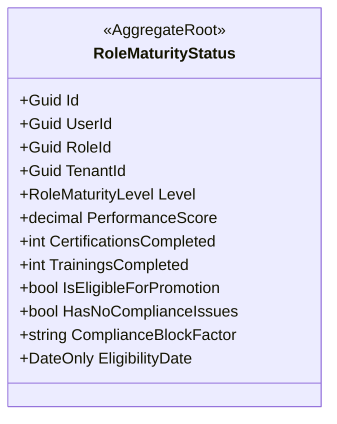
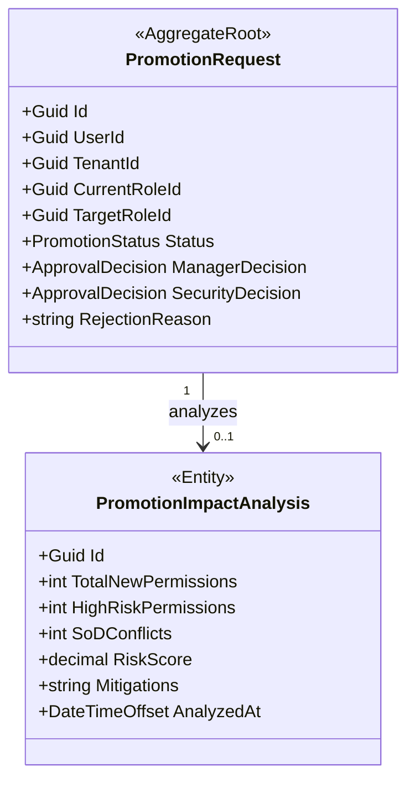
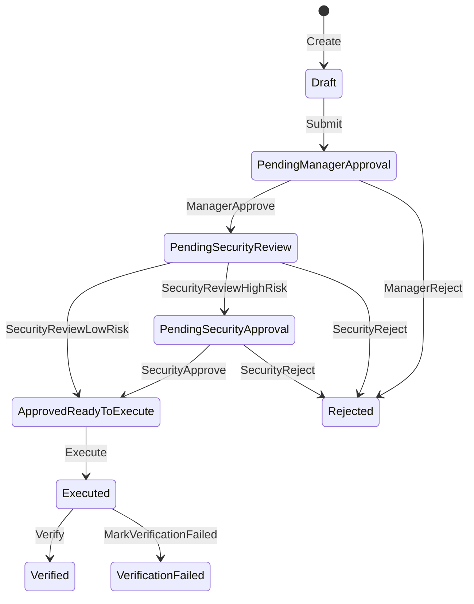

# BC-H — IGA Context

> **Idioma:** Español | *Versión en inglés no disponible*

**Schema:** `[ums_iga]` | **Owner:** UMS Core API .NET 8  
**Misión:** Gobernar el ciclo de vida de evolución de roles, procesos de promoción y seguimiento del nivel de madurez técnica y operativa de los usuarios dentro de la organización.  
**FS cubiertos:** FS-12, FS-14  
**Versión:** 3.0 | **Fecha:** 2026-05-18

> **Arquitectura de Agregados:** Modelo completo con diagramas, secuencias, ER y API:
> [PromotionRequest](../../../domain/iga/promotion-request.md) · [RoleMaturityStatus](../../../domain/iga/role-maturity-status.md)

---

## Agregados

| Agregado | Raiz | Descripción |
|---------|------|-------------|
| [RoleMaturityStatus](#aggregate-rolematuritystatus) | `RoleMaturityStatus` | Control de nivel de madurez técnica, certificaciones y elegibilidad del usuario |
| [PromotionRequest](#aggregate-promotionrequest) | `PromotionRequest` | Workflow transaccional y análisis de impacto para la promoción de un usuario |

---

## Aggregate: RoleMaturityStatus

**Aggregate Root:** `RoleMaturityStatus`  
**FS:** FS-12

Representa la madurez y nivel técnico actual de un usuario asignado a un rol específico dentro de un tenant. Monitorea su progreso operativo y determina de forma automática si cumple con las directrices mínimas para postular a una promoción.

### Value Objects & Enums

| Tipo | Nombre | Regla / Valores |
|------|--------|-----------------|
| `enum` | `RoleMaturityLevel` | `Junior / Intermediate / Senior / Lead / Principal` |
| `decimal` | `PerformanceScore` | Puntuación de desempeño obligatoria entre `0.0` y `5.0` |

### Invariantes

| ID | Regla | Fuente |
|----|-------|--------|
| INV-RMS1 | **Score Rango Valido:** La puntuación de desempeño (`PerformanceScore`) debe ser mayor o igual a `0.0` y menor o igual a `5.0`. | RoleMaturityStatus.cs |
| INV-RMS2 | **Elegibilidad por Nivel:** Un usuario solo puede ser elegible para promoción si cumple con el tiempo mínimo de permanencia en su nivel actual:   - *Junior:* Mínimo 6 meses.   - *Intermediate:* Mínimo 12 meses.   - *Senior:* Mínimo 18 meses.   - *Lead:* Mínimo 24 meses.   - *Principal:* Sin elegibilidad de promoción adicional. | RoleMaturityStatus.cs |
| INV-RMS3 | **Sin Bloqueos de Cumplimiento:** Cualquier problema de cumplimiento activo (`HasNoComplianceIssues = false`) bloquea inmediatamente la elegibilidad. | RoleMaturityStatus.cs |
| INV-RMS4 | **Score Mínimo:** Se requiere un `PerformanceScore >= 3.0` para calificar como elegible. | RoleMaturityStatus.cs |

### Diagrama del Agregado

### Comandos y Operaciones

| Comando / Método | Descripción |
|------------------|-------------|
| `Create` | Registra el estado inicial de madurez de un usuario para un rol dado. |
| `UpdateMaturityLevel` | Actualiza al nuevo nivel alcanzado, calcula el siguiente nivel elegible y reinicia la fecha de elegibilidad. |
| `RecordCertificationCompletion` | Incrementa la cuenta de certificaciones completadas exitosamente. |
| `RecordTrainingCompletion` | Incrementa la cuenta de capacitaciones/cursos tomados por el usuario. |
| `UpdatePerformanceScore` | Actualiza la puntuación de desempeño (valida que esté entre 0 y 5). |
| `MarkComplianceIssue` | Marca un problema de cumplimiento activo detallando el factor de bloqueo. |
| `ResolveComplianceIssue` | Resuelve y limpia el bloqueo de cumplimiento previo. |
| `ReviewEligibility` | Evalúa si el usuario cumple con las invariantes (tiempo, score, compliance) y establece la fecha de elegibilidad. |

---

## Aggregate: PromotionRequest

**Aggregate Root:** `PromotionRequest`  
**FS:** FS-12

Representa la solicitud de promoción de rol activa de un usuario. Gestióna la orquestación y aprobación de dos fases (Aprobación de Manager Directo y Revisión del Oficial de Seguridad) e integra un análisis de riesgo e impacto sobre la matriz de accesos.

### Entidades Hijas

| Entidad | Descripción |
|---------|-------------|
| `PromotionImpactAnalysis` | Registro del análisis de riesgo realizado por seguridad, detallando métricas de permisos y mitigaciones. |

### Value Objects & Enums

| Tipo | Nombre | Regla / Valores |
|------|--------|-----------------|
| `enum` | `PromotionStatus` | `Draft / PendingManagerApproval / PendingSecurityReview / PendingSecurityApproval / ApprovedReadyToExecute / Executed / Verified / Rejected / VerificationFailed` |
| `enum` | `ApprovalDecisión` | `None / Approved / Rejected` |

### Invariantes

| ID | Regla | Fuente |
|----|-------|--------|
| INV-PR1 | **Transición Única de Borrador:** El envío (`Submit`) solo se puede realizar si el estado actual es exactamente `Draft`. | PromotionRequest.cs |
| INV-PR2 | **Aprobación de Manager Requerida:** Las acciones del Manager (Aprobar/Rechazar) requieren que la solicitud esté en `PendingManagerApproval`. | PromotionRequest.cs |
| INV-PR3 | **Evaluación de Seguridad Requerida:** Las acciones del Oficial de Seguridad requieren que el estado sea `PendingSecurityReview` o `PendingSecurityApproval` según el nivel de riesgo analizado. | PromotionRequest.cs |
| INV-PR4 | **Límite de Análisis:** Solo se permite registrar un único reporte de análisis de impacto (`PromotionImpactAnalysis`) por solicitud de promoción. | PromotionRequest.cs |

### Diagrama del Agregado

### Máquina de Estados: PromotionRequest

### Comandos y Operaciones

| Comando / Método | Descripción |
|------------------|-------------|
| `Create` | Crea una nueva solicitud en estado `Draft`. |
| `Submit` | Presenta la solicitud de promoción para aprobación del manager. |
| `ManagerApprove` | Aprueba la solicitud por parte de su manager y la pasa a revisión de seguridad. |
| `ManagerReject` | Rechaza la solicitud por el manager directo (estado terminal `Rejected`). |
| `SecurityReviewLowRisk` | Determina que el perfil no genera impacto crítico, marcándola aprobada y lista para ejecutar. |
| `SecurityReviewHighRisk` | Identifica riesgos en la matriz y eleva la solicitud al estado `PendingSecurityApproval` para evaluación formal. |
| `SecurityApprove` | Concede aprobación oficial del oficial de seguridad tras el análisis minucioso. |
| `SecurityReject` | Rechaza la solicitud por motivos de seguridad (estado terminal `Rejected`). |
| `Execute` | Aplica físicamente el cambio de rol en el sistema (estado `Executed`). |
| `Verify` | Confirma la validez y correcta aplicación del rol en producción (estado terminal `Verified`). |
| `MarkVerificationFailed` | Registra que el rol no fue aplicado correctamente tras la auditoría en vivo (estado `VerificationFailed`). |
| `AddImpactAnalysis` | Inserta el reporte `PromotionImpactAnalysis` asociando puntaje de riesgo y mitigaciones propuestas. |

---

**[Anterior: Approvals Context](./07-approvals-context.md)** | **[Índice DDD](./index.md)** | **[Siguiente: Compliance Context](./09-compliance-context.md)**
