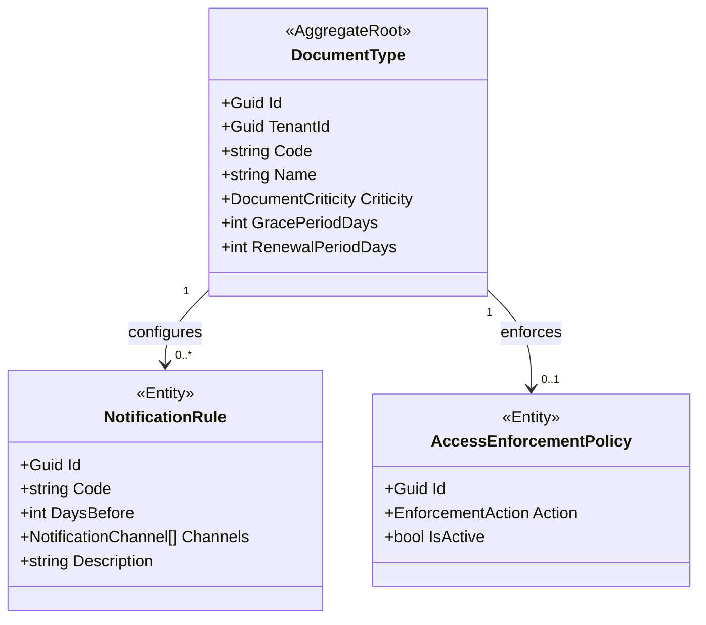
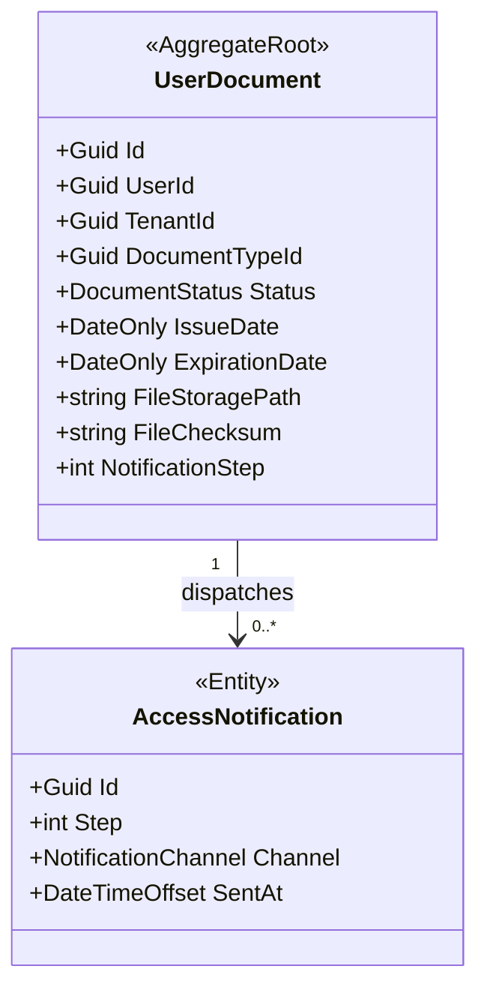
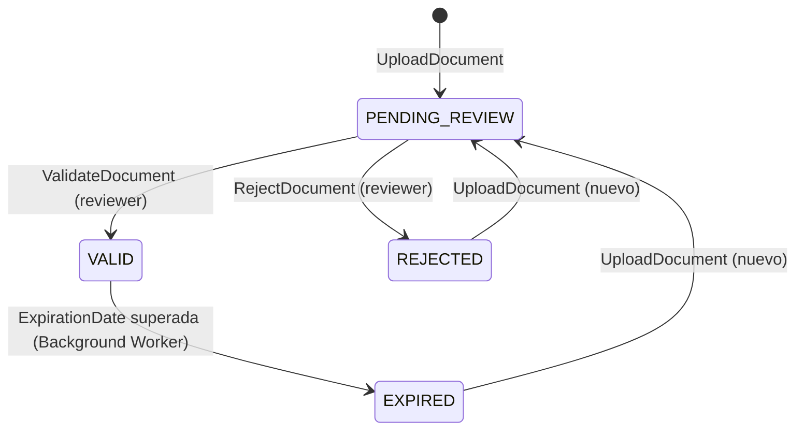

# BC-I — Compliance Context

> **Idioma:** Español | *Versión en inglés no disponible*

**Schema:** `[ums_compliance]` | **Owner:** UMS Core API .NET 8  
> [!NOTE]
> En la implementación real de C# (base de código), los agregados de este contexto están consolidados junto con el contexto de Aprobaciones bajo el espacio de nombres unificado **Ums.Domain.Approvals**.

**Misión:** Hacer cumplir políticas de acceso basadas en documentos. Gestionar ciclo de vida documental, evaluar expiración, despachar notificaciones y ejecutar enforcement automatizado.  
**FS cubiertos:** FS-11, FS-15, FS-16  
**Versión:** 2.0 | **Fecha:** 2026-05-15

> **Arquitectura de Agregados:** Modelo completo con diagramas, secuencias, ER y API:
> [DocumentType](../../../domain/approvals/document-type.md) · [UserDocument](../../../domain/approvals/user-document.md)

---

## Agregados

| Agregado | Raiz | Descripción |
|---------|------|-------------|
| [DocumentType](#aggregate-documenttype) | `DocumentType` | Catalogo de tipos de documento con reglas y políticas |
| [UserDocument](#aggregate-userdocument) | `UserDocument` | Instancia de documento de un usuario con su estado |

---

## Aggregate: DocumentType

**Aggregate Root:** `DocumentType`  
**FS:** FS-11, FS-15, FS-16

### Entidades

| Entidad | Descripción |
|---------|-------------|
| `DocumentType` (AR) | Catalogo de tipos de documento; define criticidad y reglas |
| `NotificationRule` | Alerta N-step pre-expiración configurable por canal |
| `AccessEnforcementPolicy` | Accion automatica ejecutada al vencer el documento |

### Value Objects

| Value Object | Tipo | Regla |
|-------------|------|-------|
| `DocumentCriticity` | enum | `LOW / MEDIUM / HIGH / CRITICAL` |
| `NotificationChannel` | enum | `EMAIL / SMS / IN_APP / WEBHOOK` |
| `EnforcementAction` | enum | `BLOCK_ACCESS / NOTIFY_ONLY / DOWNGRADE_ROLE / SUSPEND` |
| `DaysBefore` | int | > 0; dias antes del vencimiento para notificar |
| `GracePeriodDays` | int? | Dias de gracia post-expiración antes de enforcement |
| `RenewalPeriodDays` | int? | Dias de anticipacion para renovacíon |

### Invariantes

| ID | Regla | Fuente |
|----|-------|--------|
| INV-DT1 | `CRITICAL` debe tener al menos una `AccessEnforcementPolicy` configurada | ADR-0045, FS-16 |
| INV-DT2 | `NotificationRule.DaysBefore` valores únicos y descendentes por tipo | ADR-0045, FS-15 |
| INV-DT3 | Solo una `AccessEnforcementPolicy` activa por `(DocumentTypeId, TenantId)` | FS-16 |
| INV-DT4 | Documentos no-criticos no pueden tener política `BLOCK_ACCESS` o `DOWNGRADE_ROLE` | FS-16 |
| INV-DT5 | `NotificationRule` requiere `Code, Value (DaysBefore), Description` obligatorios | FS-15, database-design-er.md Regla 9 |

### Diagrama del Agregado



### Comandos

| Comando | Descripción |
|---------|-------------|
| `RegisterDocumentTypeCommand` | Registra tipo de documento con criticidad |
| `ConfigureNotificationRuleCommand` | Agrega regla de notificación (FS-15) |
| `RemoveNotificationRuleCommand` | Elimina regla de notificación |
| `DefineEnforcementPolicyCommand` | Define política de enforcement (FS-16) |
| `UpdateEnforcementPolicyCommand` | Actualiza la política existente |

### Eventos de Dominio

```
DocumentTypeRegisteredEvent     { documentTypeId, criticity, tenantId }
NotificationRuleConfiguredEvent { ruleId, documentTypeId, daysBefore, channels }
EnforcementPolicyDefinedEvent   { policyId, documentTypeId, actionOnExpiration }
```

---

## Aggregate: UserDocument

**Aggregate Root:** `UserDocument`  
**FS:** FS-11, FS-15, FS-16

### Entidades

| Entidad | Descripción |
|---------|-------------|
| `UserDocument` (AR) | Documento especifico de un usuario con su estado de validez |
| `AccessNotification` | Registro de cada notificación despachada para este documento |

### Value Objects

| Value Object | Tipo | Regla |
|-------------|------|-------|
| `DocumentStatus` | enum | `PENDING_REVIEW / VALID / EXPIRED / REJECTED` |
| `IssueDate` | DateOnly | Fecha de emisión del documento |
| `ExpirationDate` | DateOnly | Debe ser > `IssueDate` |
| `FileStoragePath` | string | URI valida al almacenamiento de objetos |
| `FileChecksum` | string | Hash de integridad del archivo |
| `NotificationStep` | int | Ultimo paso de notificación ejecutado (0 = ninguno) |

### Invariantes

| ID | Regla | Fuente |
|----|-------|--------|
| INV-UD1 | `ExpirationDate > IssueDate` | FS-11 |
| INV-UD2 | `REJECTED` no puede transicionar a `VALID` directamente; requiere nuevo upload | ADR-0045 |
| INV-UD3 | Un documento `VALID` que supera `ExpirationDate` transiciona a `EXPIRED` por Background Worker | ADR-0045 |
| INV-UD4 | Solo un documento `VALID` activo por `(UserId, DocumentTypeId)` | ADR-0045 |
| INV-UD5 | `FileStoragePath` debe ser URI valida accesible via `IDocumentStoragePort` | técnico |

### Diagrama del Agregado



### Máquina de Estado: UserDocument

> **Visualización:** [interactive-ddd-viewer.html](./interactive-ddd-viewer.html) — sección "UserDocument"



### Comandos

| Comando | Descripción |
|---------|-------------|
| `UploadDocumentCommand` | Carga un nuevo documento con fechas y ubicacion de archivo |
| `ValidateDocumentCommand` | El reviewer valida el documento -> VALID |
| `RejectDocumentCommand` | El reviewer rechaza el documento con razon |
| `ExpireDocumentCommand` | Background Worker vence documentos con ExpirationDate pasada |
| `RecordNotificationSentCommand` | Registra que se envio la notificación N-step |

### Eventos de Dominio

```
DocumentUploadedEvent       { documentId, userId, documentTypeId, expirationDate }
DocumentValidatedEvent      { documentId, userId, validatedBy }
DocumentRejectedEvent       { documentId, userId, rejectionReason }
DocumentNearExpirationEvent { documentId, userId, documentTypeId, daysRemaining, step }
DocumentExpiredEvent        { documentId, userId, documentTypeId, criticity, enforcementAction }
EnforcementExecutedEvent    { documentId, userId, action, executedAt }
```

---

**[Anterior: IGA Context](./08-iga-context.md)** | **[Índice DDD](./index.md)** | **[Siguiente: Cross-Context Flows](./10-cross-context-flows.md)**
