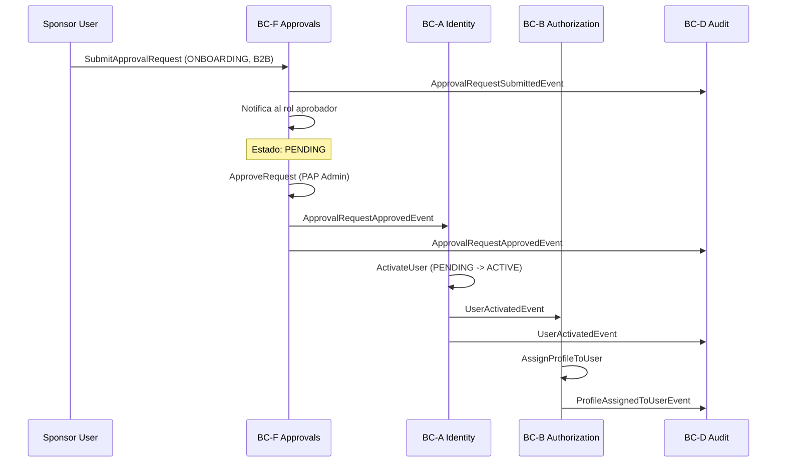
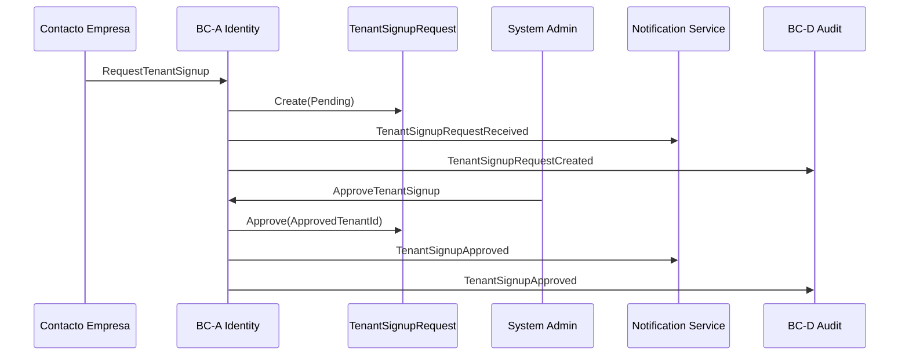
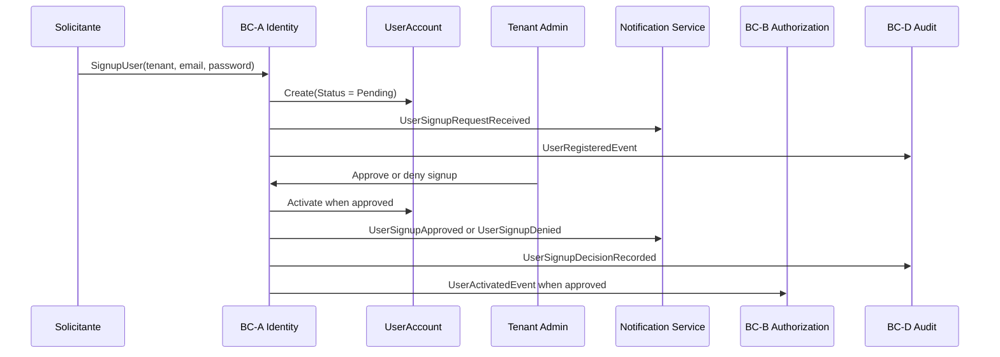
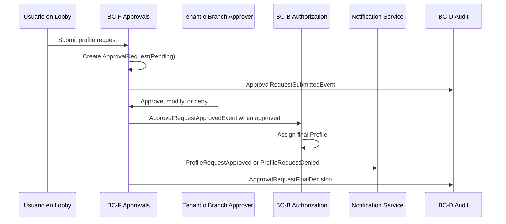
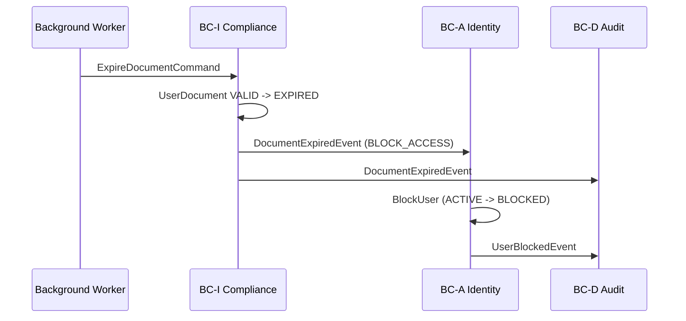
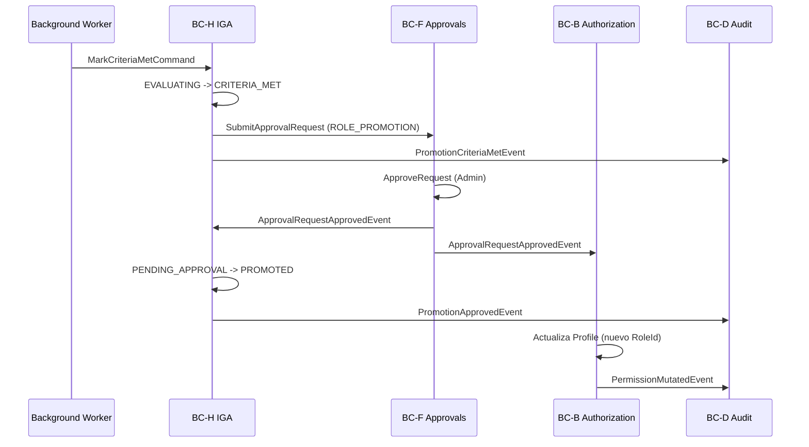

# Flujos de Eventos Cross-Contexto

**Tipo:** DDD — Inter-Context Event Flows  
**Version:** 2.1 | **Fecha:** 2026-06-01

> **Visualizacion interactiva:** [interactive-ddd-viewer.html](./interactive-ddd-viewer.html) — seccion "Flujos Cross-Contexto"

---

## Flujo 1: Onboarding de Usuario Externo B2B (FS-10)

---

## Flujo 1A: Alta Publica de Tenant (FS-21)

---

## Flujo 1B: Alta Publica de Usuario en Tenant Existente (FS-22)

> La denegacion de alta de usuario es resultado requerido por EP-09; el codigo actual implementa creacion pendiente y activacion, pero aun requiere comando dedicado de denegacion y metadata de decision.

---

## Flujo 1C: Solicitud y Decision de Perfil desde Lobby (FS-23, FS-24)

> El estado implementado `ApprovalStatus.Rejected` se traduce como resultado de negocio `Denied` en onboarding de perfiles.

---

## Flujo 2: Expiracion de Documento Critico (FS-16)

---

## Flujo 3: Promocion de Rol (FS-12)

---

## Tabla de Enrutamiento de Eventos

| Evento | Emisor | Receptor(es) | Accion del Receptor |
|--------|--------|-------------|---------------------|
| `UserRegisteredEvent` | Identity | IGA, Compliance, Approvals | Inicializar tracking |
| `UserActivatedEvent` | Identity | Authorization | Habilitar asignacion de Profiles |
| `UserBlockedEvent` | Identity | Authorization | Suspender Profiles activos |
| `DocumentExpiredEvent` | Compliance | Identity | Ejecutar `EnforcementAction` |
| `ApprovalRequestApprovedEvent` (ONBOARDING) | Approvals | Identity | Activar UserAccount |
| `ApprovalRequestApprovedEvent` (PROFILE_ASSIGNMENT) | Approvals | Authorization | Asignar Profile |
| `ApprovalRequestRejectedEvent` (PROFILE_ASSIGNMENT) | Approvals | Notification, Audit | Notificar denegacion de solicitud de perfil |
| `TenantSignupApproved` | Identity | Notification, Audit | Notificar aprobacion y registrar cierre global |
| `UserSignupApproved` | Identity | Notification, Authorization, Audit | Notificar al solicitante y habilitar lobby si no tiene Profile |
| `UserSignupDenied` | Identity | Notification, Audit | Notificar denegacion y cerrar solicitud |
| `ApprovalRequestApprovedEvent` (ROLE_PROMOTION) | Approvals | IGA, Authorization | Completar promotion + actualizar Profile |
| `PromotionApprovedEvent` | IGA | Authorization | Actualizar RoleId en Profile del usuario |
| `PermissionMutatedEvent` | Authorization | Cache | Invalidar `auth_graph:{userId}:*` |
| `AppConfigUpdatedEvent` | Configuration | Cache | Invalidar `cfg:*` para el scope |
| Todos | Todos | Audit | Appendear `AuditRecord` inmutable |

---

**[Anterior: Compliance Context](./09-compliance-context.md)** | **[Indice DDD](./index.md)** | **[Siguiente: DDD Primitives](./11-ddd-primitives.md)**
