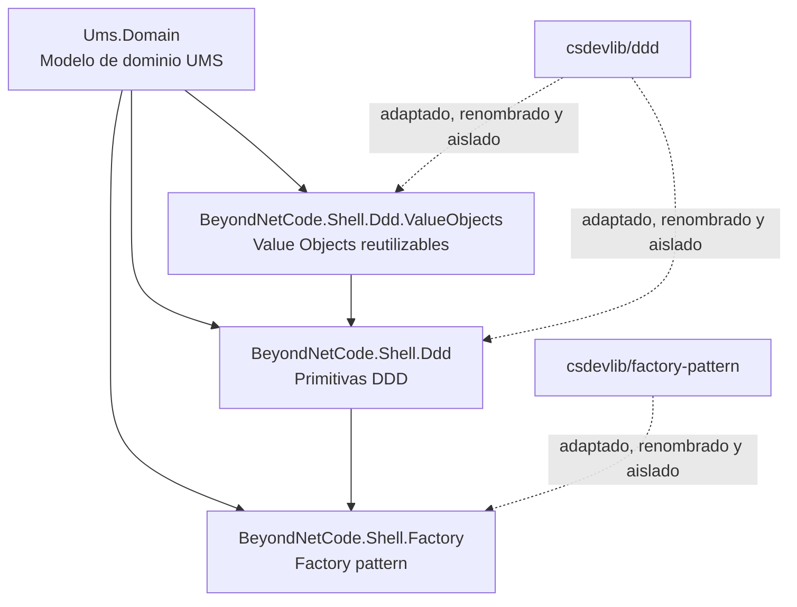

# Primitivas DDD del Proyecto

**Tipo:** DDD — C# Domain Primitives  
**Version:** 2.0 | **Fecha:** 2026-05-15  
**ADR de referencia:** ADR-0054 — Shell Library Isolation for DDD and Factory Patterns

---

## Decisión de Implementación

UMS implementa sus primitivas DDD mediante librerías shell propias bajo `src/libs/shell`. Estas librerías encapsulan patrones heredados y los exponen con namespace UMS, evitando que el dominio de producto dependa directamente de nombres o estructuras externas.

La regla vigente no es "no usar librerías". La regla vigente es:

> `Ums.Domain` puede depender de `BeyondNetCode.Shell.*`, pero no puede depender directamente de librerías externas, infraestructura, persistencia, brokers, frameworks web ni SDKs de proveedor.

## Herencia y Encapsulación



## Librerías Shell

| Librería | Rol funcional | Uso en UMS |
|----------|---------------|------------|
| `BeyondNetCode.Shell.Ddd` | Encapsula patrones DDD tácticos: entidad, agregado, eventos de dominio, validación, especificaciones y reglas base. | Base para modelar agregados y comportamiento de dominio. |
| `BeyondNetCode.Shell.Ddd.ValueObjects` | Centraliza patrones reutilizables de value objects. | Evita duplicación y asegura igualdad/validación consistente. |
| `BeyondNetCode.Shell.Factory` | Encapsula el patrón Factory y soporte de resolución/creación. | Usado por `BeyondNetCode.Shell.Ddd` y por dominio cuando se requiera creación controlada. |

## Clases Base Esperadas

```csharp
// Entity base con identidad y domain events
public abstract class Entity<TId>
{
    public TId Id { get; protected set; }
    private readonly List<IDomainEvent> _events = new();
    public IReadOnlyList<IDomainEvent> DomainEvents => _events.AsReadOnly();
    protected void Raise(IDomainEvent e) => _events.Add(e);
    public void ClearDomainEvents() => _events.Clear();
}

// Aggregate Root marca el limite de consistencia
public abstract class AggregateRoot<TId> : Entity<TId> { }

// Value Object: igualdad estructural, inmutabilidad
public abstract record ValueObject;

// Result pattern: sin excepciones en flujos de negocio
public readonly struct Result<T>
{
    public bool IsSuccess { get; }
    public T Value { get; }
    public string Error { get; }
    public static Result<T> Ok(T value) => new(true, value, null!);
    public static Result<T> Fail(string error) => new(false, default!, error);
}
```

---

## Contrato de Evento de Dominio

```csharp
public interface IDomainEvent
{
    Guid EventId { get; }
    DateTimeOffset OccurredAt { get; }
    string EventType { get; }
}
```

---

## Estructura del Monorepo

```
src/
  apps/
    app-api-dotnet/
      Ums.Domain/
        Identity/
          Aggregates/    <- Tenant.cs, UserAccount.cs, Branch.cs
          ValueObjects/  <- Email.cs, UserCategory.cs, TenantType.cs ...
          Events/        <- UserRegisteredEvent.cs, UserActivatedEvent.cs ...
          Repositories/  <- ITenantRepository.cs, IUserAccountRepository.cs
        Authorization/
          Aggregates/    <- SystemSuite.cs, Role.cs, PermissionTemplate.cs, Profile.cs
          ValueObjects/  <- ExclusiveArcTarget.cs, PermissionEffect.cs ...
          Events/        <- ProfileCreatedEvent.cs, PermissionMutatedEvent.cs ...
          Repositories/  <- IProfileRepository.cs, IRoleRepository.cs
        Configuration/
        Approvals/
        IGA/
        Compliance/
        Audit/
  libs/
    shell/
      ddd/
        src/
          BeyondNetCode.Shell.Ddd/
          BeyondNetCode.Shell.Ddd.ValueObjects/
      factory/
        src/
          BeyondNetCode.Shell.Factory/
```

Las carpetas de dominio por contexto se mantienen enfocadas en reglas de negocio. Las primitivas compartidas viven en `libs/shell` y se consumen por referencia de proyecto.

### Vista Conceptual del Dominio

```
Ums.Domain/
  Identity/
      Aggregates/    <- Tenant.cs, UserAccount.cs, Branch.cs
      ValueObjects/  <- Email.cs, UserCategory.cs, TenantType.cs ...
      Events/        <- UserRegisteredEvent.cs, UserActivatedEvent.cs ...
      Repositories/  <- ITenantRepository.cs, IUserAccountRepository.cs
  Authorization/
    Aggregates/    <- SystemSuite.cs, Role.cs, PermissionTemplate.cs, Profile.cs
    ValueObjects/  <- ExclusiveArcTarget.cs, PermissionEffect.cs ...
    Events/        <- ProfileCreatedEvent.cs, PermissionMutatedEvent.cs ...
    Repositories/  <- IProfileRepository.cs, IRoleRepository.cs
  Configuration/
  Approvals/
  IGA/
  Compliance/
  Audit/
```

---

## Reglas de Implementacion (ADR-0054)

| Regla | Detalle |
|-------|---------|
| Primitivas via shell | Entity, AggregateRoot, ValueObject, Result y patrones relacionados se consumen desde `BeyondNetCode.Shell.*` cuando aplique |
| Sin dependencia externa directa | `Ums.Domain` no puede depender directamente de paquetes o namespaces externos para patrones tácticos; debe pasar por `BeyondNetCode.Shell.*` |
| Namespace propio | No se permite `BeyondNet.*`, `csdevlib.*` u otro namespace heredado en código de aplicación UMS |
| Runtime único | API y shell libraries compilan sobre `net10.0` estable |
| Factory encapsulado | El uso de Factory pattern queda centralizado en `BeyondNetCode.Shell.Factory` y puede ser reutilizado por `BeyondNetCode.Shell.Ddd` |
| Value Objects son records | Igualdad estructural automatica via `record`; inmutabilidad via propiedades `init` |
| IDs como Guid | Todos los IDs son `Guid`; nunca `int` ni `string` en Aggregate Roots |
| Composite PK en persistencia | `(Id, RootTenantId)` en todas las tablas; mandatorio para RLS + particionado |

---

## Validación Técnica

La adopción de shell libraries exige que estas compilaciones pasen antes de promover cambios:

```bash
dotnet build src/apps/app-api-dotnet/Ums.Presentation/Ums.Presentation.csproj
dotnet build src/libs/shell/factory/src/BeyondNetCode.Shell.Factory.sln
dotnet build src/libs/shell/ddd/src/BeyondNetCode.Shell.Ddd/BeyondNetCode.Shell.Ddd.sln
```

---

**[Anterior: Cross-Context Flows](./10-cross-context-flows.md)** | **[Indice DDD](./index.md)** | **[Siguiente: Design Decisions](./12-design-decisions.md)**
