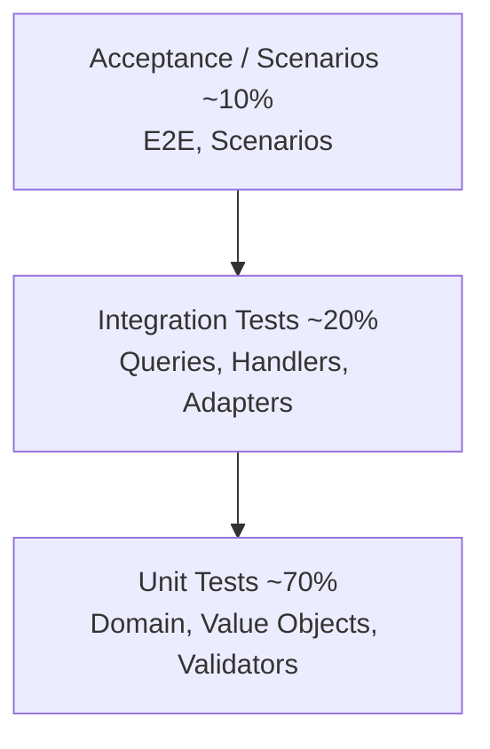
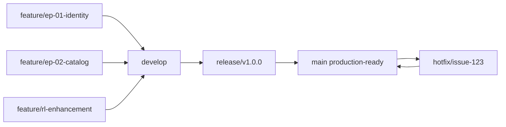

# Plan de Implementación de Servicios — UMS Sprint 1-2

**Fecha:** 2026-05-14
**Versión:** 1.0
**Estado:** Aprobado para Sprint 1
**Equipo Responsable:** Arquitecto Principal, Lead Backend (.NET)

---

## 1. Objetivo

Definir la estructura modular, organización de paquetes, estrategia de pruebas y configuración de CI/CD para implementar las 5 épicas MVP (EP-01 a EP-05) en .NET 8 con EF Core 8, SQL Server 2022 y DDD táctico.

---

## 2. Estrategia de Estructura Modular

### 2.1. Monorepo Layered Architecture (.NET)

```
ums/
├── src/
│ ├── Shared/
│ │ ├── UMS.Shared.Kernel/ # DDD primitives (ValueObject, AggregateRoot, etc.)
│ │ ├── UMS.Shared.Infrastructure/ # Cross-cutting concerns (logging, telemetry, exceptions)
│ │ ├── UMS.Shared.Ports/ # Ports abstractions (IRepository, ICache, IEventBus)
│ │ └── UMS.Shared.Adapters/ # Shared adapters (EF Core base classes, middleware)
│ │
│ ├── Contexts/
│ │ ├── Identity/
│ │ │ ├── UMS.Contexts.Identity.Domain/ # Domain Layer (Aggregates, ValueObjects, Events)
│ │ │ ├── UMS.Contexts.Identity.Application/ # Use Cases (Commands, Queries, Handlers)
│ │ │ ├── UMS.Contexts.Identity.Ports/ # Port abstractions (IIdentityRepository, ITokenService, etc.)
│ │ │ ├── UMS.Contexts.Identity.Adapters/ # Adapters (EF Core DbContext, API controllers, events)
│ │ │ └── UMS.Contexts.Identity.API/ # HTTP/gRPC endpoints (DTO contracts, routes)
│ │ │
│ │ ├── Authorization/
│ │ │ ├── UMS.Contexts.Authorization.Domain/
│ │ │ ├── UMS.Contexts.Authorization.Application/
│ │ │ ├── UMS.Contexts.Authorization.Ports/
│ │ │ ├── UMS.Contexts.Authorization.Adapters/
│ │ │ └── UMS.Contexts.Authorization.API/
│ │ │
│ │ ├── Configuration/
│ │ ├── Audit/
│ │ ├── Console/
│ │ ├── Approvals/ # NEW in Sprint 1
│ │ ├── IGA/ # NEW in Sprint 2 (Identity Governance & Administration)
│ │ └── Compliance/
│ │
│ ├── Infrastructure/
│ │ ├── UMS.Infrastructure.Persistence/ # EF Core DbContext, migrations, RLS configuration
│ │ ├── UMS.Infrastructure.Messaging/ # Event bus (in-memory for Sprint 1, AMQP later)
│ │ ├── UMS.Infrastructure.Caching/ # Redis integration (optional Sprint 1)
│ │ ├── UMS.Infrastructure.Security/ # RLS, SESSION_CONTEXT, encryption
│ │ └── UMS.Infrastructure.Observability/ # OpenTelemetry, Serilog
│ │
│ ├── Gateway/
│ │ ├── UMS.Gateway.API/ # API Gateway (.NET Minimal APIs)
│ │ └── UMS.Gateway.gRPC/ # gRPC gateway (future)
│ │
│ └── UMS.sln
│
├── tests/
│ ├── Unit/
│ │ ├── UMS.Contexts.Identity.Tests/
│ │ ├── UMS.Contexts.Authorization.Tests/
│ │ └── ...
│ │
│ ├── Integration/
│ │ ├── UMS.Contexts.Identity.IntegrationTests/
│ │ └── ...
│ │
│ └── E2E/
│ ├── UMS.API.E2ETests/
│ └── UMS.Scenarios.E2ETests/
│
├── infrastructure/
│ ├── docker-compose.yml # SQL Server 2022 + Redis (optional) + messaging
│ ├── kubernetes/ # K8s manifests (future)
│ └── sql-scripts/
│ ├── schema/ # DDL: tables, indexes, RLS policies
│ ├── migrations/ # EF Core migrations
│ └── seed/ # Reference data (tenant_types, roles)
│
└── .github/
 ├── workflows/
 │ ├── ci-pr.yml # Run on PR: build, lint, tests, SonarQube
 │ ├── cd-main.yml # Run on merge to main: build, publish, deploy-dev
 │ └── deploy-staging-prod.yml # Manual approval workflows
 │
 └── dependabot.yml # Automated dependency updates

```

### 2.2. Responsabilidades por Capa

| Capa | Responsabilidad | Dependencias | Ejemplos .NET |
|------|-----------------|--------------|---------------|
| **Domain** | Lógica de negocio pura, reglas de dominio | Ninguna (aislada) | `Tenant.cs`, `Policy.cs`, `UserRole.cs` |
| **Application** | Casos de uso, orquestación, validación | Domain | `CreateTenantCommandHandler.cs` |
| **Ports** | Abstracciones (interfaces) | Ninguna | `IRepository<T>`, `ITenantRepository` |
| **Adapters** | Implementaciones concretas (EF Core, Redis) | Ports, Infrastructure | `TenantEfCoreRepository.cs` |
| **API** | Endpoints HTTP/gRPC, DTOs | Application, Adapters | `TenantsController.cs`, `CreateTenantRequest.cs` |
| **Infrastructure** | Servicios compartidos | Domain, Ports | `DbContext`, `EventBus`, `RLS middleware` |

---

## 3. Organización de Paquetes (Package Structure)

### 3.1. Convención de Naming

```csharp
// Domain Layer
UMS.Contexts.Identity.Domain // namespace: UMS.Contexts.Identity.Domain
 └── Aggregates/
 └── Tenant.cs
 └── User.cs
 └── ValueObjects/
 └── TenantId.cs
 └── Email.cs
 └── Events/
 └── TenantCreatedEvent.cs

// Application Layer
UMS.Contexts.Identity.Application // namespace: UMS.Contexts.Identity.Application
 └── Commands/
 └── CreateTenant/
 ├── CreateTenantCommand.cs
 └── CreateTenantCommandHandler.cs
 └── Queries/
 └── GetTenant/
 ├── GetTenantQuery.cs
 └── GetTenantQueryHandler.cs
 └── Validators/
 └── CreateTenantValidator.cs

// Ports Layer
UMS.Contexts.Identity.Ports // namespace: UMS.Contexts.Identity.Ports
 └── Persistence/
 └── ITenantRepository.cs
 └── Services/
 └── ITokenService.cs

// Adapters Layer
UMS.Contexts.Identity.Adapters // namespace: UMS.Contexts.Identity.Adapters
 └── Persistence/
 └── EfCore/
 ├── IdentityDbContext.cs
 └── TenantEfCoreRepository.cs
 └── Controllers/
 └── TenantsController.cs
 └── EventHandlers/
 └── TenantCreatedEventHandler.cs
```

### 3.2. Shared Kernel Structure

```csharp
UMS.Shared.Kernel // DDD primitives (technology-agnostic)
 ├── ValueObject.cs
 ├── AggregateRoot.cs
 ├── DomainEvent.cs
 ├── Result<T>.cs # Railway-Oriented Programming
 ├── Entity.cs
 └── Specification<T>.cs

UMS.Shared.Infrastructure # Cross-cutting services
 ├── Logging/
 ├── Telemetry/
 ├── Serialization/
 ├── Exceptions/
 │ └── UMSException.cs
 └── Middleware/
 ├── GlobalExceptionMiddleware.cs
 ├── TenantResolutionMiddleware.cs
 └── RLSSessionContextMiddleware.cs
```

---

## 4. Estructura de Pruebas

### 4.1. Test Pyramid (Obligatorio >70% coverage)



### 4.2. Test Project Organization

```
tests/
├── Unit/
│ ├── UMS.Contexts.Identity.Tests/
│ │ ├── Domain/
│ │ │ └── TenantAggregateTests.cs # Crear, cambiar estado, eventos
│ │ ├── Application/
│ │ │ └── CreateTenantCommandHandlerTests.cs
│ │ ├── Validators/
│ │ │ └── CreateTenantValidatorTests.cs
│ │ └── ValueObjects/
│ │ └── EmailTests.cs
│ │
│ └── UMS.Shared.Kernel.Tests/
│ └── ResultTests.cs # Railway-Oriented Programming patterns
│
├── Integration/
│ ├── UMS.Contexts.Identity.IntegrationTests/
│ │ ├── Persistence/
│ │ │ └── TenantRepositoryTests.cs # EF Core, test data, RLS isolation
│ │ ├── Queries/
│ │ │ └── GetTenantQueryHandlerTests.cs
│ │ └── Fixtures/
│ │ └── IdentityDbContextFixture.cs # Shared database setup/teardown
│ │
│ └── UMS.Infrastructure.IntegrationTests/
│ ├── Persistence/
│ └── Messaging/
│
└── E2E/
 ├── UMS.API.E2ETests/
 │ ├── Tenants/
 │ │ ├── CreateTenantE2ETests.cs # Full request/response cycle
 │ │ ├── GetTenantE2ETests.cs
 │ │ └── TenantHierarchyE2ETests.cs
 │ │
 │ ├── Authorization/
 │ │
 │ ├── Fixtures/
 │ │ ├── ApiFixture.cs # API startup, client, test data
 │ │ └── DatabaseFixture.cs
 │ │
 │ └── Scenarios/ # User journey tests
 │ └── CorporateUserOnboardingScenario.cs
 │
 └── docker-compose.test.yml # Test SQL Server instance
```

### 4.3. Testing Strategy por Context

| Context | Unit | Integration | E2E | Coverage Min. |
|---------|------|-------------|-----|---------------|
| Identity | Command handlers, aggregates, validators | Repository, queries, RLS | Login flow, token refresh | 80% |
| Authorization | Policy compilation, PDP logic | Policy binding queries | Policy enforcement in action | 75% |
| Configuration | Feature flag logic, inheritance | Config store queries | Feature flag toggling | 70% |
| Audit | Event serialization | Event storage, queries | Audit trail reads | 70% |
| Approvals | Workflow state machine | Approval routing | Complete approval cycle | 75% |
| Console | N/A (UI) | N/A (UI) | Admin actions E2E | N/A |

### 4.4. Fixtures y Test Data Builders

```csharp
// Reusable fixtures for all tests
public class IdentityDbContextFixture : IAsyncLifetime
{
 private readonly IDbContextFactory<IdentityDbContext> _factory;
 public IdentityDbContext DbContext { get; private set; }

 public async Task InitializeAsync()
 {
 DbContext = _factory.CreateDbContext();
 await DbContext.Database.EnsureCreatedAsync();
 await SeedReferenceData();
 }

 public async Task DisposeAsync()
 {
 await DbContext.Database.EnsureDeletedAsync();
 await DbContext.DisposeAsync();
 }

 private async Task SeedReferenceData()
 {
 DbContext.Set<TenantType>().AddRange(TenantTypeBuilder.RootType(), ...);
 await DbContext.SaveChangesAsync();
 }
}

// Test data builder
public class TenantBuilder
{
 public static Tenant ValidCorporateTenant(Guid? rootTenantId = null) =>
 new Tenant(
 Guid.NewGuid(),
 "Test Corp",
 "test-corp",
 "ENTERPRISE",
 rootTenantId ?? Guid.NewGuid(),
 null);
}
```

---

## 5. Configuración de CI/CD

### 5.1. GitHub Actions Workflows

#### `ci-pr.yml` — Pull Request Validation

```yaml
name: CI — Pull Request Validation

on:
 pull_request:
 branches: [main, develop]

jobs:
 build-and-test:
 runs-on: ubuntu-latest

 services:
 sqlserver:
 image: mcr.microsoft.com/mssql/server:2022-latest
 env:
 MSSQL_SA_PASSWORD: "StrongPassword123!"
 ACCEPT_EULA: "Y"
 options: >-
--health-cmd="/opt/mssql-tools/bin/sqlcmd -S localhost -U sa -P StrongPassword123! -Q 'SELECT 1'"
--health-interval 10s
--health-timeout 5s
--health-retries 5
 ports:
- 1433:1433

 steps:
- uses: actions/checkout@v4

- name: Setup .NET 8
 uses: actions/setup-dotnet@v4
 with:
 dotnet-version: '8.0.x'

- name: Restore dependencies
 run: dotnet restore UMS.sln

- name: Build
 run: dotnet build UMS.sln --configuration Release --no-restore

- name: Run Unit Tests
 run: |
 dotnet test tests/Unit/ \
--configuration Release \
--no-build \
--logger "trx;LogFileName=test-results.trx" \
--collect:"XPlat Code Coverage"

- name: Run Integration Tests
 run: |
 dotnet test tests/Integration/ \
--configuration Release \
--no-build \
--logger "trx;LogFileName=test-results-integration.trx"
 env:
 ConnectionStrings__DefaultConnection: "Server=localhost;User Id=sa;Password=StrongPassword123!;TrustServerCertificate=true;"

- name: Upload coverage to SonarQube
 run: |
 dotnet tool install -g dotnet-sonarscanner
 dotnet sonarscanner begin \
 /k:"ums" \
 /d:sonar.host.url="https://sonarqube.example.com" \
 /d:sonar.login="${{ secrets.SONARQUBE_TOKEN }}"
 dotnet build UMS.sln --configuration Release
 dotnet sonarscanner end /d:sonar.login="${{ secrets.SONARQUBE_TOKEN }}"

- name: SonarQube Quality Gate
 run: |
# Fail if quality gate fails (70% coverage, technical debt, etc.)
 curl -s https://sonarqube.example.com/api/qualitygates/project_status?projectKey=ums \
| jq -e '.projectStatus.status == "OK"'
```

#### `cd-main.yml` — Merge to Main Deployment

```yaml
name: CD — Main Branch Deployment

on:
 push:
 branches: [main]

jobs:
 deploy-dev:
 runs-on: ubuntu-latest

 steps:
- uses: actions/checkout@v4

- name: Setup .NET 8
 uses: actions/setup-dotnet@v4
 with:
 dotnet-version: '8.0.x'

- name: Build Release Package
 run: |
 dotnet publish src/Gateway/UMS.Gateway.API/UMS.Gateway.API.csproj \
-c Release \
-o ./publish

- name: Build Docker Image
 run: |
 docker build -t ums-api:${{ github.sha }} .

- name: Push to Container Registry
 run: |
 docker login -u ${{ secrets.REGISTRY_USER }} -p ${{ secrets.REGISTRY_PASSWORD }}
 docker push ums-api:${{ github.sha }}

- name: Deploy to DEV Environment
 run: |
 kubectl set image deployment/ums-api \
 ums-api=ums-api:${{ github.sha }} \
-n ums-dev
 kubectl rollout status deployment/ums-api -n ums-dev
```

### 5.2. Branch Strategy (Git Flow)



**Reglas:**
- `feature/*` branches solo de `develop`
- `release/*` solo de `develop`
- `hotfix/*` solo de `main`
- Require 2 approvals en PR antes de merge
- Todas las pruebas (unit, integration) DEBEN pasar
- SonarQube quality gate DEBE pasar

### 5.3. Pre-commit Hooks (Husky)

```bash
# .husky/pre-commit
#!/bin/sh
set -e

echo "Running pre-commit checks..."

# Restore dependencies
dotnet restore UMS.sln

# Run analyzers (StyleCop, FxCop)
dotnet build UMS.sln /p:EnforceCodeStyleInBuild=true /p:TreatWarningsAsErrors=true

# Run unit tests locally (fail fast)
dotnet test tests/Unit/ --no-build --logger minimal

echo " Pre-commit checks passed!"
```

---

## 6. Entity Framework Core Configuration

### 6.1. DbContext Base Classes

```csharp
// UMS.Shared.Adapters/DbContextBase.cs
public abstract class UmsDbContext : DbContext
{
 protected readonly IServiceProvider _serviceProvider;
 protected readonly ICurrentUserContext _currentUserContext;

 protected UmsDbContext(DbContextOptions options,
 IServiceProvider serviceProvider,
 ICurrentUserContext currentUserContext)
 : base(options)
 {
 _serviceProvider = serviceProvider;
 _currentUserContext = currentUserContext;
 }

 // All aggregates MUST include root_tenant_id for RLS + partitioning
 protected override void OnModelCreating(ModelBuilder modelBuilder)
 {
 base.OnModelCreating(modelBuilder);

 // Apply global RLS query filter to ALL entities
 ApplyGlobalRLSFilters(modelBuilder);

 // Register all entity configurations
 RegisterEntityConfigurations(modelBuilder);
 }

 private void ApplyGlobalRLSFilters(ModelBuilder modelBuilder)
 {
 foreach (var entityType in modelBuilder.Model.GetEntityTypes())
 {
 if (entityType.FindProperty("root_tenant_id") != null)
 {
 var method = typeof(UmsDbContext)
 .GetMethod(nameof(ConfigureRLSFilter),
 System.Reflection.BindingFlags.NonPublic | System.Reflection.BindingFlags.Static)
 ?.MakeGenericMethod(entityType.ClrType);

 method?.Invoke(null, new object[] { modelBuilder });
 }
 }
 }

 private static void ConfigureRLSFilter<T>(ModelBuilder modelBuilder) where T : class
 {
 modelBuilder.Entity<T>()
 .HasQueryFilter(e => EF.Property<Guid>(e, "root_tenant_id")
 == CurrentTenantIdProvider.Current);
 }
}

// UMS.Infrastructure.Persistence/IdentityDbContext.cs
public class IdentityDbContext : UmsDbContext
{
 public DbSet<Tenant> Tenants { get; set; }
 public DbSet<User> Users { get; set; }
 public DbSet<TenantType> TenantTypes { get; set; }
 public DbSet<TenantClosure> TenantClosures { get; set; }

 public IdentityDbContext(DbContextOptions<IdentityDbContext> options,
 IServiceProvider serviceProvider,
 ICurrentUserContext currentUserContext)
 : base(options, serviceProvider, currentUserContext)
 {
 }

 protected override void OnModelCreating(ModelBuilder modelBuilder)
 {
 base.OnModelCreating(modelBuilder);

 // Context-specific configurations
 modelBuilder.ApplyConfigurationsFromAssembly(typeof(IdentityDbContext).Assembly);
 }
}
```

### 6.2. Entity Configuration Example

```csharp
// UMS.Contexts.Identity.Adapters/EfCore/Configuration/TenantConfiguration.cs
public class TenantConfiguration : IEntityTypeConfiguration<Tenant>
{
 public void Configure(EntityTypeBuilder<Tenant> builder)
 {
 builder.ToTable("tenants", schema: "identity");

 builder.HasKey(t => new { t.Id, t.RootTenantId }); // Composite PK for partitioning

 builder.Property(t => t.Id)
 .HasColumnName("id")
 .HasConversion(id => id.Value, guid => new TenantId(guid));

 builder.Property(t => t.RootTenantId)
 .HasColumnName("root_tenant_id")
 .IsRequired();

 builder.Property(t => t.Name)
 .HasColumnName("name")
 .HasMaxLength(255)
 .IsRequired();

 builder.Property(t => t.TypeCode)
 .HasColumnName("type_code")
 .HasMaxLength(32)
 .IsRequired();

 builder.HasIndex(t => new { t.RootTenantId, t.TypeCode })
 .HasName("idx_tenants_root_type");

 // Standard audit columns
 builder.Property("created_by").HasMaxLength(255);
 builder.Property("created_at").HasDefaultValueSql("GETUTCDATE()");
 builder.Property("modified_by").HasMaxLength(255);
 builder.Property("modified_at");
 builder.Property("is_deleted").HasDefaultValue(false);

 // Relationships
 builder.HasMany<TenantClosure>()
 .WithOne()
 .HasForeignKey(tc => new { tc.AncestorId, tc.RootTenantId })
 .OnDelete(DeleteBehavior.Cascade);
 }
}
```

### 6.3. RLS Middleware Integration

```csharp
// UMS.Infrastructure.Security/RLSSessionContextInterceptor.cs
public class RLSSessionContextInterceptor : DbConnectionInterceptor
{
 private readonly ICurrentUserContext _currentUserContext;

 public RLSSessionContextInterceptor(ICurrentUserContext currentUserContext)
 {
 _currentUserContext = currentUserContext;
 }

 public override async ValueTask<InterceptionResult> ConnectionOpeningAsync(
 DbConnection connection,
 ConnectionEventData eventData,
 InterceptionResult result,
 CancellationToken cancellationToken = default)
 {
 // SESSION_CONTEXT setup BEFORE any query executes
 var rootTenantId = _currentUserContext.RootTenantId;

 using (var cmd = connection.CreateCommand())
 {
 cmd.CommandText = "EXEC sp_set_session_context @key=N'root_tenant_id', @value=@tenantId";
 cmd.Parameters.Add(new SqlParameter("@tenantId", rootTenantId));

 await connection.OpenAsync(cancellationToken);
 await cmd.ExecuteNonQueryAsync(cancellationToken);
 }

 return result;
 }
}

// Registration in DI
services.AddScoped<RLSSessionContextInterceptor>();
services.AddDbContext<IdentityDbContext>((provider, options) =>
{
 options
 .UseSqlServer("Server=...;Database=ums_identity;...")
 .AddInterceptors(provider.GetRequiredService<RLSSessionContextInterceptor>());
});
```

---

## 7. Dependency Injection & Service Registration

### 7.1. DI Container Configuration

```csharp
// UMS.Gateway.API/Program.cs
var builder = WebApplicationBuilder.CreateBuilder(args);

// Add shared kernel
builder.Services
 .AddSharedKernel()
 .AddSharedInfrastructure()
 .AddSharedPorts();

// Add domain-specific contexts
builder.Services
 .AddIdentityContext()
 .AddAuthorizationContext()
 .AddConfigurationContext()
 .AddAuditContext();

// Add infrastructure
builder.Services
 .AddPersistence()
 .AddMessaging()
 .AddSecurity();

// Add API layer
builder.Services.AddControllers();
builder.Services.AddOpenApi();

// Middleware
var app = builder.Build();
app.UseMiddleware<GlobalExceptionMiddleware>();
app.UseMiddleware<TenantResolutionMiddleware>();
app.UseMiddleware<RLSSessionContextMiddleware>();
app.MapControllers();
app.Run();

// Extension method for Identity context
public static IServiceCollection AddIdentityContext(this IServiceCollection services)
{
 // Domain & Application
 services.AddScoped<ICreateTenantUseCase, CreateTenantCommandHandler>();
 services.AddScoped<IGetTenantUseCase, GetTenantQueryHandler>();

 // Persistence
 services.AddScoped<ITenantRepository, TenantEfCoreRepository>();
 services.AddScoped<ITenantTypeRepository, TenantTypeEfCoreRepository>();

 // Validators
 services.AddScoped<CreateTenantValidator>();

 return services;
}
```

---

## 8. Database Migrations Strategy

### 8.1. EF Core Migrations for Sprint 1

```bash
# Initial migrations per context (run from Infrastructure project)
dotnet ef migrations add InitialIdentitySchema \
--project src/Infrastructure/UMS.Infrastructure.Persistence \
--startup-project src/Gateway/UMS.Gateway.API \
--context IdentityDbContext \
--output-dir Migrations/Identity

dotnet ef migrations add InitialAuthorizationSchema \
--context AuthorizationDbContext \
--output-dir Migrations/Authorization

# Apply migrations to local dev
dotnet ef database update \
--project src/Infrastructure/UMS.Infrastructure.Persistence \
--startup-project src/Gateway/UMS.Gateway.API
```

### 8.2. Migration Naming Convention

```
Migrations/
├── Identity/
│ ├── 20260521120000_InitialIdentitySchema.cs
│ ├── 20260522140000_AddTenantClosure.cs
│ └── 20260523150000_AddRLSSecurityPolicy.cs
├── Authorization/
├── Configuration/
└── Audit/
```

### 8.3. Idempotent SQL Scripts for Production

```sql
-- infrastructure/sql-scripts/migrations/V001__identity_initial_schema.sql
-- Idempotent: can be applied multiple times safely

IF NOT EXISTS (SELECT * FROM INFORMATION_SCHEMA.TABLES WHERE TABLE_NAME = 'tenant_types')
BEGIN
 CREATE TABLE [identity].[tenant_types] (
 [code] VARCHAR(32) PRIMARY KEY,
 [taxonomy_rank] INT NOT NULL UNIQUE,
 [can_have_children] BIT NOT NULL DEFAULT 1,
 [max_children] INT NULL,
 [description] NVARCHAR(MAX)
 );
END;

IF NOT EXISTS (SELECT * FROM [identity].[tenant_types] WHERE [code] = 'ROOT')
BEGIN
 INSERT INTO [identity].[tenant_types] VALUES
 ('ROOT', 0, 1, NULL, 'Root tenant (platform)');
-- ... other types
END;
```

---

## 9. API Contract Definition (OpenAPI 3.0)

### 9.1. Controller Attributes (.NET 8)

```csharp
[ApiController]
[Route("api/v1/[controller]")]
[Produces(MediaTypeNames.Application.Json)]
[ApiExplorerSettings(GroupName = "Identity")]
public class TenantsController : ControllerBase
{
 [HttpPost]
 [ProducesResponseType(typeof(CreateTenantResponse), StatusCodes.Status201Created)]
 [ProducesResponseType(typeof(ValidationErrorResponse), StatusCodes.Status400BadRequest)]
 public async Task<IActionResult> CreateTenant(
 [FromBody] CreateTenantRequest request,
 CancellationToken cancellationToken)
 {
 var command = request.ToCommand();
 var result = await _handler.Handle(command, cancellationToken);

 return result.IsSuccess
 ? CreatedAtAction(nameof(GetTenant),
 new { id = result.Value.Id },
 result.Value)
 : BadRequest(result.Errors);
 }
}
```

### 9.2. OpenAPI Documentation

```csharp
// UMS.Gateway.API/OpenApiConfiguration.cs
builder.Services.AddOpenApi("ums-api", options =>
{
 options.Title = "UMS API";
 options.Version = "1.0.0";
 options.Description = "User Management System — Identity, Authorization, Audit";

 options.SecuritySchemes.Add("Bearer", new OpenApiSecurityScheme
 {
 Type = SecuritySchemeType.Http,
 Scheme = "Bearer",
 BearerFormat = "JWT"
 });

 options.Tags.Add("Identity", "Tenant and user management");
 options.Tags.Add("Authorization", "Policy and role management");
});
```

---

## 10. Rollout Plan (Sprint 1-2)

### 10.1. Sprint 1 Deliverables (Weeks 2-3)

**Week 2:**
- [ ] Project structure, solution files, package definitions created
- [ ] Shared.Kernel, Shared.Infrastructure boilerplate
- [ ] IdentityDbContext, RLS configuration, migrations
- [ ] Unit tests for TenantAggregate, validators (TDD-first)

**Week 3:**
- [ ] CreateTenant/GetTenant use cases with handlers
- [ ] TenantsController with OpenAPI documentation
- [ ] Integration tests for repositories, RLS isolation
- [ ] E2E tests for full tenant creation flow
- [ ] CI/CD pipelines (GitHub Actions) functional

### 10.2. Sprint 2 Deliverables (Weeks 4-5)

**Authorization Context:**
- [ ] Policy & PolicyBinding aggregates
- [ ] Role-based access control (RBAC) queries
- [ ] Policy inheritance (ADR-0035)

**Approval Context:**
- [ ] ApprovalWorkflow & ApprovalRequest aggregates
- [ ] Approval routing logic
- [ ] State machine validation

**Integration:**
- [ ] Event publishing between contexts
- [ ] Cross-context queries (federation)
- [ ] Performance benchmarking

---

## 11. Critical Success Factors (CSF)

| CSF | Owner | Target | Validation |
|-----|-------|--------|------------|
| Layer 1 RLS (EF Core filters) applied to ALL repositories | Lead Backend | 100% | Code review: every repository method must validate RLS filter |
| Partition key (root_tenant_id) present in ALL queries | Lead Backend | 100% | SQL Server query plans reviewed; partition pruning confirmed |
| Test coverage ≥70% for all contexts | QA Lead | 70% | SonarQube quality gate enforced in CI/CD |
| Migrations idempotent and tested locally | DBA | 100% | Schema version table, dry-run validation |
| API contracts (OpenAPI) complete and accurate | Tech Lead | 100% | Swagger UI, no missing endpoint documentation |
| Event contracts defined and immutable | Architect | 100% | ADR review, event schema versioning |
| Dependency isolation enforced (no cross-layer imports) | Architect | 100% | eslint-plugin-boundaries or similar (.NET Analyzer) |

---

## 12. Team Roles & Responsibilities

| Role | FTE | Responsibilities | Key Skills |
|------|-----|------------------|------------|
| **Backend Lead** | 1 | Architecture decisions, code reviews, RLS/partitioning | .NET 8, EF Core, SQL Server, DDD |
| **Backend Developers (3)** | 3 | Feature implementation (EP-01-05), unit/integration tests | .NET 8, C#, testing |
| **QA Engineer** | 1 | E2E testing, quality gate management, test automation | Test automation, SQL, API testing |
| **DBA (Part-time)** | 0.5 | Schema reviews, partitioning validation, performance | SQL Server 2022, RLS, indexing |
| **Architect** | 0.5 | ADR reviews, cross-context alignment, risk mitigation | DDD, microservices, governance |

---

## 13. Risks & Mitigations

| Riesgo | Probabilidad | Impacto | Mitigación |
|--------|-------------|--------|-----------|
| RLS filter bypassed in query | ALTA | CRÍTICO | Mandatory code review checklist; unit test per repo |
| EF Core migration fails in production | MEDIA | CRÍTICO | Test migrations locally first; idempotent scripts only |
| .NET 8 dependency conflicts | BAJA | MEDIA | Central NuGet.config, pin transitive dependencies |
| Schema design misses partition key | ALTA | MEDIA | SQL Server 2022 partition function validated pre-migration |
| Test coverage drops below 70% | MEDIA | MEDIA | SonarQube gate enforced; test-first development (TDD) |

---

## 14. Exit Criteria (Ready for Sprint 1 Kickoff)

- [ ] Solution structure created and pushed to `develop` branch
- [ ] Shared.Kernel boilerplate reviewed and approved
- [ ] GitHub Actions CI/CD pipelines functional (build, unit tests, SonarQube)
- [ ] SQL Server dev environment running locally (docker-compose)
- [ ] Pre-commit hooks configured (Husky equivalent for .NET)
- [ ] Team trained on ADRs (0010, 0041, 0048, 0049, 0021)
- [ ] Database schema for ums_identity, ums_authorization created
- [ ] Sample controller & repository pattern documented
- [ ] Test fixtures & builders created
- [ ] Deployment target (Azure DevOps or similar) provisioned

---

**Aprobado por:** [Architect Name]
**Fecha de Aprobación:** 2026-05-14
**Próxima Revisión:** 2026-05-21 (Post-Week 1)
