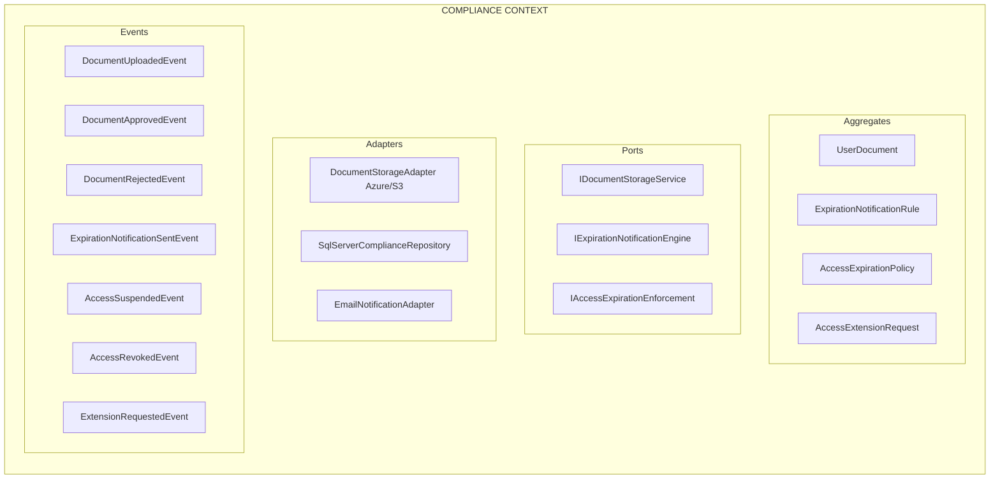

# EP-07: Diseño Detallado — Ciclo de Vida de Cumplimiento

**Versión:** 1.0
**Fecha:** 2026-05-14
**Épica:** EP-07 (Post-MVP)
**Historias:** US-023 a US-028
**Functional Stories:** FS-11, FS-15 (NEW), FS-16 (NEW)

---

## PARTE 1: FS-11 — Upload & Validate User Document

### 1.1 Definición

**FS-11** permite que usuarios y administradores carguen documentos (identidad, certificados, acuerdos) para cumplimiento.

Workflow:
1. **Upload**: Usuario carga documento → storage seguro
2. **Validation**: Validador revisa → APPROVED / REJECTED
3. **Lifecycle**: Documento válido hasta fecha de revalidación
4. **Enforcement**: Si vence, acceso puede ser afectado (integración con FS-16)

### 1.2 Document Type Taxonomy

```csharp
public enum DocumentType
{
 // Identity Verification
 IDENTITY_PROOF, // Passport, DNI, Driver License
 ADDRESS_VERIFICATION, // Utility bill, bank statement
 CORPORATE_REGISTRATION, // Articles of incorporation

 // Authorization
 SERVICE_AGREEMENT, // B2B contract
 DATA_PROCESSING_AGREEMENT, // DPA
 NON_DISCLOSURE_AGREEMENT, // NDA

 // Compliance
 BACKGROUND_CHECK, // Criminal record clearance
 INSURANCE_CERTIFICATE, // Liability, D&O
 SECURITY_CLEARANCE, // Government clearance

 // Role-specific
 CERTIFICATION, // Professional cert (CPA, CISSP)
 TRAINING_COMPLETION, // Mandatory training proof
 MEDICAL_CLEARANCE, // For certain roles

 // Custom (tenant-specific)
 CUSTOM_DOCUMENT // Tenant-defined
}

public record DocumentTypeConfiguration
{
 public DocumentType Type { get; init; }
 public string Name { get; init; }
 public string Description { get; init; }
 public TimeSpan ValidityPeriod { get; init; } // Cuánto tiempo válido
 public bool RequiresValidation { get; init; } // Quién aprueba
 public List<string> ValidatorRoles { get; init; } // COMPLIANCE_OFFICER, HR_ADMIN, etc.
 public long MaxFileSizeBytes { get; init; }
 public List<string> AllowedMimeTypes { get; init; } // PDF, JPG, etc.
}
```

### 1.3 Acceptance Criteria (FS-11)

```gherkin
Feature: Document Upload & Validation

 Scenario: Upload identity document
 Given User "alice@corp.com" is EXTERNAL
 When uploads document type: IDENTITY_PROOF
 And document: passport.pdf (500KB, valid PDF)
 Then document stored in secure location
 And document status = UPLOADED
 And audit logs: DOCUMENT_UPLOADED
 And validator notified for review

 Scenario: Validate document - APPROVED
 Given Document in UPLOADED status
 When Compliance Officer reviews
 And approves with: "Document valid, matches user"
 Then document status = APPROVED
 And valid_until = now + 365 days
 And audit logs: DOCUMENT_APPROVED with notes
 And user notified: "Document approved"

 Scenario: Validate document - REJECTED
 Given Document in UPLOADED status
 When Compliance Officer reviews
 And rejects with reason: "Document expired"
 Then document status = REJECTED
 And audit logs: DOCUMENT_REJECTED with reason
 And user notified: "Document rejected"
 And user can re-upload

 Scenario: Document revalidation needed
 Given APPROVED document with valid_until = 2026-12-31
 When today > 2026-12-31
 Then document status = REVALIDATION_REQUIRED
 And notified: user + admin
 And user can upload new document

 Scenario: Prevent upload of invalid file type
 Given User tries to upload: document.exe
 When file type not in allowed list
 Then upload rejected
 And error: "Invalid file type. Allowed: PDF, JPG, PNG"
```

---

### 1.4 Storage & Security

```csharp
public class SecureDocumentStorageService : IDocumentStorageService
{
 private readonly ISecureStorageProvider _storage; // Azure Blob, S3, etc.
 private readonly IEncryptionService _encryption;
 private readonly IDocumentRepository _repository;

 public async Task<StorageResult> UploadDocumentAsync(
 User uploader,
 DocumentUploadRequest request,
 Stream fileStream,
 CancellationToken cancellationToken)
 {
 // 1. Validar el archivo
 if (!IsValidFileType(request.DocumentType, request.FileName))
 throw new InvalidDocumentException("File type not allowed");

 if (fileStream.Length > GetMaxFileSize(request.DocumentType))
 throw new DocumentTooLargeException("File exceeds maximum size");

 // 2. Encriptar documento
 var encryptedStream = await _encryption.EncryptAsync(fileStream);

 // 3. Almacenar en secure storage con path pattern:
 // /documents/{root_tenant_id}/{user_id}/{document_id}/{filename}
 var documentId = Guid.NewGuid();
 var storagePath = $"documents/{uploader.RootTenantId}/{uploader.Id}/{documentId}/{request.FileName}";

 var storageUri = await _storage.UploadAsync(storagePath, encryptedStream);

 // 4. Crear registro de documento
 var document = new UserDocument
 {
 Id = documentId,
 RootTenantId = uploader.RootTenantId,
 UserId = uploader.Id,
 Type = request.DocumentType,
 FileName = request.FileName,
 StorageUri = storageUri,
 FileSizeBytes = fileStream.Length,
 Status = DocumentStatus.UPLOADED,
 UploadedBy = uploader.Id,
 UploadedAt = DateTime.UtcNow,
 FileHash = ComputeHash(fileStream) // Para virus/tamper detection
 };

 await _repository.AddAsync(document);

 // 5. Notificar validadores
 var validators = await _userRepository.GetUsersByRoleAsync(
 uploader.RootTenantId,
 "COMPLIANCE_OFFICER");

 foreach (var validator in validators)
 {
 await _notificationService.NotifyAsync(
 validator.Id,
 $"Document requiring validation: {request.DocumentType}",
 $"User {uploader.Name} uploaded {request.DocumentType}");
 }

 // 6. Audit
 await _auditService.LogAsync(new AuditEvent
 {
 EventType = "DOCUMENT_UPLOADED",
 UserId = uploader.Id,
 ResourceId = documentId.ToString(),
 Details = new { DocumentType = request.DocumentType, FileName = request.FileName }
 });

 return new StorageResult { DocumentId = documentId, Status = "UPLOADED" };
 }

 public async Task<Stream> DownloadDocumentAsync(
 User requester,
 Guid documentId,
 CancellationToken cancellationToken)
 {
 var document = await _repository.GetAsync(documentId);

 // Validar acceso
 if (document.UserId != requester.Id &&
 !await _authorizationService.HasPermissionAsync(requester, "VIEW_DOCUMENTS"))
 throw new UnauthorizedAccessException();

 // Descargar y desencriptar
 var encryptedStream = await _storage.DownloadAsync(document.StorageUri);
 var decryptedStream = await _encryption.DecryptAsync(encryptedStream);

 // Audit
 await _auditService.LogAsync(new AuditEvent
 {
 EventType = "DOCUMENT_DOWNLOADED",
 UserId = requester.Id,
 ResourceId = documentId.ToString()
 });

 return decryptedStream;
 }
}
```

### 1.5 Validation Workflow

```sql
CREATE TABLE [compliance].[documents] (
 [id] UNIQUEIDENTIFIER PRIMARY KEY,
 [root_tenant_id] UNIQUEIDENTIFIER NOT NULL,
 [user_id] UNIQUEIDENTIFIER NOT NULL,
 [document_type] VARCHAR(64) NOT NULL, -- IDENTITY_PROOF, SERVICE_AGREEMENT, etc.
 [document_name] VARCHAR(255) NOT NULL,
 [storage_uri] VARCHAR(MAX) NOT NULL,
 [file_size_bytes] BIGINT,
 [file_hash] VARCHAR(256), -- SHA-256 para integrity

 [uploaded_at] DATETIME2 NOT NULL DEFAULT GETUTCDATE(),
 [uploaded_by] UNIQUEIDENTIFIER,
 [status] VARCHAR(32) NOT NULL DEFAULT 'UPLOADED', -- UPLOADED, VALIDATING, APPROVED, REJECTED, REVALIDATION_REQUIRED
 [valid_until] DATETIME2, -- Cuándo vence

 CONSTRAINT pk_documents PRIMARY KEY (id, root_tenant_id),
 CONSTRAINT fk_documents_user FOREIGN KEY (user_id, root_tenant_id) REFERENCES [identity].[users](id, root_tenant_id)
);

CREATE TABLE [compliance].[document_validators] (
 [id] UNIQUEIDENTIFIER PRIMARY KEY,
 [root_tenant_id] UNIQUEIDENTIFIER NOT NULL,
 [document_id] UNIQUEIDENTIFIER NOT NULL,
 [validator_id] UNIQUEIDENTIFIER NOT NULL,

 [validation_status] VARCHAR(32), -- PENDING, APPROVED, REJECTED
 [validation_date] DATETIME2,
 [validation_notes] NVARCHAR(MAX),
 [validation_reason] NVARCHAR(MAX),

 CONSTRAINT pk_document_validators PRIMARY KEY (id, root_tenant_id),
 CONSTRAINT fk_document_validators_doc FOREIGN KEY (document_id, root_tenant_id) REFERENCES [compliance].[documents](id, root_tenant_id),
 CONSTRAINT fk_document_validators_user FOREIGN KEY (validator_id, root_tenant_id) REFERENCES [identity].[users](id, root_tenant_id)
);
```

---

## PARTE 2: FS-15 — Expiration Notification Rules (NEW)

### 2.1 Definición

**FS-15** define cuándo y cómo notificar a usuarios/admins sobre accesos que vencerán.

**Concepto clave:** Reglas configurables por tenant para alertar ANTES de que el acceso sea revocado.

### 2.2 Notification Rule Model

```csharp
public record ExpirationNotificationRule
{
 public Guid Id { get; init; }
 public Guid RootTenantId { get; init; }
 public string Code { get; init; } // "expiry_30d", "expiry_7d", etc.
 public string Name { get; init; }
 public string Description { get; init; }

 // Qué tipo de acceso expira
 public string ScopeType { get; init; } // 'PROFILE', 'PERMISSION', 'DELEGATION', 'DOCUMENT'
 public string? TargetUserCategory { get; init; } // INTERNAL, EXTERNAL, B2B (null = all)

 // Cuándo notificar ANTES de expiración
 public int DaysBeforeExpiration { get; init; } // 30, 7, 1

 // Quién se notifica
 public bool NotifyUser { get; init; }
 public bool NotifyAdmin { get; init; }
 public bool NotifyApprover { get; init; }

 // Cómo notificar
 public List<NotificationChannel> Channels { get; init; } // EMAIL, IN_APP, SMS, WEBHOOK

 // Frecuencia de renotificación
 public NotificationFrequency Frequency { get; init; } // ONCE, DAILY, WEEKLY

 public bool Enabled { get; init; }
 public DateTime CreatedAt { get; init; }
}

public enum NotificationChannel
{
 EMAIL,
 IN_APP,
 SMS,
 WEBHOOK,
 SLACK
}

public enum NotificationFrequency
{
 ONCE, // Una sola notificación
 DAILY, // Cada día hasta expiración
 WEEKLY, // Una vez por semana
 ON_LOGIN // Cada vez que user intenta login
}
```

### 2.3 Notification Engine

```csharp
public class ExpirationNotificationEngine : BackgroundService
{
 private readonly IExpirationRepository _expirationRepo;
 private readonly INotificationService _notificationService;
 private readonly IExpirationRuleRepository _ruleRepository;

 protected override async Task ExecuteAsync(CancellationToken stoppingToken)
 {
 while (!stoppingToken.IsCancellationRequested)
 {
 // Ejecutar cada hora
 await ProcessExpiringAccessAsync(stoppingToken);
 await Task.Delay(TimeSpan.FromHours(1), stoppingToken);
 }
 }

 private async Task ProcessExpiringAccessAsync(CancellationToken cancellationToken)
 {
 // 1. Obtener todas las reglas habilitadas
 var rules = await _ruleRepository.GetEnabledRulesAsync();

 foreach (var rule in rules)
 {
 // 2. Encontrar accesos que expiran en rule.DaysBeforeExpiration días
 var expiringAccess = await _expirationRepo.GetExpiringAccessAsync(
 ruleScope: rule.ScopeType,
 daysUntilExpiration: rule.DaysBeforeExpiration,
 userCategory: rule.TargetUserCategory);

 foreach (var access in expiringAccess)
 {
 // 3. Verificar si ya se notificó (para evitar spam)
 var lastNotification = await _notificationService.GetLastNotificationAsync(
 access.UserId,
 rule.Id);

 if (ShouldSendNotification(lastNotification, rule.Frequency))
 {
 // 4. Enviar notificación
 var notification = new ExpirationNotification
 {
 UserId = access.UserId,
 AccessType = rule.ScopeType,
 ExpiresAt = access.ExpiresAt,
 DaysRemaining = rule.DaysBeforeExpiration,
 RuleId = rule.Id
 };

 await SendNotificationAsync(notification, rule);

 // 5. Registrar en auditoría
 await _auditService.LogAsync(new AuditEvent
 {
 EventType = "EXPIRATION_NOTIFICATION_SENT",
 UserId = access.UserId,
 Details = new { RuleId = rule.Id, DaysRemaining = rule.DaysBeforeExpiration }
 });
 }
 }
 }
 }

 private async Task SendNotificationAsync(ExpirationNotification notification, ExpirationNotificationRule rule)
 {
 var user = await _userRepository.GetAsync(notification.UserId);

 if (rule.NotifyUser)
 {
 foreach (var channel in rule.Channels)
 {
 await SendViaChannelAsync(user, notification, channel);
 }
 }

 if (rule.NotifyAdmin)
 {
 var admins = await _userRepository.GetUsersByRoleAsync(
 user.RootTenantId, "ADMIN");

 foreach (var admin in admins)
 {
 foreach (var channel in rule.Channels)
 {
 await SendViaChannelAsync(admin, notification, channel);
 }
 }
 }
 }

 private async Task SendViaChannelAsync(User recipient, ExpirationNotification notification, NotificationChannel channel)
 {
 var message = BuildNotificationMessage(notification);

 switch (channel)
 {
 case NotificationChannel.EMAIL:
 await _emailService.SendAsync(recipient.Email,
 $"Access Expiring in {notification.DaysRemaining} Days",
 message);
 break;

 case NotificationChannel.IN_APP:
 await _inAppNotificationService.SendAsync(recipient.Id, message);
 break;

 case NotificationChannel.SMS:
 if (recipient.PhoneNumber != null)
 await _smsService.SendAsync(recipient.PhoneNumber, message);
 break;

 case NotificationChannel.WEBHOOK:
 await _webhookService.NotifyAsync(notification);
 break;

 case NotificationChannel.SLACK:
 await _slackService.NotifyAsync(recipient.SlackUserId, message);
 break;
 }
 }

 private bool ShouldSendNotification(DateTime? lastNotification, NotificationFrequency frequency)
 {
 return frequency switch
 {
 NotificationFrequency.ONCE => lastNotification == null,
 NotificationFrequency.DAILY => lastNotification == null ||
 (DateTime.UtcNow - lastNotification.Value).TotalDays >= 1,
 NotificationFrequency.WEEKLY => lastNotification == null ||
 (DateTime.UtcNow - lastNotification.Value).TotalDays >= 7,
 _ => false
 };
 }
}
```

### 2.4 Acceptance Criteria (FS-15)

```gherkin
Feature: Expiration Notification Rules

 Scenario: Configure notification rule
 Given Admin accesses Configuration > Expiration Notifications
 When creates rule:
- Code: "external_30d"
- Scope: PROFILE
- Target: EXTERNAL users
- Days: 30
- Notify: User + Admin
- Channels: EMAIL, IN_APP
- Frequency: ONCE
 Then rule saved and enabled
 And audit logs: RULE_CREATED

 Scenario: Auto-notify user before expiry
 Given Notification rule for 30 days
 And User "alice" has PROFILE expiring in 30 days
 When background job executes
 Then email sent to alice@corp.com: "Access expires in 30 days"
 And in-app notification created
 And audit logs: EXPIRATION_NOTIFICATION_SENT

 Scenario: Notify admin daily (repeated notifications)
 Given Rule with Frequency: DAILY
 And User access expiring in 5 days
 When day 1: notification sent to admin
 And day 2: re-check rule → frequency=DAILY → send again
 And day 3, 4, 5: repeat
 Then admin receives 5 notifications (one per day)

 Scenario: Customizable channels per rule
 Given Rule with Channels: [EMAIL, SLACK, WEBHOOK]
 When access expiring in 10 days
 Then notification sent via EMAIL to user
 And slack message to #compliance channel
 And webhook POST to https://company.com/compliance/expiry
```

---

## PARTE 3: FS-16 — Access Behavior on Expiration (NEW)

### 3.1 Definición

**FS-16** define qué ocurre con el acceso cuando se vence.

**Modos:** WARNING (aviso), SUSPEND (suspensión temporal), REVOKE (revocación permanente)

### 3.2 Access Expiration Policy Model

```csharp
public record AccessExpirationPolicy
{
 public Guid Id { get; init; }
 public Guid RootTenantId { get; init; }
 public string Code { get; init; } // "contract_expiry", "cert_expiry"
 public string Name { get; init; }

 // Qué tipo de acceso controla
 public string ScopeType { get; init; } // 'PROFILE', 'PERMISSION', 'DELEGATION'
 public string? TargetUserCategory { get; init; }

 // Qué ocurre en expiración
 public ExpirationAction OnExpirationAction { get; init; } // WARNING, SUSPEND, REVOKE

 // Grace period: días después de expiración antes de enforcement
 public int GracePeriodDays { get; init; }

 // Permisiones especiales
 public bool AllowExtension { get; init; } // Puede user solicitar extensión?
 public int MaxExtensionDays { get; init; } // Máxima extensión permitida
 public bool RequireReapprovalOnExtend { get; init; } // ¿Necesita nueva aprobación?

 // Excepciones
 public bool AllowExceptions { get; init; } // Puede admin hacer excepción?

 public bool Enabled { get; init; }
}

public enum ExpirationAction
{
 WARNING, // Solo notificación, acceso permanece
 SUSPEND, // Acceso suspendido temporalmente
 REVOKE // Acceso revocado permanentemente
}
```

### 3.3 Enforcement Engine

```csharp
public class AccessExpirationEnforcementEngine : BackgroundService
{
 private readonly IAccessRepository _accessRepository;
 private readonly IExpirationPolicyRepository _policyRepository;
 private readonly IAuthorizationService _authorizationService;

 protected override async Task ExecuteAsync(CancellationToken stoppingToken)
 {
 while (!stoppingToken.IsCancellationRequested)
 {
 // Ejecutar cada 6 horas
 await EnforceExpiredAccessAsync(stoppingToken);
 await Task.Delay(TimeSpan.FromHours(6), stoppingToken);
 }
 }

 private async Task EnforceExpiredAccessAsync(CancellationToken stoppingToken)
 {
 // 1. Obtener todas las políticas habilitadas
 var policies = await _policyRepository.GetEnabledPoliciesAsync();

 foreach (var policy in policies)
 {
 // 2. Encontrar accesos que expired hace más de grace_period
 var expiredAccess = await _accessRepository.GetExpiredAccessAsync(
 policyScope: policy.ScopeType,
 expiredBeforeDays: policy.GracePeriodDays);

 foreach (var access in expiredAccess)
 {
 // 3. Aplicar enforcement según policy
 await EnforceAccessAsync(access, policy);
 }
 }
 }

 private async Task EnforceAccessAsync(UserAccess access, AccessExpirationPolicy policy)
 {
 switch (policy.OnExpirationAction)
 {
 case ExpirationAction.WARNING:
 // Solo auditar, no hacer nada
 await _auditService.LogAsync(new AuditEvent
 {
 EventType = "ACCESS_EXPIRED_WARNING",
 UserId = access.UserId,
 Details = new { AccessType = policy.ScopeType, ExpiresAt = access.ExpiresAt }
 });
 break;

 case ExpirationAction.SUSPEND:
 // Suspender el acceso
 access.Status = AccessStatus.SUSPENDED;
 access.SuspendedAt = DateTime.UtcNow;
 access.SuspendedReason = $"Expired on {access.ExpiresAt:yyyy-MM-dd}";

 await _accessRepository.UpdateAsync(access);

 // Remover permisos del usuario
 await _authorizationService.RevokePermissionsAsync(access.UserId, access.Id);

 // Notificar
 var user = await _userRepository.GetAsync(access.UserId);
 await _notificationService.NotifyAsync(user.Id,
 "Access Suspended",
 $"Your {policy.ScopeType} access has been suspended due to expiration. " +
 $"Contact admin to request extension.");

 // Audit
 await _auditService.LogAsync(new AuditEvent
 {
 EventType = "ACCESS_SUSPENDED",
 UserId = access.UserId,
 ResourceId = access.Id.ToString(),
 Details = new { Reason = "Expiration", GracePeriod = policy.GracePeriodDays }
 });
 break;

 case ExpirationAction.REVOKE:
 // Revocar el acceso permanentemente
 access.Status = AccessStatus.REVOKED;
 access.RevokedAt = DateTime.UtcNow;
 access.RevokedReason = $"Expired on {access.ExpiresAt:yyyy-MM-dd}";

 await _accessRepository.UpdateAsync(access);
 await _authorizationService.RevokePermissionsAsync(access.UserId, access.Id);

 var revokedUser = await _userRepository.GetAsync(access.UserId);
 await _notificationService.NotifyAsync(revokedUser.Id,
 "Access Revoked",
 $"Your {policy.ScopeType} access has been revoked due to expiration. " +
 $"Reapply if needed.");

 await _auditService.LogAsync(new AuditEvent
 {
 EventType = "ACCESS_REVOKED",
 UserId = access.UserId,
 ResourceId = access.Id.ToString(),
 Details = new { Reason = "Expiration" }
 });
 break;
 }
 }
}
```

### 3.4 Extension Request Flow

```csharp
public class AccessExtensionService
{
 public async Task<ExtensionRequest> RequestExtensionAsync(
 User requester,
 Guid accessId,
 string justification)
 {
 var access = await _accessRepository.GetAsync(accessId);
 var policy = await _policyRepository.GetByAccessTypeAsync(access.Type);

 // 1. Validar que extension es permitida
 if (!policy.AllowExtension)
 throw new ExtensionNotAllowedException("Extensions not allowed for this access type");

 if (DateTime.UtcNow > access.ExpiresAt.AddDays(policy.GracePeriodDays))
 throw new ExtensionTooLateException("Too late to request extension");

 // 2. Crear extension request
 var request = new AccessExtensionRequest
 {
 Id = Guid.NewGuid(),
 AccessId = accessId,
 RequestedBy = requester.Id,
 RequestedAt = DateTime.UtcNow,
 CurrentExpirationDate = access.ExpiresAt,
 ProposedNewExpirationDate = access.ExpiresAt.AddDays(30), // Default 30 days
 Justification = justification,
 Status = "PENDING"
 };

 // 3. Si requiere reaprobación, crear approval request
 if (policy.RequireReapprovalOnExtend)
 {
 var approvalRequest = await _approvalService.CreateApprovalRequestAsync(
 workflow: "ACCESS_EXTENSION_APPROVAL",
 targetUser: requester.Id,
 requestedAction: $"Extend {access.Type}",
 linkedEntity: request.Id);

 request.ApprovalRequestId = approvalRequest.Id;
 request.Status = "PENDING_APPROVAL";
 }
 else
 {
 request.Status = "APPROVED";
 request.ApprovedAt = DateTime.UtcNow;
 access.ExpiresAt = request.ProposedNewExpirationDate;
 await _accessRepository.UpdateAsync(access);
 }

 await _extensionRepository.AddAsync(request);

 // 4. Audit
 await _auditService.LogAsync(new AuditEvent
 {
 EventType = "EXTENSION_REQUESTED",
 UserId = requester.Id,
 ResourceId = accessId.ToString()
 });

 return request;
 }
}
```

### 3.5 Acceptance Criteria (FS-16)

```gherkin
Feature: Access Behavior on Expiration

 Scenario: WARNING mode (access remains after expiry)
 Given Policy with OnExpiration: WARNING, GracePeriod: 0
 When access expires
 Then notification sent to user
 And access remains ACTIVE (unchanged)
 And audit logs: ACCESS_EXPIRED_WARNING

 Scenario: SUSPEND mode (access suspended after grace period)
 Given Policy with OnExpiration: SUSPEND, GracePeriod: 7
 And access expired 7 days ago
 When enforcement job runs
 Then access status = SUSPENDED
 And permissions revoked
 And user notified: "Access suspended"
 And audit logs: ACCESS_SUSPENDED

 Scenario: REVOKE mode (access permanently removed)
 Given Policy with OnExpiration: REVOKE, GracePeriod: 3
 And access expired 3 days ago
 When enforcement job runs
 Then access status = REVOKED
 And permissions permanently removed
 And user notified: "Access revoked"
 And cannot be re-enabled (only via new request)

 Scenario: Request extension (if allowed)
 Given User has suspended access due to expiration
 And Policy with AllowExtension: true, MaxExtensionDays: 60
 When user requests extension with justification
 Then extension request created
 And if RequireReapprovalOnExtend=true: approval_request created
 And if RequireReapprovalOnExtend=false: automatically approved
 Then access ExpiresAt extended

 Scenario: Extension not allowed past grace period
 Given GracePeriod: 7 days
 And access expired 8 days ago
 When user attempts to request extension
 Then request rejected: "Too late to request extension"
```

---

## PARTE 4: Compliance Context Definition

### 4.1 Bounded Context



### 4.2 Integration Points

**Compliance → Approvals:**
- Extension requests que requieren aprobación crean approval_requests

**Compliance → Audit:**
- Todos los eventos (upload, validation, enforcement) registrados immutablemente

**Compliance → Configuration:**
- Notification rules y expiration policies configurables por tenant

**Compliance → Authorization:**
- Cuando acceso es suspendido/revocado, se llama a authorization para remover permisos

---

## PARTE 5: ER Model (EP-07)

```sql
-- ============================================
-- COMPLIANCE CONTEXT TABLES
-- ============================================

CREATE TABLE [compliance].[documents] (
 [id] UNIQUEIDENTIFIER PRIMARY KEY DEFAULT NEWID(),
 [root_tenant_id] UNIQUEIDENTIFIER NOT NULL,
 [user_id] UNIQUEIDENTIFIER NOT NULL,
 [document_type] VARCHAR(64) NOT NULL,
 [document_name] VARCHAR(255) NOT NULL,
 [storage_uri] VARCHAR(MAX) NOT NULL,
 [file_size_bytes] BIGINT,
 [file_hash] VARCHAR(256),

 [uploaded_at] DATETIME2 NOT NULL DEFAULT GETUTCDATE(),
 [uploaded_by] UNIQUEIDENTIFIER,
 [status] VARCHAR(32) NOT NULL DEFAULT 'UPLOADED',
 [valid_until] DATETIME2,

 CONSTRAINT pk_documents PRIMARY KEY (id, root_tenant_id),
 CONSTRAINT fk_documents_user FOREIGN KEY (user_id, root_tenant_id) REFERENCES [identity].[users](id, root_tenant_id)
);

CREATE TABLE [compliance].[document_validators] (
 [id] UNIQUEIDENTIFIER PRIMARY KEY DEFAULT NEWID(),
 [root_tenant_id] UNIQUEIDENTIFIER NOT NULL,
 [document_id] UNIQUEIDENTIFIER NOT NULL,
 [validator_id] UNIQUEIDENTIFIER NOT NULL,

 [validation_status] VARCHAR(32),
 [validation_date] DATETIME2,
 [validation_notes] NVARCHAR(MAX),

 CONSTRAINT pk_document_validators PRIMARY KEY (id, root_tenant_id),
 CONSTRAINT fk_doc_validators_doc FOREIGN KEY (document_id, root_tenant_id) REFERENCES [compliance].[documents](id, root_tenant_id)
);

CREATE TABLE [configuration].[expiration_notification_rules] (
 [id] UNIQUEIDENTIFIER PRIMARY KEY DEFAULT NEWID(),
 [root_tenant_id] UNIQUEIDENTIFIER NOT NULL,
 [code] VARCHAR(64) NOT NULL,
 [name] VARCHAR(255) NOT NULL,

 [scope_type] VARCHAR(32),
 [target_user_category] VARCHAR(32),
 [days_before_expiration] INT NOT NULL,

 [notify_user] BIT,
 [notify_admin] BIT,
 [notify_approver] BIT,
 [notification_channels] NVARCHAR(MAX), -- JSON: ["EMAIL", "IN_APP"]
 [notification_frequency] VARCHAR(32), -- ONCE, DAILY, WEEKLY

 [enabled] BIT NOT NULL DEFAULT 1,
 [created_at] DATETIME2 NOT NULL DEFAULT GETUTCDATE(),

 CONSTRAINT pk_expiration_notification_rules PRIMARY KEY (id, root_tenant_id)
);

CREATE TABLE [configuration].[access_expiration_policies] (
 [id] UNIQUEIDENTIFIER PRIMARY KEY DEFAULT NEWID(),
 [root_tenant_id] UNIQUEIDENTIFIER NOT NULL,
 [code] VARCHAR(64) NOT NULL,
 [name] VARCHAR(255) NOT NULL,

 [scope_type] VARCHAR(32) NOT NULL,
 [target_user_category] VARCHAR(32),
 [on_expiration_action] VARCHAR(32) NOT NULL, -- WARNING, SUSPEND, REVOKE
 [grace_period_days] INT DEFAULT 0,

 [allow_extension] BIT,
 [max_extension_days] INT,
 [require_reapproval_on_extend] BIT,
 [allow_exceptions] BIT,

 [enabled] BIT NOT NULL DEFAULT 1,
 [created_at] DATETIME2 NOT NULL DEFAULT GETUTCDATE(),

 CONSTRAINT pk_access_expiration_policies PRIMARY KEY (id, root_tenant_id)
);

CREATE TABLE [compliance].[access_extension_requests] (
 [id] UNIQUEIDENTIFIER PRIMARY KEY DEFAULT NEWID(),
 [root_tenant_id] UNIQUEIDENTIFIER NOT NULL,
 [access_id] UNIQUEIDENTIFIER NOT NULL,

 [requested_by] UNIQUEIDENTIFIER NOT NULL,
 [requested_at] DATETIME2 NOT NULL DEFAULT GETUTCDATE(),
 [current_expiration_date] DATETIME2 NOT NULL,
 [proposed_new_expiration_date] DATETIME2 NOT NULL,
 [justification] NVARCHAR(MAX),

 [status] VARCHAR(32) NOT NULL DEFAULT 'PENDING',
 [approval_request_id] UNIQUEIDENTIFIER,
 [approved_at] DATETIME2,
 [approved_by] UNIQUEIDENTIFIER,
 [rejection_reason] NVARCHAR(MAX),

 CONSTRAINT pk_access_extension_requests PRIMARY KEY (id, root_tenant_id)
);

-- Índices
CREATE INDEX idx_documents_user ON [compliance].[documents] (user_id, root_tenant_id)
 WHERE status IN ('UPLOADED', 'VALIDATING');

CREATE INDEX idx_expiration_rules_scope ON [configuration].[expiration_notification_rules] (scope_type, root_tenant_id)
 WHERE enabled = 1;

CREATE INDEX idx_expiration_policies_scope ON [configuration].[access_expiration_policies] (scope_type, root_tenant_id)
 WHERE enabled = 1;
```

---

## Summary EP-07 Completado

- **FS-11**: Document Upload & Validation workflow
- **FS-15** (NEW): Expiration Notification Rules engine
- **FS-16** (NEW): Access Expiration Enforcement (WARNING, SUSPEND, REVOKE)
- **Compliance Context**: Bounded context defined
- **ER Model**: 4 nuevas tablas + configuración
- **Integration**: Compliance integra con Approvals, Audit, Authorization, Configuration

**Próximo:** EP-08 (IGA Advanced)

---

**Aprobado por:** Arquitecto Principal
**Fecha:** 2026-05-14
