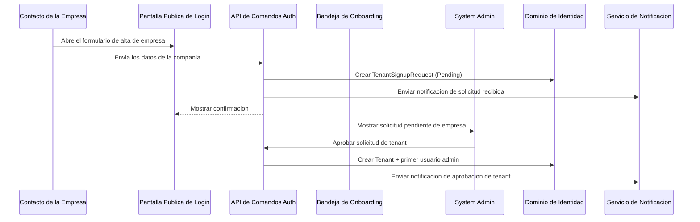
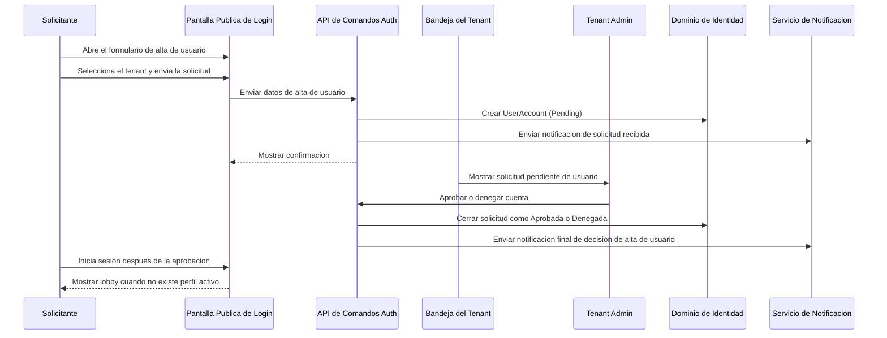
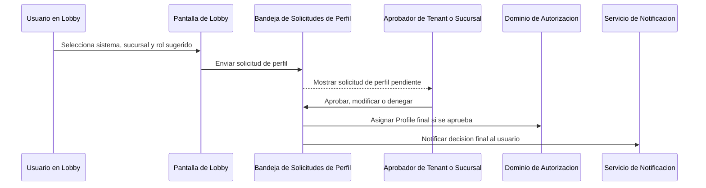

# EP-09: Diseno Detallado - Bandeja de Aprobacion de Onboarding

**Version:** 1.0  
**Fecha:** 2026-06-01  
**Epica:** EP-09 (Preparacion de Lanzamiento)  
**Historias Funcionales:** FS-21, FS-22, FS-23, FS-24  
**ADR:** ADR-0075

## 1. Objetivo del Diseno

Esta epica introduce un modelo de onboarding en dos fases:

- Fase 1 admite al usuario dentro del tenant.
- Fase 2 asigna entitlements operativos mediante un flujo de solicitud de perfil.

El diseno mantiene simple la experiencia del operador sin perder el aislamiento por tenant ni la separacion entre admision de identidad y autorizacion.

El diseno tambien exige trazabilidad completa del ciclo de vida de solicitudes de alta de usuario y de perfil por tenant. Los administradores deben cerrar cada requerimiento con un resultado final Aprobado o Denegado, y el solicitante debe ser notificado automaticamente cuando se registre la decision final.

## 2. Superficie de Producto

| Superficie | Visible para | Proposito |
|---|---|---|
| Opcion de navegacion Identity | Aprobadores autorizados | Abre la bandeja de aprobacion de onboarding. |
| Pestaña de onboarding de empresa | System Admin | Revisa solicitudes de alta de empresa. |
| Gestion de equipo: pestaña Solicitudes de Ingreso | Tenant Admin | Revisa solicitudes pendientes de alta de usuario del tenant activo. |
| Gestion de equipo: pestaña Solicitudes de Perfiles | Tenant Admin o Gerente de Sucursal delegado | Revisa solicitudes pendientes de perfil y asigna el rol final. |
| Lobby de usuario | Usuarios activos sin perfil | Muestra bienvenida al tenant y formulario de solicitud de perfil. |
| Puntos publicos de registro | Visitantes anonimos | Enviar solicitudes de alta de tenant o de usuario. |

## 3. Matriz de Ruteo de Aprobacion

| Tipo de Solicitud | Fuente de Verdad | Estado Inicial | Alcance de Revision | Resultado de Aprobacion |
|---|---|---|---|---|
| Solicitud de alta de empresa | Agregado `TenantSignupRequest` | Pending | Global | Crea tenant + primer admin + notificacion de contrasena temporal |
| Solicitud de alta de usuario | Agregado `UserAccount` | Pending | Tenant actual | Aprueba para activar la cuenta o deniega sin acceso al tenant |
| Solicitud de perfil | `ApprovalRequest` o modelo dedicado de solicitud de perfil | PendingAssignment | Tenant actual o sucursal delegada | Aprueba con asignacion de rol final o deniega sin asignacion de perfil |

## 4. Contrato de Cierre de Ciclo de Vida

| Tipo de Solicitud | Resultados Terminales Requeridos | Responsable de Cierre | Requisito de Notificacion |
|---|---|---|---|
| Solicitud de alta de usuario | Aprobado, Denegado | Tenant Admin | Notificar al solicitante cuando el acceso sea aprobado o denegado. |
| Solicitud de perfil | Aprobado, Denegado | Tenant Admin o Gerente de Sucursal delegado | Notificar al solicitante cuando la solicitud de perfil sea aprobada o denegada. |

Todo registro de ciclo de vida debe conservar tenant, solicitante, estado actual, resultado final, fecha de decision, aprobador y motivo de decision cuando exista. Los registros pendientes permanecen accionables en la bandeja hasta que se registre una decision final.

## 5. Modelo de Estados

### 5.1 Solicitud de Alta de Empresa

| Estado | Significado | Proxima Accion Permitida |
|---|---|---|
| Pending | La solicitud fue enviada y espera revision. | Aprobar o rechazar |
| Approved | El tenant fue creado y se aprovisiono la primera cuenta admin. | Ninguna |
| Rejected | La solicitud se cerro sin crear el tenant. | Ninguna |

### 5.2 Solicitud de Alta de Usuario

| Estado | Significado | Proxima Accion Permitida |
|---|---|---|
| Pending | La cuenta existe pero aun no puede iniciar sesion. | Aprobar o denegar |
| ActiveWithoutProfile | El Tenant Admin aprobo la solicitud, pero no existe perfil asignado. | Solicitar perfil |
| Active | Existe al menos un perfil activo. | Ninguna |
| Denied | La solicitud se cerro sin activar acceso al tenant. | Ninguna |

### 5.3 Solicitud de Perfil

| Estado | Significado | Proxima Accion Permitida |
|---|---|---|
| PendingAssignment | El usuario solicito sistema, sucursal y rol sugerido. | Aprobar, modificar o denegar |
| Approved | Se otorgo un rol final. El rol otorgado puede coincidir con la solicitud o ser modificado por el aprobador. | Ninguna |
| Denied | No se asigno perfil para el alcance solicitado. | Ninguna |

## 6. Diagramas de Secuencia

### 6.1 Alta de Empresa

### 6.2 Alta de Usuario

### 6.3 Solicitud de Perfil

## 7. Ubicacion en UI

| Ubicacion | Componente | Notas |
|---|---|---|
| Pantalla de login | Botones de entrada | Enlaza los formularios de alta de usuario y alta de empresa. |
| Navegacion del modulo Identity | Bandeja de Aprobacion de Onboarding | Nueva opcion visible para aprobadores. |
| Dashboard de tenants | Panel de solicitudes pendientes | Puede reutilizar el mismo read model por contexto, pero la bandeja sigue siendo la superficie principal de revision. |
| Gestion de equipo | Pestaña Solicitudes de Ingreso | Muestra solicitudes pendientes con alcance del tenant y acciones de aprobar y denegar. |
| Gestion de equipo | Pestaña Solicitudes de Perfiles | Muestra solicitudes de perfil con acciones de aprobar, modificar y denegar. |
| Lobby de usuario | Formulario de solicitud de perfil | Permite solicitar sistema, sucursal y rol sugerido a usuarios sin perfil. |

## 8. Plan de Implementacion

| Fase | Trabajo | Dependencia | Resultado |
|---|---|---|---|
| 1 | Mantener las solicitudes de alta de empresa como `TenantSignupRequest` y exponerlas en la bandeja. | Flujo existente de alta de tenant | Los admins globales pueden revisar solicitudes de empresa en un solo lugar. |
| 2 | Mantener las solicitudes de alta de usuario como `UserAccount` pendientes y mostrar acciones de aprobacion y denegacion en la bandeja del tenant. | Flujos existentes de alta, activacion y denegacion de usuario | Los Tenant Admins pueden cerrar solicitudes de acceso sin fuga entre tenants. |
| 3 | Agregar ruteo a lobby para usuarios autenticados sin perfil activo. | Resultado sin perfil del grafo de autorizacion | Los usuarios pueden entrar al tenant sin ver menus operativos. |
| 4 | Agregar flujo de solicitud de perfil con sistema, sucursal, rol solicitado y justificacion. | Catalogos de perfiles y roles | Los usuarios pueden solicitar entitlements explicitamente. |
| 5 | Agregar acciones de aprobacion: aprobar, modificar y denegar. | Comandos de aprobacion, denegacion y asignacion de perfil | Los aprobadores pueden asignar el rol final o cerrar la solicitud como denegada conservando auditoria. |
| 6 | Agregar verificaciones explicitas de capacidad por alcance. | Grafo de autorizacion y asignaciones de rol | Solo los aprobadores autorizados pueden usar las acciones de la bandeja. |
| 7 | Agregar historial de ciclo de vida y notificaciones de decision final para solicitudes de alta de usuario y de perfil. | Plantillas de notificacion y modelo de auditoria | Toda solicitud permanece trazable hasta quedar Aprobada o Denegada. |
| 8 | Agregar estados futuros de verificacion de pago si el negocio lo requiere. | Decision de producto | El onboarding de empresa puede pausarse por validacion comercial sin redisenar el punto de entrada. |

## 9. Trazabilidad

| Tipo | Referencias |
|---|---|
| Historias Funcionales | FS-21, FS-22, FS-23, FS-24 |
| ADR | ADR-0075 |
| Entidades de Dominio | `TenantSignupRequest`, `Tenant`, `UserAccount`, `ApprovalRequest`, `Profile`, `Role`, `Branch` |
| Notificaciones | `TenantSignupRequestReceived`, `TenantSignupApproved`, `UserSignupRequestReceived`, `UserSignupApproved`, `UserSignupDenied`, `ProfileRequestApproved`, `ProfileRequestDenied` |
