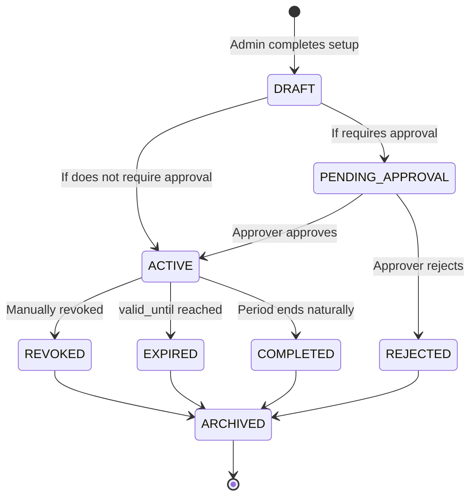

# EP-06: Detailed Design — Security, External Access & Delegation **Version:** 1.0 **Date:** 2026-05-14 **Epic:** EP-06 (Post-MVP)
**User Stories:** US-017 to US-022 **Functional Stories:** FS-09, FS-10, FS-14

---

## PART 1: FS-09 — Adaptive MFA & Passwordless Authentication

### 1.1 Definition **FS-09** implements adaptive authentication where:
- **MFA**: Multi-Factor Authentication (conditional requirement based on risk)
- **Passwordless**: Methods without passwords (FIDO2, magic links, biometrics)

System calculates a **Risk Score **in real-time and automatically decides if MFA is required.

### 1.2 Risk Scoring Model

#### 1.2.1 Risk Factors

| Factor | Range | Weight | Example |
|--------|-------|--------|---------|
| **Login Frequency Anomaly** | 0-30 | 0.20 | User never logged in at this hour |
| **Geographic Anomaly** | 0-30 | 0.25 | User in different country than usual |
| **Device Reputation** | 0-20 | 0.15 | New or unrecognized device |
| **Network Anomaly** | 0-10 | 0.10 | Suspicious IP, VPN, proxy |
| **Failed Attempts** | 0-10 | 0.10 | Recent failed login attempts |
| **Tenant Risk Level** | 0-30 | 0.20 | Tenant categorized as "high-risk" | **Risk Score = Σ(Factor × Weight)** Range: 0 (low risk) to 100 (high risk)

#### 1.2.2 Decision Thresholds

```csharp
public class MFADecisionEngine
{
 // Risk Score → MFA Requirement
 public MFARequirement CalculateMFARequirement(decimal riskScore, User user, Tenant tenant)
 {
 return (riskScore, user.Category, tenant.RiskLevel) switch
 {
 // Low risk: No MFA required
 (< 20, _, _) => MFARequirement.NotRequired,

 // Medium risk: MFA recommended (optional)
 (20 to 40, UserCategory.INTERNAL, _) => MFARequirement.Recommended,
 (20 to 40, _, _) => MFARequirement.Required,

 // High risk: MFA mandatory
 (40 to 70, _, _) => MFARequirement.Required,

 // Critical risk: MFA + security review intervention
 (> 70, _, _) => MFARequirement.RequiredWithSecurityReview,

 _ => MFARequirement.Required
 };
 }
}

public enum MFARequirement
{
 NotRequired, // User can skip MFA
 Recommended, // Show prompt but allow skip
 Required, // MFA mandatory
 RequiredWithSecurityReview // MFA + manual admin review
}
```

#### 1.2.3 Risk Calculation per Factor

```csharp
public class RiskScoringEngine
{
 // Factor 1: Login Frequency Anomaly (0-30 points)
 public int CalculateFrequencyAnomaly(User user, DateTime loginAttemptTime)
 {
 var userLoginHistory = _auditRepository.GetLoginsByUser(user.Id, lastDays: 30);
 var usualLoginHours = userLoginHistory
 .GroupBy(l => l.Timestamp.Hour)
 .Select(g => (hour: g.Key, frequency: g.Count()))
 .OrderByDescending(g => g.frequency)
 .Take(5) // Top 5 hours
 .Select(g => g.hour)
 .ToList();

 if (!usualLoginHours.Contains(loginAttemptTime.Hour))
 return 30; // Total anomaly

 return 0; // Known pattern
 }

 // Factor 2: Geographic Anomaly (0-30 points)
 public int CalculateGeographicAnomaly(User user, string ipAddress)
 {
 var userLocation = _geoIpService.GetLocation(ipAddress);
 var usualCountries = _auditRepository.GetLoginsByUser(user.Id, lastDays: 90)
 .Select(l => _geoIpService.GetLocation(l.IpAddress).Country)
 .Distinct()
 .ToList();

 if (!usualCountries.Contains(userLocation.Country))
 {
 // Check if geographically POSSIBLE to travel in time
 var lastLoginLocation = _auditRepository.GetLastLogin(user.Id);
 var travelTime = CalculateTravelTime(lastLoginLocation, userLocation);

 if (travelTime.TotalMinutes < 120) // Impossible to travel in 2h
 return 30; // Very suspicious

 return 20; // Possible travel but rare
 }

 return 0;
 }

 // Factor 3: Device Reputation (0-20 points)
 public int CalculateDeviceReputation(User user, string deviceFingerprint)
 {
 var knownDevices = _deviceRepository.GetDevicesByUser(user.Id)
 .Where(d => d.Status == DeviceStatus.TRUSTED)
 .Select(d => d.Fingerprint)
 .ToList();

 if (!knownDevices.Contains(deviceFingerprint))
 return 20; // Unknown device

 return 0;
 }

 // Factor 4: Network Anomaly (0-10 points)
 public int CalculateNetworkAnomaly(string ipAddress)
 {
 var threatIntel = _threatIntelService.CheckIP(ipAddress);

 return threatIntel switch
 {
 { IsMalicious: true } => 10,
 { IsVPN: true } => 5, // VPN = somewhat suspicious
 { IsProxy: true } => 5,
 { IsTor: true } => 10,
 _ => 0
 };
 }

 // Factor 5: Failed Attempts (0-10 points)
 public int CalculateFailedAttempts(User user, string ipAddress)
 {
 var recentFailures = _auditRepository
 .GetFailedLoginAttempts(user.Id, ipAddress, lastMinutes: 60)
 .Count;

 return recentFailures switch
 {
 0 => 0,
 1 to 3 => 3,
 4 to 6 => 7,
>= 7 => 10
 };
 }

 // Factor 6: Tenant Risk Level (0-30 points)
 public int CalculateTenantRiskLevel(Tenant tenant)
 {
 return tenant.RiskLevel switch
 {
 TenantRiskLevel.LOW => 0,
 TenantRiskLevel.MEDIUM => 10,
 TenantRiskLevel.HIGH => 25,
 TenantRiskLevel.CRITICAL => 30,
 _ => 10
 };
 }
}
```

---

### 1.3 Acceptance Criteria (FS-09)

#### US-017: Adaptive MFA** As a:** Security Administrator **I want:** Adaptive MFA rules to require verification on risky access **So that:** Security posture improves without uniform friction **Criteria:**

```gherkin
Feature: Adaptive MFA Requirements

 Scenario: Low-risk login (internal, known device, usual hour)
 Given User "alice@corp.com" (INTERNAL) attempts login at 9am
 And from her known device
 And from her usual country
 When Risk Score calculated = 15
 Then MFA is not required
 And login completes without MFA

 Scenario: Medium-risk login (unusual hour)
 Given User "bob@corp.com" attempts login at 3am
 And Risk Score calculated = 35
 When User category = INTERNAL
 Then MFA is "Recommended" (optional)
 And prompt shown "Additional verification?" with skip button

 Scenario: High-risk login (different country)
 Given User "charlie@corp.com" (EXTERNAL) attempts login from Brazil
 And last login was from USA 1 hour ago (impossible travel)
 When Risk Score calculated = 75
 Then MFA is "Required"
 And login BLOCKED until MFA completed

 Scenario: Critical risk login (multiple factors)
 Given User attempts login with Risk Score = 85
 And factors: unknown country + 5 failed attempts + malicious IP
 When Risk Score > 70
 Then MFA is "RequiredWithSecurityReview"
 And login blocked + security team notified
 And audit logs intent as suspicious

 Scenario: Tenant High-Risk Category
 Given Tenant "HighRiskCorp" categorized as HIGH_RISK
 And User belongs to that tenant
 When any login
 Then Risk Score receives +25 points automatically
 And MFA more likely (lower threshold)
```

---

### 1.4 Passwordless Methods Supported

#### FS-09 Scope: Available Methods

| Method | Description | Security | UX | Requirements |
|--------|-------------|----------|-----|------------|
| **FIDO2 / WebAuthn** | Biometric or security key | (High) | (Excellent) | Device with FIDO2 support |
| **Magic Link** | Link via email with temp token | (Medium) | (Excellent) | Email access |
| **App Notification** | Push to mobile app (Microsoft/Google style) | (High) | (Excellent) | Authenticator app installed |
| **SMS OTP** | Temporary code via SMS | (Low) | (Good) | Phone number verified |
| **TOTP** | Time-based OTP (Google Authenticator, Authy) | (Medium) | (Good) | Authenticator app | **MVP FS-09 Scope:** FIDO2 + Magic Link + App Notification

```csharp
public interface IPasswordlessMethod
{
 string MethodName { get; } // "fido2", "magic_link", "app_notification"
 Task<PasswordlessChallenge> InitiateAsync(User user);
 Task<bool> VerifyAsync(PasswordlessChallenge challenge, string response);
}

public class FIDO2Method : IPasswordlessMethod
{
 public string MethodName => "fido2";

 public async Task<PasswordlessChallenge> InitiateAsync(User user)
 {
 // 1. Generate challenge (random bytes)
 var challenge = GenerateSecureChallenge(32);

 // 2. Retrieve user's registered credential IDs
 var credentials = await _credentialRepository.GetFIDO2CredentialsByUser(user.Id);

 // 3. Build WebAuthn PublicKeyCredentialRequestOptions
 var options = new PublicKeyCredentialRequestOptions
 {
 Challenge = challenge,
 Timeout = 60000, // 60 seconds
 UserVerification = UserVerificationRequirement.Preferred,
 AllowCredentials = credentials.Select(c => new PublicKeyCredentialDescriptor
 {
 Type = PublicKeyCredentialType.PublicKey,
 Id = Convert.FromBase64String(c.CredentialId)
 }).ToList()
 };

 // 4. Cache challenge temporarily (5 min expiration)
 await _challengeCache.SetAsync($"fido2:{user.Id}", challenge, TimeSpan.FromMinutes(5));

 return new PasswordlessChallenge
 {
 Method = "fido2",
 Options = JsonSerializer.Serialize(options),
 ExpiresAt = DateTime.UtcNow.AddMinutes(5)
 };
 }

 public async Task<bool> VerifyAsync(PasswordlessChallenge challenge, string response)
 {
 // 1. Parse WebAuthn response from client
 var assertion = JsonSerializer.Deserialize<AuthenticatorAssertionResponse>(response);

 // 2. Validate signature using credential public key
 var credential = await _credentialRepository.GetCredential(assertion.Id);
 var isValid = VerifySignature(assertion, credential.PublicKey);

 // 3. Validate counter (prevent replay attacks)
 if (assertion.SignCount <= credential.SignCount)
 return false; // Possible cloning attack

 credential.SignCount = assertion.SignCount;
 await _credentialRepository.UpdateAsync(credential);

 return isValid;
 }
}

public class MagicLinkMethod : IPasswordlessMethod
{
 public string MethodName => "magic_link";

 public async Task<PasswordlessChallenge> InitiateAsync(User user)
 {
 // 1. Generate unique token (40 random characters)
 var token = GenerateSecureToken(40);

 // 2. Create passwordless session in DB
 var session = new PasswordlessSession
 {
 Id = Guid.NewGuid(),
 UserId = user.Id,
 Method = "magic_link",
 Token = HashToken(token), // Store hash only
 ExpiresAt = DateTime.UtcNow.AddMinutes(15),
 Status = PasswordlessSessionStatus.PENDING
 };
 await _sessionRepository.AddAsync(session);

 // 3. Send email with link
 var magicLink = $"https://ums.example.com/auth/passwordless/verify?token={token}&session={session.Id}";
 await _emailService.SendAsync(user.Email, new PasswordlessMagicLinkEmail
 {
 UserName = user.Name,
 MagicLink = magicLink,
 ExpiresIn = "15 minutes"
 });

 return new PasswordlessChallenge
 {
 Method = "magic_link",
 SessionId = session.Id.ToString(),
 ExpiresAt = session.ExpiresAt,
 Message = $"Link sent to {MaskEmail(user.Email)}"
 };
 }

 public async Task<bool> VerifyAsync(PasswordlessChallenge challenge, string response)
 {
 // response = token from user
 var session = await _sessionRepository.GetAsync(Guid.Parse(challenge.SessionId));

 if (session == null || session.ExpiresAt < DateTime.UtcNow)
 return false; // Session doesn't exist or expired

 // Timing-safe comparison to prevent timing attacks
 var isValid = TimingSafeEquals(HashToken(response), session.Token);

 if (isValid)
 {
 session.Status = PasswordlessSessionStatus.VERIFIED;
 session.VerifiedAt = DateTime.UtcNow;
 await _sessionRepository.UpdateAsync(session);
 }

 return isValid;
 }
}
```

---

### 1.5 Configuration (FS-09)

Where and how MFA rules are configured:

```sql
-- New table in Configuration Context
CREATE TABLE [configuration].[mfa_policies] ([id] UNIQUEIDENTIFIER PRIMARY KEY,
 [root_tenant_id] UNIQUEIDENTIFIER NOT NULL,
 [code] VARCHAR(64), -- "default", "high-risk-users", etc.
 [name] VARCHAR(255),
 [enabled] BIT,
 [scope_type] VARCHAR(32), -- 'GLOBAL', 'TENANT', 'ORGANIZATION'
 [applies_to_user_category] VARCHAR(32), -- 'INTERNAL', 'EXTERNAL', 'B2B'

-- Risk-based thresholds
 [risk_score_required_threshold] INT, -- Ex: 40
 [risk_score_review_threshold] INT, -- Ex: 70

-- Enabled methods
 [allow_fido2] BIT,
 [allow_magic_link] BIT,
 [allow_app_notification] BIT,
 [allow_sms_otp] BIT,
 [allow_totp] BIT,

-- Passwordless-only mode
 [passwordless_only] BIT,

 [created_at] DATETIME2,
 [modified_at] DATETIME2,
 [root_tenant_id] UNIQUEIDENTIFIER);

-- Risk Scoring customization per tenant
CREATE TABLE [configuration].[risk_scoring_weights] ([id] UNIQUEIDENTIFIER PRIMARY KEY,
 [root_tenant_id] UNIQUEIDENTIFIER NOT NULL,
 [frequency_anomaly_weight] DECIMAL(3,2), -- Default: 0.20
 [geographic_anomaly_weight] DECIMAL(3,2), -- Default: 0.25
 [device_reputation_weight] DECIMAL(3,2), -- Default: 0.15
 [network_anomaly_weight] DECIMAL(3,2), -- Default: 0.10
 [failed_attempts_weight] DECIMAL(3,2), -- Default: 0.10
 [tenant_risk_weight] DECIMAL(3,2) -- Default: 0.20);
```

---

## PART 2: FS-14 — Delegated Administration & Scopes

### 2.1 Definition **FS-14** allows administrators to delegate management authority to others with controlled boundaries:

- **Delegating Admin** (A) → **Delegated Admin** (B): "You can manage users in my division"
- **Scope Limiting**: "Only in ORGANIZATION X", "Only CREATE_USER and ASSIGN_PROFILE actions"
- **Temporal Constraints**: "Valid until 2026-12-31"
- **Approval Required**: Creating delegation may require approval if sensitive

### 2.2 State Machine (Delegation)

**Delegation Lifecycle**



#### 2.2.1 State Details

| State | Description | Valid Transitions | Events |
|-------|-------------|-------------------|--------|
| **DRAFT** | Delegation being created, not visible | → PENDING_APPROVAL, → ACTIVE | Created |
| **PENDING_APPROVAL** | Awaiting approval | → ACTIVE (approved), → REJECTED | SubmittedForApproval |
| **ACTIVE** | Delegation operational | → REVOKED, → EXPIRED | Activated |
| **REVOKED** | Manually revoked by admin | → ARCHIVED | Revoked |
| **EXPIRED** | Expired by date (valid_until) | → ARCHIVED | Expired |
| **COMPLETED** | Completed naturally (period end) | → ARCHIVED | Completed |
| **REJECTED** | Rejected on approval | → ARCHIVED | Rejected |
| **ARCHIVED** | Historic (not visible in operations) | (none) | Archived | ---

## PART 3: ER Model Complete (EP-06)

### 3.1 New Tables

```sql
-- ============================================
-- APPROVALS CONTEXT TABLES
-- ============================================

CREATE TABLE [approval].[approval_workflows] ([id] UNIQUEIDENTIFIER PRIMARY KEY DEFAULT NEWID(),
 [root_tenant_id] UNIQUEIDENTIFIER NOT NULL,
 [code] VARCHAR(64) NOT NULL,
 [name] VARCHAR(255) NOT NULL,
 [description] NVARCHAR(MAX),

 [trigger_type] VARCHAR(32) NOT NULL, -- 'USER_ONBOARDING', 'PROFILE_ASSIGNMENT', 'DELEGATION_CREATION', 'B2B_ACCESS_REQUEST'
 [approval_type] VARCHAR(32) NOT NULL, -- 'SERIAL', 'PARALLEL', 'QUORUM'
 [required_approvals] INT NOT NULL DEFAULT 1,

 [timeout_days] INT DEFAULT 7,
 [escalate_after_days] INT,

 [scope_type] VARCHAR(32), -- 'GLOBAL', 'TENANT', 'ORGANIZATION'
 [applies_to_user_category] VARCHAR(32),

 [enabled] BIT NOT NULL DEFAULT 1,
 [created_by] VARCHAR(255),
 [created_at] DATETIME2 NOT NULL DEFAULT GETUTCDATE(),
 [modified_by] VARCHAR(255),
 [modified_at] DATETIME2,
 [is_deleted] BIT NOT NULL DEFAULT 0,

 CONSTRAINT pk_approval_workflows PRIMARY KEY (id, root_tenant_id),
 CONSTRAINT fk_approval_workflows_tenant FOREIGN KEY (root_tenant_id) REFERENCES [identity].[tenants](id));

CREATE TABLE [approval].[approval_requests] ([id] UNIQUEIDENTIFIER PRIMARY KEY DEFAULT NEWID(),
 [root_tenant_id] UNIQUEIDENTIFIER NOT NULL,
 [workflow_id] UNIQUEIDENTIFIER NOT NULL,

 [requester_id] UNIQUEIDENTIFIER NOT NULL,
 [target_user_id] UNIQUEIDENTIFIER,
 [target_entity_type] VARCHAR(32), -- 'USER', 'PROFILE', 'DELEGATION', 'B2B_ACCESS'
 [target_entity_id] UNIQUEIDENTIFIER,

 [requested_action] VARCHAR(255) NOT NULL,
 [request_reason] NVARCHAR(MAX),
 [business_justification] NVARCHAR(MAX),

 [created_at] DATETIME2 NOT NULL DEFAULT GETUTCDATE(),
 [submitted_at] DATETIME2,
 [expires_at] DATETIME2,
 [completed_at] DATETIME2,

 [status] VARCHAR(32) NOT NULL DEFAULT 'DRAFT', -- DRAFT, SUBMITTED, PENDING, APPROVED, REJECTED, ESCALATED
 [final_decision] VARCHAR(32), -- APPROVED, REJECTED
 [final_decision_reason] NVARCHAR(MAX),

 [priority] VARCHAR(32), -- LOW, MEDIUM, HIGH, CRITICAL
 [risk_score] DECIMAL(5,2),

 CONSTRAINT pk_approval_requests PRIMARY KEY (id, root_tenant_id),
 CONSTRAINT fk_approval_requests_workflow FOREIGN KEY (workflow_id, root_tenant_id) REFERENCES [approval].[approval_workflows](id, root_tenant_id),
 CONSTRAINT fk_approval_requests_requester FOREIGN KEY (requester_id, root_tenant_id) REFERENCES [identity].[users](id, root_tenant_id),
 CONSTRAINT fk_approval_requests_target FOREIGN KEY (target_user_id, root_tenant_id) REFERENCES [identity].[users](id, root_tenant_id));

CREATE TABLE [approval].[approval_approvers] ([id] UNIQUEIDENTIFIER PRIMARY KEY DEFAULT NEWID(),
 [root_tenant_id] UNIQUEIDENTIFIER NOT NULL,
 [approval_request_id] UNIQUEIDENTIFIER NOT NULL,

 [approver_id] UNIQUEIDENTIFIER NOT NULL,
 [approver_role] VARCHAR(64),
 [approval_order] INT,

 [status] VARCHAR(32) NOT NULL DEFAULT 'PENDING', -- PENDING, APPROVED, REJECTED, ESCALATED
 [approved_at] DATETIME2,
 [decision_reason] NVARCHAR(MAX),
 [decision_notes] NVARCHAR(MAX),

 [escalated_to_id] UNIQUEIDENTIFIER,
 [escalated_at] DATETIME2,

 CONSTRAINT pk_approval_approvers PRIMARY KEY (id, root_tenant_id),
 CONSTRAINT fk_approval_approvers_request FOREIGN KEY (approval_request_id, root_tenant_id) REFERENCES [approval].[approval_requests](id, root_tenant_id),
 CONSTRAINT fk_approval_approvers_approver FOREIGN KEY (approver_id, root_tenant_id) REFERENCES [identity].[users](id, root_tenant_id));

CREATE TABLE [approval].[approval_attachments] ([id] UNIQUEIDENTIFIER PRIMARY KEY DEFAULT NEWID(),
 [root_tenant_id] UNIQUEIDENTIFIER NOT NULL,
 [approval_request_id] UNIQUEIDENTIFIER NOT NULL,

 [document_name] VARCHAR(255) NOT NULL,
 [document_type] VARCHAR(64), -- 'SERVICE_AGREEMENT', 'IDENTITY_PROOF', etc.
 [storage_uri] VARCHAR(MAX) NOT NULL,
 [file_size_bytes] BIGINT,
 [uploaded_by] UNIQUEIDENTIFIER,
 [uploaded_at] DATETIME2 NOT NULL DEFAULT GETUTCDATE(),

 CONSTRAINT pk_approval_attachments PRIMARY KEY (id, root_tenant_id),
 CONSTRAINT fk_approval_attachments_request FOREIGN KEY (approval_request_id, root_tenant_id) REFERENCES [approval].[approval_requests](id, root_tenant_id));

-- ============================================
-- DELEGATION CONTEXT TABLES
-- ============================================

CREATE TABLE [delegation].[user_management_delegations] ([id] UNIQUEIDENTIFIER PRIMARY KEY DEFAULT NEWID(),
 [root_tenant_id] UNIQUEIDENTIFIER NOT NULL,

 [delegating_admin_id] UNIQUEIDENTIFIER NOT NULL,
 [delegated_admin_id] UNIQUEIDENTIFIER NOT NULL,

 [scope_type] VARCHAR(32) NOT NULL, -- TENANT, ORGANIZATION, DEPARTMENT, SYSTEM, TEAM
 [scope_id] UNIQUEIDENTIFIER,

 [allowed_actions] NVARCHAR(MAX) NOT NULL, -- JSON: ["CREATE_USER", "ASSIGN_PROFILE", ...]

 [valid_from] DATETIME2 NOT NULL,
 [valid_until] DATETIME2 NOT NULL,
 [max_duration_days] INT,

 [requires_approval] BIT NOT NULL DEFAULT 0,
 [approval_request_id] UNIQUEIDENTIFIER,

 [status] VARCHAR(32) NOT NULL DEFAULT 'DRAFT', -- DRAFT, PENDING_APPROVAL, ACTIVE, REVOKED, EXPIRED, REJECTED, COMPLETED, ARCHIVED
 [revoked_at] DATETIME2,
 [revoked_by] UNIQUEIDENTIFIER,
 [revocation_reason] NVARCHAR(MAX),

 [restricted_to_user_category] VARCHAR(32),
 [restricted_to_organization_id] UNIQUEIDENTIFIER,

 [created_by] UNIQUEIDENTIFIER NOT NULL,
 [created_at] DATETIME2 NOT NULL DEFAULT GETUTCDATE(),
 [modified_by] VARCHAR(255),
 [modified_at] DATETIME2,

 CONSTRAINT pk_user_management_delegations PRIMARY KEY (id, root_tenant_id),
 CONSTRAINT fk_delegation_delegating_admin FOREIGN KEY (delegating_admin_id, root_tenant_id) REFERENCES [identity].[users](id, root_tenant_id),
 CONSTRAINT fk_delegation_delegated_admin FOREIGN KEY (delegated_admin_id, root_tenant_id) REFERENCES [identity].[users](id, root_tenant_id),
 CONSTRAINT fk_delegation_approval FOREIGN KEY (approval_request_id, root_tenant_id) REFERENCES [approval].[approval_requests](id, root_tenant_id));

-- ============================================
-- INDICES for Performance
-- ============================================

CREATE INDEX idx_approval_requests_workflow ON [approval].[approval_requests] (workflow_id, root_tenant_id)
 WHERE status NOT IN ('APPROVED', 'REJECTED');

CREATE INDEX idx_approval_requests_target ON [approval].[approval_requests] (target_user_id, root_tenant_id);

CREATE INDEX idx_approval_approvers_request ON [approval].[approval_approvers] (approval_request_id, root_tenant_id);

CREATE INDEX idx_approval_approvers_approver ON [approval].[approval_approvers] (approver_id, root_tenant_id)
 WHERE status = 'PENDING';

CREATE INDEX idx_delegations_delegated_admin ON [delegation].[user_management_delegations] (delegated_admin_id, root_tenant_id)
 WHERE status = 'ACTIVE';

CREATE INDEX idx_delegations_scope ON [delegation].[user_management_delegations] (scope_type, scope_id, root_tenant_id)
 WHERE status IN ('ACTIVE', 'PENDING_APPROVAL');
```

---

## PART 4: Integration Map (EP-06)

### 4.1 Approvals ↔ Authorization Context

Approver must have permission to approve a request type.

**Integration Query:**

```csharp
public interface IApprovalAuthorizationValidator
{
 /// <summary>
 /// Validates that approver has permission to approve this request.
 /// </summary>
 Task<bool> CanApproveAsync(User approver, ApprovalRequest request);
}

public class ApprovalAuthorizationValidator : IApprovalAuthorizationValidator
{
 public async Task<bool> CanApproveAsync(User approver, ApprovalRequest request)
 {
 // 1. Determine permission needed based on request type
 var requiredPermission = request.TargetEntityType switch
 {
 "PROFILE" => "APPROVE_PROFILE_ASSIGNMENT",
 "USER_ONBOARDING" => "APPROVE_USER_ONBOARDING",
 "B2B_ACCESS" => "APPROVE_B2B_ACCESS",
 "DELEGATION" => "APPROVE_DELEGATION",
 _ => throw new InvalidOperationException()
 };

 // 2. Check if approver has that permission
 var permissions = await _authorizationService
 .GetEffectivePermissionsAsync(approver.Id);

 return permissions.Any(p => p.ActionCode == requiredPermission);
 }
}
```

### 4.2 Approvals ↔ Audit Context

Every approval decision is immutably logged.

### 4.3 Approvals ↔ Configuration Context

Workflows and policies defined in Configuration are used by Approvals.

---

## Summary EP-06 Deliverables

### Completed

1. **FS-09 Adaptive MFA** — Risk scoring, passwordless methods, acceptance criteria
2. **FS-14 Delegated Admin** — State machine, scope validation, temporal constraints
3. **ER Model** — Complete tables with indices
4. **Integration Map** — Approval workflows integrate with Authorization, Audit, Configuration **Next:** EP-07 Compliance (separate document)

---

**Approved by:** Principal Architect **Date:** 2026-05-14
