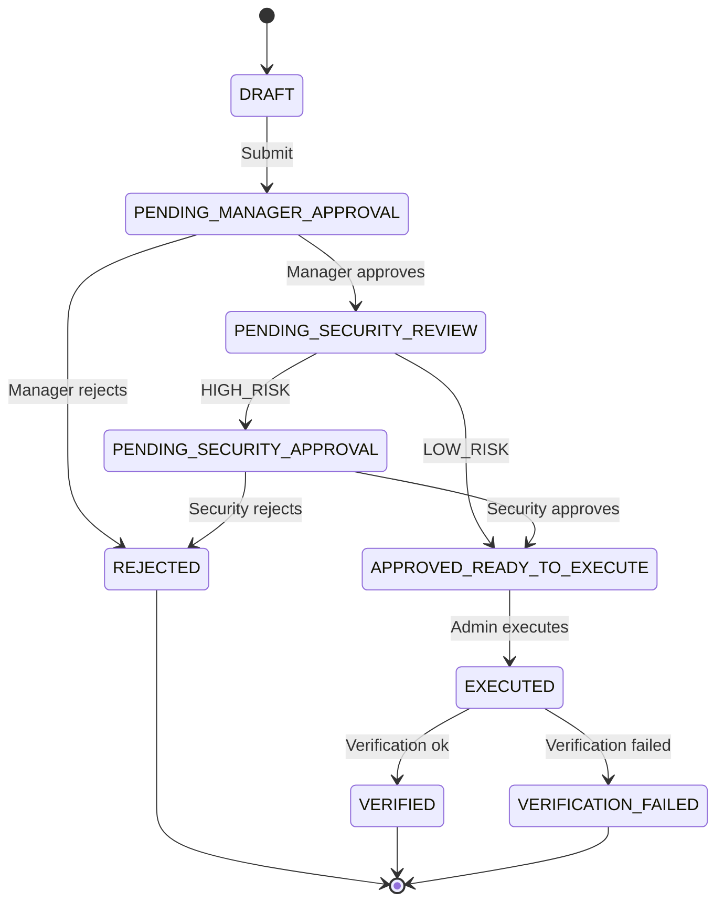
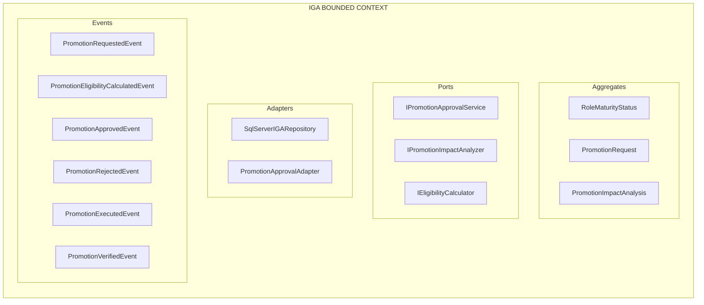

# EP-08: Detailed Design — Advanced IGA (Identity Governance & Administration)

**Version:** 1.0
**Date:** 2026-05-14
**Epic:** EP-08 (Post-MVP)
**User Stories:** US-031, US-032 (EXPANDED to 5-6 stories)
**Functional Story:** FS-12 (Role Promotion & Maturity)

---

## PART 1: IGA Strategic Domain & Role Maturity

### 1.1 IGA Definition

**Identity Governance & Administration** is the practice of:
- Mapping identities to roles and responsibilities
- Supervising and evaluating role evolution over time
- Authorizing responsibility changes (promotions)
- Auditing governance decisions

**In UMS:** This means defining a model where roles and permissions evolve over time, and transitions are governed, audited, and auditable.

### 1.2 Role Maturity Model

Each role has a maturity level reflecting responsibility and seniority:

```csharp
public enum RoleMaturityLevel
{
 JUNIOR = 1, // Apprentice (0-6 months)
 INTERMEDIATE = 2, // Contributor (6-18 months)
 SENIOR = 3, // Expert (18+ months)
 LEAD = 4, // Team leader
 PRINCIPAL = 5 // Architect/Strategist
}

public record RoleMaturityStatus
{
 public Guid UserId { get; init; }
 public Guid RoleId { get; init; }
 public RoleMaturityLevel CurrentLevel { get; init; }
 public RoleMaturityLevel EligibleNextLevel { get; init; }

 // Timeline
 public DateTime AssignedAt { get; init; }
 public DateTime CurrentLevelSince { get; init; }
 public DateTime? EligibleForPromotionAt { get; init; }

 // Compliance
 public int CompletedCertifications { get; init; }
 public int CompletedTrainings { get; init; }
 public decimal PerformanceScore { get; init; } // 0.0 to 5.0
 public bool HasNoComplianceIssues { get; init; }

 public string? BlockingFactor { get; init; }
}
```

---

## PART 2: FS-12 — Role Promotion Process (EXPANDED)

### 2.1 Expanded Definition

**FS-12** manages complete promotion lifecycle:

1. **Eligibility Check** → Verify user eligible
2. **Impact Analysis** → Calculate new permissions, risks
3. **Approval** → Manager + Security approves
4. **Execution** → Apply new role
5. **Verification** → Audit changes

### 2.2 Expanded Sub-Stories (5-6 stories)

#### US-031: Request Role Promotion
**As a:** Senior user in role for 2+ years
**I want:** Request promotion to Lead
**So that:** Compensation and responsibilities align

---

#### US-032: Review Promotion Impact
**As a:** Security Administrator
**I want:** See promotion impact
**So that:** I don't approve risky changes

**Acceptance:**
- Impact shows: current vs new permissions
- Affected systems listed
- Risk score (0-100)
- Conflicting permissions identified

---

#### US-033: Approve/Reject Promotion
**As a:** Manager
**I want:** Approve or reject promotion
**So that:** Team aligned

---

#### US-034: Execute Promotion
**As a:** IGA Admin
**I want:** Execute approved promotion
**So that:** New permissions applied

---

#### US-035: Monitor Promotion Metrics
**As a:** HR Analytics
**I want:** See promotion metrics
**So that:** I identify bottlenecks

---

#### US-036: Promotion Eligibility Engine
**As a:** IGA System
**I want:** Auto-calculate eligibility
**So that:** Notifications automatic

---

### 2.3 Impact Analysis Engine

```csharp
public class RolePromotionImpactAnalysis
{
 public Guid UserId { get; set; }
 public Guid CurrentRoleId { get; set; }
 public Guid TargetRoleId { get; set; }

 // Permissions
 public List<Permission> CurrentPermissions { get; set; }
 public List<Permission> TargetPermissions { get; set; }
 public List<Permission> PermissionsAdded { get; set; }
 public List<Permission> PermissionsRemoved { get; set; }
 public List<Permission> ConflictingPermissions { get; set; }

 // Affected systems
 public List<SystemImpact> AffectedSystems { get; set; }

 // Risk
 public decimal RiskScore { get; set; } // 0-100
 public List<string> RiskFactors { get; set; }

 public DateTime AnalyzedAt { get; set; }
 public string AnalyzedBy { get; set; }
}

public class PromotionImpactAnalysisService
{
 public async Task<RolePromotionImpactAnalysis> AnalyzeAsync(
 User user,
 Role currentRole,
 Role targetRole)
 {
 // 1. Get current permissions
 var currentPermissions = await _authorizationService
 .GetEffectivePermissionsAsync(user.Id);

 // 2. Get target role permissions
 var targetPermissions = await _authorizationService
 .GetPermissionsByRoleAsync(targetRole.Id);

 // 3. Calculate differences
 var added = targetPermissions.Except(currentPermissions).ToList();
 var removed = currentPermissions.Except(targetPermissions).ToList();

 // 4. Detect conflicts (e.g., create + delete = risky)
 var conflicting = DetectConflictingPermissions(added);

 // 5. Identify affected systems
 var affectedSystems = added
 .GroupBy(p => p.System)
 .Select(g => new SystemImpact
 {
 SystemName = g.Key,
 NewPermissionsCount = g.Count(),
 ImpactLevel = CalculateImpactLevel(g)
 })
 .ToList();

 // 6. Calculate risk score
 var riskScore = CalculateRiskScore(added, removed, targetRole, user);

 return new RolePromotionImpactAnalysis
 {
 UserId = user.Id,
 CurrentRoleId = currentRole.Id,
 TargetRoleId = targetRole.Id,
 PermissionsAdded = added,
 PermissionsRemoved = removed,
 ConflictingPermissions = conflicting,
 AffectedSystems = affectedSystems,
 RiskScore = riskScore,
 AnalyzedAt = DateTime.UtcNow
 };
 }
}
```

### 2.4 Promotion State Machine



---

## PART 3: IGA Bounded Context



---

## PART 4: ER Model (EP-08)

```sql
-- ============================================
-- IGA CONTEXT TABLES
-- ============================================

CREATE TABLE [iga].[role_maturity_levels] (
 [id] UNIQUEIDENTIFIER PRIMARY KEY DEFAULT NEWID(),
 [root_tenant_id] UNIQUEIDENTIFIER NOT NULL,
 [user_id] UNIQUEIDENTIFIER NOT NULL,
 [role_id] UNIQUEIDENTIFIER NOT NULL,

 [current_maturity_level] VARCHAR(32) NOT NULL,
 [next_eligible_maturity_level] VARCHAR(32),

 [assigned_at] DATETIME2 NOT NULL,
 [current_level_since] DATETIME2 NOT NULL,
 [eligible_for_promotion_at] DATETIME2,

 [completed_certifications_count] INT DEFAULT 0,
 [completed_trainings_count] INT DEFAULT 0,
 [performance_score] DECIMAL(3,2),
 [has_no_compliance_issues] BIT DEFAULT 1,

 [blocking_factor] NVARCHAR(MAX),
 [last_reviewed_at] DATETIME2,

 CONSTRAINT pk_role_maturity_levels PRIMARY KEY (id, root_tenant_id),
 CONSTRAINT fk_role_maturity_user FOREIGN KEY (user_id, root_tenant_id) REFERENCES [identity].[users](id, root_tenant_id)
);

CREATE TABLE [iga].[promotion_requests] (
 [id] UNIQUEIDENTIFIER PRIMARY KEY DEFAULT NEWID(),
 [root_tenant_id] UNIQUEIDENTIFIER NOT NULL,
 [user_id] UNIQUEIDENTIFIER NOT NULL,

 [current_role_id] UNIQUEIDENTIFIER NOT NULL,
 [target_role_id] UNIQUEIDENTIFIER NOT NULL,

 [requested_at] DATETIME2 NOT NULL DEFAULT GETUTCDATE(),
 [requested_by] UNIQUEIDENTIFIER NOT NULL,
 [request_reason] NVARCHAR(MAX),

 [manager_id] UNIQUEIDENTIFIER NOT NULL,
 [manager_approval_status] VARCHAR(32),
 [manager_decision_at] DATETIME2,

 [security_approval_status] VARCHAR(32),
 [security_decision_at] DATETIME2,

 [status] VARCHAR(32) NOT NULL DEFAULT 'DRAFT',
 [final_status] VARCHAR(32),

 [executed_at] DATETIME2,
 [executed_by] UNIQUEIDENTIFIER,
 [verified_at] DATETIME2,

 CONSTRAINT pk_promotion_requests PRIMARY KEY (id, root_tenant_id),
 CONSTRAINT fk_promotion_requests_user FOREIGN KEY (user_id, root_tenant_id) REFERENCES [identity].[users](id, root_tenant_id)
);

CREATE TABLE [iga].[promotion_impact_analysis] (
 [id] UNIQUEIDENTIFIER PRIMARY KEY DEFAULT NEWID(),
 [root_tenant_id] UNIQUEIDENTIFIER NOT NULL,
 [promotion_request_id] UNIQUEIDENTIFIER NOT NULL,

 [risk_score] DECIMAL(5,2),
 [risk_level] VARCHAR(32),
 [new_permissions_count] INT,
 [removed_permissions_count] INT,
 [affected_systems_count] INT,

 [conflicting_permissions] NVARCHAR(MAX),
 [risk_factors] NVARCHAR(MAX),
 [suggested_mitigations] NVARCHAR(MAX),

 [analyzed_at] DATETIME2 NOT NULL DEFAULT GETUTCDATE(),
 [analyzed_by] VARCHAR(255),

 CONSTRAINT pk_promotion_impact_analysis PRIMARY KEY (id, root_tenant_id),
 CONSTRAINT fk_promotion_impact_request FOREIGN KEY (promotion_request_id, root_tenant_id) REFERENCES [iga].[promotion_requests](id, root_tenant_id)
);

CREATE TABLE [iga].[promotion_eligible_notifications] (
 [id] UNIQUEIDENTIFIER PRIMARY KEY DEFAULT NEWID(),
 [root_tenant_id] UNIQUEIDENTIFIER NOT NULL,
 [user_id] UNIQUEIDENTIFIER NOT NULL,

 [eligible_for_next_level] VARCHAR(32),
 [eligible_at] DATETIME2 NOT NULL,
 [notification_sent_at] DATETIME2,
 [user_acknowledged_at] DATETIME2,

 CONSTRAINT pk_promotion_eligible_notifications PRIMARY KEY (id, root_tenant_id)
);

-- Indices
CREATE INDEX idx_role_maturity_user ON [iga].[role_maturity_levels] (user_id, root_tenant_id);
CREATE INDEX idx_promotion_requests_user ON [iga].[promotion_requests] (user_id, root_tenant_id)
 WHERE status IN ('PENDING_MANAGER_APPROVAL', 'PENDING_SECURITY_REVIEW');
```

---

## PART 5: Integration (IGA with other contexts)

### 5.1 IGA ↔ Approvals

Promotion requests may require formal approval if target role is sensitive:

```csharp
if (targetRole.RiskLevel == "CRITICAL")
{
 var approvalRequest = await _approvalService.CreateApprovalRequestAsync(
 workflow: "ROLE_PROMOTION_APPROVAL",
 requester: user.Id,
 linkedEntity: promotionRequest.Id);
}
```

### 5.2 IGA ↔ Authorization

When promotion executes, user permissions updated:

```csharp
await _authorizationService.RevokePermissionsAsync(user.Id, currentRole.Id);
await _authorizationService.AssignPermissionsAsync(user.Id, targetRole.Id);
```

### 5.3 IGA ↔ Audit

All events audited:

```csharp
await _auditService.LogAsync(new AuditEvent
{
 EventType = "PROMOTION_EXECUTED",
 UserId = user.Id,
 Details = new
 {
 FromRole = currentRole.Name,
 ToRole = targetRole.Name,
 RiskScore = impactAnalysis.RiskScore
 }
});
```

---

## Summary EP-08 Completed

- **FS-12 Expanded**: 6 sub-stories (US-031 to US-036)
- **IGA Bounded Context**: Defined
- **Role Maturity Model**: 5 levels (JUNIOR to PRINCIPAL)
- **Promotion Impact Analysis**: Risk scoring, permission analysis
- **ER Model**: Complete tables
- **Integration**: IGA ↔ Approvals, Authorization, Audit

---

**Approved by:** Principal Architect
**Date:** 2026-05-14
