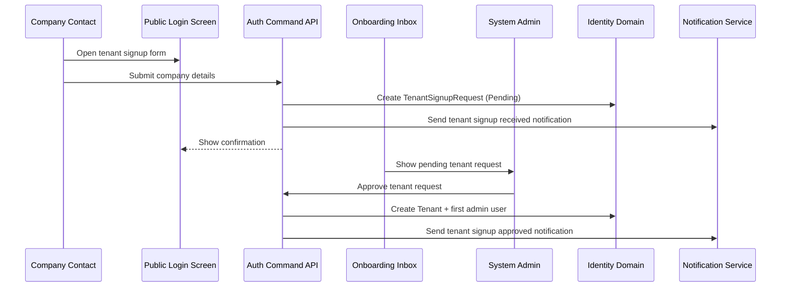
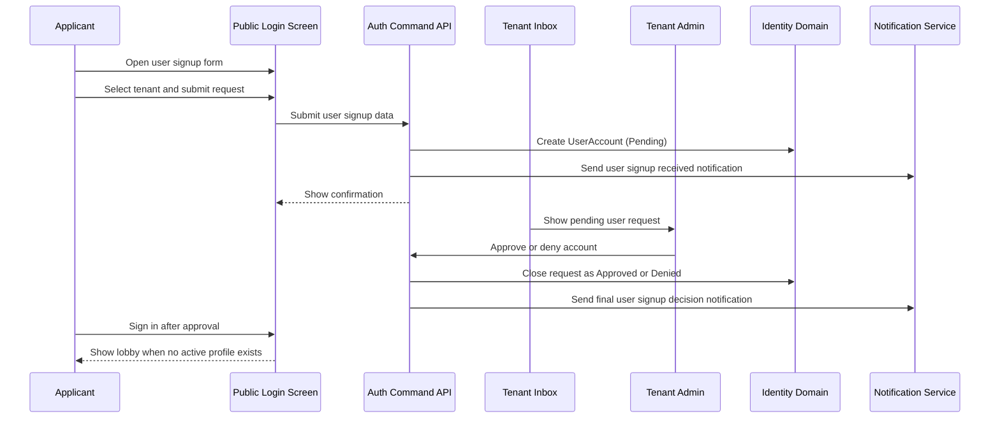
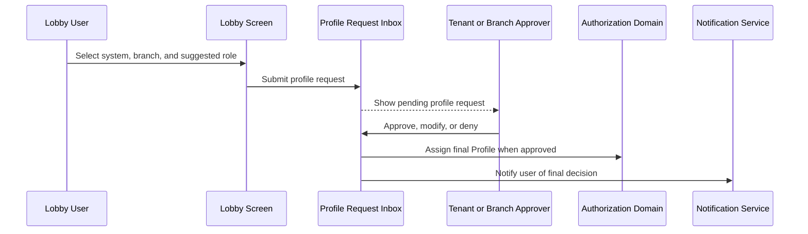

# EP-09: Detailed Design - Onboarding Approval Inbox

**Version:** 1.0  
**Date:** 2026-06-01  
**Epic:** EP-09 (Launch Readiness)  
**Functional Stories:** FS-21, FS-22, FS-23, FS-24  
**ADR:** ADR-0075

## 1. Design Goal

This epic introduces a two-phase onboarding model:

- Phase 1 admits the user into the tenant.
- Phase 2 assigns operational entitlements through a profile request workflow.

The design keeps the operator experience simple while preserving tenant isolation and the separation between identity admission and authorization.

The design also requires full lifecycle traceability for user signup and profile requests per tenant. Administrators must close each request with a final Approved or Denied outcome, and the requester must be notified automatically when the final decision is recorded.

## 2. Product Surface

| Surface | Visible to | Purpose |
|---|---|---|
| Identity navigation entry | Authorized onboarding approvers | Opens the onboarding approval inbox. |
| Tenant onboarding inbox tab | System Admin | Reviews company signup requests. |
| Team management: Access requests tab | Tenant Admin | Reviews pending user signup requests for the active tenant. |
| Team management: Profile requests tab | Tenant Admin or delegated Branch Manager | Reviews pending profile requests and assigns the final role. |
| User lobby | Active users without profile | Shows the tenant welcome state and profile request form. |
| Public signup entry points | Anonymous visitors | Submit tenant or user signup requests. |

## 3. Approval Routing Matrix

| Request Type | Source of Truth | Default Status | Review Scope | Approval Outcome |
|---|---|---|---|---|
| Tenant signup request | `TenantSignupRequest` aggregate | Pending | Global | Creates tenant + first admin account + temporary password notification |
| User signup request | `UserAccount` aggregate | Pending | Current tenant | Approves to activate the account or denies without tenant access |
| Profile access request | `ApprovalRequest` or dedicated profile request model | PendingAssignment | Current tenant or delegated branch | Approves with final role assignment or denies without profile assignment |

## 4. Lifecycle Closure Contract

| Request Type | Required Terminal Outcomes | Closure Owner | Notification Requirement |
|---|---|---|---|
| User signup request | Approved, Denied | Tenant Admin | Notify the applicant when access is approved or denied. |
| Profile access request | Approved, Denied | Tenant Admin or delegated Branch Manager | Notify the requester when the profile request is approved or denied. |

All lifecycle records must keep tenant, requester, current status, final outcome, decision date, approver, and decision reason when provided. Pending records remain actionable in the inbox until a final decision is recorded.

## 5. State Model

### 5.1 Tenant Signup Request

| State | Meaning | Allowed Next Action |
|---|---|---|
| Pending | Request submitted and waiting for review. | Approve or reject |
| Approved | Tenant created and first admin account provisioned. | None |
| Rejected | Request closed without tenant creation. | None |

### 5.2 User Signup Request

| State | Meaning | Allowed Next Action |
|---|---|---|
| Pending | Account exists but cannot sign in yet. | Approve or deny |
| ActiveWithoutProfile | Tenant admin approved the request, but no profile is assigned. | Request profile |
| Active | At least one active profile exists. | None |
| Denied | Request closed without activating tenant access. | None |

### 5.3 Profile Request

| State | Meaning | Allowed Next Action |
|---|---|---|
| PendingAssignment | User requested system, branch, and suggested role. | Approve, modify, or deny |
| Approved | A final role was granted. The granted role may match the request or be modified by the approver. | None |
| Denied | No profile was assigned for the requested scope. | None |

## 6. Sequence Diagrams

### 6.1 Tenant Signup

### 6.2 User Signup

### 6.3 Profile Request

## 7. UI Placement

| Location | Component | Notes |
|---|---|---|
| Login screen | Entry buttons | Links to user signup and tenant signup forms. |
| Identity module navigation | Onboarding Approval Inbox | New visible option for approvers. |
| Tenant dashboard | Pending tenant requests panel | Can reuse the same read model for context, but the inbox remains the primary review surface. |
| Team management | Access Requests tab | Shows tenant-scoped pending user requests with approve and deny actions. |
| Team management | Profile Requests tab | Shows pending profile requests with approve, modify, and deny actions. |
| User lobby | Profile request form | Lets users without profiles request system, branch, and suggested role. |

## 8. Implementation Plan

| Phase | Work Item | Dependency | Outcome |
|---|---|---|---|
| 1 | Keep tenant signup requests as `TenantSignupRequest` and expose them in the inbox. | Existing tenant onboarding command path | Global admins can review company requests from one place. |
| 2 | Keep user signup requests as pending `UserAccount` rows and surface approve and deny actions in the tenant inbox. | Existing user signup, activation, and denial commands | Tenant admins can close user access requests without cross-tenant leakage. |
| 3 | Add lobby routing for authenticated users without active profile. | Authorization graph no-profile result | Users can enter the tenant without seeing operational menus. |
| 4 | Add profile request workflow with system, branch, requested role, and justification. | Profile and role catalogs | Users can request entitlements explicitly. |
| 5 | Add approval actions for approve, modify, and deny. | Approval, denial, and profile assignment commands | Approvers can assign the exact final role or close the request as denied while keeping audit trail. |
| 6 | Add explicit approval capability checks by scope. | Authorization graph and role assignments | Only authorized approvers can use inbox actions. |
| 7 | Add lifecycle history and final decision notifications for user signup and profile requests. | Notification templates and audit model | Every request remains traceable until Approved or Denied. |
| 8 | Add future payment-verification states if the business requires them. | Product decision | Tenant onboarding can pause for commercial validation without redesigning the request entry point. |

## 9. Traceability

| Type | References |
|---|---|
| Functional Stories | FS-21, FS-22, FS-23, FS-24 |
| ADR | ADR-0075 |
| Domain Entities | `TenantSignupRequest`, `Tenant`, `UserAccount`, `ApprovalRequest`, `Profile`, `Role`, `Branch` |
| Notifications | `TenantSignupRequestReceived`, `TenantSignupApproved`, `UserSignupRequestReceived`, `UserSignupApproved`, `UserSignupDenied`, `ProfileRequestApproved`, `ProfileRequestDenied` |
