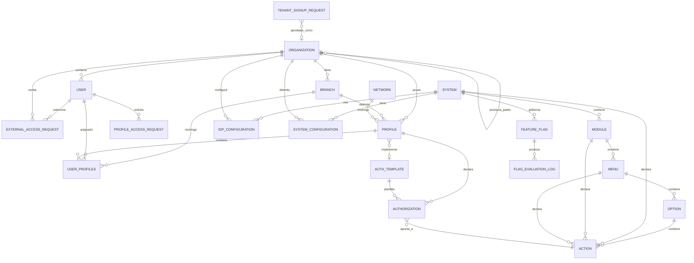

# Modelo Conceptual de Datos

Este documento detalla el esquema de datos conceptual, estructuras de entidades, relaciones y diagramas Entidad-Relacion para el **User Management System (UMS)** bajo la estrategia spec-driven AI BMAD-METHOD.

> **Nota de implementacion autoritativa:** El modelo ER fisico alineado al codigo se mantiene en [database-design-er.md](../../architecture/blueprints-es/database-design-er.md). Este modelo conceptual usa nombres de negocio y debe leerse con el alineamiento de onboarding introducido por EP-09.

---

## 1. Diagrama Entidad-Relacion

### Alineamiento Conceptual de Onboarding

| Entidad Conceptual | Fuente Implementada | Proposito |
|---|---|---|
| `TENANT_SIGNUP_REQUEST` | `identity.TenantSignupRequests` | Traza el alta publica de empresa antes de crear el tenant. |
| `USER` con estado pendiente | `identity.UserAccounts.StatusId = Pending` | Traza solicitudes de alta de usuario para un tenant existente. |
| `PROFILE_ACCESS_REQUEST` | `approvals.ApprovalRequests` | Traza solicitudes de perfil desde usuarios en lobby. |

Los resultados finales de negocio para alta de usuario y solicitud de perfil son `Approved` y `Denied`. La persistencia implementada actualmente guarda la denegacion de perfil como `ApprovalStatus.Rejected`, que debe traducirse a `Denied` en boundaries de aplicacion y UI.

---

## 2. Especificacion de Atributos de Entidades

### A. User Entity
- `id` (UUID, PK): Unique identifier for the user.
- `organization_id` (UUID, FK): Owning tenant organization.
- `email` (string, Unique): Corporate email address.
- `password_hash` (string, **Nullable**): Populated **only** when the Internal Bcrypt Strategy adapter is active for the organization. `NULL` when authentication is delegated to an external IdP.
- `identity_reference` (string): External unique ID linking to corporate HR/ERP records.
- `status` (enum): `ACTIVE`, `SUSPENDED`, or `TERMINATED`.
- `created_at` (datetime2): Marca de tiempo de creacion del registro.

### B. Entidad Organization (Organización)
> [!IMPORTANT]
> Esta entidad representa un nodo empresarial. Una organización puede ser el Tenant corporativo principal (`INTERNAL`), o un actor externo como un `CLIENT` o `SUPPLIER` B2B.

- `id` (UUID, PK): Identificador único de la organización.
- `tenant_id` (UUID, FK): El tenant maestro general al que pertenece esta organizacion.
- `parent_organization_id` (UUID, FK, Nullable): Enlace autorreferencial para agrupación jerárquica (Ej. Grupo Matriz -> Subsidiaria).
- `type` (enum): `INTERNAL`, `CLIENT`, `SUPPLIER`, `PARTNER`.
- `name` (string): Nombre legal corporativo de la empresa.
- `company_reference` (string): Código de empresa externo que enlaza con el ERP corporativo (ej. código SAP).
- `idp_strategy` (enum): `INTERNAL_BCRYPT`, `ZITADEL`, `AZURE_AD`, `OKTA`, `SAML2`, `GENERIC_OIDC`.
- `status` (enum): `ACTIVE` o `BLOCKED`.

### C. Branch Entity (Sedes)
> [!IMPORTANT]
> This entity represents a physical or logical sub-unit of an Organization (e.g., *Callao Port Terminal*, *Lurin Warehouse*). It is the **branch context** used for hierarchical, context-aware authorization routing.

- `id` (UUID, PK): Unique identifier for the branch.
- `organization_id` (UUID, FK): Owning tenant organization.
- `name` (string): Human-readable branch name (e.g., `Callao Terminal`).
- `code` (string, Unique within org): Short code for the branch (e.g., `BRANCH_CALLAO`).
- `geofencing_metadata` (nvarchar(max) JSON, Nullable): Restricciones opcionales de geofencing aplicadas a politicas de acceso (ej. `{ "radius_km": 10, "center_lat": -12.05, "center_lng": -77.12 }`).
- `status` (enum): `ACTIVE` or `SUSPENDED`.

### D. Profile Entity
- `id` (UUID, PK): Unique identifier for the profile.
- `organization_id` (UUID, FK): The owning tenant organization.
- `branch_id` (UUID, FK, **Nullable**): Optional scoping to a specific branch. `NULL` means profile applies org-wide.
- `name` (string): Human-readable profile name (e.g., `PortOperator_Callao`).
- `template_id` (UUID, FK, Nullable): Optional linked Authorization Template (auto-assigned or manually attached).
- `auto_assigned` (boolean): `true` if template was assigned via the Automatic Rule-Based Engine.

### E. Authorization Entity
- `id` (UUID, PK): Unique identifier for the authorization record.
- `profile_id` (UUID, FK, Nullable): Linked profile if customized locally.
- `template_id` (UUID, FK, Nullable): Linked template if inherited from a blueprint.
- `action_id` (UUID, FK): Mapped system action.
- `effect` (enum): `ALLOW` or `DENY`.

### F. Auth Template Entity
- `id` (UUID, PK): Unique identifier for the template.
- `name` (string): Human-readable template name (e.g., `Analyst_Baseline_v1`).
- `version` (string): Semantic version (e.g., `1.0.0`).
- `system_id` (UUID, FK): The target client system this template is designed for.
- `created_by` (UUID, FK): Admin user who created the template.
- `created_at` (datetime2).

### G. System Entity
- `id` (UUID, PK): Unique identifier for the application/sub-portal.
- `name` (string, Unique): Application name (e.g., `Route Planner`).
- `system_code` (string, Unique): Machine-readable slug (e.g., `route_planner`).
- `base_url` (string): Base physical URL for routing.
- `api_credential_hash` (string): Hashed M2M credential for gateway validation.

### H. Module / Menu / Option / Action Entities
> [!NOTE]
> These form the hierarchical navigation topology compiled into the Authorization Graph.
> The resource hierarchy is: `System → Module → Menu → Option`. Actions can be attached at any level (System, Module, Menu, or Option).

- `Module`: `module_id` (UUID, PK), `system_id` (UUID, FK → System), `name` (string, unique per system), `code` (string, machine-readable), `description` (text, optional), `is_active` (boolean)
- `Menu`: `id`, `module_id (FK)`, `label`, `order`, `icon_code`
- `Option`: `id`, `menu_id (FK)`, `label`, `route_path`
- `Actions`: `action_id` (UUID, PK), `action_name` (string), `action_code` (string), `level` (enum: system, module, menu, option), `level_id` (UUID - FK to the respective level entity), `is_active` (boolean)

### I. IDP_CONFIGURATION Entity *(NEW — Configuration Context)*
- `id` (UUID, PK)
- `tenant_id` (UUID, FK → ORGANIZATION)
- `system_id` (UUID, FK, Nullable → SYSTEM): `NULL` means applies to all systems for the tenant
- `code` (string, Unique por alcance): Clave técnica estable del registro de configuración IdP.
- `value` (nvarchar(max) JSON): Payload operativo de configuracion consumido en runtime.
- `description` (text): Propósito funcional, impacto, comportamiento esperado y alcance aplicable.
- `provider_type` (enum): `INTERNAL_BCRYPT`, `ZITADEL`, `AZURE_AD`, `OKTA`, `KEYCLOAK`, `AUTH0`, `GOOGLE`, `LDAP`, `SAML2`, `GENERIC_OIDC`
- `priority` (integer): Resolution order (lower = higher priority)
- `fallback_to` (UUID, FK, Nullable → IDP_CONFIGURATION)
- `config_payload` (nvarchar(max) JSON, encrypted): Authority URL, client_id, scopes, claim mappings
- `config_secret_ref` (string): Vault path for encrypted credentials (e.g., `vault://ums/secrets/{tenant}/client_secret`)
- `domain_hints` (text[]): Email domain patterns for IdP routing (e.g., `@logisticscorp.com`)
- `mfa_enforced` (boolean)
- `status` (enum): `ACTIVE`, `INACTIVE`, `DRAFT`
- `version` (string): Semantic version of this config record

### J. SYSTEM_CONFIGURATION Entity *(NEW — Configuration Context)*
- `id` (UUID, PK)
- `system_id` (UUID, FK → SYSTEM)
- `tenant_id` (UUID, FK → ORGANIZATION)
- `code` (string, Unique por alcance): Clave técnica estable del parámetro.
- `value` (nvarchar(max) JSON): Valor operativo usado por el sistema en runtime.
- `description` (text): Propósito funcional, impacto, comportamiento esperado y alcance.
- `version` (string): Semantic version (e.g., `2.1.0`)
- `config_payload` (nvarchar(max) JSON): Configuracion completa de comportamiento (auth, session, MFA, onboarding, branding, modules)
- `status` (enum): `ACTIVE`, `ARCHIVED`, `DRAFT`
- `published_at` (datetime2)
- `published_by` (UUID, FK → USER)

### K. FEATURE_FLAG Entity *(NEW — Configuration Context)*
- `id` (UUID, PK)
- `code` (string, Unique global): Identificador canónico de la bandera (alias de `flag_code` para consistencia de catálogo).
- `value` (nvarchar(max) JSON): Valor/payload operativo efectivo (`enabled`, variante o rollout object).
- `description` (text): Propósito funcional, impacto, comportamiento esperado y alcance.
- `flag_code` (string, Unique globally): Machine-readable identifier (e.g., `FLEET_DISPATCH_NEW_UI_V2`)
- `type` (enum): `BOOLEAN`, `VARIANT`, `PERCENTAGE`
- `targets` (nvarchar(max) JSON): Reglas de alcance `{ systems, tenants, organizations, branches, roles, users, environments, rollout_percentage }`
- `status` (enum): `ACTIVE`, `INACTIVE`, `ARCHIVED`
- `linked_resource_type` (string, Nullable): `menu`, `module`, `endpoint`, `workflow`
- `linked_resource_id` (UUID, Nullable)
- `version` (string)
- `created_by` (UUID, FK → USER)
- `created_at` (datetime2)

### L. FLAG_EVALUATION_LOG Entity *(NEW — Audit Context)*
- `id` (UUID, PK)
- `flag_id` (UUID, FK → FEATURE_FLAG)
- `evaluated_for_type` (string): `user`, `tenant`, `organization`
- `evaluated_for_id` (UUID)
- `result` (boolean or variant value)
- `evaluated_at` (datetime2)

### M. Entidad EXTERNAL_ACCESS_REQUEST *(NUEVO — Contexto de Aprobación B2B)*
- `id` (UUID, PK)
- `sponsor_user_id` (UUID, FK → USER): Usuario interno que solicita acceso para un tercero.
- `target_organization_id` (UUID, FK, Nullable → ORGANIZATION): La organización cliente/proveedor B2B externa.
- `target_user_email` (string): Correo del usuario externo.
- `requested_profile_id` (UUID, FK → PROFILE): Rol sugerido para el usuario externo.
- `justification` (text): Razón de negocio para otorgar el acceso.
- `status` (enum): `DRAFT`, `PENDING_APPROVAL`, `APPROVED`, `REJECTED`.
- `approved_by` (UUID, FK, Nullable → USER): Administrador PAP que autorizó la solicitud.

---

## 3.1 Estándar Obligatorio de Catálogos Paramétricos

Todas las entidades de parámetros/configuración/catálogos DEBEN incluir como mínimo:

- `code`
- `value`
- `description`

`description` DEBE documentar claramente:

1. para qué se usa,
2. impacto funcional,
3. comportamiento esperado,
4. alcance/contexto de configuración aplicable.

Este estándar aplica a parámetros globales, por tenant y por system/suite; feature flags; políticas; configuraciones de seguridad; workflows; reglas de negocio; y configuraciones de notificación/aprobación.

Ademas, estas entidades deben definir:

- constraints únicos por alcance,
- estrategia de versionado,
- metadatos de auditoría,
- eventos de trazabilidad,
- estrategia de cacheabilidad/invalidación,
- extensibilidad futura.

---

## 4. Key Precedence Axioms (Engine Rules)

1. **Deny-by-Default**: An action is blocked until an explicit `ALLOW` is declared by a profile or template.
2. **Permissive Union**: If no `DENY` is present, the user inherits all active `ALLOW` blocks from all assigned profiles.
3. **Explicit Deny Dominance**: A `DENY` from *any* active profile instantly invalidates matching `ALLOW` blocks across all other profiles.
4. **Branch Scope Precedence**: Branch-scoped profiles override org-wide profiles for the matching branch context.
