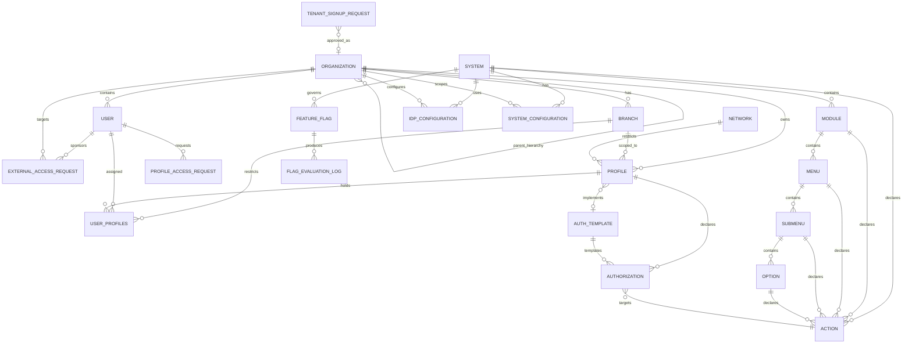

# Conceptual Data Model

This document describes the **business-readable conceptual data model** for the User Management System (UMS).

It intentionally uses business-friendly names, but every concept must map to the DDD aggregate model and to the physical ER model.

> **Authoritative implementation note:** The code-aligned physical ER model is maintained in [Database Design ER](../../architecture/blueprints/database-design-er.md). The DDD aggregate catalog is maintained in the [Domain Aggregate Index](../../domain/index.md). Use [Data Model Consistency Review](../../architecture/blueprints/data-model-consistency-review.md) to validate alignment across conceptual, domain, physical, and persistence views.

---

## 1. Conceptual-to-Physical Mapping

The following table prevents ambiguity between early business terminology and the current DDD / physical model.

| Conceptual Name | DDD / Physical Name | Notes |
|---|---|---|
| `ORGANIZATION` | `TENANT` / `Tenant` | Business organization maps to the tenant aggregate and tenant-scoped persistence model. |
| `USER` | `USER_ACCOUNT` / `UserAccount` | User identity and lifecycle are governed by the UserAccount aggregate. |
| `BRANCH` | `BRANCH` / `Tenant.Branch` | Branch is an owned child entity inside Tenant. |
| `PROFILE` | `PROFILE` / `Profile` | User role assignment and scoped authorization profile. |
| `AUTH_TEMPLATE` | `PERMISSION_TEMPLATE` / `PermissionTemplate` | Template-based permission blueprint. |
| `AUTHORIZATION` | `PERMISSION_TEMPLATE_ITEM` / `PROFILE_PERMISSION` | Authorization is materialized through template items and profile permissions. |
| `SYSTEM` | `SYSTEM_SUITE` / `SystemSuite` | Application suite or product surface governed by Authorization BC. |
| `MODULE` | `FUNCTIONAL_MODULE` / `SystemSuite.Module` | Functional module under a system suite. |
| `MENU` | `FUNCTIONAL_MENU` / `SystemSuite.Menu` | Functional menu under a module. |
| `SUBMENU` | `FUNCTIONAL_SUBMENU` / `SystemSuite.SubMenu` | Required level in the physical and DDD hierarchy. |
| `OPTION` | `FUNCTIONAL_OPTION` / `SystemSuite.Option` | Functional option under a submenu. |
| `ACTION` | `ACTION` / `SystemSuite.Action` | Action can be attached to the functional hierarchy according to the authorization graph rules. |
| `SYSTEM_CONFIGURATION` | `APP_CONFIGURATION` / `AppConfiguration` | Runtime configuration with global, tenant, or system scope. |
| `PROFILE_ACCESS_REQUEST` | `APPROVAL_REQUEST` / `ApprovalRequest` | Profile request is implemented through the generic approval request model. |
| `EXTERNAL_ACCESS_REQUEST` | `APPROVAL_REQUEST` / `ApprovalRequest` | B2B access request is modeled as an approval workflow unless a dedicated record is introduced by ADR. |

---

## 2. Entity-Relationship Diagram



### Onboarding Conceptual Alignment

| Conceptual Entity | Implemented Source | Purpose |
|---|---|---|
| `TENANT_SIGNUP_REQUEST` | `identity.TenantSignupRequests` | Tracks public company signup before tenant creation. |
| `USER` with pending status | `identity.UserAccounts.StatusId = Pending` | Tracks user signup requests for an existing tenant. |
| `PROFILE_ACCESS_REQUEST` | `approvals.ApprovalRequests` | Tracks profile access requests from lobby users. |

The final business outcomes for user signup and profile access requests are `Approved` and `Denied`. Current implemented persistence stores profile denial as `ApprovalStatus.Rejected`, which must be translated to `Denied` at application and UI boundaries.

---

## 3. Entity Attributes Specification

### A. User Entity

> Physical / DDD mapping: `USER_ACCOUNT` / `UserAccount`.

- `id` (UUID, PK): Unique identifier for the user.
- `organization_id` (UUID, FK): Owning tenant organization.
- `email` (string, Unique): Corporate email address.
- `password_hash` (string, **Nullable**): Populated **only** when the Internal Bcrypt Strategy adapter is active for the organization. `NULL` when authentication is delegated to an external IdP.
- `identity_reference` (string): External unique ID linking to corporate HR/ERP records.
- `status` (enum): `ACTIVE`, `SUSPENDED`, or `TERMINATED`.
- `created_at` (datetime2): Record creation timestamp.

### B. Organization Entity

> Physical / DDD mapping: `TENANT` / `Tenant`.

This entity represents a company node. An organization can be the primary corporate Tenant (`INTERNAL`), or an external actor such as a B2B `CLIENT` or `SUPPLIER`.

- `id` (UUID, PK): Unique identifier for the organization.
- `tenant_id` (UUID, FK): The overarching master tenant this organization belongs to.
- `parent_organization_id` (UUID, FK, Nullable): Self-referencing link for hierarchical grouping.
- `type` (enum): `INTERNAL`, `CLIENT`, `SUPPLIER`, `PARTNER`.
- `name` (string): Corporate legal company name.
- `company_reference` (string): External company code linking to corporate ERP.
- `idp_strategy` (enum): `INTERNAL_BCRYPT`, `ZITADEL`, `AZURE_AD`, `OKTA`, `SAML2`, `GENERIC_OIDC`.
- `status` (enum): `ACTIVE` or `BLOCKED`.

### C. Branch Entity

> Physical / DDD mapping: `BRANCH` / `Tenant.Branch`.

- `id` (UUID, PK): Unique identifier for the branch.
- `organization_id` (UUID, FK): Owning tenant organization.
- `name` (string): Human-readable branch name.
- `code` (string, Unique within organization): Short branch code.
- `geofencing_metadata` (nvarchar(max) JSON, Nullable): Optional geofencing constraints.
- `status` (enum): `ACTIVE` or `SUSPENDED`.

### D. Profile Entity

> Physical / DDD mapping: `PROFILE` / `Profile`.

- `id` (UUID, PK): Unique identifier for the profile.
- `organization_id` (UUID, FK): The owning tenant organization.
- `branch_id` (UUID, FK, **Nullable**): Optional branch scope. `NULL` means profile applies organization-wide.
- `name` (string): Human-readable profile name.
- `template_id` (UUID, FK, Nullable): Optional linked Authorization Template.
- `auto_assigned` (boolean): `true` if assigned via the automatic rule-based engine.

### E. Authorization Entity

> Physical / DDD mapping: `PERMISSION_TEMPLATE_ITEM` and `PROFILE_PERMISSION`.

- `id` (UUID, PK): Unique identifier for the authorization record.
- `profile_id` (UUID, FK, Nullable): Linked profile if customized locally.
- `template_id` (UUID, FK, Nullable): Linked template if inherited from a blueprint.
- `action_id` (UUID, FK): Mapped system action.
- `effect` (enum): `ALLOW` or `DENY`.

### F. Auth Template Entity

> Physical / DDD mapping: `PERMISSION_TEMPLATE` / `PermissionTemplate`.

- `id` (UUID, PK): Unique identifier for the template.
- `name` (string): Human-readable template name.
- `version` (string): Semantic version.
- `system_id` (UUID, FK): The target client system this template is designed for.
- `created_by` (UUID, FK): Admin user who created the template.
- `created_at` (datetime2).

### G. System Entity

> Physical / DDD mapping: `SYSTEM_SUITE` / `SystemSuite`.

- `id` (UUID, PK): Unique identifier for the application/sub-portal.
- `name` (string, Unique): Application name.
- `system_code` (string, Unique): Machine-readable slug.
- `base_url` (string): Base physical URL for routing.
- `api_credential_hash` (string): Hashed M2M credential for gateway validation.

### H. Module / Menu / SubMenu / Option / Action Entities

> Physical / DDD mapping: `FUNCTIONAL_MODULE`, `FUNCTIONAL_MENU`, `FUNCTIONAL_SUBMENU`, `FUNCTIONAL_OPTION`, `ACTION` inside `SystemSuite`.

These form the hierarchical navigation topology compiled into the Authorization Graph.

The resource hierarchy is:

```text
System → Module → Menu → SubMenu → Option
```

Actions may be attached at any level according to the physical model and authorization graph contract:

```text
System / Module / Menu / SubMenu / Option
```

- `Module`: `module_id` (UUID, PK), `system_id` (UUID, FK → System), `name`, `code`, `description`, `is_active`.
- `Menu`: `id`, `module_id (FK)`, `label`, `order`, `icon_code`.
- `SubMenu`: `id`, `menu_id (FK)`, `label`, `order`, `icon_code`.
- `Option`: `id`, `submenu_id (FK)`, `label`, `route_path`.
- `Action`: `action_id` (UUID, PK), `action_name`, `action_code`, `level`, `level_id`, `is_active`.

### I. IDP_CONFIGURATION Entity

> Physical / DDD mapping: `IDP_CONFIGURATION` / `IdpConfiguration`.

- `id` (UUID, PK)
- `tenant_id` (UUID, FK → ORGANIZATION)
- `system_id` (UUID, FK, Nullable → SYSTEM): `NULL` means applies to all systems for the tenant
- `code` (string, Unique by scope): Stable technical key for the IdP configuration record.
- `value` (nvarchar(max) JSON): Operational configuration payload consumed by runtime.
- `description` (text): Functional purpose, impact, expected behavior, and applicable scope.
- `provider_type` (enum): `INTERNAL_BCRYPT`, `ZITADEL`, `AZURE_AD`, `OKTA`, `KEYCLOAK`, `AUTH0`, `GOOGLE`, `LDAP`, `SAML2`, `GENERIC_OIDC`
- `priority` (integer): Resolution order.
- `fallback_to` (UUID, FK, Nullable → IDP_CONFIGURATION)
- `config_payload` (nvarchar(max) JSON, encrypted): Authority URL, client_id, scopes, claim mappings
- `config_secret_ref` (string): Vault path for encrypted credentials
- `domain_hints` (text[]): Email domain patterns for IdP routing
- `mfa_enforced` (boolean)
- `status` (enum): `ACTIVE`, `INACTIVE`, `DRAFT`
- `version` (string): Semantic version of this config record

### J. SYSTEM_CONFIGURATION Entity

> Physical / DDD mapping: `APP_CONFIGURATION` / `AppConfiguration`.

- `id` (UUID, PK)
- `system_id` (UUID, FK → SYSTEM)
- `tenant_id` (UUID, FK → ORGANIZATION)
- `code` (string, Unique by scope): Stable technical key for the configuration parameter.
- `value` (nvarchar(max) JSON): Operational value used by the system at runtime.
- `description` (text): Functional purpose, impact, expected behavior, and scope.
- `version` (string): Semantic version.
- `config_payload` (nvarchar(max) JSON): Full behavioral config.
- `status` (enum): `ACTIVE`, `ARCHIVED`, `DRAFT`
- `published_at` (datetime2)
- `published_by` (UUID, FK → USER)

### K. FEATURE_FLAG Entity

> Physical / DDD mapping: `FEATURE_FLAG` / `FeatureFlag`.

- `id` (UUID, PK)
- `code` (string, Unique globally): Canonical feature flag identifier.
- `value` (nvarchar(max) JSON): Effective operational flag value/payload.
- `description` (text): Functional purpose, impact, expected behavior, and scope.
- `flag_code` (string, Unique globally): Machine-readable identifier.
- `type` (enum): `BOOLEAN`, `VARIANT`, `PERCENTAGE`
- `targets` (nvarchar(max) JSON): Scoping rules.
- `status` (enum): `ACTIVE`, `INACTIVE`, `ARCHIVED`
- `linked_resource_type` (string, Nullable)
- `linked_resource_id` (UUID, Nullable)
- `version` (string)
- `created_by` (UUID, FK → USER)
- `created_at` (datetime2)

### L. FLAG_EVALUATION_LOG Entity

> Physical / DDD mapping: `FLAG_EVALUATION_LOG` / `FeatureFlag.FlagEvaluationLog`.

- `id` (UUID, PK)
- `flag_id` (UUID, FK → FEATURE_FLAG)
- `evaluated_for_type` (string): `user`, `tenant`, `organization`
- `evaluated_for_id` (UUID)
- `result` (boolean or variant value)
- `evaluated_at` (datetime2)

### M. EXTERNAL_ACCESS_REQUEST Entity

> Physical / DDD mapping: currently represented by `ApprovalRequest` unless a dedicated B2B request persistence record is introduced by ADR.

- `id` (UUID, PK)
- `sponsor_user_id` (UUID, FK → USER): Internal user requesting access for a third party.
- `target_organization_id` (UUID, FK, Nullable → ORGANIZATION): The external B2B client/supplier organization.
- `target_user_email` (string): Email of the external user.
- `requested_profile_id` (UUID, FK → PROFILE): Suggested role for the external user.
- `justification` (text): Business rationale for granting access.
- `status` (enum): `DRAFT`, `PENDING_APPROVAL`, `APPROVED`, `REJECTED`.
- `approved_by` (UUID, FK, Nullable → USER): Admin who authorized the request.

---

## 4. Mandatory Parametric Catalog Standard

All parameter/configuration/catalog entities MUST include, at minimum:

- `code`
- `value`
- `description`

`description` MUST clearly document:

1. purpose of use,
2. functional impact,
3. expected behavior,
4. applicable scope/configuration context.

This standard applies to global, tenant, and system/suite scoped parameters; feature flags; policies; security configurations; workflows; business rules; and notification/approval configurations.

All these entities must also define:

- uniqueness constraints by scope,
- versioning strategy,
- audit metadata,
- traceability events,
- cacheability/invalidation strategy,
- forward extensibility.

---

## 5. Key Precedence Axioms (Engine Rules)

1. **Deny-by-Default**: An action is blocked until an explicit `ALLOW` is declared by a profile or template.
2. **Permissive Union**: If no `DENY` is present, the user inherits all active `ALLOW` blocks from all assigned profiles.
3. **Explicit Deny Dominance**: A `DENY` from *any* active profile instantly invalidates matching `ALLOW` blocks across all other profiles.
4. **Branch Scope Precedence**: Branch-scoped profiles override organization-wide profiles for the matching branch context.

---

## 6. Reading Guidance

Use this document to discuss the business model with product, QA, and stakeholders. Use the following documents for implementation validation:

| Need | Authoritative Source |
|---|---|
| DDD aggregate ownership and invariants | [Domain Aggregate Index](../../domain/index.md) |
| Physical ER and SQL Server model | [Database Design ER](../../architecture/blueprints/database-design-er.md) |
| Cross-view consistency | [Data Model Consistency Review](../../architecture/blueprints/data-model-consistency-review.md) |
