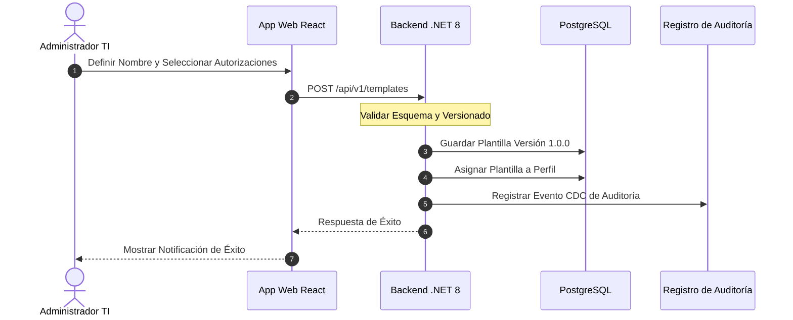

# 📘 Functional Story 2: Crear e Instanciar Plantilla de Autorización

Este documento especifica el flujo de transacciones, los actores y las reglas de control de versiones para crear una plantilla de políticas reutilizable y vincularla a espacios de trabajo de perfiles bajo la **estrategia spec-driven AI BMAD-METHOD**.

---

## 🏛️ 1. Definición del Caso de Uso

| Atributo | Especificación |
| :--- | :--- |
| **Nombre** | Crear e Instanciar Plantilla de Autorización |
| **Actor Principal** | Administrador Global de TI |
| **Precondiciones** | Los Sistemas, Menús, Opciones y Acciones están registrados en el sistema. |
| **Postcondiciones** | Se crea la Plantilla de Autorización y todos los Perfiles vinculados heredan las políticas en tiempo real. |

---

## 🔄 2. Flujo de Transacción

### A. Flujo Principal
1.  El Administrador Global de TI navega a la sección de Gestor de Plantillas en el portal de administración y hace clic en el botón "Crear Nueva Plantilla".
2.  El administrador define los metadatos de la plantilla (nombre: `PortOperatorBaseline`, versión inicial: `v1.0.0`).
3.  El administrador selecciona los `Sistemas`, `Menús` y `Acciones` específicos que esta plantilla permitirá (ej. permitir `create` y `read` en `Containers`).
4.  El administrador envía el formulario de creación. La aplicación web envía una solicitud `POST` a `/api/v1/templates`.
5.  El backend valida el esquema de autorización e inserta la Plantilla y sus Autorizaciones correspondientes dentro de PostgreSQL en una única transacción de base de datos segura.
6.  El administrador selecciona un `Perfil` existente (o crea uno nuevo) y lo vincula a la `Plantilla` recién creada.
7.  El sistema actualiza automáticamente todas las sesiones de usuario que pertenecen a ese perfil, invalida las claves de caché de Redis coincidentes y escribe una entrada en el libro mayor de auditoría inmutable.

---

## 🛡️ 3. Flujos Alternativos y Manejo de Excepciones

### Flujo Alternativo A: Fallo en la Validación del Esquema
*   Si el administrador intenta asignar una acción inválida (por ejemplo, una acción dirigida a un menú u opción inexistente), el backend intercepta la solicitud y rechaza la transacción con un error `400 Bad Request` explicando el error de validación.

### Flujo Alternativo B: Conflicto por Actualización de Versión Mayor
*   Si la actualización de una plantilla introduce cambios incompatibles que entran en conflicto con las anulaciones personalizadas locales en ciertos Perfiles, el sistema muestra al administrador una advertencia de compatibilidad, requiriendo su aprobación explícita antes de aplicar los cambios globalmente.
