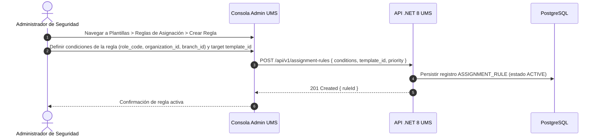
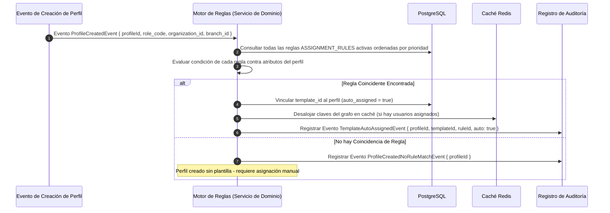

# 🧪 Functional Story 6: Auto-Asignar Plantilla de Autorización al Crear Perfil

Este caso de uso especifica el flujo del **Motor Automático de Asignación de Plantillas Basado en Reglas**, el cual se activa al momento de la creación de un perfil para adjuntar automáticamente la Plantilla de Autorización correspondiente según reglas de coincidencia configurables.

---

## 🏛️ 1. Definición del Caso de Uso

| Atributo | Especificación |
| :--- | :--- |
| **Nombre** | Auto-Asignar Plantilla de Autorización al Crear Perfil |
| **Actor Principal** | Motor de Reglas UMS (Actor del Sistema ”” disparado automáticamente) |
| **Actor Secundario** | Administrador de Seguridad Global (SuperAdmin ”” configura las reglas) |
| **Precondiciones** | Al menos una Regla de Asignación está configurada y activa. El perfil desencadenado tiene atributos de metadatos que coinciden con una regla. |
| **Postcondiciones** | El Perfil es creado con `auto_assigned = true`. La plantilla coincidente es vinculada. Las claves de caché de Redis son desalojadas si existen usuarios. Se escribe el registro de auditoría marcado como `auto: true`. |

---

## 🔄 2. Flujo de Configuración de Reglas (Admin ”” Configuración Única)

---

## 🔄 3. Flujo Disparador de Asignación Automática (Sistema ”” Al Crear Perfil)

### A. Lógica de Coincidencia de Reglas
Las reglas son evaluadas en **orden de prioridad** (número menor = mayor prioridad). La **primera regla coincidente** gana (evaluación de cortocircuito).

Una regla es coincidente cuando **todas** sus condiciones son satisfechas:

| Campo Condición | Tipo de Coincidencia | Ejemplo de Valor |
| :--- | :--- | :--- |
| `role_code` | Coincidencia exacta | `TransportationAnalyst` |
| `organization_id` | Coincidencia exacta o comodín `*` | `tenant_logistics_corp` |
| `branch_id` | Coincidencia exacta o comodín `*` | `branch_callao_terminal` |
| `system_id` | Coincidencia exacta o comodín `*` | `route_planner` |

**Ejemplo de Regla:**
> *Si `role_code = "TransportationAnalyst"` Y `organization_id = "tenant_logistics_corp"` ENTONCES asignar `Analyst_Baseline_v1`*

---

## 🛡️ 4. Flujos Alternativos y Manejo de Excepciones

### Flujo Alternativo A: Múltiples Reglas Coinciden
- Si más de una regla coincide con los atributos del perfil, solamente se aplica la **regla de mayor prioridad** (el número de prioridad más bajo). Las demás coincidencias se registran en el rastro de auditoría como candidatas.

### Flujo Alternativo B: Plantilla Objetivo Desactivada
- Si la plantilla correspondiente ha sido desactivada o eliminada desde que se creó la regla, el motor registra una advertencia `RULE_TEMPLATE_UNAVAILABLE` en el rastro de auditoría y pasa a evaluar la siguiente regla coincidente. Si no existe alternativa, el perfil se crea sin asignación de plantilla.

### Flujo Alternativo C: Fallo del Motor de Reglas
- Si el Motor de Reglas lanza una excepción no controlada, **NO se revierte la creación del Perfil** (el perfil se guarda). El fallo del motor se registra como un evento de nivel `CRITICAL` y el perfil se marca para una revisión de asignación manual de plantilla.
