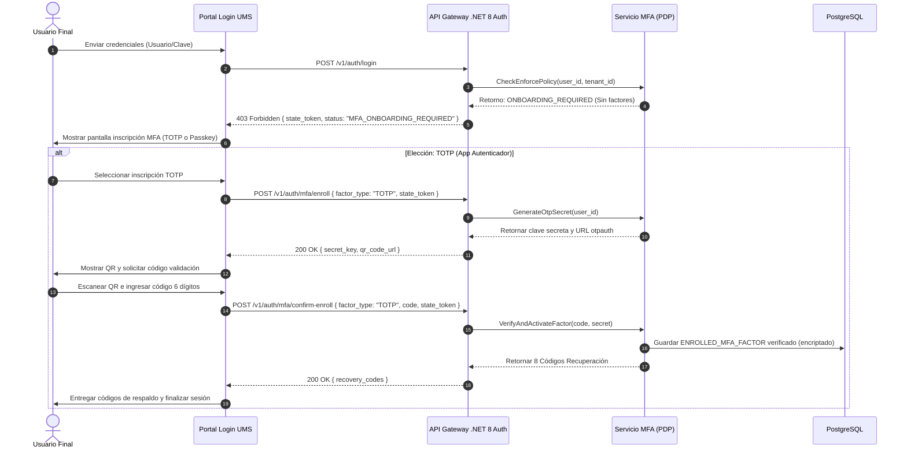
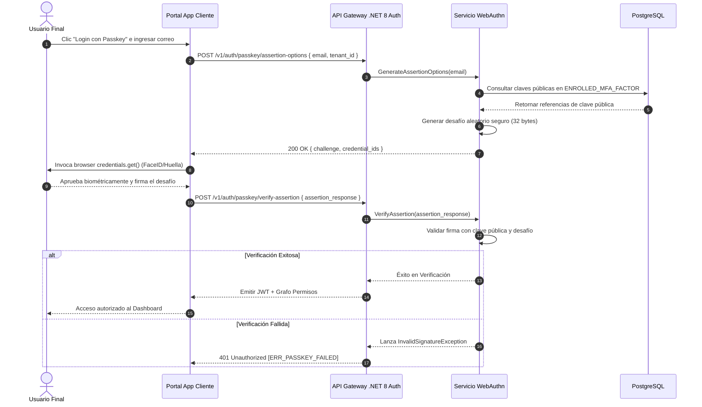

# 🧪 Functional Story 9: Autenticación Adaptativa Multifactor y Sin Contraseña

Este documento especifica el flujo de transacción detallado, actores, precondiciones, postcondiciones y manejo de excepciones para el registro y autenticación de usuarios empleando Autenticación Multifactor (MFA) y/o Passkeys Sin Contraseña (WebAuthn), bajo el control de la evaluación dinámica y adaptativa de riesgos de la **estrategia spec-driven AI BMAD-METHOD**.

---

## 🏛️ 1. Definición del Caso de Uso

| Atributo | Especificación |
| :--- | :--- |
| **Nombre** | Autenticación Adaptativa Multifactor y Sin Contraseña |
| **Actor Principal** | Usuario Final (ej. Operador B2B, Analista de Negocio), Sistema Cliente |
| **Precondiciones** | El usuario tiene una cuenta en el UMS. La política de seguridad del Tenant permite o exige MFA/Passkeys. |
| **Postcondiciones** | La identidad del usuario es verificada, se establece una sesión segura y se retorna un grafo de autorización hecho a la medida. |

---

## 🔄 2. Flujo de Transacción

### A. Secuencia: Onboarding & Registro de MFA

Este flujo ocurre cuando un usuario inicia sesión por primera vez o la política lo obliga a inscribir un nuevo segundo factor (TOTP/Passkey).

### B. Secuencia: Inicio de Sesión Asertivo con Passkey (Passwordless)

Este flujo detalla cómo un usuario ingresa directamente utilizando sensores biométricos nativos de su dispositivo (Huella, FaceID) o llaves de seguridad físicas (FIDO2) sin emplear contraseñas.

---

## 🛡️ 3. Flujos Alternativos y Manejo de Excepciones

### Flujo Alternativo A: Recuperación ante Pérdida del Factor Primario (Auto-Servicio)
- Si el usuario pierde su dispositivo MFA (ej., teléfono con TOTP) o no puede acceder a su biometría:
    1. En la pantalla de MFA, el usuario hace clic en **"Usar Código de Recuperación"**.
    2. Envía uno de los códigos de respaldo alfabéticos de 8 caracteres guardados durante el registro inicial.
    3. El gateway somete la entrada a un hash Bcrypt y lo compara con los valores guardados en la tabla `RECOVERY_CODES`.
    4. Tras la validación, el gateway:
        - Marca el código de recuperación como `USED` (inactivándolo permanentemente).
        - Genera una sesión temporal de vida corta.
        - Redirige al usuario directamente a la pantalla de administración de factores MFA para que registre un nuevo dispositivo.
        - Emite un evento `UserRecoveryCodeUsedEvent` al registro de auditoría.

### Flujo Alternativo B: Intervención de Evaluación de Riesgos Adaptativa (Step-Up)
- Si el contexto de login de un usuario se considera sospechoso (ej. inicio de sesión desde un nuevo país o una huella digital de navegador irreconocible):
    1. El motor `AdaptiveRiskEvaluator` califica el riesgo como `ALTO` (`HIGH`).
    2. El gateway intercepta el flujo normal y exige un desafío Step-Up MFA, ignorando cualquier estado de "Recordar Dispositivo".
    3. Se obliga al usuario a completar la autenticación con el factor más robusto disponible (ej., Passkeys biométricas).
    4. Si tiene éxito, se disminuye el nivel de riesgo, el nuevo dispositivo se marca como de confianza y la sesión es establecida.
    5. Si falla el desafío luego de 3 intentos, el gateway aborta la autenticación, envía la amenaza a Grafana Loki y bloquea temporalmente la cuenta por 15 minutos.

### Excepción 1: Sincronización de Reloj Desfasada en TOTP
- Si un usuario envía un código TOTP válido que fracasa al validar debido a un desfase horario en su teléfono:
    1. El servicio `MfaService` evalúa las ventanas de tiempo colindantes (±30 segundos).
    2. Si el código acierta en una de las ventanas adyacentes, el sistema acepta el login, emite un *warning* sobre la des-sincronización y automáticamente re-ajusta el *offset* temporal interno del servidor asociado a ese dispositivo.
    3. Si falla en todas las ventanas adyacentes, rechaza el intento con `401 Unauthorized` [código de error: `ERR_INVALID_MFA_CODE`].

---

## 📋 4. Referencia del Modelo Operativo Principal
Las capacidades multifactor y sin contraseñas configurables por Tenant se encuentran completamente declaradas y versionadas bajo el **Modelo de Configuración de Comportamiento del Sistema**. Para más detalles de la especificación técnica, visite **[mfa-passwordless-security-spec.md](../../04-artifacts/mfa-passwordless-security-spec.md)**.
