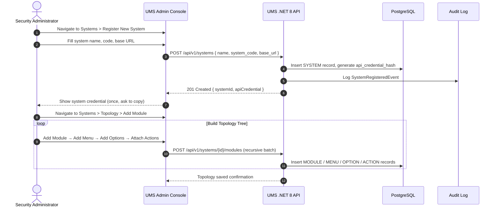

# 🧪 Functional Story 4: Register System and Define Menu Topology

This use case specifies the flow to register a new client application (System) in the UMS and define its hierarchy of navigation resources (Modules, Menus, Options, and Actions).

---

## 📑 1. Use Case Definition

| Attribute | Specification |
| :--- | :--- |
| **Name** | Register System and Define Menu Topology |
| **Primary Actor** | Global Security Administrator (SuperAdmin) |
| **Preconditions** | Actor is authenticated as SuperAdmin in the UMS Admin Console. |
| **Postconditions** | System is registered with a secure M2M API credential. Menu topology is defined and available for template assignment. |

---

## 🔄 2. Transaction Flow

### A. Main Flow
1. SuperAdmin navigates to **Systems** and clicks **Register New System**.
2. Fills system name (`Route Planner`), machine code (`route_planner`), and base URL.
3. The API generates a unique and hashed M2M API credential that client applications will use in `Authorization: Bearer` headers when calling `POST /v1/authorization/graph`. This credential is shown **only once** and must be saved.
4. The admin navigates to the **Topology Builder** for the registered system and builds the navigation tree: `Modules → Menus → Options → Actions`.
5. Each node specifies a label, an order index, and (for Actions) an API endpoint mapping and action code (`create`, `read`, `update`, `delete`, `export`, `approve`).

---

## 🛡️ 3. Alternative Flows and Exception Handling

### Alternative Flow A: Duplicate System Code
- If `system_code` already exists, the API returns a `409 Conflict` with error code `ERR_DUPLICATE_SYSTEM_CODE`.

### Alternative Flow B: Incomplete Topology
- If an Option has no defined Actions, the topology is saved as a draft but cannot be referenced in Authorization Templates until at least one Action is linked.
