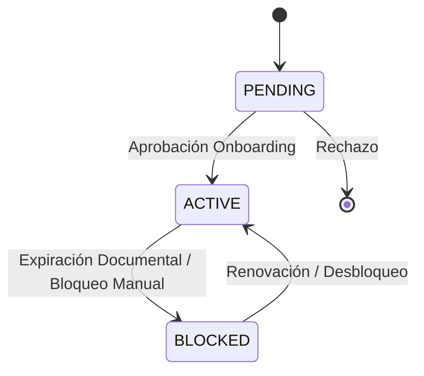
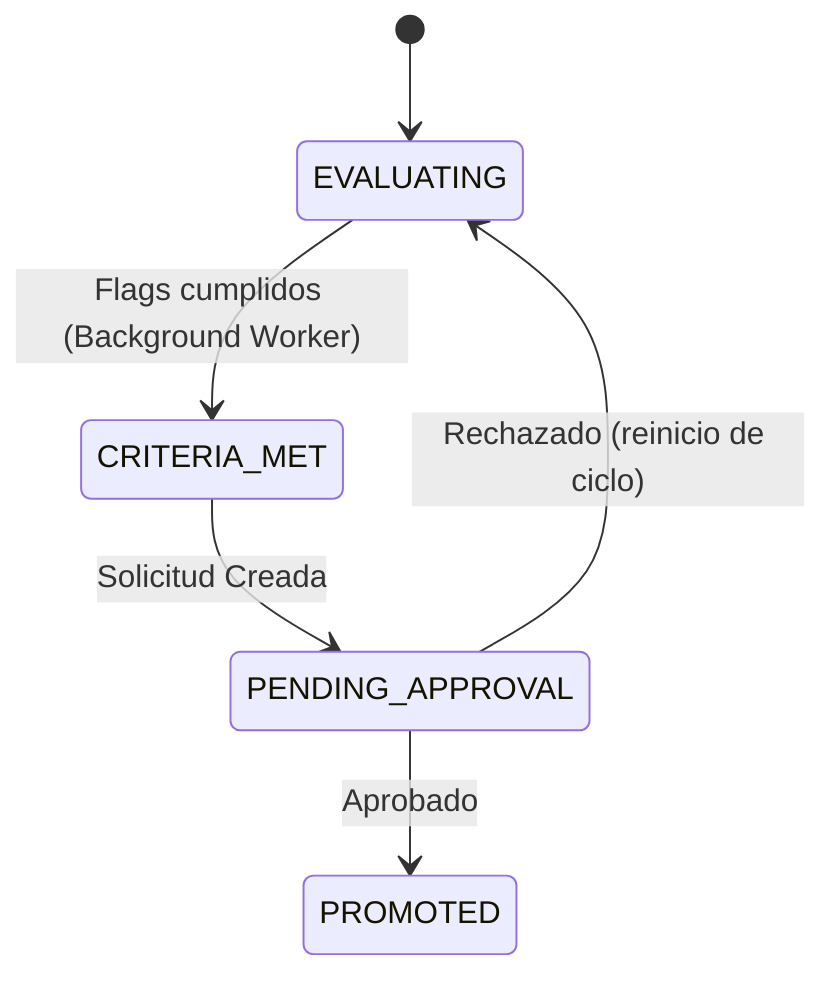
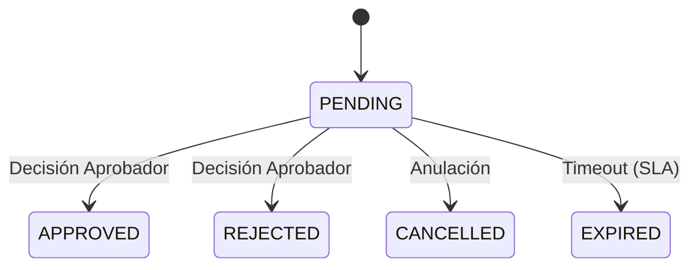

# 📖 Glossary of Terms

This document establishes the standardized, non-ambiguous glossary of terms for the **User Management System (UMS)** under the **spec-driven AI strategy BMAD-METHOD**.

---

## 🏛️ UMS Unified Glossary

| Term | Definition | SSoT Schema Owner |
| :--- | :--- | :--- |
| **User (Usuario)** | A unique human operator or service account registered in the system. Has credentials and assigned Profiles. | `Identity.Users` |
| **Organization (Organización)**| A company node. Can be the primary corporate Tenant (`INTERNAL`) or an external actor such as a B2B `CLIENT` or `SUPPLIER` linked to an ERP code. | `Identity.Organizations` |
| **Sponsor User** | An internal corporate user who requests and justifies system access for an external third-party user. | `Identity.Users` |
| **External Access Request** | An auditable business ticket routing an external B2B access request through the PAP approval workflow. | `Identity.AccessRequests` |
| **Branch (Sedes)** | A physical or logical sub-unit of an Organization (e.g., *Callao Port Terminal*, *Lurin Warehouse*). Acts as the branch context for hierarchical authorization routing. | `Identity.Branches` |
| **Network (Red)** | A logical network boundary (Private Network, Public, Shared) governing access policies. | `Identity.Networks` |
| **System (Sistema)** | An independent application or sub-portal registered in the platform (e.g., Route Planner, Billing). Contains one or more Modules. | `Auth.Systems` |
| **Menu (Menú)** | A structured navigation tree of sidebars and views within a Module. | `Auth.Menus` |
| **Module (Módulo)** | A logical grouping of Menus and Options within a System. Modules organize functional areas and can have Actions attached at the module level. | `Auth.Modules` |
| **Option (Opción)** | A specific web page or UI view within a Menu. | `Auth.Options` |
| **Action (Acción)** | An executable operation or permission that can be attached at System, Module, Menu, or Option level. | `Auth.Actions` |
| **Profile (Perfil)** | A physical collection of authorizations assigned to Users, scoped to an Organization and optionally a Branch. | `Auth.Profiles` |
| **Authorization (Autorización)**| The mapping of an Allow/Deny policy to a specific Resource + Action. | `Auth.Authorizations` |
| **Auth Template (Plantilla)** | A reusable versioned blueprint of authorizations used to instantiate Profiles. | `Auth.Templates` |
| **Permission (Permiso)** | The runtime resolved ability of a User to execute an Action, following the precedence rules. | Resolved at Runtime |
| **Multi-Tenancy** | Architectural pattern enabling multiple secure tenants to share the same physical database. | `Core.Architecture` |
| **Authorization Graph** | The compiled hierarchical JSON structure mapping a principal's full permission set for a given system and branch context. | Resolved at Runtime |
| **Principal** | An authenticated subject (user or service) requesting access to a resource. | IAM Standard Term |
| **PEP** | Policy Enforcement Point — the gateway component that intercepts requests and enforces access rules. | `Auth.Gateway` |
| **PDP** | Policy Decision Point — the UMS core engine that compiles and returns the authorization graph. | `Auth.Engine` |
| **PAP** | Policy Administration Point — the UMS Administrative Web Console where rules are managed. | `Console.App` |
| **PIP** | Policy Information Point — the SQL Server 2022 database supplying entity attributes during evaluation. | `Auth.Database` |

---

## 🔄 Domain Enumerations & State Machines

This section defines the technical enums and lifecycle states managed by the UMS engine.

### 1. User Account Lifecycle (USER_ACCOUNT.Status)
| Value | Descripción | Entrada | Salida |
| :--- | :--- | :--- | :--- |
| **PENDING** | Usuario registrado pero aún no activado o en espera de aprobación inicial. | Registro inicial o reseteo de seguridad. | Aprobación exitosa (ACTIVE) o rechazo. |
| **ACTIVE** | Usuario con acceso pleno a los sistemas según su perfil. | Aprobación de onboarding o desbloqueo manual. | Bloqueo por expiración documental o manual (BLOCKED). |
| **BLOCKED** | Acceso denegado. | Expiración de documento crítico, solicitud administrativa o múltiples fallos de login. | Renovación de documento o desbloqueo manual (ACTIVE/PENDING). |

### 2. Promotion Process Lifecycle (USER_PROMOTION_PROCESS.Status)
| Value | Descripción | Entrada | Salida |
| :--- | :--- | :--- | :--- |
| **EVALUATING** | El sistema monitorea el cumplimiento de flags del usuario. | Usuario asignado a una jerarquía evolutiva. | Cumplimiento de todos los flags (CRITERIA_MET). |
| **CRITERIA_MET** | Todos los criterios automáticos (antigüedad, documentos) se han cumplido. | Worker detecta cumplimiento. | Creación de solicitud de aprobación (PENDING_APPROVAL). |
| **PENDING_APPROVAL** | Esperando decisión manual de un administrador. | Generación de solicitud. | Aprobación (PROMOTED) o Rechazo (EVALUATING). |
| **PROMOTED** | Rol actualizado exitosamente en el perfil. | Aprobación manual. | Fin del proceso. |

### 3. Approval Request Lifecycle (APPROVAL_REQUEST.RequestStatus)
| Value | Descripción | Entrada | Salida |
| :--- | :--- | :--- | :--- |
| **PENDING** | Solicitud en bandeja del aprobador. | Evento de promoción o onboarding externo. | Aprobación, Rechazo o Expiración. |
| **APPROVED** | Solicitud aceptada y ejecutada. | Acción del aprobador. | Estado final. |
| **REJECTED** | Solicitud denegada. | Acción del aprobador. | Estado final. |
| **CANCELLED** | Solicitud anulada por el solicitante o sistema. | Acción administrativa. | Estado final. |
| **EXPIRED** | Solicitud no atendida en el tiempo límite. | Tiempo de SLA agotado. | Estado final. |

### 4. General Domain Enums

#### **UserCategory (USER_ACCOUNT.UserCategory)**
| Value | Descripción |
| :--- | :--- |
| **INTERNAL** | Empleado directo de la organización. |
| **EXTERNAL** | Contratista o consultor externo. |
| **B2B** | Usuario de una organización cliente o proveedor. |
| **PARTNER** | Socio de negocio con acceso colaborativo. |
| **SERVICE_ACCOUNT** | Cuenta para integraciones automatizadas (No humana). |

#### **DocumentStatus (USER_DOCUMENT.Status)**
| Value | Descripción |
| :--- | :--- |
| **VALID** | Documento vigente y aprobado. |
| **EXPIRED** | Documento con fecha de vencimiento superada. |
| **REJECTED** | Documento rechazado por el revisor. |
| **PENDING_REVIEW**| Documento cargado esperando validación. |

#### **DocumentCriticity (USER_DOCUMENT.Criticity)**
| Value | Descripción |
| :--- | :--- |
| **LOW** | Informativo, no afecta acceso. |
| **MEDIUM** | Requiere atención, genera advertencias. |
| **HIGH** | Crítico para la operación de ciertos módulos. |
| **CRITICAL** | Vital para el cumplimiento legal. Su expiración bloquea el acceso al sistema. |

#### **EnforcementAction (ACCESS_ENFORCEMENT_POLICY.ActionOnExpiration)**
| Value | Descripción |
| :--- | :--- |
| **BLOCK_ACCESS** | Bloqueo total del usuario (`USER_ACCOUNT.Status = BLOCKED`). |
| **NOTIFY_ONLY** | Solo envío de alertas sin restricción de acceso. |
| **DOWNGRADE_ROLE**| Degradación a un rol con permisos mínimos de lectura. |
| **SUSPEND** | Suspensión temporal de perfiles específicos. |

#### **NotificationChannel (NOTIFICATION_RULE.Channel)**
| Value | Descripción |
| :--- | :--- |
| **EMAIL** | Correo electrónico corporativo. |
| **SMS** | Mensajería de texto al móvil registrado. |
| **IN_APP** | Notificación dentro del portal UMS. |
| **WEBHOOK** | Llamada a sistema externo del Tenant. |

#### **ApprovalActionTaken (APPROVAL_LOG.ActionTaken)**
| Value | Descripción |
| :--- | :--- |
| **APPROVED** | Aprobación definitiva. |
| **REJECTED** | Rechazo definitivo. |
| **ESCALATED** | Envío a un nivel superior de autoridad. |
| **DELEGATED** | Reasignación a otro aprobador del mismo nivel. |
| **COMMENTED** | Registro de observación sin cambio de estado. |

