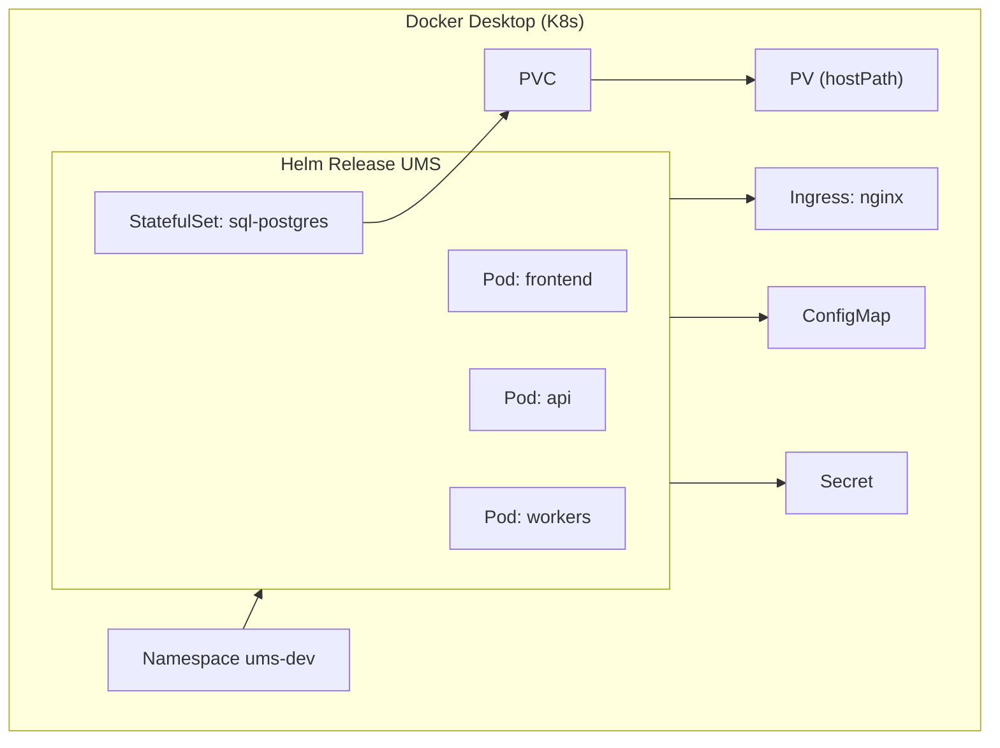
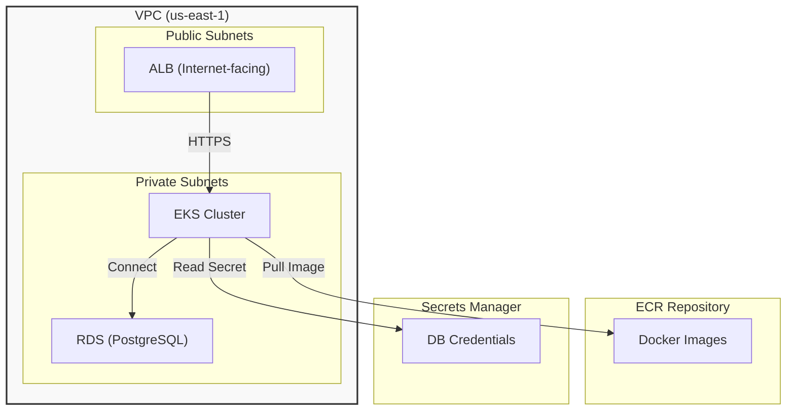
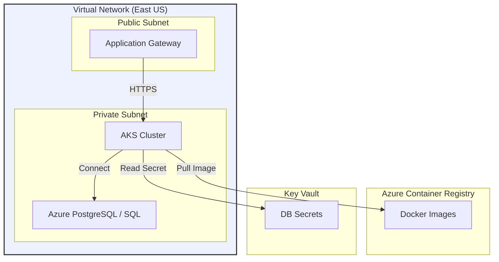

# Plan de Infraestructura para UMS (Español)

**Objetivo**: Producir un plan integral, no genérico, de infraestructura para el monorepo **UMS** cubriendo los entornos Local, AWS y Azure, cumpliendo la gobernanza de Evolith y las reglas BMAD.

---

## 1. Arquitectura Conceptual de UMS

```mermaid
flowchart TB
    subgraph Frontend
        FE["Frontend (React) "]
    end
    subgraph Backend
        API["API (ASP.NET Core) "]
        W["Workers (Background) "]
    end
    subgraph DB
        SQL["SQL Server / PostgreSQL"]
    end
    subgraph Bus
        Bus["Service Bus (in‑memory) "]
    end
    FE -->|HTTP| API
    API -->|Events/Commands| Bus
    W -->|Consume| Bus
    API -->|Read/Write| SQL
    W -->|Read/Write| SQL
```

---

## 2. Sub‑plan Local (Docker Desktop + Kubernetes integrado)

### 2.1 Descripción

- **Docker Desktop** con Kubernetes habilitado (`docker-desktop` context).
- **Helm chart** único para UMS que despliega Frontend, API, Workers y DB (SQL Server o PostgreSQL) como Pods.
- **Namespaces** separados por ambiente (`ums-dev`, `ums-test`).
- **ConfigMaps** y **Secrets** definidos localmente.
- **PersistentVolumeClaims** utilizan `hostPath` bajo `/var/lib/ums-data`.
- **Ingress** mediante NGINX Ingress Controller incluido en Docker Desktop.
- **Observabilidad** mínima con OpenTelemetry Collector y Prometheus‑Grafana pods.

### 2.2 Diagrama Local



### 2.3 Tareas (`Taskfile`/`Makefile`)

```bash
# Verificaciones preliminares
task infra:check   # valida Docker, kubectl, helm, contexto

# Construcción de imágenes
task infra:build   # docker build -f Dockerfile.frontend ...

# Despliegue en Kubernetes
task infra:up      # helm upgrade --install ums ./helm --values ./local/values.yaml

# Estado y logs
task infra:status
task infra:logs   # kubectl logs -l app=ums -n ums-dev

# Pruebas y reset
task infra:test
task infra:down   # helm uninstall ums
```

---

## 3. Sub‑plan AWS (Productivo)

### 3.1 Descripción

- **Región**: `us-east-1` (ejemplo).
- **VPC** con subredes públicas y privadas (2 AZ).
- **EKS** (control plane gestionado) con node groups en subredes privadas.
- **ALB** (Application Load Balancer) como punto de entrada.
- **RDS** para PostgreSQL (o SQL Server) en subredes privadas.
- **ECR** para almacenar imágenes Docker versionadas.
- **Secrets Manager** para credenciales DB y otros secrets.
- **IAM Roles** asignados a los nodos y a los Service Accounts de pods.
- **Observabilidad** con CloudWatch + OpenTelemetry Collector.
- **IaC**: **OpenTofu/Terraform**.

### 3.2 Diagrama AWS



### 3.3 Costos Aproximados (Ejemplo)

| Servicio | Configuración | Cantidad | Costo mensual (≈) | Supuesto |
|----------|----------------|---------:|-------------------:|---------|
| EKS control plane | Regional | 1 | $0.10/h | 730h/mes |
| EC2 m5.large (Node) | 2 AZ, 2 nodos | 2 | $70/mes cada | On‑demand |
| ALB | 1 | 1 | $18/mes | 10 GB data |
| RDS PostgreSQL db.t3.medium | 1 | 1 | $50/mes | Multi‑AZ disabled |
| ECR storage | 10 GB | 1 | $0.10/mes | 
| CloudWatch Logs | 5 GB | 1 | $5/mes | 
| ... | ... | ... | ... | ... |

---

## 4. Sub‑plan Azure (Productivo)

### 4.1 Descripción

- **Región**: `East US` (ejemplo).
- **Virtual Network** con subredes públicas/privadas (2 zonas).
- **AKS** (cluster gestionado) con node pools en subredes privadas.
- **Application Gateway** como ingress.
- **Azure Database for PostgreSQL** (o Azure SQL Database) en subredes privadas.
- **ACR** para imágenes Docker.
- **Key Vault** para secrets.
- **Managed Identities** para pods.
- **Observabilidad** con Azure Monitor + OpenTelemetry Collector.
- **IaC**: **OpenTofu/Terraform** (azurerm provider).

### 4.2 Diagrama Azure



### 4.3 Costos Aproximados (Ejemplo)

| Servicio | Configuración | Cantidad | Costo mensual (≈) | Supuesto |
|----------|----------------|---------:|-------------------:|---------|
| AKS control plane | Regional | 1 | $0.10/h | 730h |
| VM Standard_D2s_v3 (Node) | 2 AZ, 2 nodos | 2 | $65/mes cada | Pay‑as‑you‑go |
| Application Gateway | Standard v2 | 1 | $30/mes | 10 GB data |
| Azure PostgreSQL | General Purpose, 2 vCores | 1 | $55/mes | Geo‑redundant disabled |
| ACR storage | 10 GB | 1 | $0.15/mes | 
| Log Analytics | 5 GB | 1 | $6/mes | 
| ... | ... | ... | ... | ... |

---

## 5. Matriz de Equivalencias Cloud

| Capacidad | Local | AWS | Azure |
|-----------|-------|-----|-------|
| Orquestador | Docker Desktop Kubernetes (`docker-desktop`) | EKS | AKS |
| Registro de imágenes | Docker Engine (local) | ECR | ACR |
| Base de datos | SQL Server / PostgreSQL local (Docker) | RDS PostgreSQL / RDS SQL Server | Azure PostgreSQL / Azure SQL |
| Secrets | Kubernetes Secrets | Secrets Manager | Key Vault |
| Ingress | NGINX Ingress (local) | ALB | Application Gateway |
| Observabilidad | OpenTelemetry + Prometheus/Grafana | CloudWatch + OpenTelemetry | Azure Monitor + OpenTelemetry |
| Almacenamiento persistente | hostPath PV | EBS/EFS | Azure Disk/Files |
| CI/CD | GitHub Actions | GitHub Actions + Terraform | GitHub Actions + Terraform |

---

## 6. Plan de Verificación

1. **Lint automático** de Markdown y Mermaid (`markdownlint`, `mermaid-cli`).
2. **Renderizado** de diagramas para validar sintaxis.
3. **`task infra:check`** valida Docker, kubectl, helm y contexto `docker-desktop`.
4. **`terraform fmt` / `terraform validate`** en los módulos generados.
5. **Dry‑run** del workflow de GitHub Actions (`act`).
6. **Revisión** de tablas de costos contra calculadoras oficiales.

---

## 7. Sub‑plan VPS (Hostinger)

### 7.1 Descripción
- **Servidor**: KVM 2 (2 vCPU, 8 GB RAM, 100 GB NVMe, 8 TB ancho de banda) con IP dedicada.
- **Sistema operativo**: Ubuntu 22.04 LTS (o Debian) con acceso root.
- **Objetivo**: Ejecutar UMS en un único nodo usando Docker Engine y Docker Compose (alternativa: instalar un clúster Kubernetes ligero, pero fuera del alcance de la fase 1).
- **Componentes desplegables**:
  - Frontend (React) → contenedor `ums-frontend`.
  - API (ASP.NET Core) → contenedor `ums‑api`.
  - Workers (si existen) → contenedor `ums‑worker`.
  - Base de datos: PostgreSQL (o SQL Server) en contenedor `ums‑db`.
  - Service Bus in‑memory (integrado en API/Worker).
- **Persistencia**: Volúmenes Docker montados en `/var/lib/ums-data` dentro del VPS.
- **Networking**: Puertos expuestos 80/443 (NGINX reverse proxy) y 5432/1433 para DB interno (no expuesto a internet).
- **Seguridad**: Secrets gestionados vía Docker secrets o archivos `.env` fuera del repo; firewall `ufw` permite solo puertos necesarios.
- **Observabilidad**: OpenTelemetry Collector en contenedor, métricas a Grafana vía port‑forward.

### 7.2 Docker Compose

```yaml
version: "3.9"
services:
  frontend:
    image: your-registry/ums-frontend:1.0.0
    ports:
      - "80:80"
    depends_on:
      - api
    environment:
      - API_URL=http://api:5000
  api:
    image: your-registry/ums-api:1.0.0
    ports:
      - "5000:5000"
    environment:
      - DB_CONNECTION=Host=db;Username=ums;Password=${DB_PASSWORD}
    secrets:
      - db_password
  worker:
    image: your-registry/ums-worker:1.0.0
    depends_on:
      - api
  db:
    image: postgres:15-alpine
    volumes:
      - db_data:/var/lib/postgresql/data
    environment:
      - POSTGRES_USER=ums
      - POSTGRES_PASSWORD=${DB_PASSWORD}
      - POSTGRES_DB=umsdb
    secrets:
      - db_password
  otel-collector:
    image: otel/opentelemetry-collector:latest
    volumes:
      - ./otel-config.yaml:/etc/otel/config.yaml
    command: ["--config", "/etc/otel/config.yaml"]
volumes:
  db_data:

secrets:
  db_password:
    file: ./secrets/db_password.txt
```

### 7.3 Tareas (`Makefile`)

```make
.PHONY: up down logs ps

up:
	docker compose up -d

down:
	docker compose down -v

logs:
	docker compose logs -f

ps:
	docker compose ps
```

### 7.4 Coste estimado
Con el plan actual de Hostinger (311.99 MX$ / mes) el coste total de infraestructura es **≈ 311 MX$ / mes**, que incluye:
- 2 vCPU, 8 GB RAM, 100 GB NVMe.
- 8 TB de ancho de banda (suficiente para tráfico moderado).
- IP dedicada y backups semanales.
No hay costos adicionales de nube; solo el VPS.

### 7.5 Verificación
1. `ssh root@<IP>` → instalar Docker (`apt-get install docker.io`).
2. Copiar `docker-compose.yml`, archivos de secrets y `otel-config.yaml`.
3. Ejecutar `make up` y validar `curl http://<IP>` retorna la UI.
4. Verificar healthchecks: `curl http://<IP>/healthz`.
5. Revisar logs con `make logs`.

*Generado por Antigravity.*

## 8. Infraestructura disponible

- **Local**: Docker Desktop + Kubernetes integrado (ideal para desarrollo y pruebas).
- **AWS**: Amazon EKS con RDS, ECR, etc. (producción escalable y gestionada).
- **Azure**: Azure AKS con Azure Database, ACR, etc. (producción gestionada).
- **VPS (Hostinger)**: Servidor KVM 2 (2 vCPU, 8 GB RAM, 100 GB NVMe, 8 TB BW) – descrito en la sección 7.

### 8.1 ¿Puede el modo local pasar a producción en el VPS?

- **Capacidad de cómputo**: 2 vCPU y 8 GB RAM son suficientes para entornos de bajo a medio tráfico, pero limitan la concurrencia y el número de réplicas.
- **Almacenamiento**: 100 GB NVMe es adecuado para bases de datos pequeñas‑medianas; sin embargo, no cuenta con redundancia ni snapshots automáticos más allá de los backups semanales del VPS.
- **Red**: 8 TB de ancho de banda brindan margen para tráfico moderado, pero no hay balanceador de carga ni auto‑escalado.
- **Base de datos**: Ejecutar PostgreSQL (o SQL Server) en contenedor carece de alta disponibilidad y backups automáticos; se dependerá de los backups semanales del VPS.
- **Seguridad**: Se gestionan manualmente los firewalls y secrets; no hay IAM gestionado ni cifrado de datos en reposo a nivel de servicio.
- **Observabilidad**: Se puede desplegar OpenTelemetry Collector, pero no hay integración nativa con servicios de monitoreo avanzado.

**Conclusión**: El VPS puede usarse como entorno de **staging** o **producción de baja carga** (p. ej., pruebas de usuarios internos, PoC). Para una producción con requisitos de alta disponibilidad, escalabilidad y respaldo automatizado, se recomienda migrar a AWS o Azure. Si se opta por producción en el VPS, se deberán implementar mecanismos adicionales:
- Monitoreo de recursos y alertas.
- Backups más frecuentes (diarios) de la base de datos.
- Considerar un balanceador de carga externo (NGINX) y replicación de la base de datos.

*Generado por el agente Antigravity. Este documento constituye la documentación oficial de infraestructura para UMS.*
