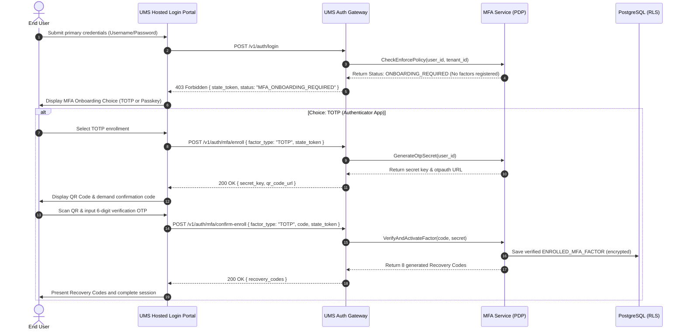
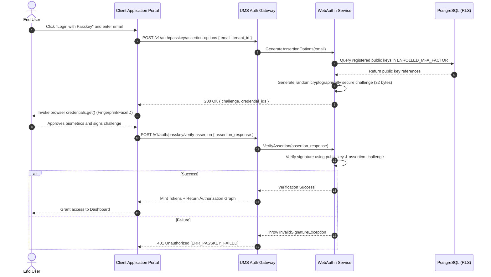

# 🧪 Use Case 11: Multi-Factor & Passwordless Adaptive Authentication

This document specifies the detailed transaction flow, actors, preconditions, postconditions, and exception handling for enrolling and authenticating users using Multi-Factor Authentication (MFA) and/or Passwordless Passkeys (WebAuthn), governed by dynamic adaptive risk evaluation under the **bMAD Method**.

---

## 🏛️ 1. Use Case Definition

| Attribute | Specification |
| :--- | :--- |
| **Name** | Multi-Factor & Passwordless Adaptive Authentication |
| **Primary Actor** | End User (e.g., B2B Operator, Business Analyst), Downstream Client System |
| **Preconditions** | The user has registered an account in UMS. The tenant security policy allows or enforces MFA/Passwordless. |
| **Postconditions** | The user's identity is verified, a secure session is established, and the tailored authorization graph is returned. |

---

## 🔄 2. Transaction Flow

### A. Sequence: Onboarding & MFA Registration

This flow occurs when a user logs in for the first time or is forced by policy to enroll a new secondary factor (TOTP/Passkey).

### B. Sequence: Passwordless Passkey Assertion Login

This flow details how a user logs in seamlessly using their device's native biometric sensors or hardware security keys without passwords.

---

## 🛡️ 3. Alternative Flows & Exception Handling

### Alternative Flow A: Primary Factor Loss Recovery (Self-Service Recovery)
- If the user has lost their MFA device (e.g., phone with TOTP) or biometric capabilities are unavailable:
    1. On the MFA challenge screen, the user selects **"Use Recovery Code"**.
    2. The user submits one of the 8-character alphabetic backup recovery codes saved during onboarding.
    3. The gateway hashes the input using Bcrypt and compares it against stored values in the `RECOVERY_CODES` table.
    4. Upon successful validation, the gateway:
        - Marks the selected recovery code as `USED` (making it permanently inactive).
        - Generates a short-lived temporary session.
        - Redirects the user directly to the MFA factors administration screen to re-register a new device.
        - Emits a `UserRecoveryCodeUsedEvent` to the audit ledger.

### Alternative Flow B: Adaptive Risk Step-Up Intervention
- If the user's login context is deemed suspicious (e.g., login attempt from a new geographic location or an unrecognized device fingerprint):
    1. The `AdaptiveRiskEvaluator` scores the request risk as `HIGH`.
    2. The gateway intercepts the normal authentication flow and issues a step-up challenge, regardless of whether "Remember Device" was active.
    3. The user is prompted to complete their strongest available factor (such as WebAuthn Passkey biometrics).
    4. If completed successfully, the risk score is mitigated, the device fingerprint is added as "trusted," and the session is established.
    5. If the user fails to complete the step-up verification within 3 attempts, the gateway aborts the authentication flow, logs a security threat to Grafana Loki, and locks the user's account for 15 minutes.

### Exception 1: Out-of-Sync TOTP Clock Drift
- If the user submits a valid TOTP code that fails verification due to minor clock unsynchronization on their device:
    1. The `MfaService` evaluates adjacent time windows (one interval backward and one interval forward, ±30 seconds).
    2. If the code is valid in an adjacent window, the service accepts the code, logs a warning about clock drift, and automatically resynchronizes the server's tracking offset for that user factor.
    3. If the code remains invalid across all adjacent windows, the server rejects the attempt with `401 Unauthorized` [error code: `ERR_INVALID_MFA_CODE`].

---

## 📋 4. Primary Operational Model Reference
The multi-factor and passwordless capabilities configured per tenant are fully declared, cached, and versioned via the **System Behavioral Configuration Model**. For complete API payloads, schema specifications, and security threat analyses, consult **[mfa-passwordless-security-spec.md](../../04-artifacts/mfa-passwordless-security-spec.md)**.
