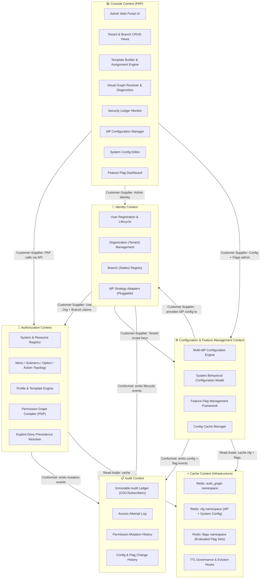

# 🗺️ Bounded Context Map — User Management System (UMS)

This document establishes the formal **Domain-Driven Design (DDD) Bounded Context Map** for the UMS platform. It defines the boundaries of each domain context, their internal responsibilities, and the integration contracts between them.

> [!IMPORTANT]
> This is a **Priority 1 Architectural Deliverable** as established in `architecture-spec.md`. All teams must align to this map before implementing features that cross context boundaries.

---

## 📐 1. Context Map Overview

---

## 📦 2. Context Definitions

### 🔐 A. Identity Context
**Mission:** Manage the lifecycle of all principals (users) and the organizational structures (tenants and branches) they belong to. Delegate credential verification to pluggable, external Identity Providers using configurations supplied by the Configuration Context.

**Owns:**
- `User` aggregate (registration, suspension, offboarding)
- `Organization` (Tenant) aggregate
- `Branch` (Sedes) aggregate
- `IAuthenticationPort` (pluggable IdP strategy adapter — reads from Config Context)

**Does NOT own:**
- Authorization rules or permission logic
- Audit ledger storage
- IdP configuration data (owned by Config Context)

**Integration Contracts (Published Language):**
- `UserRegisteredEvent { userId, organizationId, branchId, employeeReference }`
- `UserSuspendedEvent { userId, tenantId }`
- `OrganizationCreatedEvent { tenantId, idpStrategy }`

---

### 🔑 B. Authorization Context
**Mission:** Act as the **Policy Decision Point (PDP)**. Compile and resolve the hierarchical authorization graph for any authenticated principal based on their organization, branch, profiles, and attached templates.

**Owns:**
- `System` aggregate (registered client applications)
- `Menu → Submenu → Option → Action` topology
- `Profile` aggregate
- `AuthorizationTemplate` aggregate
- `Authorization` (Allow/Deny records)
- `Permission Graph Compiler` (core engine)
- `Explicit-Deny Precedence` rules engine

**Does NOT own:**
- Identity verification (delegated to Identity Context via port)
- Cache storage (delegated to Cache Context via `ICachePort`)
- Admin UI rendering (delegated to Console Context)
- Feature flag state (delegated to Config Context)

**Integration Contracts (Published Language):**
- `GET /v1/authorization/graph` → returns `HierarchicalJsonGraph`
- `POST /v1/authorization/templates` → creates versioned template
- `PermissionMutatedEvent { userId, profileId, effect, actionId, timestamp }`

---

### ⚙️ C. Configuration & Feature Management Context *(NEW)*
**Mission:** Govern the **dynamic, multi-tenant runtime behavior** of all UMS-integrated systems without requiring code changes or redeployment. Owns three capability pillars:
1. **Multi-IdP Configuration Engine** — per-tenant/system IdP registry with priority/fallback
2. **System Behavioral Configuration** — versioned JSON config for auth, session, branding, modules
3. **Feature Flag Framework** — centralized, multi-dimensional toggle engine with rollout strategies

**Owns:**
- `IdpConfiguration` aggregate
- `SystemConfiguration` aggregate (versioned)
- `FeatureFlag` aggregate
- `FeatureFlagProviderConfig` aggregate *(per-tenant provider overrides)*
- `FlagEvaluationEngine` (domain service — routes via port)
- `IFeatureFlagPort` (core port — pluggable: Internal, LaunchDarkly, Unleash, ConfigCat, Azure App Config)
- `IConfigCachePort` (infrastructure port — separate from auth graph cache)
- `ISecretStorePort` (infrastructure port — vault-referenced credentials)

**Does NOT own:**
- User or organization identities (scopes them as foreign keys only)
- Permission graphs (belongs to Authorization Context)
- Admin UI (belongs to Console Context)

**Integration Contracts (Published Language):**
- `GET /v1/config/idp?tenant_id&system_id` → returns ordered IdP config set
- `GET /v1/config/system/{system_id}?tenant_id` → returns active system config
- `POST /v1/flags/evaluate` → returns evaluated flag set for a runtime context
- `IdpConfigUpdatedEvent { configId, tenantId, version, timestamp }`
- `SystemConfigPublishedEvent { configId, systemId, tenantId, version }`
- `FeatureFlagStateChangedEvent { flagCode, newStatus, targetScope, changedBy }`

---

### 📋 D. Audit Context
**Mission:** Maintain an **immutable, tamper-proof ledger** of all identity events, permission mutations, **and configuration changes**. Serves compliance, forensic, and SRE diagnostic needs.

**Owns:**
- `AuditRecord` entity (who, when, what, result)
- `AccessAttemptLog` (authentication success/failure)
- `PermissionMutationHistory` (ALLOW/DENY changes)
- `ConfigChangeHistory` (IdP config, system config, feature flag mutations) *(NEW)*

**Integration Pattern:** Event-driven subscriber (Conformist). Receives events from Identity, Authorization, and Configuration contexts via internal event bus (`IEventBusPort`).

---

### 💻 E. Console Context (Policy Administration Point — PAP)
**Mission:** Provide the **Administrative Web Portal** that allows SuperAdmins and Tenant Managers to govern organizations, systems, profiles, templates, IdP configurations, system configs, and feature flags.

**Owns:**
- Admin Web Portal (React SPA)
- Template Builder UI & Automated Assignment Rule Configurator
- Visual Graph Resolver
- **IdP Configuration Manager** *(NEW)*
- **System Config Editor** *(NEW)*
- **Feature Flag Dashboard** *(NEW)*

**Integration Pattern:** Customer-Supplier. Calls all backend contexts via their published REST APIs. Authenticates using the same UMS AuthGateway with a `SuperAdmin`-scoped `system_id`.

---

### ⚡ F. Cache Context (Infrastructure)
**Mission:** Provide a high-performance distributed cache layer for authorization graphs, system configurations, and feature flag evaluations — all under strict namespace governance.

**Cache Namespaces:**
| Namespace | Owner Context | Key Pattern | TTL |
| :--- | :--- | :--- | :--- |
| `auth_graph:*` | Authorization Context | `auth_graph:{userId}:{systemId}:{tenantId}:{branchId}` | 3600s |
| `cfg:idp:*` | Configuration Context | `cfg:idp:{tenantId}:{systemId}` | 900s |
| `cfg:sys:*` | Configuration Context | `cfg:sys:{systemId}:{tenantId}` | 300s |
| `flags:*` | Configuration Context | `flags:{systemId}:{tenantId}:{userId}` | 60s |

**Integration Pattern:** Hidden behind pure core port abstractions (`ICachePort`, `IConfigCachePort`). Only infrastructure adapters interact with Redis directly.

---

## 🔗 3. Context Relationships

| Upstream Context | Downstream Context | Pattern | Contract |
| :--- | :--- | :--- | :--- |
| Identity Context | Authorization Context | **Customer-Supplier** | User/Org/Branch claims pushed as events or queried via API |
| Identity Context | Config Context | **Customer-Supplier** | Tenant scope keys used for config isolation |
| Config Context | Identity Context | **Customer-Supplier** | IdP config supplied to Auth Gateway for routing |
| Authorization Context | Audit Context | **Conformist (Event)** | Publishes `PermissionMutatedEvent` |
| Identity Context | Audit Context | **Conformist (Event)** | Publishes `UserRegisteredEvent`, `UserSuspendedEvent` |
| Config Context | Audit Context | **Conformist (Event)** | Publishes `IdpConfigUpdatedEvent`, `SystemConfigPublishedEvent`, `FeatureFlagStateChangedEvent` |
| Console Context | Authorization Context | **Customer-Supplier** | PAP calls Authorization APIs for template/profile management |
| Console Context | Identity Context | **Customer-Supplier** | PAP calls Identity APIs for org/branch management |
| Console Context | Config Context | **Customer-Supplier** | PAP calls Config APIs for IdP, system config, and flag management |
| Authorization Context | Cache Context | **Shared Kernel (ICachePort)** | Read-aside; invalidation on mutation events |
| Config Context | Cache Context | **Shared Kernel (IConfigCachePort)** | Read-aside for cfg + flags; invalidation on config events |

---

## 🚧 4. Anti-Corruption Layers (ACL)

| Boundary | ACL Mechanism | Reason |
| :--- | :--- | :--- |
| Authorization ↔ External IdP | `IAuthenticationPort` (Strategy Pattern) | Prevents Zitadel/Okta SDK from polluting core |
| Config ↔ Feature Flag Providers | `IFeatureFlagPort` (Strategy Pattern) | Prevents LaunchDarkly/Unleash/ConfigCat SDKs from coupling to core. Mirrors IAuthenticationPort design (ADR-0025). |
| Config ↔ Secret Vault | `ISecretStorePort` (Strategy Pattern) | Prevents AWS Secrets Manager / HashiCorp Vault SDK from leaking into domain |
| Config ↔ Redis (cfg/flags) | `IConfigCachePort` | Separate port from auth graph cache to enforce namespace governance |
| Authorization ↔ Redis (auth_graph) | `ICachePort` | Prevents Redis client from leaking into domain layer |
| Authorization ↔ Event Bus | `IEventBusPort` | Prevents Kafka/RabbitMQ from coupling to use cases |
| Console ↔ UMS APIs | REST API contracts (versioned) | Console is an external consumer; treated as any third party |

