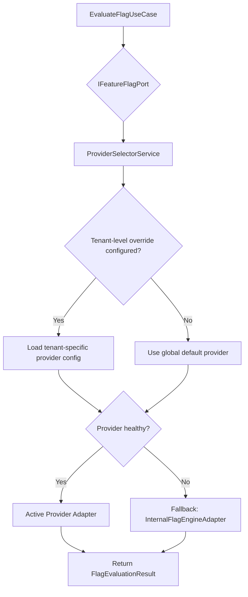

# 📜 ADR-0025 — Feature Flag Provider Abstraction Strategy

**Status:** Accepted  
**Date:** 2026-05-09  
**Deciders:** Enterprise Architect, Product Owner, Lead Developer  
**ADR Type:** Extensibility Pattern — Cross-Cutting Concern  
**Supersedes:** ADR-0017 (Feature Flagging — partial)  
**Related Specs:** [`ums-configuration-platform-spec.md`](../../04-artifacts/ums-configuration-platform-spec.md)  
**Related ADRs:** [ADR-0020 (IdP Abstraction)](./0020-identity-provider-abstraction-strategy.md), [ADR-0024 (Config Platform)](./0024-configuration-feature-management-platform.md)

---

## 📋 Context

The UMS Configuration Platform (ADR-0024) introduces a Feature Flag Management Framework. As the system evolves and enterprise customers demand integration with their existing DevOps toolchains, the UMS must support multiple feature flag providers without requiring core code changes.

Several industry-standard Feature Flag platforms exist with mature SDKs and enterprise support contracts:

- **LaunchDarkly** — Enterprise SaaS flag platform with advanced targeting, experimentation, and A/B testing.
- **Unleash** — Open-source, self-hosted flag engine with a mature API.
- **ConfigCat** — Lightweight, easy-to-integrate SaaS flag platform.
- **Azure App Configuration** — Microsoft-managed feature management integrated with Azure DevOps pipelines.

Each vendor exposes a different SDK, evaluation model, and context schema. Hardcoding any one of these into UMS core would:
1. Create vendor lock-in for the UMS platform itself.
2. Couple business use cases to external SDK lifecycles.
3. Prevent customers from using their existing flag tooling.
4. Require core code changes to switch providers.

This violates the UMS design principles of **vendor neutrality**, **hexagonal architecture**, and **zero-dependency core**.

---

## ⚖️ Decision

We will implement the Feature Flag subsystem following the **same Hexagonal Ports & Adapters pattern** established in ADR-0020 (IdP Abstraction Strategy).

### Core Pattern: `IFeatureFlagPort`

The UMS Domain Core defines a single, stable port interface:

```typescript
interface IFeatureFlagPort {
  evaluate(flagCode: string, context: FlagEvaluationContext): Promise<FlagEvaluationResult>;
  evaluateAll(context: FlagEvaluationContext): Promise<Record<string, FlagEvaluationResult>>;
  isHealthy(): Promise<boolean>;
}
```

**All use cases, guards, and domain services interact exclusively with this interface**. No concrete provider SDK is ever imported outside of infrastructure adapters.

### Adapter Implementations

Each provider is encapsulated in a dedicated adapter class in the Infrastructure layer:

| Adapter Class | Provider | Strategy |
| :--- | :--- | :--- |
| `InternalFlagEngineAdapter` | UMS Built-in | PostgreSQL flag store + Redis evaluation cache. Default for all tenants. |
| `LaunchDarklyFlagAdapter` | LaunchDarkly | Maps `FlagEvaluationContext` to LaunchDarkly LDContext. Uses Server SDK streaming. |
| `UnleashFlagAdapter` | Unleash | Maps `FlagEvaluationContext` to Unleash context. Uses HTTP API or SDK. |
| `ConfigCatFlagAdapter` | ConfigCat | Maps `flag_code` to ConfigCat setting key. Uses Server SDK auto-polling. |
| `AzureAppConfigFlagAdapter` | Azure App Config | Uses Azure Feature Manager SDK with context-aware filter conditions. |

### Provider Resolution Strategy



### Provider Registration (NestJS DI)

```typescript
// feature-flag.module.ts
providers: [
  { provide: 'IFeatureFlagPort', useClass: resolveFlagProvider(config) },
  InternalFlagEngineAdapter,
  LaunchDarklyFlagAdapter,
  UnleashFlagAdapter,
  ConfigCatFlagAdapter,
  AzureAppConfigFlagAdapter,
]
```

The `resolveFlagProvider()` factory reads the active `FEATURE_FLAG_PROVIDER_CONFIG` from the Configuration Context and returns the correct adapter class. This selection happens at module initialization and on live configuration change events.

---

## 📐 Architectural Constraints

1. **Zero core coupling**: No concrete provider SDK (`@launchdarkly/node-server-sdk`, `unleash-client`, etc.) is imported in `core/` or `application/` layers. All SDK imports are restricted to `infrastructure/adapters/feature-flags/`.
2. **Fallback guarantee**: The `InternalFlagEngineAdapter` is always available as the fallback provider. It requires no external network calls beyond Redis/PostgreSQL.
3. **Context normalization**: Each adapter is responsible for mapping the canonical `FlagEvaluationContext` to its provider-specific schema (no context mutation in core).
4. **Health-check circuit breaker**: If an external provider's `isHealthy()` returns false for 3 consecutive calls within 30 seconds, the system activates the fallback provider automatically and emits a `FeatureFlagProviderChangedEvent` to the Audit Context.
5. **Cache layer independence**: The Redis evaluation cache is managed by the `EvaluateFlagUseCase`, not by individual adapters. External providers that perform their own SDK-level caching (e.g., LaunchDarkly streaming) are complementary.
6. **Observability**: Every `evaluate()` call logs the `providerName`, `reason`, and `traceId` in structured JSON logs via the `ILoggerPort`.

---

## ✅ Consequences

### Positive
- **Vendor Neutrality**: The UMS core is completely insulated from any flag platform SDK or API.
- **Zero-Impact Migration**: Switching from Internal to LaunchDarkly requires only a configuration change, not code deployment.
- **Tenant-Specific Providers**: Enterprise customers with existing LaunchDarkly contracts can use them without platform changes.
- **Gradual Rollout Ready**: Internal engine supports percentage rollout natively; external providers extend this with richer experimentation capabilities.
- **Future-Proof**: Any new provider (OpenFeature-compatible, etc.) only requires a new adapter class implementing `IFeatureFlagPort`.

### Negative
- **Adapter maintenance cost**: Each external provider adapter must track SDK version updates.
- **Context mapping complexity**: Each adapter must map the canonical evaluation context to vendor-specific formats — potential for mapping drift.

### Neutral
- OpenFeature (CNCF standard for feature flags) compatibility is achievable by wrapping `IFeatureFlagPort` as an OpenFeature provider — documented as future roadmap item.

---

## 🔗 ADR Cross-References

| ADR | Relationship |
| :--- | :--- |
| ADR-0002 (Hexagonal Architecture) | This ADR follows the same Ports & Adapters pattern mandated in ADR-0002 |
| ADR-0014 (Redis Caching) | Redis cache layer governs flag evaluation TTL independently of provider |
| ADR-0016 (Immutable Audit) | Provider change events feed the Audit Context via `IEventBusPort` |
| ADR-0020 (IdP Abstraction) | **Symmetric pattern** — IFeatureFlagPort mirrors IAuthenticationPort design |
| ADR-0024 (Config Platform) | This ADR is a sub-decision within the broader Config Platform context |
