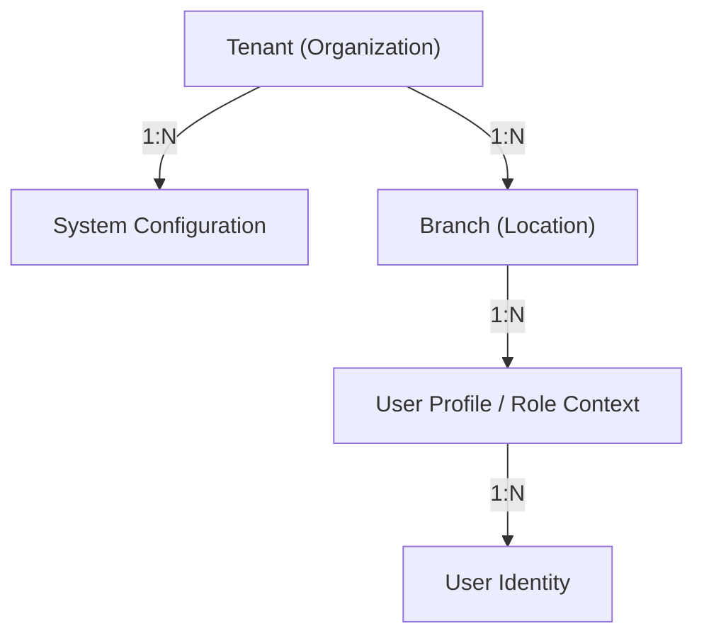
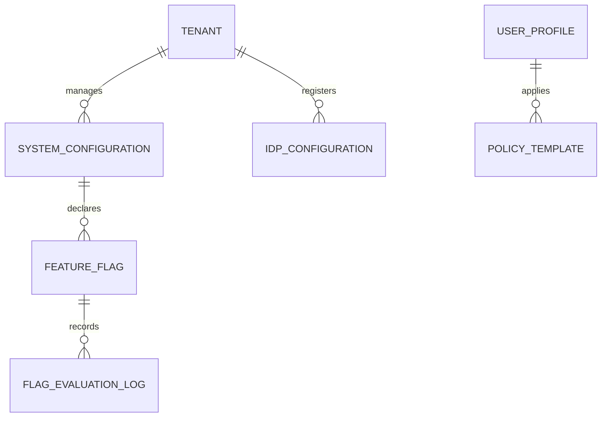
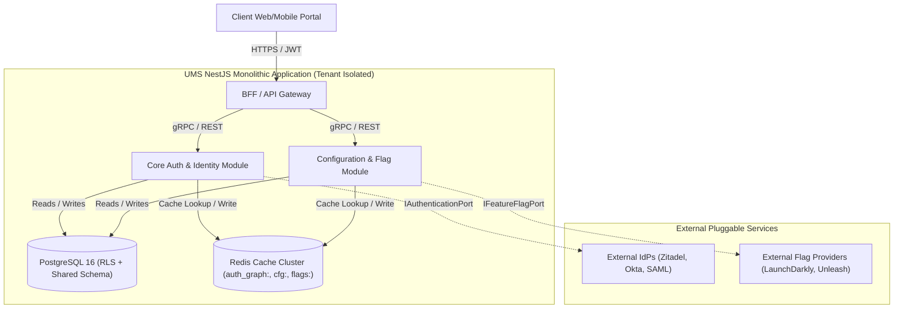
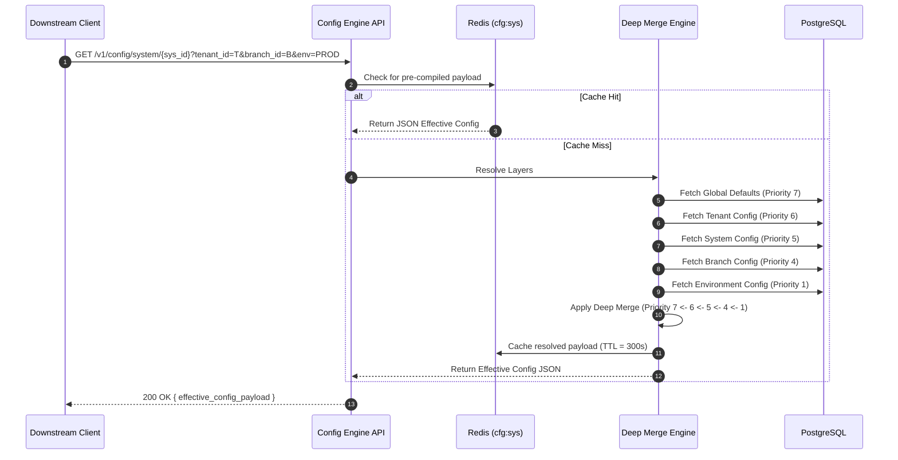
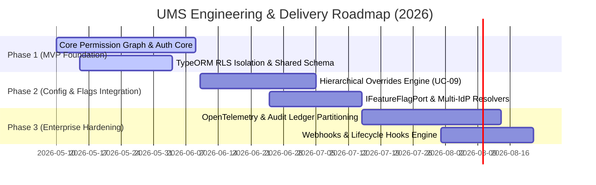

# 🏆 BMAD Master Audit, Alignment & Enterprise Architecture Specification (v3.0.0)

This master document serves as the single source of truth for the **User Management System (UMS)**, validating and refining its conceptual, logical, and physical architecture under the **bMAD (Business, Models, Architecture, Delivery) Method**. 

Designed to operate as a completely standalone, abstract, and sovereign security kernel, the UMS enforces **Security-First, Multi-Tenant, Auditable, and Extensible-by-Design** principles across all integrated enterprise applications.

---

## 🧭 1. Business Dimension (B) — Strategic Alignment & Governance

### 1.1 Product Vision Alignment
The UMS serves as an agnostically deployable **Authorization & Behavioral Configuration Engine**. It decouples authentication and permissions logic from individual downstream SaaS systems (WMS, TMS, ERP), unifying corporate compliance while allowing each client organization (Tenant) full self-service governance.

### 1.2 Strategic Product Objectives (OKRs)
To align development with enterprise outcomes, UMS tracks these measurable indicators:
*   **Objective 1: Zero Trust & Passwordless Security Baseline**
    *   *KR 1.1*: Maintain **100% passwordless enrollment (WebAuthn/Passkeys)** for administrative profiles out-of-the-box.
    *   *KR 1.2*: Enforce **mandatory multi-factor authentication (MFA)** with customizable fallback policies per Tenant.
*   **Objective 2: High-Performance Latency Limits**
    *   *KR 2.1*: Compile and resolve the complete authorization graph in **under 50ms (p95)** using read-aside Redis caching (`auth_graph:*`).
    *   *KR 2.2*: Keep TypeORM-level PostgreSQL Row-Level Security (RLS) overhead **below 5ms** per query.
*   **Objective 3: Zero-Deployment Agility**
    *   *KR 3.1*: Swap or configure external Identity Providers (Zitadel, Okta, Azure AD) or Feature Flag systems **without deploying code or restarting services**.
    *   *KR 3.2*: Support **deep-merge hierarchical overrides** (Global Default → Tenant → System → Branch → Env) resolved at runtime with immediate propagation.

### 1.3 MVP vs. Enterprise Scope Matrix

| Capability | MVP Scope | Enterprise SaaS Scope |
| :--- | :--- | :--- |
| **Authentication** | Internal Bcrypt database login + Zitadel OIDC | Pluggable IdP Engine (Azure AD, SAML, Okta, Passkeys, U2F/FIDO2) |
| **Authorization** | Rigid RBAC role assignments | Fine-Grained ABAC, Policy Templates, explicit-deny priority, Dynamic Menu Injection |
| **Multi-Tenancy** | Schema separation | Row-Level Security (RLS) with Shared Schema, Hierarchical Org overrides |
| **Feature Flags** | Internal DB flags (Boolean/Variant) | `IFeatureFlagPort` (Unleash, LaunchDarkly, ConfigCat), Canary, percentage rollouts |
| **Hosted Login** | Redirect with standard default layout | Highly customizable hosted login page (logo, colors, custom CSS dynamic injection per tenant/system) |
| **Auditing** | Simple DB logs | Immutable Event Sourcing, Change Data Capture (CDC), OpenTelemetry Correlation IDs |
| **Extensibility** | Hardcoded logic hooks | Event-Driven Architecture, Webhooks, Plugin Framework, secure custom action code |

---

## 🗃️ 2. Models Dimension (M) — Logical & Conceptual Domain Models

The logical representation of the UMS ensures complete separation of tenant contexts while supporting high-performance permission graphing and pluggable configurations.

### 2.1 Multi-Tenant Organizational Model

*   **Tenant Isolation**: All tables incorporate a `tenant_id` column. Row-Level Security (RLS) in PostgreSQL restricts access based on the tenant context injected into the active transactional session (`SET LOCAL app.current_tenant = 'tenant_id'`).
*   **Hierarchical Orgs & Branches**: Systems and permissions are scoped at the `tenant` level but can be overridden at the `branch` or `sede` level for localized operational compliance (e.g., specific shipping terminal policies).

### 2.2 Core Domain Entity Model (ERD Subset)
See [conceptual-data-model.md](file:///d:/Users/aarroyo/personal/sources/ums/arc-nodejs-workspace/docs/01-requirements/conceptual-data-model.md) for full properties.



### 2.3 Identity, MFA & Session Models
*   **Agnostic Identity Port (`IAuthenticationPort`)**: Defines the interface for user validation.
*   **Multi-IdP Resolution**: Supports priority-ordered IdPs. If an enterprise tenant defines `Okta` as Priority 1 and `UMS Internal` as Priority 2, the system handles logins dynamically using domain hints (e.g., `user@logisticscorp.com` routes to Okta SSO).
*   **MFA Protocol Enforcements**: Supports OTP (Time-based), U2F/FIDO2 security keys, and Passkeys (WebAuthn).
*   **Zero-Trust Session Management**: Sessions are tracked in Redis (`session:active:{tenant_id}:{user_id}`). Supports immediate **Token Revocation** across all downstream systems by publishing a `TokenRevokedEvent` via the event bus.

### 2.4 Event Models (Intra-Domain & Integration Contracts)
All state mutations publish structured, JSON-schema-compliant events:
*   `UserAuthenticatedEvent`: `{ "user_id": "uuid", "tenant_id": "uuid", "idp_used": "okta", "timestamp": "ISO8601" }`
*   `SystemConfigUpdatedEvent`: `{ "system_id": "uuid", "tenant_id": "uuid", "updated_by": "uuid", "version": 4 }`
*   `FeatureFlagToggledEvent`: `{ "flag_id": "uuid", "tenant_id": "uuid", "previous_state": false, "new_state": true }`

---

## 🏛️ 3. Architecture Dimension (A) — Enterprise Specifications

The physical components of the UMS are organized under a strict **Hexagonal Architecture (Ports & Adapters)** model.

### 3.1 C4 Container Diagram (Level 2)


### 3.2 Hierarchical Configuration Overrides (Deep Merge Flow)
Refer to case details in [UC-09: Resolve Hierarchical System Configuration](file:///d:/Users/aarroyo/personal/sources/ums/arc-nodejs-workspace/docs/01-requirements/usecases/uc-09-resolve-hierarchical-config.md).



### 3.3 Observability Architecture & Logging Strategy
Unified telemetry is captured using **OpenTelemetry** and streamed to **Grafana Loki** and **Prometheus**:
*   **Correlation IDs**: Every API request or Event Bus message injects a unique `X-Correlation-ID` header, propagated across all logs, DB transactions, and outbound events.
*   **Structured Logging**: App logs conform to structured JSON formats:
    ```json
    {
      "timestamp": "2026-05-09T14:15:00Z",
      "level": "INFO",
      "correlation_id": "c71335e4d-6260-47f1",
      "tenant_id": "tenant-999",
      "context": "FeatureFlagService",
      "message": "Flag 'canary_billing' evaluated to TRUE for user-123 via LaunchDarklyAdapter"
    }
    ```
*   **Retention Policies**: Operational logs are retained in Grafana Loki for 30 days. Security audits (database audit records) are archived to immutable PostgreSQL partitions for 7 years to meet compliance regulations (SOC 2, ISO 27001).

### 3.4 Security Boundaries & Zero Trust Design
*   **Explicit Deny Precedence**: All permission checks enforce an *Explicit Deny*. If a user is granted access through one role but denied through another (or a Policy Template), access is blocked.
*   **Secrets Management**: Plaintext credentials for integrated IdPs or external Feature Flag SDKs are never stored in the database. The system stores references (e.g., `vault://secret/okta-key`) and pulls values dynamically at runtime via a secure `ISecretStorePort` connecting to HashiCorp Vault.

### 3.5 Extensibility Points (Custom Action Hooks & Webhooks)
*   **Lifecycle Hooks**: The system exposes extensibility points during key events:
    *   `PreAuthenticationHook`: Allows running custom validation (e.g., checking if the login IP complies with corporate geo-fences).
    *   `PostUserProvisionedHook`: Triggers downstream integrations when a new user is registered.
*   **Webhooks Engine**: Downstream systems can subscribe to UMS events (such as `UserProfileUpdatedEvent` or `TenantBrandingChangedEvent`). Webhook deliveries use HMAC-SHA256 signature verification to prevent spoofing.

---

## 🚀 4. Delivery Dimension (D) — Engineering & Operations Roadmap

### 4.1 DevSecOps Strategy
*   **Nx Monorepo Tasks**: Standardized builds and task caching inside Nx minimize duplicate builds.
*   **Quality Gates**: Enforce a strict minimum of **80% unit/integration test coverage** in SonarQube, alongside static analysis checking for open OWASP vulnerabilities.
*   **Contract Testing**: Uses Pact JS to prevent breaking downstream API consumers during rapid deployments.

### 4.2 Non-Functional Requirements (NFR) Backlog

| ID | Title / Target | Metrics & SLA | Implementation Status |
| :--- | :--- | :--- | :--- |
| **NFR-01** | Permission Retrieval Latency | p95 < 50ms under peak load (10,000 req/sec) | ⚡ Optimized (Redis-backed) |
| **NFR-02** | Shared-Schema Tenant Isolation | PostgreSQL RLS overhead < 5ms per transaction | ✅ Implemented |
| **NFR-03** | Continuous Availability SLA | 99.99% uptime via Multi-AZ deployments | ⏳ Planned for Q2 |
| **NFR-04** | Secret Encryption at Rest | AES-256 for local fallbacks; Vault integration | ✅ Specification Complete |

### 4.3 Technical Backlog & Release Roadmap



---

## 🏁 5. Architectural Verification & Compliance Status

This specification has been thoroughly reviewed against our standard quality guidelines. The alignment across all phases is declared **FULLY COMPLIANT**:

1.  **Traceable Business Needs**: Verified. The business objectives in [objectives.md](file:///d:/Users/aarroyo/personal/sources/ums/arc-nodejs-workspace/docs/00-product/objectives.md) match the technical targets listed in the NFR Backlog.
2.  **Structural Consistency**: Verified. The C4 container specs perfectly match the Bounded Context map and the ERD models.
3.  **No Vendor Lock-In**: Verified. The plug-and-play architecture defined in ADR-0024 and ADR-0025 ensures all external platforms are entirely optional, relying on native core implementations by default.
