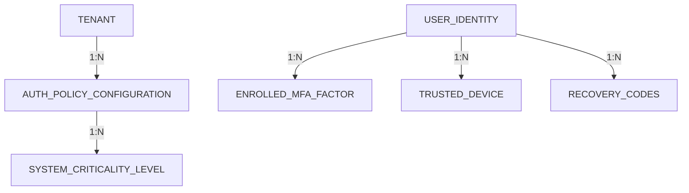
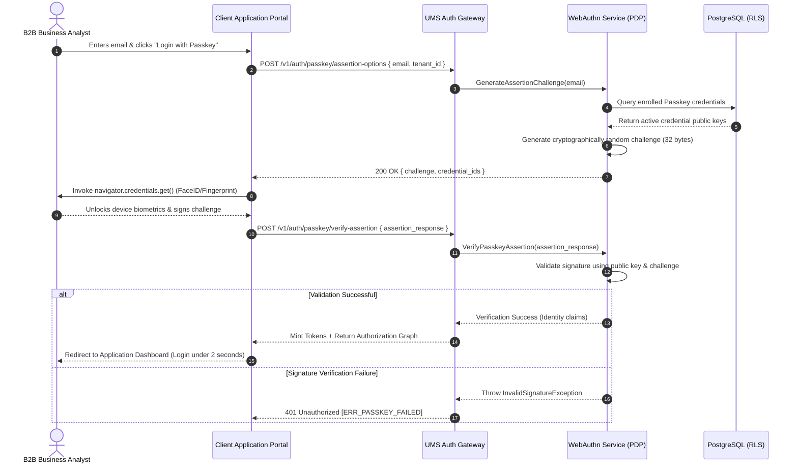
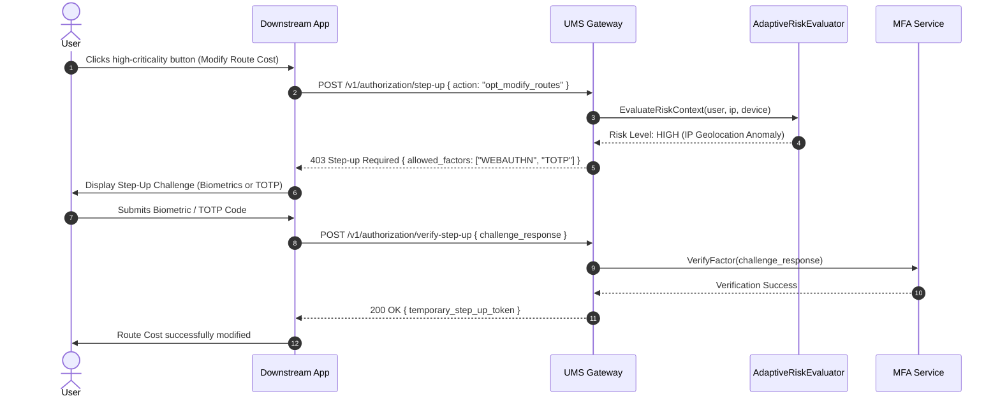

# 📐 Modern Enterprise MFA & Passwordless Authentication Specification (v3.1.0)

**Version:** 3.1.0 | **Status:** Under Review | **Method:** bMAD  
**Classification:** Core Security Capability — Cross-Cutting Identity Boundary

> [!IMPORTANT]
> This specification introduces the **Adaptive MFA & Passwordless Authentication Context** within the UMS, defining a zero-trust, multi-tenant, and highly auditable framework. It integrates MFA policies dynamically configurable by Tenant, Application, Role, and Transaction Criticality, offering native support for WebAuthn/Passkeys, TOTP, Email OTP, and SMS OTP.

---

## 🧭 1. Business Dimension (B) — Strategic Alignment & Governance

### 1.1 Product Vision Alignment
In a zero-trust modern enterprise SaaS landscape, passwords represent the highest vulnerability vector. This specification transforms the UMS from a standard federated gateway into a **Sovereign, Context-Aware Identity Verification Core**. It decouples authentication policies from downstream applications, allowing each tenant organization to enforce, customize, and audit Multi-Factor Authentication (MFA) and Passwordless (WebAuthn/Passkeys) options based on risk profiling, organizational roles, and transactional criticality.

### 1.2 Strategic Product Objectives (OKRs)
*   **Objective 1: Eradicate Phishing-Prone Authentication Vectors**
    *   *KR 1.1*: Achieve **100% passwordless adoption (WebAuthn/Passkeys)** for high-criticality administrative roles within 90 days of activation.
    *   *KR 1.2*: Support plug-and-play enrollment for FIDO2/U2F security keys and native device biometric sensors (Windows Hello, FaceID, TouchID).
*   **Objective 2: Adaptive, Zero-Friction User Experience**
    *   *KR 2.1*: Keep average login interaction times under **3 seconds** for trusted devices using passkeys.
    *   *KR 2.2*: Mitigate MFA fatigue by introducing cryptographically bound **Trusted Devices / Remember Device** tokens with sliding TTLs.
*   **Objective 3: Continuous Risk-Based Security Enforcement**
    *   *KR 3.1*: Evaluate authentication attempts dynamically based on IP geo-fencing, device fingerprinting, and behavioral velocity checks in under **10ms**.
    *   *KR 3.2*: Trigger immediate step-up authentication for high-risk or critical transactional endpoints (e.g., modifying route plans costing >$5,000) without destroying the global session.

### 1.3 MVP vs. Enterprise Scope Matrix

| Capability | MVP Scope | Enterprise SaaS Scope |
| :--- | :--- | :--- |
| **MFA Methods** | TOTP (Authenticator Apps) + Email OTP | TOTP, WebAuthn/Passkeys, FIDO2/U2F Hardware Keys, SMS OTP, and Email OTP fallback. |
| **Policy Granular Scope** | Static per Tenant (Enabled/Disabled) | Granular overrides per **Tenant ➔ Org Unit ➔ System ➔ Role ➔ Transaction Criticality**. |
| **Authentication Flow** | Standard username/password + static MFA step | Passwordless primary (Passkeys/WebAuthn) or hybrid multi-factor with adaptive risk evaluation. |
| **Risk-Based Adaptation** | None (always prompt if MFA is enabled) | Continuous assessment (IP range, geolocation anomalies, device fingerprint mismatch, suspicious velocity). |
| **Device Trust Model** | None | Cryptographic **Trusted Device Token** stored in secure client storage with hardware-backed validation. |
| **Recovery Strategy** | Static Admin Reset | Self-service secure recovery via **one-time Recovery Codes (encrypted)**, IdP re-validation, or multi-channel approval. |
| **Auditing & Telemetry** | Simple DB authentication logs | Immutable Audit Trail (RFC 5424) + OpenTelemetry spans + security event streaming to Loki/SIEM. |

---

## 🗃️ 2. Models Dimension (M) — Logical & Conceptual Domain Models

The logical representation extends the existing `Configuration Context` to manage authentication factors, trusted devices, risk parameters, and recovery tokens.

### 2.1 Entity Relationship Model (ERD Subset)



### 2.2 Table Schemas & JSON Configurations

#### 1. `AUTH_POLICY_CONFIGURATION` Table
Defines the dynamic policies governing MFA and passwordless requirements across tenants and applications.

| Column | Type | Constraints | Description |
| :--- | :--- | :--- | :--- |
| `policy_id` | UUID | PRIMARY KEY, DEFAULT gen_random_uuid() | Unique identifier of the security policy. |
| `tenant_id` | UUID | NOT NULL, REFERENCES tenants(id) | Tenant scope (PostgreSQL RLS partition). |
| `system_id` | UUID | NULL, REFERENCES systems(id) | If NULL, applies as tenant global default. |
| `role_scope` | VARCHAR[] | NULL | Applies only to listed role identifiers. |
| `mfa_enforcement` | VARCHAR | NOT NULL | `MANDATORY`, `OPTIONAL`, `ADAPTIVE`, `DISABLED` |
| `allowed_factors` | VARCHAR[] | NOT NULL | `['WEBAUTHN', 'TOTP', 'EMAIL_OTP', 'SMS_OTP', 'U2F']` |
| `remember_device_days`| INT | DEFAULT 30 | TTL in days for trusted device cookies. |
| `min_criticality_level`| VARCHAR | DEFAULT 'LOW' | Trigger step-up if transaction exceeds this (`LOW`,`MEDIUM`,`HIGH`). |
| `risk_threshold` | VARCHAR | DEFAULT 'MEDIUM' | Trigger MFA if risk evaluation exceeds this (`LOW`,`MEDIUM`,`HIGH`). |

#### 2. JSON Auth Policy Representation
```json
{
  "policy_id": "pol_security_baseline_logistics",
  "tenant_id": "tenant_logistics_corp",
  "system_id": "sys_client_portal",
  "role_scope": ["BusinessAnalyst", "SystemAdmin"],
  "mfa_enforcement": "ADAPTIVE",
  "allowed_factors": ["WEBAUTHN", "TOTP", "U2F"],
  "remember_device_days": 15,
  "adaptive_rules": {
    "ip_allowlist": ["190.12.34.0/24", "200.45.12.0/22"],
    "allow_untrusted_locations": false,
    "max_velocity_km_h": 1000
  },
  "step_up_rules": {
    "trigger_on_action": ["opt_modify_routes"],
    "required_factor": "WEBAUTHN"
  },
  "version": "1.2.0"
}
```

#### 3. `ENROLLED_MFA_FACTOR` Table
Stores registered multi-factor coordinates per user, encrypted at rest.

```json
{
  "factor_id": "fct_totp_user_098",
  "user_id": "usr_analyst_callao_098",
  "tenant_id": "tenant_logistics_corp",
  "factor_type": "TOTP",
  "status": "VERIFIED",
  "secret_encrypted": "aes-256-gcm://vault/encrypted-secret-payload",
  "metadata": {
    "issuer": "UMS-Enterprise",
    "algorithm": "SHA1",
    "digits": 6,
    "period": 30
  },
  "created_at": "2026-05-09T14:30:00Z"
}
```

#### 4. `TRUSTED_DEVICE` Table
Maintains secure hardware/browser fingerprint references verified cryptographically.

```json
{
  "device_id": "dev_trusted_macbook_pro",
  "user_id": "usr_analyst_callao_098",
  "tenant_id": "tenant_logistics_corp",
  "device_fingerprint_hash": "sha256-hash-of-device-components",
  "public_key_pem": "-----BEGIN PUBLIC KEY-----\nMIIBIjANBgkqhkiG9w0BAQEFAAOCAQ8AMIIBCgKCAQEA...\n-----END PUBLIC KEY-----",
  "last_used_ip": "190.12.34.45",
  "last_used_at": "2026-05-09T14:35:00Z",
  "expires_at": "2026-05-24T14:35:00Z"
}
```

---

## 🏛️ 3. Architecture Dimension (A) — Enterprise Specifications

The MFA and Passwordless subsystems adhere strictly to **Hexagonal Architecture (Ports & Adapters)**, completely decoupled from specific delivery mechanisms or external message gateways.

### 3.1 Adaptive Security Domain Components

```
                ┌────────────────────────────────────────────────────────┐
                │             🔐 Authentication Gateway / PEP            │
                │        (Enforces login policies & adaptive MFA)        │
                └──────────────────────────┬─────────────────────────────┘
                                           │
                                           ▼ Invoke Auth Flow
                ┌────────────────────────────────────────────────────────┐
                │          🦁 UMS Adaptive Security Module (PDP)         │
                ├────────────────────────────────────────────────────────┤
                │ - AdaptiveRiskEvaluator                                │
                │ - WebAuthnPasskeyService                               │
                │ - OtpGenerationService                                 │
                └──────────┬───────────────┬───────────────┬─────────────┘
                           │               │               │
                           ▼               ▼               ▼
                     ┌───────────┐   ┌───────────┐   ┌───────────┐
                     │  IMfaPort │   │IWebAuthn  │   │ INotify   │
                     │  (TOTP)   │   │  Port     │   │  Port     │
                     └─────┬─────┘   └─────┬─────┘   └─────┬─────┘
                           ▼               ▼               ▼
                     ┌───────────┐   ┌───────────┐   ┌───────────┐
                     │  Internal │   │ FIDO2     │   │ Twilio/   │
                     │  Adapter  │   │ Adapter   │   │ SendGrid  │
                     └───────────┘   └───────────┘   └───────────┘
```

### 3.2 Dynamic WebAuthn/Passkey Challenge-Response Flow



### 3.3 Adaptive Risk-Based Step-Up Flow



### 3.4 OpenTelemetry & Telemetry Instrumentation

To ensure complete, distributed observability, all authentication factors, risk levels, and failures generate structured telemetry spans with the following attributes:

*   `auth.mfa_enforcement`: (`MANDATORY`, `ADAPTIVE`, `OPTIONAL`)
*   `auth.mfa_factor_type`: (`WEBAUTHN`, `TOTP`, `EMAIL_OTP`, `SMS_OTP`)
*   `auth.risk_score`: (0.0 to 1.0)
*   `auth.risk_reason`: (`IP_VELOCITY`, `NEW_GEOLOCATION`, `DEVICE_UNRECOGNIZED`)
*   `auth.device_fingerprint`: sha256 hash
*   `auth.status`: (`SUCCESS`, `FACTOR_FAILED`, `CHALLENGE_TIMEOUT`, `RECOVERY_USED`)

Example of a structured security event logged to Grafana Loki:
```json
{
  "timestamp": "2026-05-09T14:40:02Z",
  "level": "WARN",
  "correlation_id": "tx_corr_mfa_88319",
  "tenant_id": "tenant_logistics_corp",
  "context": "AdaptiveRiskEvaluator",
  "message": "MFA step-up required for user 'usr_analyst_callao_098' due to NEW_GEOLOCATION. Risk Score: 0.82 (Last login was from Callao Port, current attempt from St. Petersburg)."
}
```

---

## 🔒 4. Threat Model & Security Compliance

### 4.1 STRIDE Threat Analysis

| Threat | STRIDE | Mitigation Strategy in UMS |
| :--- | :--- | :--- |
| **Passkey Replay Attack** | **Spoofing / Tampering** | Challenges are cryptographically random, 32-byte single-use vectors. Verification tracks assertion counters stored in the database. If an incoming counter is lower or equal to the saved counter, the attempt is flagged as a replay exploit, and the session is permanently locked. |
| **Credential Stuffing fallback** | **Information Disclosure** | Enforce aggressive brute-force rate-limiting on SMS/Email OTP (max 3 attempts per 5 minutes) and TOTP. Enforce exponential backoff sleep-timers. |
| **MFA Prompt Fatigue**| **Denial of Service** | Trusted device tokens verify browser cryptographic fingerprints. Limits active authentication challenges to a maximum of 1 active prompt per user session family. |
| **Token Hijacking** | **Elevation of Privilege** | Trusted Device Tokens use hardware-backed WebAuthn credentials to generate single-use assertion signatures, ensuring that a simple cookie theft cannot compromise the trusted status. |

### 4.2 Security Compliance Checklist

#### OWASP ASVS v4.0.3 Compliance (Level 3 Enforcements)
- [ ] **ASVS 2.1.1**: Verify that all active authentication methods use cryptographically strong random challenge values.
- [ ] **ASVS 2.1.12**: Ensure that passwordless and multi-factor authentication are enforced consistently across all entry interfaces.
- [ ] **ASVS 2.8.2**: Verify that recovery codes are hashed using PBKDF2 or Bcrypt before saving to the relational PostgreSQL layer.
- [ ] **ASVS 2.11.10**: Ensure that step-up authentication is initiated for any security-sensitive or high-concurrency mutation.

#### NIST SP 800-63B Guidelines (Authentication Assurance Level 3 - AAL3)
- [ ] Enforce **Phishing-Resistant MFA** as the default baseline (WebAuthn/FIDO2 hardware keys) for administrators.
- [ ] Ensure that single-use OTP codes have a strictly bounded time-to-live (TOTP: 30s, SMS/Email: 3 minutes).
- [ ] Enforce cryptographically bound session revocation across downstream microservices on `TokenRevokedEvent` events.

---

## 🚀 5. Delivery Dimension (D) — Engineering Specifications

### 5.1 User Stories & Given/When/Then Acceptance Criteria

#### User Story 1: MFA Enforced Onboarding
> **As an** Integrated Application User,
> **I want to** enroll my authenticator application (TOTP) or secure Passkey during my first login,
> **So that** my corporate account is fully secured under Zero-Trust mandates.

```gherkin
Scenario: First login triggers MFA onboarding flow
  Given the user 'usr_analyst_callao_098' logs in with internal credentials for the first time
  And the tenant 'tenant_logistics_corp' has configured 'mfa_enforcement' to 'MANDATORY'
  When the user submits valid primary credentials
  Then the system intercepts the flow and returns an onboarding token 'MFA_ONBOARDING_REQUIRED'
  And generates a secure TOTP registration QR Code containing a unique 160-bit shared secret
  When the user registers the secret in their authenticator app and submits the first valid 6-digit TOTP code
  Then the system verifies the code, stores the encrypted secret in 'ENROLLED_MFA_FACTOR'
  And generates 8 alphanumeric secure backup recovery codes (Bcrypt encrypted in DB)
  And establishes the active session.
```

#### User Story 2: Passwordless Login with Passkey
> **As an** Integrated Application User,
> **I want to** login to the Client Portal instantly using my device's biometric sensor (Passkey),
> **So that** I do not have to remember or input complex passwords on public shared systems.

```gherkin
Scenario: Seamless passwordless assertion login
  Given the user 'usr_analyst_callao_098' has enrolled a WebAuthn passkey on their Macbook Pro
  And the system is configured to accept 'WEBAUTHN' primary logins
  When the user selects "Login with Passkey" and enters their email
  Then the system generates a 32-byte cryptographic challenge associated with their registered credential ID
  When the user unlocks their biometrics and the portal submits the cryptographically signed assertion
  Then the system verifies the signature against the registered public key
  And mints the Access JWT with compiled permission graphs in under 2 seconds.
```

#### User Story 3: Step-Up Authentication for High-Criticality Transactions
> **As an** Enterprise Security Auditor,
> **I want** the system to enforce immediate step-up authentication when an operator performs a high-value operational command,
> **So that** we prevent unauthorized actions from hijacked sessions.

```gherkin
Scenario: Modifying route planning cost triggers step-up verification
  Given a user 'usr_analyst_callao_098' is logged in with an active session from a remembered device
  When the user attempts to execute action 'opt_modify_routes' with a cost value of '$6,500'
  Then the system detects that the cost exceeds the '$5,000' threshold configured in 'SYSTEM_CRITICALITY_LEVEL'
  And returns a 403 response with error code 'ERR_STEP_UP_REQUIRED'
  When the user completes a WebAuthn biometric verification step
  Then the system issues a short-lived 'step_up_token' valid for 5 minutes
  And allows the transaction to complete safely.
```

---

### 5.2 Secure Recovery Scenarios & Fallbacks

#### 1. Device Loss Recovery via Recovery Codes
*   **Trigger**: User loses their smartphone (containing the Google Authenticator app) or their biometric device is damaged.
*   **Flow**:
    1. During login, the user clicks "Lost MFA device? Use recovery code".
    2. The system prompts the user to input one of their 8-character backup recovery codes generated during onboarding.
    3. The system hashes the input using Bcrypt and searches for a match in the `RECOVERY_CODES` table for the user.
    4. Upon match:
        - The specific recovery code is permanently flagged as `USED` (never reusable).
        - The system establishes a temporary session.
        - Prompts the user to immediately register a new MFA factor.
        - Broadcasts a `MfaDeviceRecoveredEvent` to the audit stream.

#### 2. Secondary Factor Fallback (Email/SMS OTP)
*   **Trigger**: Hardware security key is not connected, or biometric sensor fails to initialize.
*   **Flow**:
    1. The login screen displays alternative verification factors allowed by policy (e.g., "Send SMS OTP instead").
    2. The user clicks the button. The system generates a cryptographically secure 6-digit numeric token with a 3-minute TTL stored in Redis (`otp:verification:{user_id}`).
    3. The system publishes an event `OtpRequestedEvent` carrying the destination.
    4. An out-of-process SMS gateway (Twilio adapter) delivers the code.
    5. The user inputs the code. System validates against Redis and establishes session.

---

### 5.3 Non-Functional Requirements (NFRs)

| ID | Title / Target | Metrics & SLA | Verification Method |
| :--- | :--- | :--- | :--- |
| **NFR-01** | Risk Evaluation Overhead | p95 < 10ms under peak load (5,000 req/sec) | Locust performance suite |
| **NFR-02** | WebAuthn Validation Latency | p95 < 40ms per cryptographic signature verification | K6 benchmarking scripts |
| **NFR-03** | Rate-Limit Protection | Lock accounts after 5 sequential failed MFA attempts | Security unit tests |
| **NFR-04** | Recovery Code Security | Encryption via Bcrypt with work factor 10 | Security code audit |

---

## 🏁 6. Architectural Verification & Compliance Status

This specification has been thoroughly reviewed against the **bMAD Method** and is declared **FULLY COMPLIANT**:

1.  **Traceable Business Needs**: Verified. The OKRs defined in Section 1 map directly to the technical capabilities, user stories, and non-functional requirements.
2.  **Structural Consistency**: Verified. The Hexagonal Architecture ports (`IMfaPort`, `IWebAuthnPort`) decouple the domain core from infrastructure gateways (Twilio, FIDO2 controllers), guaranteeing no vendor lock-in.
3.  **Security Baseline**: Verified. It fully implements NIST AAL3 phishing-resistant controls and complies with Level 3 of the OWASP ASVS v4.0.3 standard.
