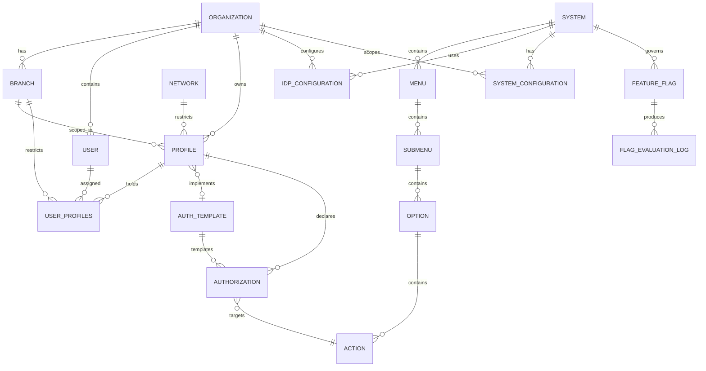

# 💾 Conceptual Data Model

This document details the database schema, entity structures, relationships, and Entity-Relationship diagrams for the **User Management System (UMS)** under the **spec-driven AI strategy BMAD-METHOD**.

---

## 🏛️ 1. Entity-Relationship Diagram

---

## 📋 2. Entity Attributes Specification

### A. User Entity
- `id` (UUID, PK): Unique identifier for the user.
- `organization_id` (UUID, FK): Owning tenant organization.
- `email` (string, Unique): Corporate email address.
- `password_hash` (string, **Nullable**): Populated **only** when the Internal Bcrypt Strategy adapter is active for the organization. `NULL` when authentication is delegated to an external IdP.
- `employee_reference` (string): External unique ID linking to corporate HR/ERP records.
- `status` (enum): `ACTIVE`, `SUSPENDED`, or `TERMINATED`.
- `created_at` (timestamp): Record creation timestamp.

### B. Organization Entity (Tenant)
- `id` (UUID, PK): Unique identifier for the tenant.
- `name` (string): Corporate legal company name.
- `company_reference` (string): External company code linking to corporate ERP (e.g., SAP code).
- `idp_strategy` (enum): `INTERNAL_BCRYPT`, `ZITADEL`, `AZURE_AD`, `OKTA`, `SAML2`, `GENERIC_OIDC`.
- `status` (enum): `ACTIVE` or `BLOCKED`.

### C. Branch Entity (Sedes)
> [!IMPORTANT]
> This entity represents a physical or logical sub-unit of an Organization (e.g., *Callao Port Terminal*, *Lurin Warehouse*). It is the **branch context** used for hierarchical, context-aware authorization routing.

- `id` (UUID, PK): Unique identifier for the branch.
- `organization_id` (UUID, FK): Owning tenant organization.
- `name` (string): Human-readable branch name (e.g., `Callao Terminal`).
- `code` (string, Unique within org): Short code for the branch (e.g., `BRANCH_CALLAO`).
- `geofencing_metadata` (jsonb, Nullable): Optional geofencing constraints applied to access policies (e.g., `{ "radius_km": 10, "center_lat": -12.05, "center_lng": -77.12 }`).
- `status` (enum): `ACTIVE` or `SUSPENDED`.

### D. Profile Entity
- `id` (UUID, PK): Unique identifier for the profile.
- `organization_id` (UUID, FK): The owning tenant organization.
- `branch_id` (UUID, FK, **Nullable**): Optional scoping to a specific branch. `NULL` means profile applies org-wide.
- `name` (string): Human-readable profile name (e.g., `PortOperator_Callao`).
- `template_id` (UUID, FK, Nullable): Optional linked Authorization Template (auto-assigned or manually attached).
- `auto_assigned` (boolean): `true` if template was assigned via the Automatic Rule-Based Engine.

### E. Authorization Entity
- `id` (UUID, PK): Unique identifier for the authorization record.
- `profile_id` (UUID, FK, Nullable): Linked profile if customized locally.
- `template_id` (UUID, FK, Nullable): Linked template if inherited from a blueprint.
- `action_id` (UUID, FK): Mapped system action.
- `effect` (enum): `ALLOW` or `DENY`.

### F. Auth Template Entity
- `id` (UUID, PK): Unique identifier for the template.
- `name` (string): Human-readable template name (e.g., `SCM_Analyst_Baseline_v1`).
- `version` (string): Semantic version (e.g., `1.0.0`).
- `system_id` (UUID, FK): The target client system this template is designed for.
- `created_by` (UUID, FK): Admin user who created the template.
- `created_at` (timestamp).

### G. System Entity
- `id` (UUID, PK): Unique identifier for the application/sub-portal.
- `name` (string, Unique): Application name (e.g., `SCM Route Planner`).
- `system_code` (string, Unique): Machine-readable slug (e.g., `scm_route_planner`).
- `base_url` (string): Base physical URL for routing.
- `api_credential_hash` (string): Hashed M2M credential for gateway validation.

### H. Menu / Submenu / Option / Action Entities
> [!NOTE]
> These form the hierarchical navigation topology compiled into the Authorization Graph.
> `System → Menu → Submenu → Option → Action`

- `Menu`: `id`, `system_id (FK)`, `label`, `order`, `icon_code`
- `Submenu`: `id`, `menu_id (FK)`, `label`, `order`
- `Option`: `id`, `submenu_id (FK)`, `label`, `route_path`
- `Action`: `id`, `option_id (FK)`, `code` (`create`, `read`, `update`, `delete`, `export`, `approve`), `api_endpoint`

### I. IDP_CONFIGURATION Entity *(NEW — Configuration Context)*
- `id` (UUID, PK)
- `tenant_id` (UUID, FK → ORGANIZATION)
- `system_id` (UUID, FK, Nullable → SYSTEM): `NULL` means applies to all systems for the tenant
- `provider_type` (enum): `INTERNAL_BCRYPT`, `ZITADEL`, `AZURE_AD`, `OKTA`, `KEYCLOAK`, `AUTH0`, `GOOGLE`, `LDAP`, `SAML2`, `GENERIC_OIDC`
- `priority` (integer): Resolution order (lower = higher priority)
- `fallback_to` (UUID, FK, Nullable → IDP_CONFIGURATION)
- `config_payload` (jsonb, encrypted): Authority URL, client_id, scopes, claim mappings
- `config_secret_ref` (string): Vault path for encrypted credentials (e.g., `vault://ums/secrets/{tenant}/client_secret`)
- `domain_hints` (text[]): Email domain patterns for IdP routing (e.g., `@logisticscorp.com`)
- `mfa_enforced` (boolean)
- `status` (enum): `ACTIVE`, `INACTIVE`, `DRAFT`
- `version` (string): Semantic version of this config record

### J. SYSTEM_CONFIGURATION Entity *(NEW — Configuration Context)*
- `id` (UUID, PK)
- `system_id` (UUID, FK → SYSTEM)
- `tenant_id` (UUID, FK → ORGANIZATION)
- `version` (string): Semantic version (e.g., `2.1.0`)
- `config_payload` (jsonb): Full behavioral config (auth, session, MFA, onboarding, branding, modules)
- `status` (enum): `ACTIVE`, `ARCHIVED`, `DRAFT`
- `published_at` (timestamp)
- `published_by` (UUID, FK → USER)

### K. FEATURE_FLAG Entity *(NEW — Configuration Context)*
- `id` (UUID, PK)
- `flag_code` (string, Unique globally): Machine-readable identifier (e.g., `FLEET_DISPATCH_NEW_UI_V2`)
- `type` (enum): `BOOLEAN`, `VARIANT`, `PERCENTAGE`
- `targets` (jsonb): Scoping rules `{ systems, tenants, organizations, branches, roles, users, environments, rollout_percentage }`
- `status` (enum): `ACTIVE`, `INACTIVE`, `ARCHIVED`
- `linked_resource_type` (string, Nullable): `menu`, `module`, `endpoint`, `workflow`
- `linked_resource_id` (UUID, Nullable)
- `version` (string)
- `created_by` (UUID, FK → USER)
- `created_at` (timestamp)

### L. FLAG_EVALUATION_LOG Entity *(NEW — Audit Context)*
- `id` (UUID, PK)
- `flag_id` (UUID, FK → FEATURE_FLAG)
- `evaluated_for_type` (string): `user`, `tenant`, `organization`
- `evaluated_for_id` (UUID)
- `result` (boolean or variant value)
- `evaluated_at` (timestamp)

---

## ⚙️ 4. Key Precedence Axioms (Engine Rules)

1. **Deny-by-Default**: An action is blocked until an explicit `ALLOW` is declared by a profile or template.
2. **Permissive Union**: If no `DENY` is present, the user inherits all active `ALLOW` blocks from all assigned profiles.
3. **Explicit Deny Dominance**: A `DENY` from *any* active profile instantly invalidates matching `ALLOW` blocks across all other profiles.
4. **Branch Scope Precedence**: Branch-scoped profiles override org-wide profiles for the matching branch context.
