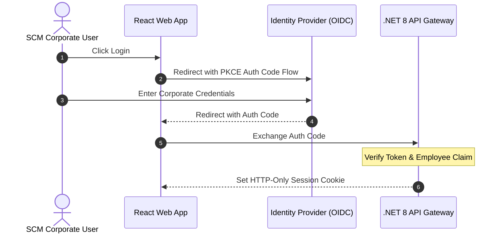

# 📘 Functional Story 1: User Authentication via External IdP

This document specifies the transaction flow, actors, and fallback strategies for authenticating a corporate user against an external identity provider (IdP) under the **spec-driven AI strategy BMAD-METHOD**.

---

## 🏛️ 1. Use Case Definition

| Attribute | Specification |
| :--- | :--- |
| **Name** | User Authentication via External IdP |
| **Primary Actor** | SCM Corporate User |
| **Preconditions** | User is registered in the ULPMS database and holds a valid HR employee reference. |
| **Postconditions** | Session is established in the SCM application, and a secure HTTP-Only cookie is returned. |

---

## 🔄 2. Transaction Flow

### A. Main Flow
1.  The user accesses the SCM portal and clicks the "Login with Corporate SSO" button.
2.  The web client redirects the user to the configured external Identity Provider (Keycloak/Azure AD) authorization endpoint using **OAuth 2.0 Auth Code Flow with PKCE**.
3.  The user authenticates successfully using their corporate credentials on the IdP portal.
4.  The IdP redirects the browser back to the SCM portal with an authorized single-use Authorization Code.
5.  The SCM backend exchanges the Authorization Code with the IdP for a cryptographically signed Access Token (JWT) containing employee claims.
6.  The backend verifies the token's RS256 signature and validates that the `employee_reference` matches an active employee record in the local SCM database.
7.  The system initializes the user session, injects the tenant context, and returns a secure, HTTP-Only, SameSite=Strict session cookie.

---

## 🛡️ 3. Alternative Flows & Exception Handling

### Alternative Flow A: External IdP Inaccessible
*   If the connection to Keycloak/Azure AD fails, the SCM Gateway intercepts the timeout error.
*   The system displays a secure fallback credentials page allowing authorized IT Administrators to login using local ULPMS emergency credentials, while standard operators are prompted to retry.

### Alternative Flow B: Unlinked Employee Reference
*   If the authenticated IdP token succeeds but the `employee_reference` is not found or is suspended in the SCM database:
    *   The backend aborts the login process.
    *   Saves a security warning inside the immutable access audit logs.
    *   Returns a `403 Forbidden` response explaining that the corporate account is not active on the SCM portal.

---

## 📋 4. Primary Operational Model Reference
The complete transaction flow, multi-factor authentication considerations, and error paths for this use case are modeled around the **SCM Transportation Analyst** initiating a session at the Callao Port Terminal (under *Logistics Corp*). For the detailed technical schemas, parameter structures, and OpenAPI examples, consult **[enterprise-iam-ums-specification.md](../../04-artifacts/enterprise-iam-ums-specification.md)**.

