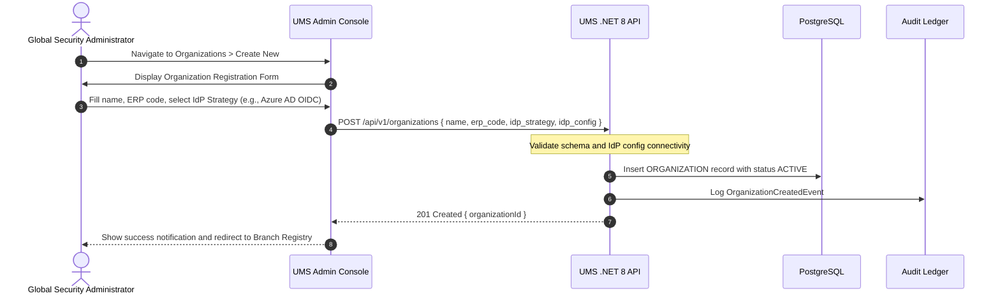

# 📘 Functional Story 3: Register Organization and Configure IdP Strategy

This use case specifies the flow for onboarding a new corporate tenant (Organization) into the UMS and configuring its identity authentication strategy.

---

## 🏛️ 1. Use Case Definition

| Attribute | Specification |
| :--- | :--- |
| **Name** | Register Organization and Configure IdP Strategy |
| **Primary Actor** | Global Security Administrator (SuperAdmin) |
| **Preconditions** | Actor is authenticated as SuperAdmin in the UMS Admin Console. |
| **Postconditions** | Organization is registered and active. IdP strategy is persisted. Branches can be registered. |

---

## 🔄 2. Transaction Flow

### A. Main Flow
1. SuperAdmin navigates to the **Organizations** module in the Admin Console.
2. Fills in the registration form: legal company name, ERP reference code, and selects the IdP strategy from the pluggable list (`INTERNAL_BCRYPT`, `ZITADEL`, `AZURE_AD`, `OKTA`, `SAML2`, `GENERIC_OIDC`).
3. If an external IdP is selected, the form dynamically expands to collect the required OIDC/SAML configuration fields (client ID, authority URL, certificates).
4. On submit, the API validates the configuration (optionally performs an IdP connectivity health check).
5. The organization is persisted, an immutable audit record is written, and the admin is redirected to register branches.

---

## 🛡️ 3. Alternative Flows & Exception Handling

### Alternative Flow A: IdP Connectivity Failure
- If the supplied OIDC/SAML discovery URL is unreachable, the API returns a `422 Unprocessable Entity` with error code `ERR_IDP_UNREACHABLE`. The organization record is **not** persisted.

### Alternative Flow B: Duplicate ERP Code
- If the `company_reference` (ERP code) already exists, the API returns a `409 Conflict` with error code `ERR_DUPLICATE_ORG_CODE`.
