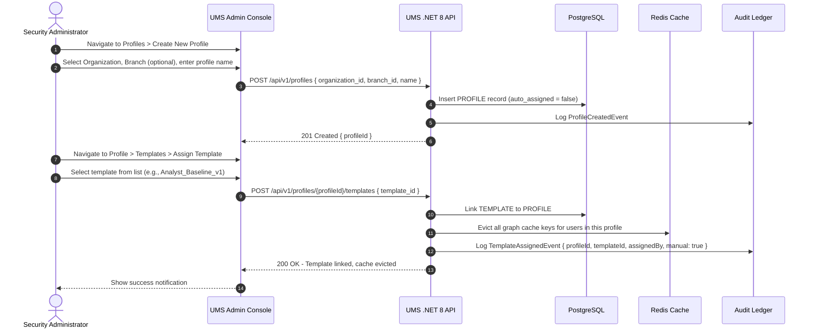

# 📘 Functional Story 5: Create Profile and Manually Assign Authorization Template

This use case specifies the flow for creating a user Profile within an Organization/Branch context and **manually assigning** one or more Authorization Templates to it via the Admin Console.

---

## 🏛️ 1. Use Case Definition

| Attribute | Specification |
| :--- | :--- |
| **Name** | Create Profile and Manually Assign Authorization Template |
| **Primary Actor** | Global Security Administrator (SuperAdmin) or Tenant Operations Manager (LocalAdmin) |
| **Preconditions** | Target Organization, Branch, and at least one Authorization Template are registered in the system. |
| **Postconditions** | Profile is created and active. Template is linked. All users assigned to this profile inherit the compiled permission graph immediately. Redis cache keys for affected users are evicted. |

---

## 🔄 2. Transaction Flow

### A. Main Flow
1. Admin navigates to **Profiles** module and clicks **Create New Profile**.
2. Selects the target Organization (required) and optionally a Branch for context-scoping. Enters a descriptive profile name (e.g., `TransportationAnalyst_Callao`).
3. Profile is created and saved with `auto_assigned = false`.
4. Admin navigates to the profile's **Template Assignment** panel and selects one or more available Authorization Templates from a searchable dropdown.
5. The API persists the template link, evicts all Redis graph cache keys for users currently assigned to this profile, and writes an immutable audit record flagged as `manual: true`.
6. All users in the profile immediately receive the updated permission graph on their next request (cache miss forces recompilation).

---

## 🛡️ 3. Alternative Flows & Exception Handling

### Alternative Flow A: Template Version Conflict
- If the selected template version introduces conflicting explicit DENY rules that override locally customized ALLOW entries in the profile, the Console displays a compatibility warning requiring admin confirmation before persisting.

### Alternative Flow B: Profile Already Has Template
- If the profile already has an active template assigned, the new assignment **replaces** it after confirmation. The previous template link is archived in the audit trail.

### Alternative Flow C: No Active Users Affected
- If no users are currently assigned to the profile, the template is linked immediately with no cache eviction required. Audit record is still written.
