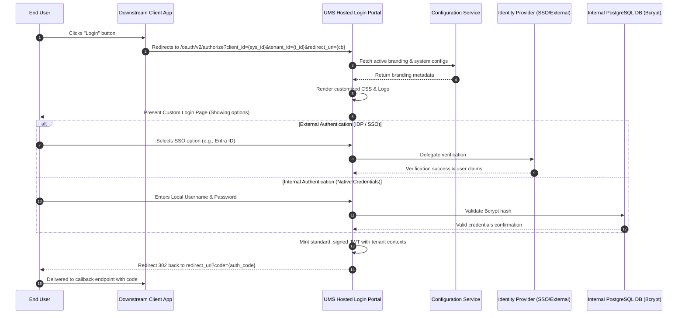

# 🧪 Functional Story 8: Authenticate via Customizable Hosted Login Page

This use case details the flow for centralizing user authentication through a secure, UMS-hosted login page that dynamically adapts its branding and layouts per tenant and system.

---

## 🏛️ 1. Use Case Definition

| Attribute | Specification |
| :--- | :--- |
| **Name** | Authenticate via Customizable Hosted Login Page |
| **Primary Actor** | End User, Downstream Client System |
| **Preconditions** | The client system is registered in UMS and has configured redirect callback URLs. |
| **Postconditions** | The user is authenticated by the selected IdP (or native fallback), and UMS redirects them back to the client application with a signed JWT. |

---

## 🔄 2. Transaction Flow



### A. Main Flow
1. An End User visits a registered downstream application (e.g., SCM Portal) and clicks the "Login" button.
2. The downstream application redirects the user's browser to the secure, centralized UMS Hosted Login page, passing its `client_id` (System ID), `tenant_id`, and a verified `redirect_uri` as query parameters.
3. The UMS Hosted Login Portal queries the Configuration Service for the active branding configuration (logo, colors, custom CSS classes) associated with the specified Tenant and System.
4. The Configuration Service resolves the configuration using the hierarchical resolution engine (applying Tenant and System-level branding overrides).
5. The Hosted Login page injects the fetched stylesheet properties, logo URL, and font settings into the DOM at runtime.
6. The user is presented with a premium, brand-aligned login interface displaying the specific IdP login options configured for their Tenant (e.g., "Login with Microsoft Entra" or "Passwordless Passkey").
7. The user completes the login process. The UMS Hosted Login Portal authenticates them via the configured IdP.
8. Upon successful validation, UMS issues a standard, cryptographically signed JWT containing the user's compiled permission graph and tenant scopes.
9. The Hosted Login Portal redirects the user's browser back to the registered `redirect_uri` callback with an authorization code or token payload.

---

## ⚙️ 3. Dynamic Branding Options

The UMS Hosted Login page supports these configuration variables in the versioned `SYSTEM_CONFIGURATION` JSON:

```json
{
  "branding": {
    "theme": "dark",
    "primary_color": "#0F52BA",
    "logo_url": "https://cdn.logisticscorp.com/assets/logo.png",
    "custom_css_url": "https://cdn.logisticscorp.com/styles/login-override.css",
    "font_family": "Outfit, sans-serif"
  },
  "login_behaviors": {
    "show_passkey_option": true,
    "allow_remember_me": false
  }
}
```

---

## 🛡️ 4. Exception Handling

### Alternative Flow A: Invalid Redirect URI
- If the `redirect_uri` passed in the query parameters does not match the registered redirect whitelist for the system inside UMS, the login flow is immediately aborted. The portal presents a secure `400 Bad Request` page and logs a security alert.

### Alternative Flow B: Branding Fetch Timeout
- If the Configuration Service is unresponsive or times out, the Hosted Login Portal falls back to the Global default layout (UMS default neutral dark theme) to guarantee authentication services remain fully available.
