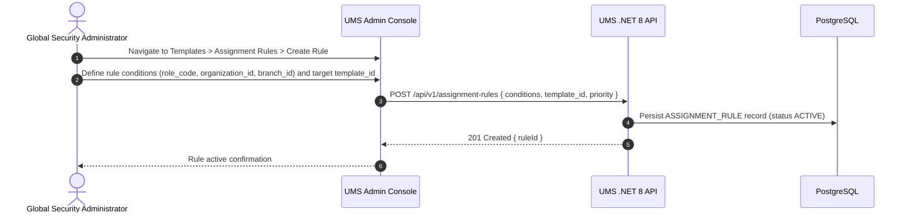
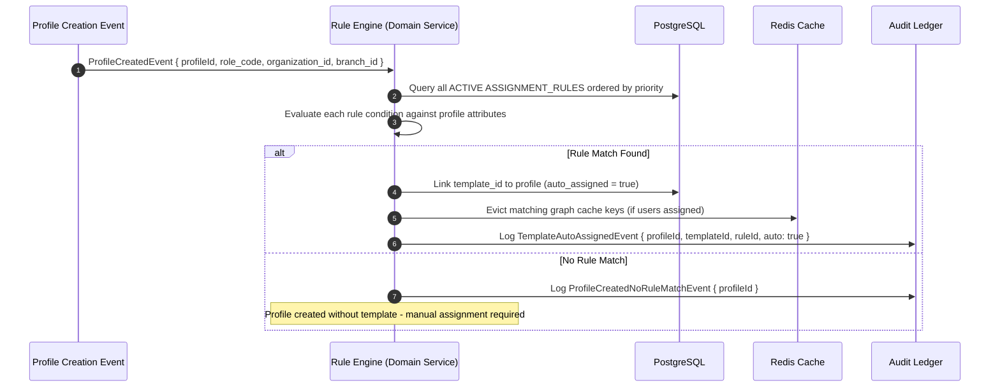

# 🧪 Use Case 7: Auto-Assign Authorization Template on Profile Creation

This use case specifies the flow of the **Automatic Rule-Based Template Assignment Engine**, which triggers upon profile creation to automatically attach the appropriate Authorization Template based on configurable matching rules.

---

## 🏛️ 1. Use Case Definition

| Attribute | Specification |
| :--- | :--- |
| **Name** | Auto-Assign Authorization Template on Profile Creation |
| **Primary Actor** | UMS Rule Engine (System Actor — triggered automatically) |
| **Secondary Actor** | Global Security Administrator (SuperAdmin — configures the rules) |
| **Preconditions** | At least one Assignment Rule is configured and active. The triggered profile has metadata attributes matching a rule. |
| **Postconditions** | Profile is created with `auto_assigned = true`. Matching template is linked. Redis cache keys are evicted if users exist. Audit record is written flagged as `auto: true`. |

---

## 🔄 2. Rule Configuration Flow (Admin — One Time Setup)

---

## 🔄 3. Automatic Assignment Trigger Flow (System — On Profile Creation)

### A. Rule Matching Logic
Rules are evaluated in **priority order** (lower number = higher priority). The **first matching rule** wins (short-circuit evaluation).

A rule matches when **all** of its conditions are satisfied:

| Condition Field | Match Type | Example Value |
| :--- | :--- | :--- |
| `role_code` | Exact match | `TransportationAnalyst` |
| `organization_id` | Exact match or wildcard `*` | `tenant_logistics_corp` |
| `branch_id` | Exact match or wildcard `*` | `branch_callao_terminal` |
| `system_id` | Exact match or wildcard `*` | `scm_route_planner` |

**Example Rule:**
> *If `role_code = "TransportationAnalyst"` AND `organization_id = "tenant_logistics_corp"` THEN assign `Template_SCM_Analyst_Baseline_v1`*

---

## 🛡️ 4. Alternative Flows & Exception Handling

### Alternative Flow A: Multiple Rules Match
- If more than one rule matches the profile attributes, only the **highest-priority rule** (lowest priority number) is applied. Remaining matches are logged in the audit trail as candidates.

### Alternative Flow B: Target Template Deactivated
- If the matched template has been deactivated or deleted since the rule was created, the engine logs a `RULE_TEMPLATE_UNAVAILABLE` warning in the audit trail and falls through to the next matching rule. If no fallback exists, the profile is created without a template assignment.

### Alternative Flow C: Rule Engine Failure
- If the Rule Engine throws an unhandled exception, the **Profile creation is NOT rolled back** (profile is saved). The engine failure is logged as a `CRITICAL` level event and the profile is flagged for manual template review.
